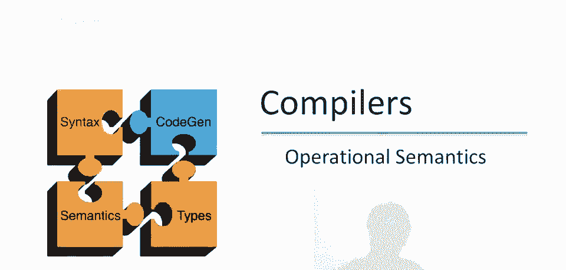
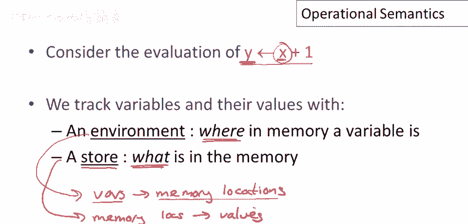
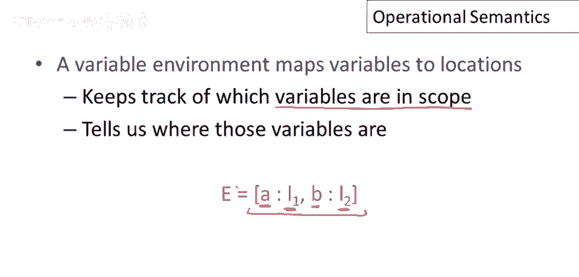
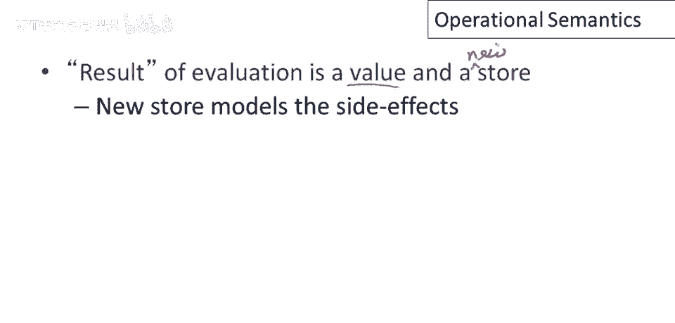

# 课程 P69：形式操作语义入门 🧠

在本节课中，我们将学习形式操作语义的基本概念。我们将了解如何用逻辑推理规则来形式化地描述程序的执行过程，包括环境、存储和对象的表示方法。

---

## 定义形式操作语义的第一步

就像我们处理词法分析、解析和类型检查一样，定义形式操作语义的第一步是引入符号。

我们发现，操作语义使用的符号与类型检查中使用的符号相同或非常相似。我们将使用逻辑推理规则。

## 推理规则与评估上下文

以类型检查为例，我们展示的推理规则类型证明了一些东西。在某些上下文中，我们可以显示某些表达式具有特定类型。

对于评估，我们将做非常相似的事情。我们现在将在某种上下文中显示。这将不同于我们在类型中拥有的上下文。因此，这将是评估上下文而不是类型上下文。

上下文中实际包含的内容将不同。但目前真正重要的是存在某种上下文。在那个上下文中，我们将能够显示某些表达式评估为特定值。

## 一个简单的评估例子

让我们看看这个简单的表达式 `E1 + E2`。

假设我们有一堆规则，并且我们可以显示，在初始上下文中，`E1` 在同一上下文中评估为值 `5`。`E2` 也在同一上下文中评估为值 `7`。然后我们可以证明 `E1 + E2` 评估为值 `12`。

这条规则说的是，如果 `E1` 评估为 `5`，`E2` 评估为 `7`，那么如果你评估表达式 `E1 + E2`，你将得到值 `12`。

那么上下文在做什么呢？在这条特定规则中它并没有做很多。但记住类型检查中的上下文是做什么的。上下文是为表达式的自由变量赋予值的。

因此，我们需要对像 `E1 + E2` 这样的表达式说些什么。关于可能出现在 `E1` 中的变量的值，你需要说，以便于说它们评估为什么。因此，可以说整个表达式 `E1 + E2` 将评估为什么。

## 评估上下文的具体内容

现在让我们更精确地谈谈上下文中将包含什么。

让我们考虑表达式或语句 `y = x + 1` 的评估。我们将把 `y` 的值设置为 `x + 1`。

为了评估这个表达式，我们需要知道两件事。

首先，要知道变量在内存中的位置。例如，变量 `x` 的值需要查找，然后加 `1`。该值需存入 `y` 的内存位置。变量与内存位置有映射。在操作语义中称为**环境**。

环境可能有点混淆，因为我们曾用环境指代其他事物。现在忘掉其他环境用法。谈论操作语义时，环境指映射，变量与内存位置关联。

此外，需要**存储**。存储将告诉我们内存中的内容。仅知道变量位置不够。若知道 `x` 的值，若知道 `x` 的位置，这是获取 `x` 值的方法。还需知道确切存储的值。

存储是内存位置到值的映射。这些是存储在内存中的值。所以是两级映射。为每个变量关联内存位置，然后每个内存位置有值。

## 环境与存储的符号表示

现在谈谈使用的符号。

记录环境和存储。如前所述，变量环境映射变量到位置。我们将以如下方式书写，以变量和位置对列表形式，用冒号分隔。

例如这个环境，说变量 `a` 在位置 `l1`，变量 `b` 在位置 `l2`。

环境的一个方面是跟踪在作用域内的变量。环境中提到的变量仅是当前范围内的。

存储映射内存位置到值。我们还将存储作为成对的列表写出。在这种情况下，存储 `s` 中的内存位置 `l1` 包含值为 `5`，内存位置 `l2` 包含值为 `7`。我们用箭头分隔这些对，只是为了使存储看起来与环境不同，这样我们不会混淆两者。

存储有一种操作，即替换值或更新值。在这种情况下，我们取存储 `s`，并将位置 `l1` 的值更新为 `12`。这定义了一个新的存储 `s'`。

存储只是函数。至少在我们的模型中，我们可以通过取旧存储 `s` 的旧函数，并在一点上进行修改来定义新的存储 `s'`。这定义了一个新的存储 `s'`，使得如果我应用 `s'` 到新的位置 `l1`，我得到新的值 `12`。如果我应用 `s'` 到任何其他位置，任何不同于 `l1` 的位置，我得到存储 `s` 中位置的值。

## Cool语言中对象的表示

现在在 Cool 中，我们有更复杂的值和整数。特别是我们有了对象，并且所有对象都是某个类的实例。我们将需要一种表示对象的操作语义符号。

因此我们将使用以下方式写下对象。一个对象将以其类名开始。在这种情况下类名 `X`。它将跟随属性的列表。类 `X` 有 `n` 个属性 `a1` 到 `an`。与每个属性相关联的是存储该属性的内存位置。

属性 `a1` 存储在位置 `l1`，一直到属性 `an` 存储在位置 `ln`。这将是一个完整的对象描述。因为一旦我们知道对象在内存中的存储位置，我们可以使用存储查找每个属性的值。

## 基本类型的特殊表示

Cool 中有无属性名的特殊类。我们将有一种特殊的书写方式。

整数仅有一个值，将写成 `int` 和一个整数值。

布尔值类似，它们只有一个值，真或假。

字符串有两个属性：字符串长度和字符串常量。

还有一个特殊值为 `void` 的 object 类型。我们将使用 `void` 术语表示。简而言之，`void` 特殊在于无法操作，除了测试是否为 `void`。特别地，不能派发 `void`，即使类型为 object 也会报错。唯一能做的是测试是否为 `void`。具体实现通常使用空指针表示 `void`。

## 操作语义的判断形式

现在可以详细讨论，操作语义中的判断将如何。

上下文将包含三部分：
1.  第一部分是当前 `self` 对象。
2.  第二部分是环境，从变量到存储位置的映射。
3.  第三部分是内存，存储，从内存位置到值的映射。

在一个上下文中，表达式 `e` 将评估为两件事。首先你会产生一个值。例如，我们之前看到 `7 + 5` 产生 `12`。这是评估的一个结果。

但第二件事是它将产生一个修改后的存储。表达式 `e` 可能是一段复杂的代码，可能本身就是整个程序。它可能包含赋值语句更新内存内容。所以评估后，将有一个新的内存状态需要表示。所以 `s'` 代表评估后的内存状态。

现在注意几件事。

首先，当前 `self` 对象和环境不会改变。它们不会被评估改变。所以哪个对象是 `self` 参数，和当前方法，以及变量和内存位置映射不会被运行表达式改变。这很合理。你不能在 Cool 中更新 `self` 对象。你没有以任何形式访问变量存储位置的权利。因此，这两件事是不变的。它们在评估下是不变的。当你运行一段代码时，它们不会改变。

然而，存储会改变。内存的内容可能会被修改。这就是为什么我们需要在评估前后存储的原因。

还有一个细节。这种形式的判断总是有一个限定，即判断仅在 `e` 终止时成立。因此，如果 `e` 进入无限循环，那么你将不会得到一个值，你也不会得到一个新存储。因此，这种判断应该总是被理解为说，如果 `e` 终止，那么 `e` 产生一个值 `v` 和一个新存储 `s'`。

## 总结评估结果

总结一下，评估的结果是一个值和一个新存储。

新的存储模型表达式的副作用。再次注意，一些事情在评估结果中不会改变。

这实际上对于编译很重要，因为我们将能够利用它们不变的事实来生成高效代码。

因此，变量环境不会改变。`self` 的值，我们谈论的对象不会改变。并且注意这里还有一个细节，`self` 对象的内容，`self` 对象中的属性可能会改变，它们可能会被更新。但是，属性存储的位置不会改变。因此，对象存储的布局不会改变。这就是我们在这里所说的。实际对象的内容，是存储映射的一部分。这些可能会通过评估被更新。

操作语义还允许非终止评估。这是这里的最后一点。那些判断仅在假设下成立。

---

本节课中我们一起学习了形式操作语义的基本框架。我们了解了如何用环境、存储和对象来描述程序状态，以及如何用推理规则来形式化地定义表达式的评估过程。评估的结果包括一个值和一个更新后的存储，而环境和 `self` 对象在评估过程中保持不变。