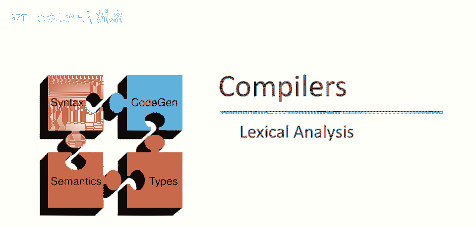
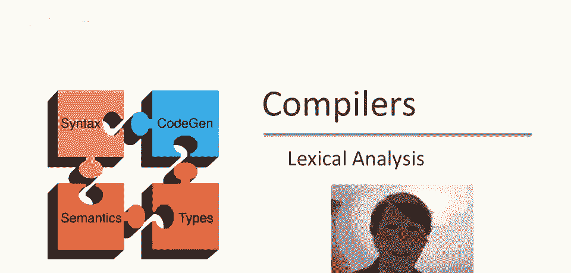
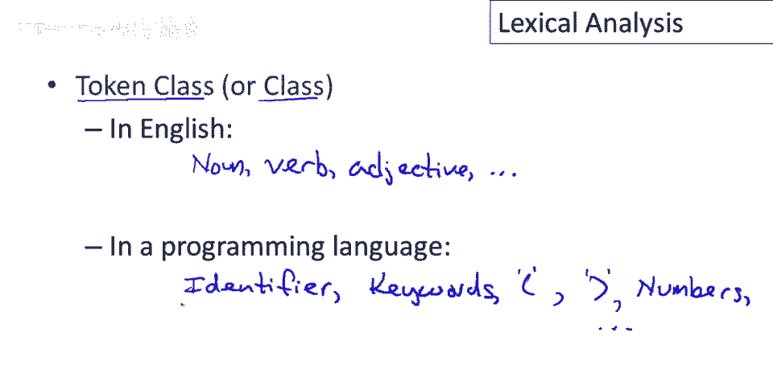
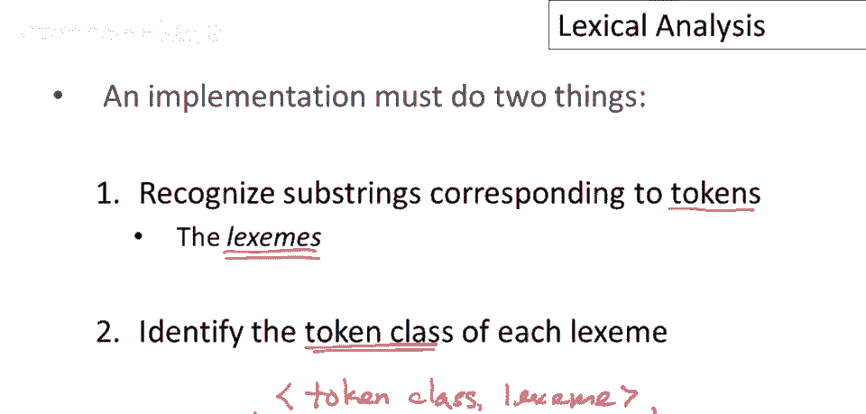

# 编译器实现 P7：词法分析入门 🧩



在本节课中，我们将要学习编译器实现的第一步：词法分析。我们将了解词法分析器如何将源代码字符串分解为有意义的单元，并为每个单元分类。

## 概述

词法分析是编译器的第一个阶段。它的核心任务是将源代码（一个长长的字符串）分解成一系列称为“标记”的基本单元，并识别每个单元的类型（如关键字、标识符、数字等）。这个过程就像阅读时把句子拆分成单词并理解每个词的词性。

## 什么是词法分析？

回忆上次内容，编译器通常分为五个阶段。我们将从第一个阶段——词法分析开始讨论。这个过程可能需要三到四个视频才能详细讲完，之后我们会按顺序继续其他阶段。


让我们先看一个小代码片段：
```c
if (i == j) x = 1; else x = 0;
```
词法分析的目标是将这段代码，分解成其词法单元，例如关键字`if`、变量名`i`和`j`、关系运算符`==`等等。

对人类而言，这是一件很容易的事，因为有各种各样的视觉线索（如空格、括号）来提示单元的位置和边界。但程序（即词法分析器）没有那种视觉能力。

## 词法分析器的视角



实际上，词法分析器看到的源代码更像这样的东西（一个包含所有空白字符的线性字符串）：
```
"if (i == j)   x = 1; else x = 0;"
```
从这个字符串表示（你可以认为这就是文件中的字节序列）开始工作，词法分析器必须识别出不同单元之间的分隔符。

它会识别出空白字符与关键字`if`之间有一个分隔，关键字`if`之后与左括号`(`之间也有分隔。它就这样持续地“划出”这些分割线，将字符串分解成一个个词法单元。虽然这里没有完成整个分析，但你应该能理解这个过程。

## 标记与标记类

然而，词法分析器不仅仅是在字符串中放置分隔符。它还需要根据这些子字符串在程序中的“角色”对它们进行分类。我们称这些角色为**标记类**（有时也简称为标记的类型）。

在自然语言中，单词的角色可能是动词、形容词等。在编程语言中，标记类可能是：
*   **标识符**：如变量名。
*   **关键字**：如`if`、`else`。
*   **标点符号**：如左括号`(`、右括号`)`、分号`;`。
*   **数字**：如整数。
*   **操作符**：如`==`、`=`。

有一组固定的标记类，每个类对应程序中可能出现的特定字符串集合。


## 标记类的定义

标记类对应着字符串的集合，这些集合可以用相对直接的方式描述。

以下是几个例子：
*   **标识符**：在大多数语言中，标识符通常是以字母开头的，由字母或数字组成的字符串。
    *   例如：`a1`、`foo`、`b17`。
    *   公式描述：`[a-zA-Z][a-zA-Z0-9]*`
*   **整数**：通常定义为非空的数字字符串。
    *   例如：`0`、`12`、`001`（注意，根据此定义，`001`也是有效的整数字符串）。
    *   公式描述：`[0-9]+`
*   **关键字**：通常只是一组保留字。
    *   例如：`else`、`if`、`begin`等。
*   **空白符**：空格、换行符、制表符等序列本身也是一个标记类。

因此，词法分析器需要说明源代码字符串中的每一个字符（包括空白符）属于哪个标记类，以及它属于哪个子串。例如，三个连续的空格`"   "`会被分组为一个“空白符”标记。

## 词法分析器的输出

上一节我们介绍了标记类的概念，本节中我们来看看词法分析器的具体工作流程和目标。


词法分析的目标是按照子字符串在程序中的作用（即标记类）对它们进行分类，然后将这些标记传递给编译器的下一个阶段——**语法分析器（解析器）**。

我们可以这样描述这个过程：
```
源代码字符串 (输入) --> [词法分析器] --> 标记序列 (输出) --> [语法分析器]
```
词法分析器接收一个字符串（通常来自文件），处理后输出一系列**标记**。每个标记是一个**对**（Pair），包含：
1.  **标记类**：该子串在语言中的角色。
2.  **词素**：原始输入中的那个子串本身。

例如，对于输入字符串 `"foo = 42"`，词法分析器会输出三个标记：
1.  `(标识符, "foo")`
2.  `(赋值运算符, "=")`
3.  `(整数, "42")` （注意，这里的`"42"`是字符串，不是数字值）

## 实例分析

让我们回到视频开头的示例代码，并将其视为一个字符串。我们的目标是完成对它的词法分析。

首先，我们需要定义一些标记类来工作：
*   `W`：空白符（空格、换行、制表符等序列）。
*   `K`：关键字（如`if`, `else`）。
*   `I`：标识符（变量名）。
*   `N`：数字（整数）。
*   `P`：标点符号（每个单字符一类，如`(`, `)`, `;`）。
*   `O`：操作符（如`==`, `=`）。

现在，我们遍历字符串并将其标记化。对于每个识别出的子串（词素），我们标注其标记类（用首字母简写表示）。

以下是分析过程：
```
输入字符串: "if (i == j)   x = 1; else x = 0;"

标记化结果:
(W, " ")      // 开头的空格
(K, "if")     // 关键字 if
(W, " ")      // 空格
(P, "(")      // 左括号
(I, "i")      // 标识符 i
(W, " ")      // 空格
(O, "==")     // 操作符 ==
(W, " ")      // 空格
(I, "j")      // 标识符 j
(P, ")")      // 右括号
(W, "   ")    // 三个空格
(I, "x")      // 标识符 x
(W, " ")      // 空格
(O, "=")      // 赋值操作符 =
(W, " ")      // 空格
(N, "1")      // 数字 1
(P, ";")      // 分号
(W, " ")      // 空格
(K, "else")   // 关键字 else
(W, " ")      // 空格
(I, "x")      // 标识符 x
(W, " ")      // 空格
(O, "=")      // 赋值操作符 =
(W, " ")      // 空格
(N, "0")      // 数字 0
(P, ";")      // 分号
```
通过这个过程，我们识别了输入中的所有子字符串（词素），并为每一个都标注了其标记类。

## 总结


本节课中我们一起学习了词法分析的基础知识。

总结来说，词法分析器的实现必须完成两件核心工作：
1.  **识别词素**：在输入字符串中识别出对应标记的子字符串。这些子字符串在编译器术语中称为**词素**。
2.  **分类标记**：对于每个识别出的词素，判断它属于哪个**标记类**。



词法分析器的最终输出是一系列**标记**，每个标记都是一个`(标记类， 词素)`对。这个标记序列将成为语法分析器（解析器）的输入，驱动编译流程进入下一个阶段。