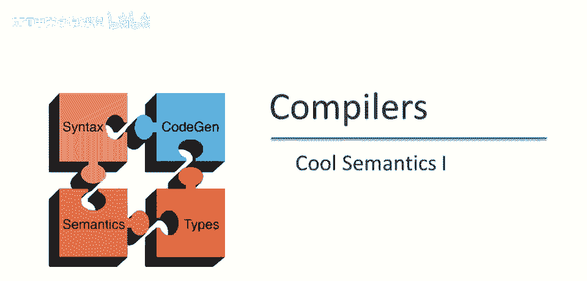
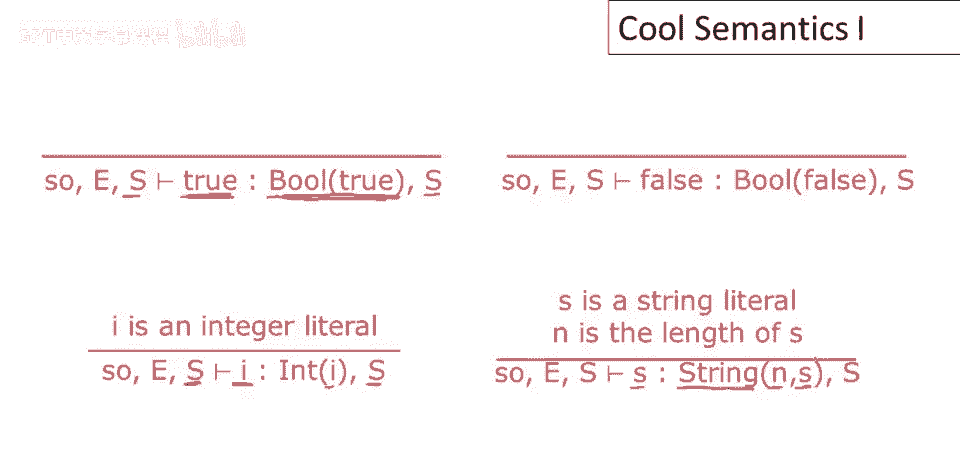
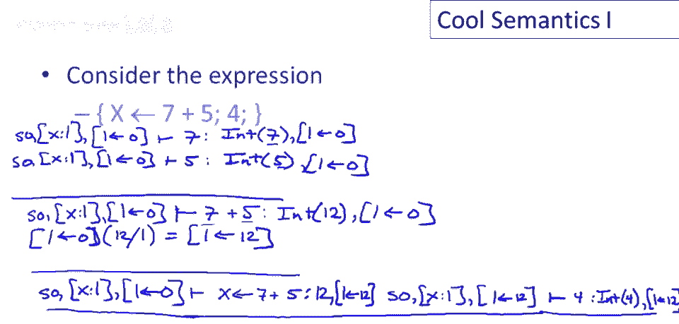

# 课程 P70：Cool 语言操作语义详解 🧠

在本节课中，我们将深入研究 Cool 语言的操作语义。我们将从最简单的表达式开始，逐步讲解到更复杂的结构，如赋值、块、条件语句和循环。通过理解这些规则，你将能够清晰地把握 Cool 程序中表达式的求值顺序和状态变化。

---

## 常量求值规则 📊

上一节我们介绍了课程概述，本节中我们来看看最简单的表达式：常量。常量求值不会修改存储状态。

以下是常量求值的具体规则：

*   **布尔值 `true`**：表达式 `true` 求值为布尔值 `true`，且不修改存储。
    *   **公式**：`<self, E, S> ⊢ true ⇒ true, S`
*   **布尔值 `false`**：表达式 `false` 求值为布尔值 `false`，且不修改存储。
    *   **公式**：`<self, E, S> ⊢ false ⇒ false, S`
*   **整数字面量 `i`**：整数字面量 `i` 求值为值为 `i` 的整数对象，且不修改存储。
    *   **公式**：`<self, E, S> ⊢ i ⇒ Int(i), S`
*   **字符串字面量 `s`**：若 `s` 是长度为 `n` 的字符串，则其求值为具有长度 `n` 和内容 `s` 的字符串对象，且不修改存储。
    *   **公式**：`<self, E, S> ⊢ s ⇒ String(n, s), S`

---

## 标识符与 `self` 表达式 🔍

了解了常量后，我们来看看如何求值变量和 `self`。这涉及到从环境（`E`）和存储（`S`）中查找信息。

以下是标识符与 `self` 表达式的求值规则：

*   **标识符 `id`**：要评估标识符（如变量名 `x`），首先在环境 `E` 中查找其对应的存储位置 `L_id`，然后在存储 `S` 中查找该位置的值 `v`。这是一个“加载”操作，不修改存储。
    *   **公式**：`<self, E, S> ⊢ id ⇒ v, S`，其中 `E(id) = L` 且 `S(L) = v`
*   **`self` 表达式**：`self` 表达式直接求值为当前对象 `self`，且不修改存储。
    *   **公式**：`<self, E, S> ⊢ self ⇒ self, S`

---

## 赋值表达式 ✍️

现在，我们来看一个会修改存储的表达式：赋值。赋值表达式由标识符和提供新值的表达式组成。

以下是赋值表达式的求值步骤：

1.  **求值右表达式**：首先，在相同的上下文（`<self, E, S>`）中求值表达式 `e`，得到值 `v` 和可能更新后的存储 `S1`。
2.  **确定写入位置**：在环境 `E` 中查找标识符 `id` 对应的存储位置 `L_id`。
3.  **更新存储**：在存储 `S1` 中，将位置 `L_id` 的值更新为 `v`，得到新存储 `S2`。
4.  **返回结果**：整个赋值表达式返回右表达式的值 `v` 和更新后的存储 `S2`。
    *   **公式**：`<self, E, S> ⊢ id <- e ⇒ v, S2`，其中 `<self, E, S> ⊢ e ⇒ v, S1`，`E(id) = L`，且 `S2 = S1[L ↦ v]`

---

## 加法操作 ➕

理解了赋值后，我们来看看二元操作，例如加法。加法表达式 `e1 + e2` 的求值定义了子表达式的执行顺序。

以下是加法表达式的求值规则：

*   首先，在原始上下文 `<self, E, S>` 中求值 `e1`，得到值 `v1` 和更新后的存储 `S1`。
*   然后，在更新后的上下文 `<self, E, S1>` 中求值 `e2`，得到值 `v2` 和进一步更新后的存储 `S2`。
*   整个表达式的结果是 `v1` 与 `v2` 相加的值，以及最终的存储 `S2`。
    *   **公式**：`<self, E, S> ⊢ e1 + e2 ⇒ v1 + v2, S2`，其中 `<self, E, S> ⊢ e1 ⇒ v1, S1` 且 `<self, E, S1> ⊢ e2 ⇒ v2, S2`

**关键点**：存储 `S` 的传递强制了求值顺序：必须先求值 `e1`，再求值 `e2`，`e2` 能看到 `e1` 产生的所有副作用。

---

## 语句块 📦

接下来，我们看看如何求值由多个表达式组成的语句块。块的值是最后一个表达式的值。

以下是语句块的求值规则：

*   按顺序求值块中的每个表达式 `e1, e2, ..., en`。
*   求值 `e1` 使用原始存储 `S`，产生存储 `S1` 和值 `v1`。
*   求值 `e2` 使用存储 `S1`，产生存储 `S2` 和值 `v2`，依此类推。
*   求值最后一个表达式 `en` 使用存储 `S_{n-1}`，产生最终存储 `S_n` 和值 `v_n`。
*   整个块的结果是值 `v_n` 和存储 `S_n`。
    *   **公式**：`<self, E, S> ⊢ {e1; e2; ...; en;} ⇒ v_n, S_n`，其中求值过程链式进行。

**关键点**：存储的依赖关系强制了表达式必须按书写顺序执行。只有最后一个表达式的值被保留。

---

## 条件表达式（If-Then-Else） ⚖️

现在，我们引入控制流，从条件表达式开始。`if` 表达式根据谓词的布尔值选择执行的分支。

以下是条件表达式的求值规则：

*   **首先求值谓词**：在原始上下文 `<self, E, S>` 中求值谓词表达式 `e1`，得到布尔值 `b` 和更新后的存储 `S1`。
*   **根据结果选择分支**：
    *   如果 `b` 为 `true`，则在存储 `S1` 的上下文中求值 `then` 分支 `e2`，得到值 `v` 和存储 `S2`。整个表达式返回 `v` 和 `S2`。
        *   **公式**：`<self, E, S> ⊢ if e1 then e2 else e3 fi ⇒ v, S2`，当 `<self, E, S> ⊢ e1 ⇒ true, S1` 且 `<self, E, S1> ⊢ e2 ⇒ v, S2`
    *   如果 `b` 为 `false`，则在存储 `S1` 的上下文中求值 `else` 分支 `e3`，得到值 `v` 和存储 `S2`。整个表达式返回 `v` 和 `S2`。
        *   **公式**：`<self, E, S> ⊢ if e1 then e2 else e3 fi ⇒ v, S2`，当 `<self, E, S> ⊢ e1 ⇒ false, S1` 且 `<self, E, S1> ⊢ e3 ⇒ v, S2`

---

## 循环表达式（While） 🔄

最后，我们来看最复杂的控制流结构之一：`while` 循环。其语义描述了循环如何根据条件重复执行。

以下是 `while` 循环的求值规则：

*   **情况一：谓词初始为假**：首先在原始上下文 `<self, E, S>` 中求值谓词 `e1`。如果结果为 `false` 且存储变为 `S1`，则循环体不执行，整个 `while` 表达式以 `void` 值和存储 `S1` 结束。
    *   **公式**：`<self, E, S> ⊢ while e1 loop e2 pool ⇒ void, S1`，当 `<self, E, S> ⊢ e1 ⇒ false, S1`
*   **情况二：谓词初始为真**：
    1.  在原始上下文 `<self, E, S>` 中求值谓词 `e1`，得到 `true` 和存储 `S1`。
    2.  在存储 `S1` 的上下文中求值循环体 `e2`，得到值 `v`（通常被忽略）和存储 `S2`。
    3.  **关键步骤**：在**新的存储 `S2` 的上下文**中，**再次求值整个 `while` 表达式**。这模拟了循环的迭代。
    4.  假设这个后续的求值最终终止（情况一），并产生 `void` 值和存储 `S3`。
    5.  那么最初的 `while` 表达式也返回 `void` 值和最终的存储 `S3`。
    *   **公式**：`<self, E, S> ⊢ while e1 loop e2 pool ⇒ void, S3`，当 `<self, E, S> ⊢ e1 ⇒ true, S1`，`<self, E, S1> ⊢ e2 ⇒ v, S2`，且 `<self, E, S2> ⊢ while e1 loop e2 pool ⇒ void, S3`

---

## Let 表达式（变量绑定） 🆕

我们来看最后一个核心表达式：`let`，它用于引入新的局部变量。这是最复杂的规则之一，因为它涉及扩展环境和分配新内存。

以下是 `let` 表达式的求值规则：

1.  **求值初始化器**：首先，在原始上下文 `<self, E, S>` 中求值初始化表达式 `e1`，得到值 `v1` 和更新后的存储 `S1`。
2.  **分配新位置**：使用函数 `newloc(S1)` 从存储 `S1` 中获取一个未被使用的新内存位置 `L_new`。这模拟了内存分配。
3.  **扩展环境与存储**：
    *   创建一个新环境 `E'`，它是在原环境 `E` 的基础上，将新变量 `id` 映射到新位置 `L_new`，即 `E' = E[id ↦ L_new]`。
    *   创建一个新存储 `S1'`，它是在存储 `S1` 的基础上，在新位置 `L_new` 存入值 `v1`，即 `S1' = S1[L_new ↦ v1]`。
4.  **求值主体**：在新的上下文 `<self, E', S1'>` 中求值 `let` 的主体表达式 `e2`，得到值 `v2` 和最终存储 `S2`。
5.  **返回结果**：整个 `let` 表达式返回 `v2` 和 `S2`。
    *   **公式**：`<self, E, S> ⊢ let id: T <- e1 in e2 ⇒ v2, S2`，其中 `<self, E, S> ⊢ e1 ⇒ v1, S1`，`L_new = newloc(S1)`，`E' = E[id ↦ L_new]`，`S1' = S1[L_new ↦ v1]`，且 `<self, E', S1'> ⊢ e2 ⇒ v2, S2`

---

## 总结 📝

本节课中，我们一起学习了 Cool 语言操作语义的核心规则。我们从最简单的常量求值开始，逐步深入到会修改状态的赋值、定义了执行顺序的加法和块、控制程序流的条件与循环语句，最后学习了引入新变量的 `let` 表达式。理解这些规则是理解程序如何一步步执行、状态如何变化的基础。记住，存储（`S`）的传递是强制表达式求值顺序和传播副作用的关键机制。