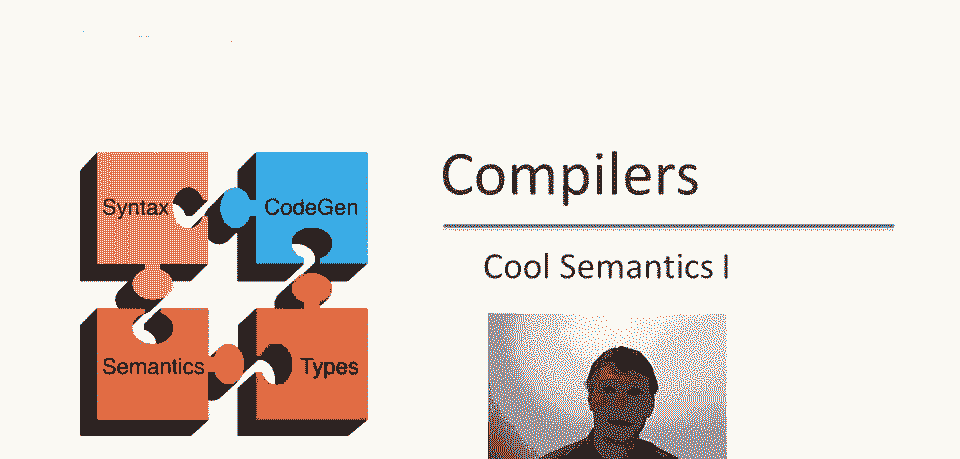
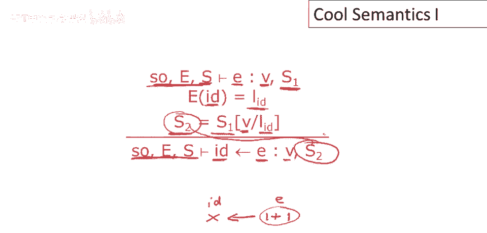
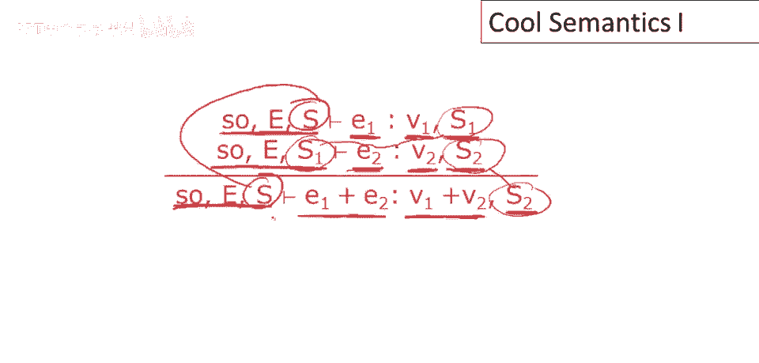
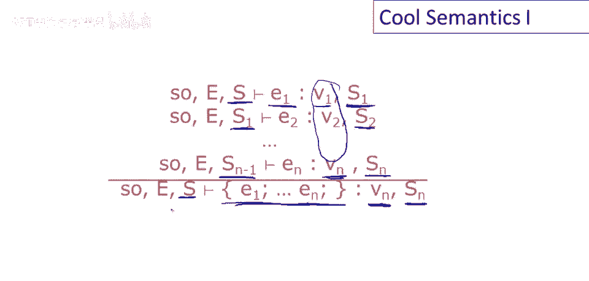
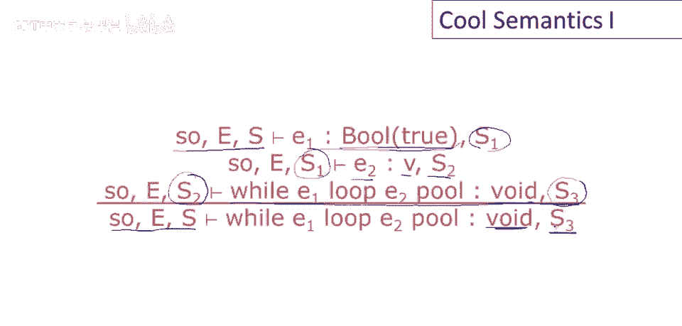
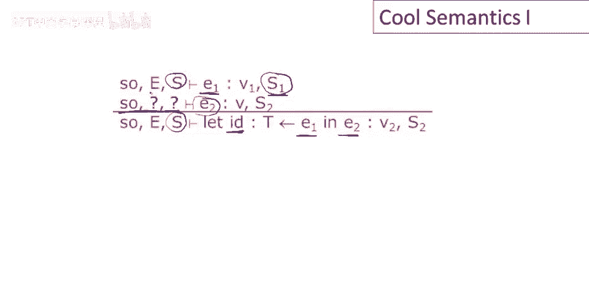
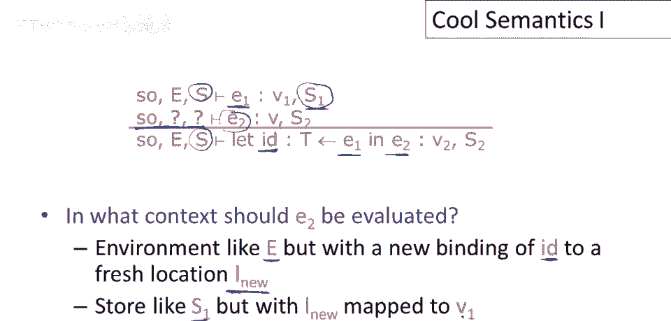
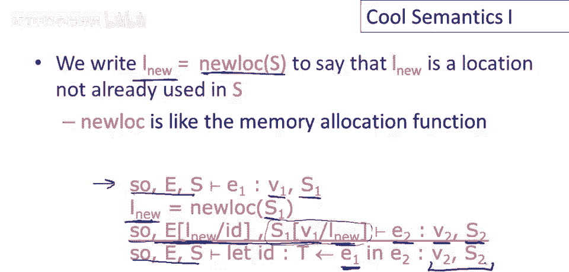

# P70：p70 13-03-_Cool_Semantics_I - 加加zero - BV1Mb42177J7

在接下来的视频中，我们将研究酷操作语义的细节，逐个讲解每种表达式的语义，从简单开始，逐步深入复杂。

因此，最简单的规则是酷常数规则，所以，值true，表达式true，应该说它评估为布尔值true，且不修改存储，因此，存储保持不变，因为它显然不更新，对于False有相应规则，整数非常，非常相似。

所以如果整数表达式，整数字面量，将评估为整数对象，值为i，同样，存储不会因这种评估而修改，最后字符串，如果a，呃，若s为长度为n的字符串，则其将评估为具有n和字符串常量s的字符串对象。

标识符的评估非常直接，考虑到我们既有环境又有存储，因此，要评估一个标识符，这将是类似于x或y或foo的变量名，我们做什么，首先，我们在环境中查找该标识符的存储位置，这将返回给我们一个内存位置。

在这种情况下为L_sub_id，然后在商店查看内存位置的价值，所以这里使用相同的内存位置作为存储的参数，以获取回值，那个变量目前拥有的，注意，这只是一个引用，这是内存的读取，所以这是加载。

你可以认为它是加载变量的值，这不会影响存储，所以存储在这之前和之后是一样的，这只是在查找变量的值，不更新变量，self表达式，仅评估为self对象，这里我们仅利用，self对象是环境一部分的事实。

所以直接复制过来，嗯，作为表达式的结果，注意，store不受self评估的影响，现在看看稍复杂的表达式如何评估，特别是，赋值表达式，由两部分组成，一个将被更新的标识符和一个将给出新值的表达式，例如。

提醒一下，我们可能有类似 x 得到 1 加 1，1 加 1，这里是表达式 e，x 是标识符，对吧，为了评估赋值，首先我们必须做的是，我们要知道写入标识符的值，所以什么是，我们要进行的更新是什么。

所以首先要做的是评估e，注意这里e在同一环境中评估，所以它和这里的三个组件相同，好的，所以如它所说，我们首先运行e，这将给我们带回一个新的a值v，我们将带回一个值v，打扰一下，可能还有更新商店。

所以e可以是任意代码段，它本身可以有赋值语句，所以得到的故事可能完全不同，所以e产生值v和更新后的商店s1，现在真正要做赋值，我们该怎么做呢，我们必须知道要更新哪个内存位置，所以我们查找id的内存位置。

这样我们就有位置ID，然后修改商店为新值，在那个点修改商店为新值，所以我们替换位置ID，或更新位置ID的值等于e的值，值v，我们在商店s1中这样做得到新商店，S2，现在注意s2是评估e的结果，好的。

我们完成作业时，作业返回值v，即，当然运行e的值，并返回更新后的存储s two。

接下来谈谈加法操作规则，要评估e one加e two，我们要做什么呢，首先，我们将评估e one，注意，这是在整体表达式的上下文中完成的，好的，所以这些组件，评估一的上下文与整个表达式的上下文完全相同。

E一加E二，因此，当我们评估E一，它将给我们一个值V一，它还将给我们一个更新的存储S一，然后我们要评估E，注意这里的上下文不同，自对象和环境相同，但现在我们在新的存储S一中运行E二，S一。

这意味着如果E二中有赋值或变量引用，这些赋值和变量引用必须在运行E一的结果存储上进行，好的，这一点非常重要，我们必须理解，运行E一发生的任何副作用，或E二表达式看到的都是可见的，所以我们运行E二。

在这个环境中，我们将得到V二的值和更新的存储S二，整个表达式的结果将是V一加V二，结果存储将是S二，注意这里的存储告诉你必须评估表达式的顺序，因为E一在相同的存储中评估，作为整个表达式。

这告诉你E一必须首先评估，然后因为E二在存储中评估，由E一产生，这告诉你E一，E二抱歉必须在评估后评估，呃，E一，然后事实是，呃，S二是整个东西的结果，这告诉你E二也是最后评估的。

在执行这个特定表达式期间。

好的，让我们看看语句块，只是为了多样性，让我改变我的颜色，我们如何评估一个语句块中的语句，E一至E n，好的，嗯，这个语义的含义是我们应该按顺序运行它们，从E一开始，整个执行的结抱歉。

整个块的值将是最后一个表达式的值，这些，嗯，这条规则只是说，首先，我们评估e one，注意到它在与整体表达相同的商店完成，这就是告诉你它必须先来的原因，并产生新的商店，S one和一个值v one。

好的，然后e two在商店s one中评估，并产生商店s two等，然后表达式在商店sn减一中评估，并产生值v n和更新的商店s sub n，整个结果为vn的值，以及更新后的存储s_n，这告诉你。

此规则告诉你评估子表达式的顺序，这里的依赖，存储迫使你先评估e1，然后是e2，然后是e3等，因此你必须按此顺序进行以获得副作用，以正确顺序获得所有这些表达式的副作用，此外，它还告诉你，你只会保留。

Vn的值，注意，这里产生的其他值，都没有被使用，它们没有出现在。

任何其他地方规则中，让我们用所学做个小例子，我们想了解评估x赋值为7加5，时会发生什么，这是第一个语句，块中的第二个也是最后一个语句，只是表达式的值，首先我们要说，上下文包括三部分。

会有一个self对象，在这种情况下，self对象的内容并不重要，因为程序中没有引用self，因此它不会对评估产生任何影响，但我们仍然需要它，将会有，将会有一些self对象，它不会被使用。

现在我们需要一个环境，告诉我们程序中所有自由变量的位置，只需存储x的地方，x将存储在某位置，L，还需知道内存内容，我们的存储是什么，假设l最初值为0，好的，现在可用规则运行程序，评估此程序。

我将此行拉长，回忆你知道的，块评估包括所有语句的评估，好的，所以第一个将是x得到7加5，将在与整个表达式的相同环境中评估，所以我们将有，抱歉，相同的上下文，对不起，我应该说我经常滑倒。

我知道我意识到并说环境对于这些判断的整个左半部分，我将努力保持一致，并仅使用环境，对于上下文的第二个组件，在文献中，人们称左半边的整个东西为环境，这就是我犯错误的原因，但你知道对于这套笔记。

我正在努力保持一致，左半边的所有组件一起称为上下文，环境只是第二个组件，从变量到其位置的映射，回到例子中，块中的第一个语句是x得到7加5，然后我们将会有第二个语句，我们知道self对象和环境不会改变。

但我们不知道，存储器将会怎样，存储器可能不同，所以我们将存储器暂时留空，我们稍后会弄清楚，我们将评估表达式的okay，所以现在要取得进展，我们应该看看这个第一个语句，尝试在那个上取得一些进展。

所以为了评估赋值，我们必须做什么，我们首先要做的就是我们要评估右半边，所以我们将会有，呃，那个的上下文将和，我们一直在看的上下文相同，因为那是实际上将要发生的第一件事是评估，7加5，好的，现在留。

一些空间在这里为赋值规则的其余部分，我们不会马上填写，现在要评估加表达式，我们必须评估第一个表达式和第二个表达式，好的，那么，我们怎么做呢，我们终于知道了，我想知道怎么做，因为我们终于完成了。

那里会有一个整数，然后，我们已经有了一个规则，所以整数字面量评估为整数对象，好的，嗯，对象内部就是值，好的，存储没有改变，好的，然后类似地，嗯，这里的另一个，参数，所以五也会评估为整数对象，值为五。

好的，所以这是两个，这个版本的表达式，所以现在我们可以填写结果了，所以我们将取两个整数的值，我们相加它们，那也将是一个整数对象，所以我们将得到整数对象十二，存储没有改变，好的，所以这。

我们得到的存储恰好与输入的存储相同，只是因为表达式中没有赋值，好的，现在我们可以做赋值了，那么我们怎么做呢，我们必须形成一个新存储，所以我们将有一个新存储，l 变为零，嗯，嗯，l 处的值。

我不记得我的符号是怎么写的，我认为长度，数字先，我们将十二放入位置 l，当然那个存储只是等于 l 值为十二的存储，好的，所以现在下面会发生什么，当我们做赋值时，我们得到新的值，好的，右边的值是十二。

我们有了新店，位置l有12，好的，现在我们可以评估块中的第二个语句，那将在位置l有12的商店中进行，当然，这只是一个整数，因此，它将评估为整数常量，整数值，请原谅我，或包含整数对象的整数对象。

我们的商店，它只会适合，不太对，然后这是整个评估的结果，因此，此块将产生值为整数对象的整数和更新的商店，呃，位置l有值为12。

接下来我想看一下if then else表达式，并且要评估，如果then else，我们做什么，实际上这应该是，如果then else费，当然，所以要评估，如果then else，首先。

我们必须评估谓词，这在同一家商店中进行，与整个表达式的相同上下文中，如果结果为真，如果布尔谓词返回值为真，那么我们只想评估真分支而不是假分支，这就是为什么你只在这里看到，没有提到e二和e三的评估。

并且要知道，谓词可能具有副作用，e二在e一产生的任何商店中评估，整个表达式的结果为e二的值，好的，那是v，以及运行then分支产生的最终商店，对于如果谓词评估为假的情况有一个对称规则，在这种情况下。

你将评估e三而不是e二，接下来我们将看看while循环在cool中会发生什么，有两种情况，首先，如果while循环的谓词评估为假，好的，嗯，在这种情况下，循环体将不会执行，对吧，所以首先我们评估谓词。

这在同一家商店中进行，与评估整个表达式的相同上下文中，如果谓词为假，那么我们退出循环，接下来我们将看看循环体在cool中会发生什么，循环结果为空，值为空，评估谓词的结果。

另一种可能是谓词为真，因此，我们再次在同一上下文中评估谓词，如果谓词为真，我们将运行循环体一次，好的，我们将评估循环体并注意到这是在，评估谓词的结果中完成的。

评估循环体将给我们一个值v和一个新存储s two，接下来我们需要做的是，我们需要再次执行循环，我们如何能做到这一点呢，我们实际上只是在新的上下文中运行整个循环。

因此我们接下来要做的就是在新存储中评估整个循环，因此，在执行一次循环体后，然后我们再次执行循环，这可能会运行零次或更多次，当它最终终止时，如果终止，它将产生，它将产生新商店，当3评估while循环。

当然，总是产生void值，然后会产生什么，嗯，对于整个循环，整个表达式的值为void，更新的商店为s3。

下一个有趣的表达式是let表达式，我回忆这看起来如何，所以让cool有一个声明类型的变量，一个初始化器，这是可选的，这是标识符将被初始化的值，然后是在新变量可用中的表达式，我们如何评估这个。

首先我们将评估新变量的初始值，所以我们评估e一，和往常一样，初始存储完成，可能产生修改后的存储，现在的问题是，我们将要做什么，这里的上下文是什么，对于e two的评估，对于let的主体。

显然它将涉及s one，因为它有e one的所有更新，我们如何做到这一点。

我们想要一个新环境，E但id绑定到新位置，我们引入一个新变量，记住环境要跟踪所有自由变量，这是扩展环境的情况之一，E与新绑定，新变量的位置必须是新位置，我们不想与正在使用的任何其他内存位置冲突，好的。

我们将为变量分配新的内存位置，然后存储，新存储也将类似于s一，如我们所说，它必须包含s一的所有值，但还将有这个新变量的新位置，它将具有变量的初始值。

V一，为了表达我们需要新位置，我们将引入存储上的新操作，它将给我们一个新鲜位置，所以new lo应用于存储，它只是将给我们存储未使用的某个位置，所以存储有一个域，它是从位置到值的映射。

我们只需选择一些位置，该位置不在存储当前列表中的位置，那将是返回的，或那将是new look返回的，好的，所以new look你可以看作是运行时系统中内存分配函数的模型，所以然后我们可以写出规则。

这是迄今为止我们看到的最复杂的规则，所以我会花一点时间走一遍，好吧，所以首先我们评估，E一，新变量的初始化器，好的，所以就像以前一样，这将在整个表达式的相同上下文中进行。

这将给我们一个值free一和一个更新的存储，好吧，然后使用更新的存储在这里，我们找到一个未使用的位置l new，好的，然后我们将创建一个存储，其中该新位置有，其中它有e一的值。

所以我们将e一的值存储在该新位置，我们将更新存储s一以反映这一点，并且进一步扩展我们的环境与新标识符，它将存储在这个新位置，这是上下文，然后好的，更新环境与存储，评估let体。

将产生值v2和可能更新的存储s2，这些是整体表达式的结果。

