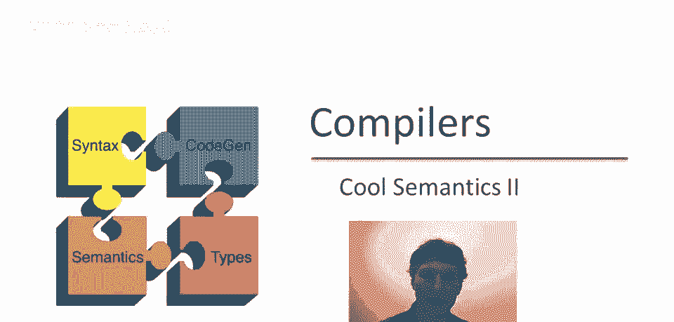
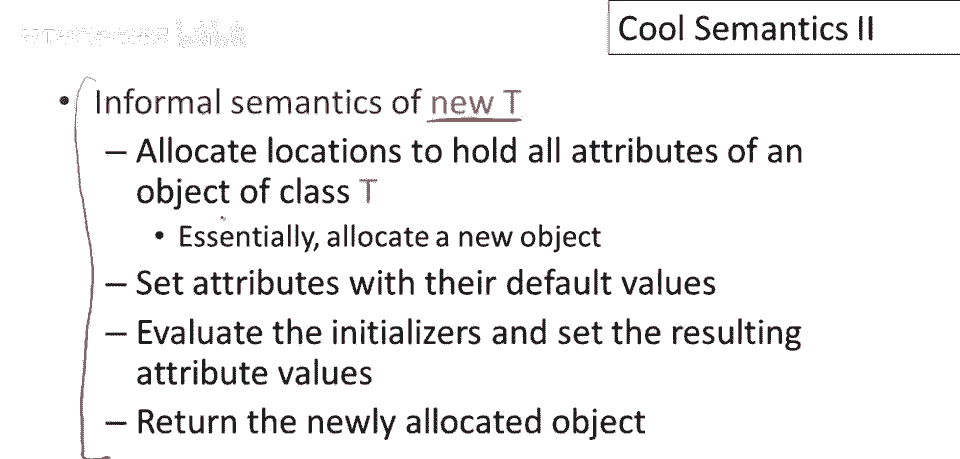
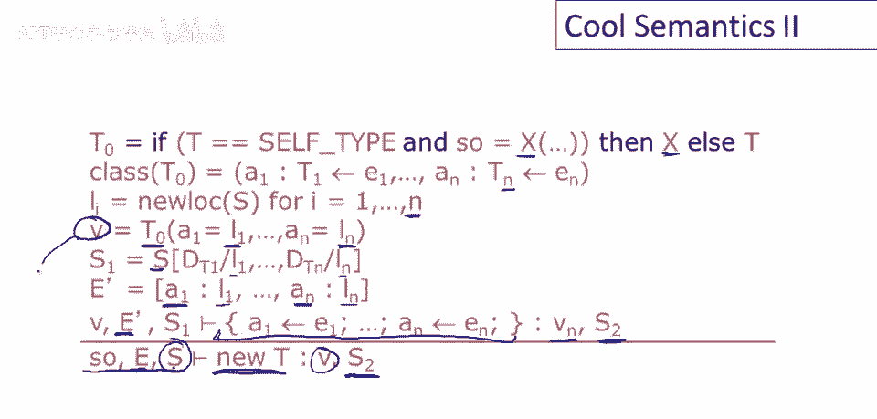
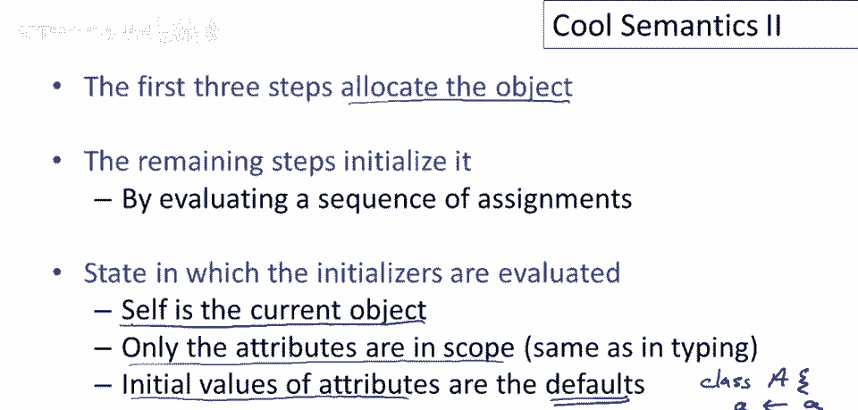
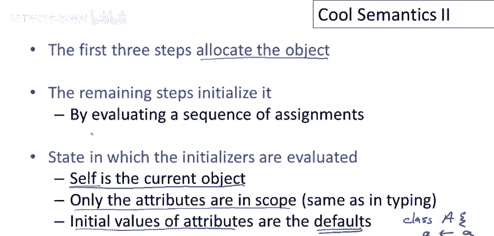
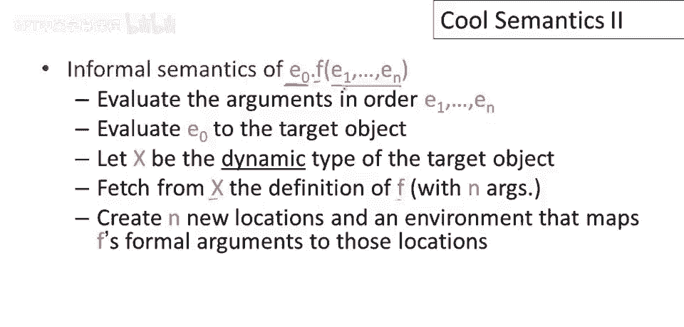
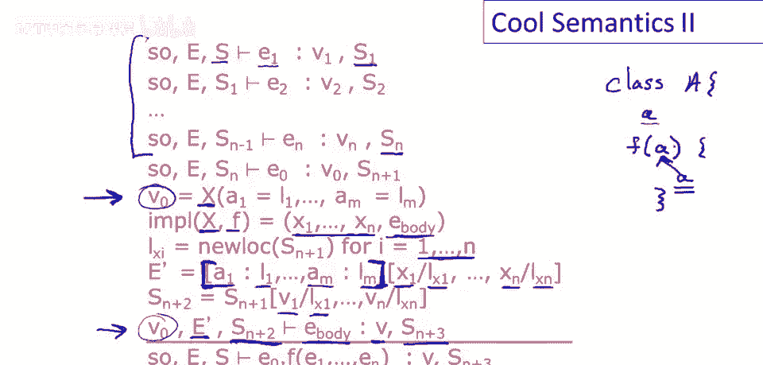
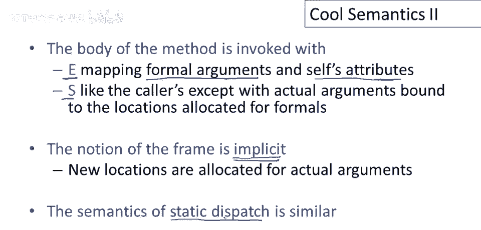
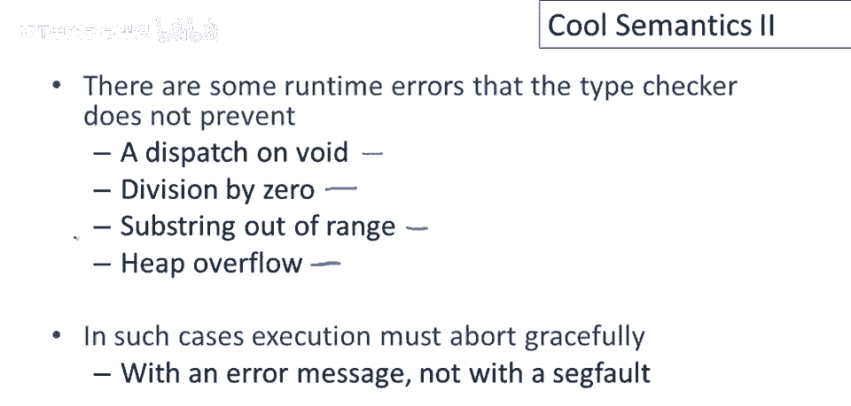
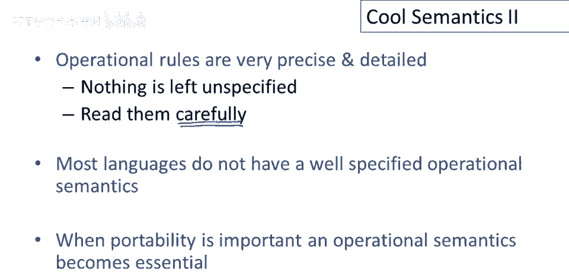

# 课程 P71：Cool 操作语义 I - 对象分配与动态分发 🧠



在本节课中，我们将学习 Cool 语言操作语义中最复杂的两个部分：新对象的分配（`new`）和动态分发（方法调用）。我们将详细拆解这两个操作在运行时发生的每一个步骤。



---


## 概述 📋

上一节我们介绍了 Cool 语言的基本操作语义。本节中，我们将深入探讨两个核心且复杂的运行时操作：创建新对象和动态调用方法。理解这些规则对于实现一个正确的 Cool 编译器至关重要。

---

## 新对象分配（`new`）的语义 🆕


首先，我们非正式地讨论分配新对象时发生的事。必须为对象分配空间，本质上意味着为对象的属性留有足够空间。我们将为类 `T` 对象的每个属性分配一个存储位置。新 `T` 对象的属性首先被设置为默认值，然后评估其初始化表达式，最后返回新分配的对象。这个过程不仅仅是分配内存，还涉及相当多的计算。

### 默认值设定

每个类都有一个关联的默认值。规则如下：
*   对于 `Int` 类型，默认值为 `0`。
*   对于 `Bool` 类型，默认值为 `false`。
*   对于 `String` 类型，默认值为空字符串 `""`。
*   对于其他任何类（非基本类），默认值为 `void`。

### 类的属性列表

在操作规则中，我们需要一种方式来引用类的属性。因此，我们定义一个名为 `class` 的函数，它接受类名并返回该类的属性列表、类型及初始化表达式。

以下是关于属性列表的重要特征：
*   列表包含类 `A` 的所有属性，包括继承的属性。
*   属性出现的顺序至关重要。规则是：属性按“最远祖先优先”的顺序列出。

举例说明，假设有三个类：`A`、`B`（继承自 `A`）和 `C`（继承自 `B`）。
*   `A` 定义属性 `a1`, `a2`。
*   `B` 定义属性 `b1`, `b2`。
*   `C` 定义属性 `c1`, `c2`。

那么类 `C` 的属性列表顺序将是：`a1`, `a2`, `b1`, `b2`, `c1`, `c2`。同一类中的属性按其在文本中出现的顺序排列。



### `new T` 的正式语义

现在我们可以正式定义 `new T` 的语义了。我们将在具有 `self` 对象 `s`、环境 `E` 和存储 `S` 的上下文中，为类型 `T` 分配一个新对象。

**步骤分解：**
1.  **确定对象类型 `T0`**：
    *   如果 `T` 不是 `SELF_TYPE`，则 `T0 = T`。
    *   如果 `T` 是 `SELF_TYPE`，则 `T0` 是 `self` 对象 `s` 的动态类型。
2.  **获取属性信息**：使用 `class(T0)` 函数获取类 `T0` 的属性列表 `(a1, ..., am)`、类型及初始化器 `(e1, ..., em)`。
3.  **分配存储位置**：为每个属性 `ai` 分配一个新的存储位置 `li`。
4.  **创建对象**：创建一个类标签为 `T0` 的新对象 `v`，其属性 `ai` 绑定到位置 `li`。
5.  **初始化默认值**：更新存储 `S` 为 `S1`，使得每个新位置 `li` 持有属性 `ai` 的默认值。
6.  **评估初始化器**：
    *   初始化环境 `E‘` 仅包含 `self` 对象 `v` 和所有属性名 `ai` 到其位置 `li` 的绑定。
    *   将初始化表达式 `(e1, ..., em)` 作为一个块（`{ e1; ...; em; }`）按顺序在环境 `E‘` 和存储 `S1` 中评估。这会得到一个新的存储 `S’`。
    *   注意：`self` 在初始化器中指向正在初始化的新对象 `v`。
7.  **返回结果**：`new T` 的结果是对象 `v`，最终的存储是 `S‘`。



用伪代码/规则描述核心过程：
```
new T 在 (E, S, s) 环境下：
    T0 = if T == SELF_TYPE then class-of(s) else T
    attrs = class(T0) // 获取属性、类型、初始化器列表
    for each attr ai in attrs:
        allocate new location li
    v = new object with tag T0 and bindings ai -> li
    S1 = S updated with li -> default-value(ai)
    E‘ = { self -> v } ∪ { ai -> li }
    evaluate block of initializers in (E’, S1) -> (_, S‘)
    result = (v, S’)
```


### 总结 `new` 的语义



前三个步骤（确定类型、获取属性、分配位置）负责分配对象内存。剩余的步骤通过按顺序评估一系列赋值来初始化对象。关于初始化，最重要的一点是：**初始化器评估的上下文中，只有属性（和 `self`）在作用域内**，这与类型检查规则一致。属性的初始值是默认值，这是必要的，因为属性可以在其自身的初始化器中被引用（例如 `a <- a`）。

---



## 动态分发（方法调用）的语义 🔄


上一节我们介绍了对象创建，本节中我们来看看对象间如何通信——即动态分发。动态分发评估概述如下，然后我们查看正式操作规则。

**评估分派时发生的步骤：**
1.  按顺序评估所有实际参数表达式 `e1` 到 `en`。
2.  评估目标对象表达式 `e0`。
3.  查看目标对象 `v0` 的动态类型（类标签 `X`）。
4.  在类 `X` 的方法表中查找被调用的方法 `f` 的定义。
5.  为本次调用设置新的环境：为形式参数分配位置，并用实际参数值初始化这些位置；将 `self` 设置为目标对象 `v0`；将类的所有属性纳入作用域。
6.  在新的环境和更新后的存储中，评估方法 `f` 的函数体。

### 方法实现的表示

为了在类中查找方法，我们需要一个函数来表示类中存在哪些方法。我们定义一个名为 `impl` 的函数，`impl(X, f)` 返回类 `X` 中方法 `f` 的实现，包括其形式参数列表 `(x1, ..., xn)` 和函数体 `ebody`。

### 动态分发的正式语义

现在我们来讨论方法分派在 Cool 中的正式操作语义细节。考虑动态分发表达式：`e0.f(e1, ..., en)`。

**步骤分解：**
1.  **评估参数**：按顺序评估所有实际参数 `e1` 到 `en`。每个评估都可能产生副作用，更新存储。最终得到值 `(v1, ..., vn)` 和存储 `S_{n}`。
2.  **评估目标对象**：评估表达式 `e0`，得到对象 `v0` 和更新后的存储 `S_{n+1}`。
3.  **获取目标类型与方法**：设 `v0` 的类标签为 `X`（即其动态类型）。查找 `impl(X, f)`，获得形式参数名 `(x1, ..., xn)` 和方法体 `ebody`。
4.  **分配参数空间**：为每个形式参数 `xi` 分配一个新的存储位置 `l_{xi}`。
5.  **构建调用环境 `E‘`**：
    *   设类 `X` 的属性为 `(a1, ..., am)`，它们在 `v0` 中的位置是 `(l_{a1}, ..., l_{am})`。
    *   初始环境包含 `self -> v0` 和所有属性绑定 `ai -> l_{ai}`。
    *   **重要**：在此基础上，用形式参数绑定 `xi -> l_{xi}` **更新**环境。如果形式参数名与某个属性名相同，形式参数的绑定将覆盖（隐藏）属性的绑定。
6.  **初始化参数存储**：更新存储 `S_{n+1}` 为 `S‘`，使得每个新位置 `l_{xi}` 存储对应的实际参数值 `vi`。
7.  **评估方法体**：在环境 `E‘` 和存储 `S’` 中评估方法体 `ebody`。`self` 对象是 `v0`。这会得到结果值 `v` 和最终存储 `S_{final}`。
8.  **返回结果**：整个动态分发表达式的结果是 `(v, S_{final})`。

用伪代码/规则描述核心过程：
```
e0.f(e1, ..., en) 在 (E, S) 环境下：
    evaluate e1 -> (v1, S1)
    ...
    evaluate en -> (vn, Sn)
    evaluate e0 -> (v0, S_{n+1})
    X = class-tag-of(v0)
    (params, ebody) = impl(X, f) // params = (x1, ..., xn)
    for each param xi:
        allocate new location l_xi
    E_attr = { self -> v0 } ∪ { ai -> location-of(ai-in-v0) }
    E‘ = E_attr updated with { xi -> l_xi }
    S’ = S_{n+1} updated with l_xi -> vi
    evaluate ebody in (E‘, S’) -> (v, S_final)
    result = (v, S_final)
```

### 总结动态分发的语义

方法体在专门构建的环境 `E‘` 中被调用，该环境定义了形式参数和 `self` 对象（`v0`）的属性。存储 `S’` 继承了调用者的所有副作用，并额外包含了绑定到形式参数位置的实际参数值。规则中“栈帧”或“激活记录”的概念是隐式的，这给了实现者灵活性。

静态分发（`e0@T.f(...)`）的语义与此非常相似，唯一的区别在于确定被调用方法的类：它使用指定的静态类型 `T`，而不是 `e0` 的动态类型。



---

## 规则完备性与运行时错误 ⚠️

值得指出的是，虽然操作规则非常详细，但它们有意省略了一些情况。例如，在动态分发规则中，我们假设在类 `X` 中查找方法 `f` 时它一定存在。这是因为 Cool 的类型检查器已经确保了这一点。类型系统的存在使得操作语义规则可以更简洁。



然而，类型检查无法防止所有运行时错误。在 Cool 中，主要有四种运行时错误：
1.  对 `void`（空值）进行分发。
2.  整数除以零。
3.  子字符串索引超出范围。
4.  内存耗尽（分配新对象时没有足够空间）。

一个正确的 Cool 实现必须能优雅地处理这些错误（例如，输出清晰的错误信息），而不仅仅是崩溃。


---

## 总结与思考 💎



本节课中，我们一起学习了 Cool 语言操作语义的两个核心部分：**新对象分配**和**动态分发**。

*   **`new T`** 涉及确定类型、分配空间、设置默认值、按特定顺序（最远祖先优先）评估初始化器，最终返回新对象。
*   **动态分发 `e0.f(...)`** 涉及评估参数和目标对象、根据目标对象的动态类型查找方法、构建包含 `self`、属性和（可能覆盖属性的）形式参数的新环境，最后在新的上下文中执行方法体。

这些操作语义规则非常精确和详细。理解它们就等于理解了如何实现一个正确的 Cool 编译器。虽然规则复杂且包含许多微妙之处（如属性顺序、初始化环境、形式参数对属性的覆盖），但仔细研究它们不仅能指导实现，也是深入理解编程语言设计形式化思维的良好方式。



大多数现实中的编程语言并没有如此明确的操作语义定义。但当软件的可移植性和行为一致性至关重要时，拥有一个独立于具体实现的环境定义就变得非常必要。Cool 的操作语义正是提供了这样一个精确的规范。