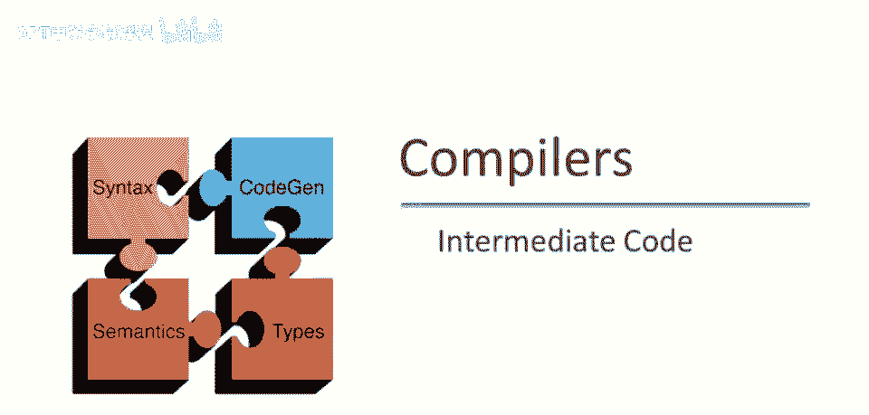
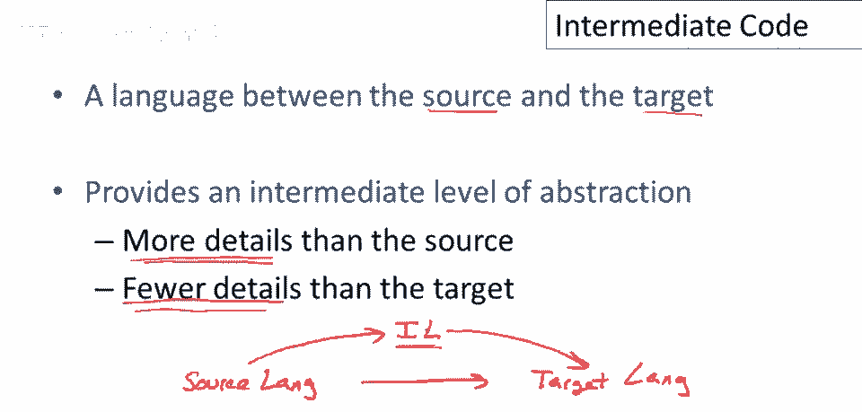
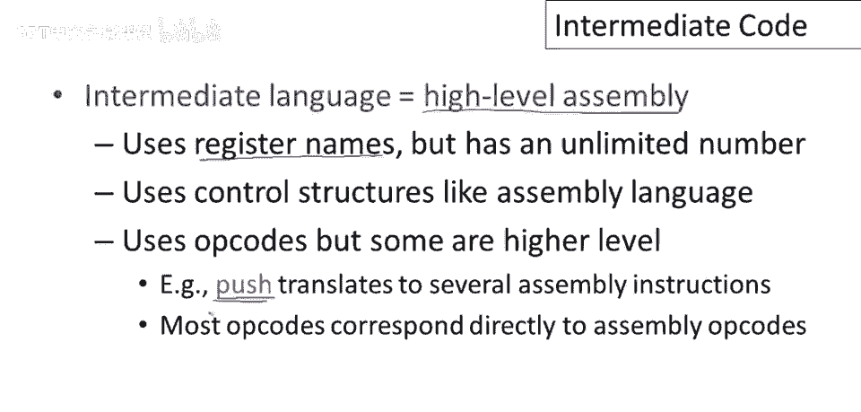
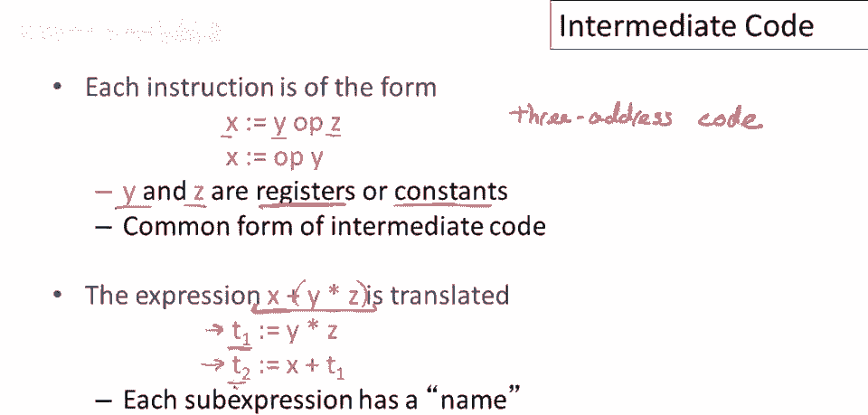
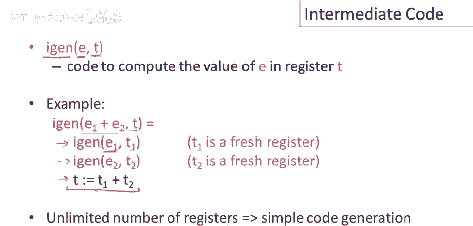

# 课程 P72：中间代码简介 🧩


在本节课中，我们将要学习编译器中的一个核心概念——中间代码。我们将了解什么是中间代码、为什么需要它、它的常见形式以及如何生成它。


---

## 什么是中间代码？🤔

上一节我们介绍了本课程的主题。本节中，我们来看看中间代码的定义。

中间代码，或称中间语言，是介于源语言和目标语言之间的一种语言。编译器的作用是将用源语言（如Cool）编写的程序翻译成目标语言（如MIPS汇编）。中间语言就存在于这个翻译过程的中间阶段。

使用中间语言的编译器会先将源语言翻译成中间语言，然后再将中间语言翻译成目标语言。

你可能会问，为什么要分两步进行？事实证明，引入中间层非常有用，因为它提供了一个适中的抽象级别。

具体来说：
*   中间语言比源语言包含更多细节。例如，像Cool这样的源语言没有寄存器的概念，因此无法在源代码层面进行寄存器优化。而中间语言可以包含寄存器，从而允许我们设计和实现寄存器优化算法。
*   中间语言比目标语言包含更少细节。它通常略高于特定机器的指令集级别，因此更容易将中间代码移植到不同的目标机器上，因为它不包含特定机器的所有细节。

经验表明，使用中间语言是一个好主意。几乎所有现代编译器都使用中间语言，有些编译器甚至使用不止一种中间语言。在本课程后续部分，我们将只考虑一种中间语言。

---



## 我们将使用的中间语言形式 🛠️

上一节我们了解了中间代码的作用。本节中我们来看看本课程将采用的具体中间语言形式。

我们将要使用的中间语言是一种“高级汇编”语言。它具有以下特点：
*   使用寄存器名，但**寄存器数量不受限制**（可以任意多）。
*   控制结构类似于汇编语言，包含明确的跳转（jump）和指令标签（label）。
*   包含操作码（opcode），其中一些是“高级”操作码。例如，可能有一个`push`操作码，它最终会被翻译为目标机器上的多条具体汇编指令。

在这种中间代码中，每条指令只有两种形式：



1.  **二元操作**：`x = y op z`
2.  **一元操作**：`x = op y`

其中，`y`和`z`可以是寄存器或常数（立即数）。`x`是目标寄存器。

这种形式非常常见，被称为**三地址代码**，因为每条指令最多涉及三个“地址”（两个操作数和一个结果存放地址）。

这种代码的层级很低。任何涉及多个操作的高级表达式都必须被翻译成一系列每次只执行一个操作的指令。

例如，对于表达式 `x + (y * z)`，我们不能直接在中间代码中表示。必须将其重写为：
```
t1 = y * z
t2 = x + t1
```
这里，`t1`和`t2`是新的寄存器（或临时变量）。

将复合表达式重写为单操作指令序列的后果是：**每个中间值都会获得自己的名字**。这为程序的优化和分析提供了便利。

---

## 如何生成中间代码？⚙️

上一节我们了解了三地址代码的形式。本节中我们来看看生成中间代码的简要思路。



生成中间代码与生成汇编代码非常相似。主要区别在于，在中间语言中我们可以使用**任意数量的寄存器**来存储中间结果，这简化了生成过程。

我们可以编写一个名为`igen`的中间代码生成函数。它接受两个参数：要生成代码的表达式（`e`），以及用于存放表达式结果的寄存器（`t`）。


以下是生成加法表达式 `e1 + e2` 的中间代码的示例步骤：

1.  为子表达式`e1`生成代码，将其结果存入一个新的寄存器`t1`。
2.  为子表达式`e2`生成代码，将其结果存入一个新的寄存器`t2`。
3.  生成一条三地址指令来计算总和：`t = t1 + t2`。

由于寄存器数量无限，生成中间代码变得非常简单，甚至比为堆栈机器生成代码还要简单（因为无需管理栈指针，可以直接使用寄存器名）。

---

## 总结与展望 📚

本节课中，我们一起学习了编译器中的中间代码。

我们首先了解了中间代码是位于源语言和目标语言之间的桥梁，它既提供了比源语言更底层的细节（以支持优化），又保持了比目标语言更高的抽象（以支持可移植性）。



接着，我们介绍了本课程将使用的中间语言形式——三地址代码，其特点是每条指令最多执行一个基本操作，并为所有中间结果命名。

最后，我们简要探讨了中间代码的生成思路，其核心优势在于可以利用无限数量的寄存器来简化翻译过程。

对于本课程，你需要做到：
*   理解并能够使用这个级别的中间代码。
*   能够编写简单的中间代码程序。
*   能够设计在中间代码上运行的算法（尤其是优化算法）。

关于如何从源程序自动生成中间代码，我们不会深入讨论，因为它所使用的思想与我们已学过的代码生成技术相似。


在未来的课程中，我们将经常查看中间代码，并利用它来表达和实现各种程序优化。