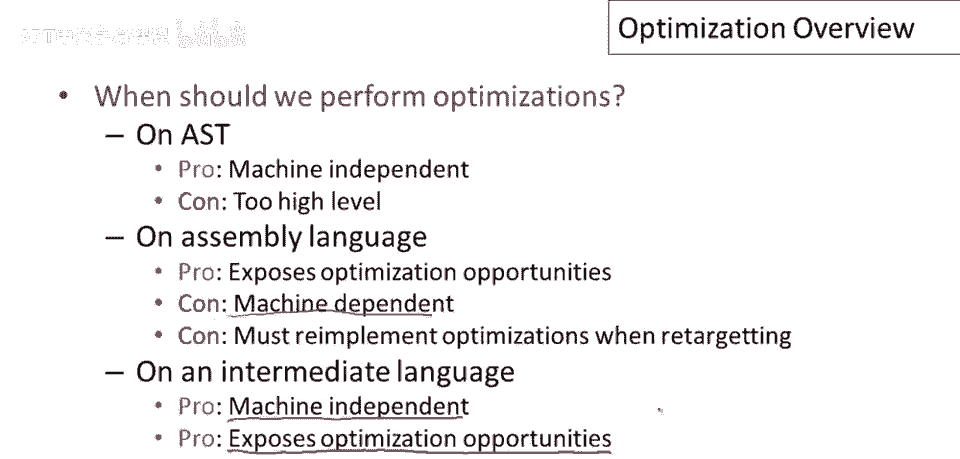

# 课程 P73：程序优化概述 🚀


在本节课中，我们将要学习程序优化的基本概念，包括优化的原因、权衡以及编译器如何决定实施哪些优化。我们将从编译器的工作阶段开始，探讨优化的位置、执行优化的不同层次（如抽象语法树、汇编语言和中间语言），并介绍优化中两个重要的概念：基本块和控制流图。最后，我们会讨论优化的目标、不同粒度（局部、全局、跨过程）以及为什么并非所有已知的优化技术都会被实际应用。


---

## 编译器阶段回顾 🔄

上一节我们介绍了课程的整体目标，本节中我们来看看编译器的工作流程。优化是编译器讨论的最后一个阶段。


让我们简要回顾一下编译器的主要阶段：
1.  词法分析
2.  解析
3.  语义分析
4.  代码生成
5.  优化

实际上，优化通常在代码生成之前进行，因为我们希望在将程序转换为机器码之前改进它。在现代编译器中，优化阶段通常位于语义分析和代码生成之间，这是编译器中最复杂、代码量最多的部分。


---

## 优化的执行时机 ⏱️

一个非常基本的问题是何时执行优化。我们实际上有几个选择。



**在抽象语法树上进行优化**
*   **优势**：它是机器无关的。
*   **劣势**：抽象语法树的层次太高，无法表达许多依赖于机器低级细节的优化。

**在汇编语言上执行优化**
*   **优势**：机器的所有细节都暴露出来，原则上任何优化都可以在此级别表达。
*   **劣势**：优化依赖于特定机器架构，需要为每种新架构重新实现。

**使用中间语言进行优化**
*   **优势**：如果设计得当，中间语言可以保持机器无关性（代表一大类机器），同时暴露足够的优化机会，让编译器有效提升程序性能。


---

## 中间语言与基本块 🧱


我们将研究对中间语言的优化。该中间语言的操作由以下语法描述：

```
程序 -> 语句序列
语句 -> x = y                     // 复制
       | x = 一元操作 y           // 一元操作
       | x = y 二元操作 z         // 二元操作
       | push x                   // 压栈
       | x = pop                  // 弹栈
       | if x 比较操作 y goto L  // 条件跳转
       | goto L                   // 无条件跳转
       | L:                       // 标签
```


其中，`x, y, z` 是寄存器名称，也可以在操作符右侧使用立即值。我们假设典型的操作符家族，如加、减、乘等。

优化通常针对语句组进行，最重要的分组是**基本块**。

基本块是一系列指令，我们希望它是**最长可能**的指令序列，并满足两个属性：
1.  除了第一条指令外，序列中没有标签。
2.  除了最后一条指令外，序列中没有跳转。

基本块背后的想法是保证执行流程：一旦从块的第一条语句开始执行，就保证会按顺序执行到最后一条语句。控制流在块内是完全可预测的。进入块的唯一方式是通过第一条指令，离开块的唯一方式是通过最后一条指令。

以下是一个基本块示例，展示了其有用性：
```
1. t = 2 * x
2. t = t + x
3. w = t + x
```
因为语句2总是在语句3之前执行，我们可以将第三条指令优化为 `w = 3 * x`。如果 `t` 是一个临时变量且只在此处使用，我们甚至可以删除前两条语句。

---


## 控制流图 🗺️

仅看单个基本块可能无法了解变量的全部用途。下一个重要的语句分组是**控制流图**。


控制流图是基本块构成的图。如果执行可以从块A的最后一条指令传递到块B的第一条指令，那么图中就存在一条从块A指向块B的边。控制流图总结了程序中块之间有趣的控制流决策点。

一个方法体可以表示为一个控制流图。我们通常约定控制流图有一个特殊的入口节点（起始节点），以及一些返回节点（退出点），这些节点没有出边。


---

## 优化的目标与权衡 ⚖️


优化的目的是提高程序的资源利用率。在本课程中，当我们谈论优化时，主要关注**减少程序的执行时间**，即让程序运行得更快。这是人们最关心的方面，大多数编译器也在此投入大量精力。

但需要认识到，还有许多其他资源可以优化，例如：
*   代码大小
*   网络消息数量
*   内存使用
*   磁盘访问次数
*   电源消耗（对电池供电设备尤为重要）

优化的一个重要原则是：**不能改变程序计算的内容**。答案必须保持不变。我们可以提高资源利用率，但不能改变程序的输出。

---


## 优化的粒度 📊

对于像C和Cool这样的语言，通常谈论三种优化粒度：

以下是三种主要的优化粒度：
1.  **局部优化**：对单个基本块孤立进行的优化。
2.  **全局优化**（实际指函数级优化）：针对单个函数（即其整个控制流图）进行的优化。
3.  **跨过程优化**：跨越方法边界，对多个函数进行整体优化的技术。

许多编译器都实现了局部优化，几乎所有现代编译器都实现了全局优化，但实际实现跨过程优化的编译器并不多。这是因为随着优化粒度的增加，实现的复杂度和难度也大幅增加，而许多性能收益在更局部的优化中已经可以获得。


---

## 优化实施的现实考量 🛠️

虽然我们知道如何实现许多优化，但编译器开发者经常有意识地决定不实现研究文献中已知的最先进优化。


这主要归结为**软件工程的权衡**：
*   **实现复杂度高**：一些优化算法非常复杂，难以正确实现和维护。
*   **编译时间成本**：一些优化非常耗时，可能导致编译过程需要几小时甚至几天，影响开发效率。
*   **收益较低**：一些复杂的优化可能只带来微小的性能提升。

因此，优化的真正目标是追求**最大的收益与最小的成本**（即高成本效益比）。优化带来的性能改进必须足够大，才能证明其在代码复杂性、编译时间等方面所付出的成本是值得的。文献中许多最复杂的优化往往同时具备高复杂度、长编译时间和低收益的特点，因此并未被广泛用于生产编译器。

---

## 总结 📝


本节课中我们一起学习了程序优化的概述。我们回顾了编译器阶段，了解了优化通常在中间代码上进行。我们学习了**基本块**和**控制流图**这两个用于分析和实施优化的重要概念。明确了优化的目标是提高资源利用率（尤其是运行速度）且不改变程序语义。我们还探讨了局部、全局和跨过程等不同粒度的优化，并理解了在实际编译器开发中，需要在优化收益与实现成本之间进行谨慎的权衡。