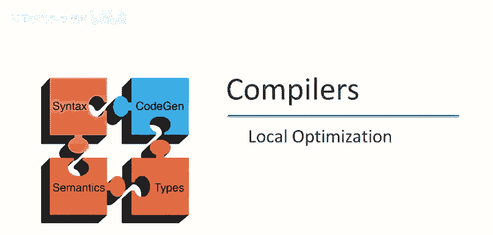
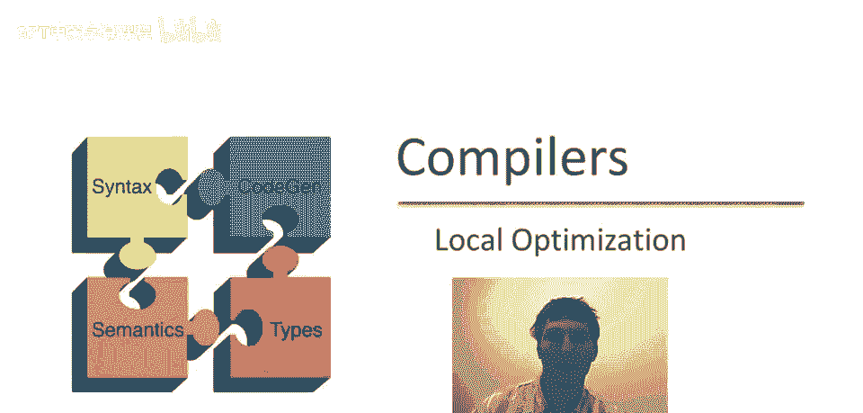
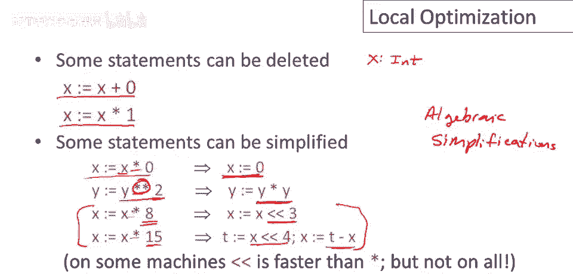
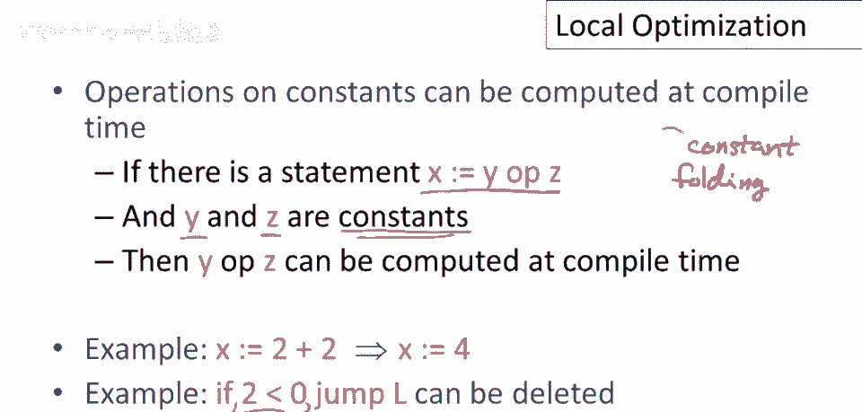
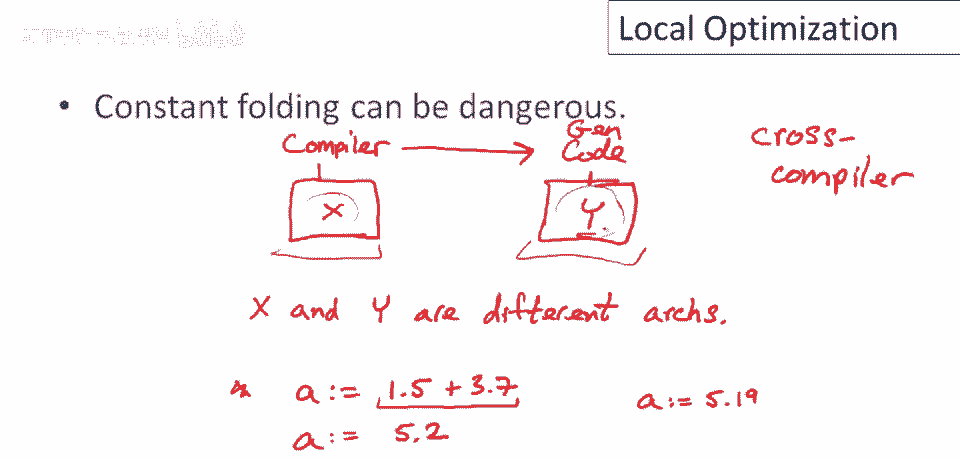
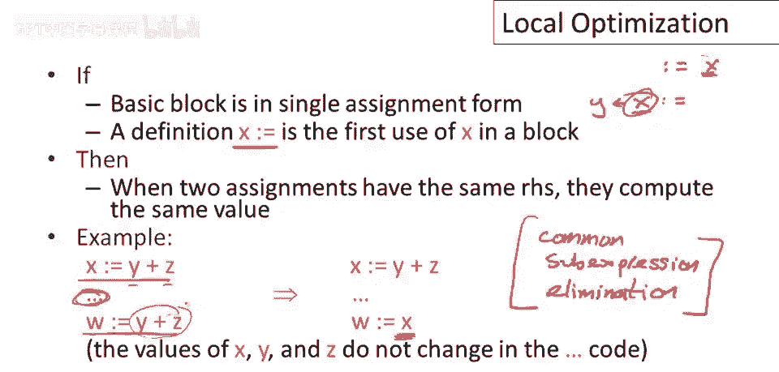
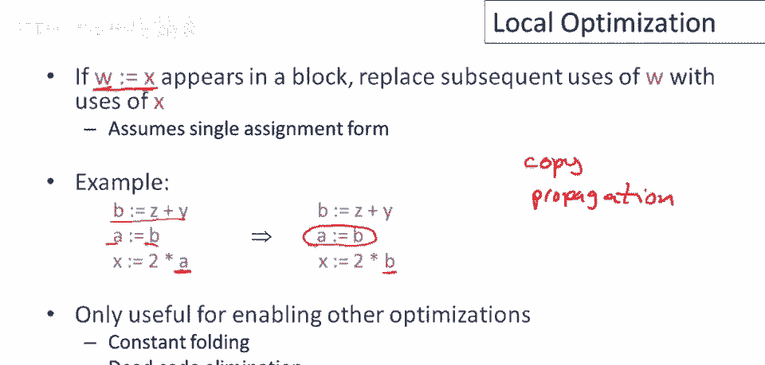
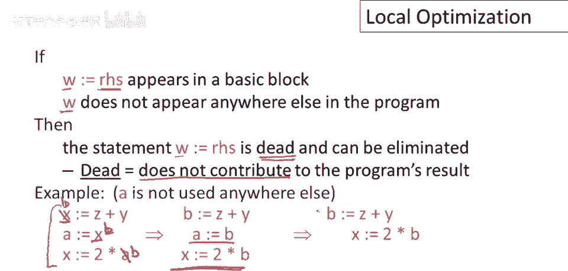

# 课程 P74：局部优化 🛠️


在本节课中，我们将要学习程序优化中最基础的形式——局部优化。局部优化专注于优化单个基本块内的代码，无需考虑复杂的控制流。我们将介绍多种简单但有效的优化技术，并通过实例演示它们如何相互作用，最终使程序变得更小、更快。

---

## 什么是局部优化？ 🧱

上一节我们介绍了局部优化的基本概念，本节中我们来看看它的具体定义。

局部优化是最简单的程序优化形式，因为它只关注优化单个基本块。特别地，它无需担心复杂的控制流，也不会查看整个方法或过程体。

---

## 代数简化 ✂️



在了解了局部优化的范围后，我们来看看几种基于数学特性的简化优化。

以下是几种代数简化的例子：
*   **删除无用操作**：对于整型变量 `x`，语句 `x = x + 0` 或 `x = x * 1` 不会改变 `x` 的值，因此可以直接删除。
*   **简化操作**：语句 `x = x * 0` 可以简化为 `x = 0`。虽然仍需执行赋值，但可能更快或为后续优化创造条件。
*   **替换幂运算**：计算 `y ** 2`（`y` 的平方）可以替换为 `y * y`，以避免函数调用开销。
*   **用移位替换乘法**：对于乘以 2 的幂的操作，如 `x * 8`，可以用左移替换，即 `x << 3`。对于其他乘数，也可用移位和加减法的组合来替换。

这些优化都利用了数学运算符的特性，用更简单或更高效的操作替换复杂的操作。



---

## 常量折叠 🔢

代数简化关注的是操作本身，而常量折叠则致力于在编译时完成计算。

常量折叠是指在编译时而非运行时计算操作的结果。这是编译器最重要和最常见的优化之一。

以下是常量折叠的应用场景：
*   **计算常量表达式**：对于指令 `x = 2 + 2`，可以在编译时计算出结果为 4，并替换为 `x = 4`。
*   **预计算条件跳转**：如果条件语句的谓词仅由立即值组成，如 `if (2 > 0) goto L1`，编译器可以预计算结果。由于条件恒真，可以直接替换为无条件跳转 `goto L1`；若恒假，则可删除该跳转指令。

**注意**：在交叉编译（为不同架构的机器生成代码）时，对浮点数的常量折叠需要特别小心。不同架构的浮点运算舍入方式可能不同。谨慎的编译器会在内部以高精度（如字符串形式）执行浮点运算，生成精确的字面量，由目标机器决定最终舍入，以保证结果的一致性。

---



## 消除不可达代码 🗑️

优化不仅能让代码运行更快，还能让代码变得更小。接下来我们看看如何删除永远不会执行的代码。


不可达的基本块是指没有任何跳转指令能跳转到其开头，且它不是前一条指令顺延执行目标的基本块。这样的代码永远不会被执行，可以从程序中删除。

删除不可达代码能减小程序体积，可能因更好的缓存局部性而间接提升运行速度。


不可达代码的出现有几种常见原因：
*   **条件编译**：例如在 C 语言中，通过预定义宏（如 `#ifdef DEBUG`）来包含或排除调试代码。当 `DEBUG` 未定义时，对应的代码块就成为不可达的。
*   **库函数未使用**：程序可能只使用了通用库中的一小部分函数，其余未使用的函数代码可以被删除。
*   **其他优化的结果**：其他优化可能导致某些基本块变得冗余和不可达。

---

## 单赋值形式 📝

为了更清晰地表达和实现某些优化，我们常常需要将代码转换为一种标准形式。

单赋值形式要求每个寄存器（或变量）在基本块内最多被赋值一次。如果代码不满足此条件，我们可以通过引入新的寄存器名来重写。


例如，对于以下两次对 `x` 的赋值：
```
x = y + z
...
x = a + b
```
我们可以将第一个赋值重写为：
```
b = y + z
...
x = a + b
```
现在，每个寄存器都只被赋值一次。

---


## 基于单赋值形式的优化 🔄

将代码转换为单赋值形式后，我们可以更方便地应用一些强大的优化。

以下是两种依赖于单赋值形式的重要优化：

**公共子表达式消除**
如果两个赋值语句的右侧表达式完全相同，并且由于处于单赋值形式，其操作数在两次赋值之间不会改变，那么这两个表达式计算的值必然相同。因此，第二个计算可以被替换为对第一个结果寄存器名的引用。
例如：
```
x = y + z
...
w = y + z // 可替换为 w = x
```

**复制传播**
如果我们看到一个赋值 `w = x`（将 `x` 的值复制给 `w`），那么 `w` 的所有后续使用都可以替换为直接使用 `x`。
例如：
```
b = 5
a = b
c = a + 1 // 复制传播后变为 c = b + 1
```
复制传播本身并不减少指令，但它常与其他优化（如死代码消除）结合，为后续优化创造条件。



---

## 优化组合实例 🧩



单个优化的效果可能有限，但优化之间会相互作用，一个优化可能为另一个优化打开大门。让我们通过一个例子来观察这个过程。

假设我们有以下代码片段：
```
a = 5
x = 2 * a
y = x + 6
t = x * y
```
优化过程如下：
1.  **常数传播**：将 `a = 5` 传播到 `x = 2 * a`，得到 `x = 2 * 5`。
2.  **常量折叠**：计算 `2 * 5`，得到 `x = 10`。
3.  **常数传播**：将 `x = 10` 传播到 `y = x + 6`，得到 `y = 10 + 6`。
4.  **常量折叠**：计算 `10 + 6`，得到 `y = 16`。
5.  **常数传播**：将 `x=10` 和 `y=16` 传播到 `t = x * y`，得到 `t = 10 * 16`。
6.  **常量折叠**：计算 `10 * 16`，最终得到 `t = 160`。

通过一系列优化的组合，复杂的计算在编译时就被完成了。

---

## 死代码消除 ☠️


在进行了各种传播和折叠后，程序中可能会留下一些不再需要的代码。

如果一个寄存器被赋值，但其值在程序的后续部分（包括本基本块和其他地方）从未被使用，那么对该寄存器的赋值语句就是“死代码”，可以直接删除。

考虑以下代码，假设 `a` 在程序其他地方未被使用：
```
x = y + z
a = x
```
1.  首先转换为单赋值形式（假设需要）：`b = y + z; a = b`。
2.  进行复制传播：后续使用 `a` 的地方替换为 `b`（此例中无后续使用）。
3.  现在，赋值 `a = b` 的结果未被引用，可以删除。
4.  最终只留下 `b = y + z`（或 `x = y + z`）。



---


## 综合示例与优化策略 🎯


最后，让我们看一个更复杂的例子，并总结编译器的优化策略。

假设初始代码如下，目标是计算 `g`：
```
b = 3
c = b
a = x ** 2
d = x * x
e = 3 << 1
f = a + a
g = e * f
```
优化步骤：
1.  **代数简化**：`x ** 2` 替换为 `x * x`；`3 << 1` 是 `3*2`，但先保留。
2.  **复制/常数传播**：`b=3` 和 `c=b` 传播开。
3.  **常量折叠**：`e = 3 << 1` 可计算为 `e = 6`。
4.  **公共子表达式消除**：`a = x * x` 和 `d = x * x` 相同，故 `d = a`。
5.  **复制传播**：`d=a` 和 `e=6` 传播到后续使用。
6.  **死代码消除**：假设 `b, c, d, e` 后续不再使用，则它们的赋值语句可被删除。
7.  最终得到优化后的核心代码：`a = x * x; f = a + a; g = 6 * f`。
    *   *进一步的优化*：聪明的编译器可能发现 `f = a + a` 即 `f = 2 * a`，从而推导出 `g = 6 * (2 * a) = 12 * a`，进而可能将 `f` 也作为死代码消除。

优化编译器的工作方式就像一个拥有许多技巧的工具袋。它反复扫描代码，寻找可应用的优化转换，执行它们，然后再次扫描，直到没有更多的优化可以应用为止。这个过程称为“优化遍”。

---

## 总结 📚


本节课中我们一起学习了程序优化中的局部优化技术。我们从局部优化的定义开始，先后介绍了**代数简化**、**常量折叠**、**消除不可达代码**等基础优化。为了更有效地实施优化，我们引入了**单赋值形式**，并在此基础上讲解了**公共子表达式消除**和**复制传播**。最后，我们通过实例看到了**死代码消除**如何清理冗余代码，并理解了优化编译器通过多“遍”扫描、组合应用各种优化策略的工作方式。掌握这些局部优化是理解更复杂全局优化的基础。