# P74：p74 14-03-_Local_Optimizati - 加加zero - BV1Mb42177J7

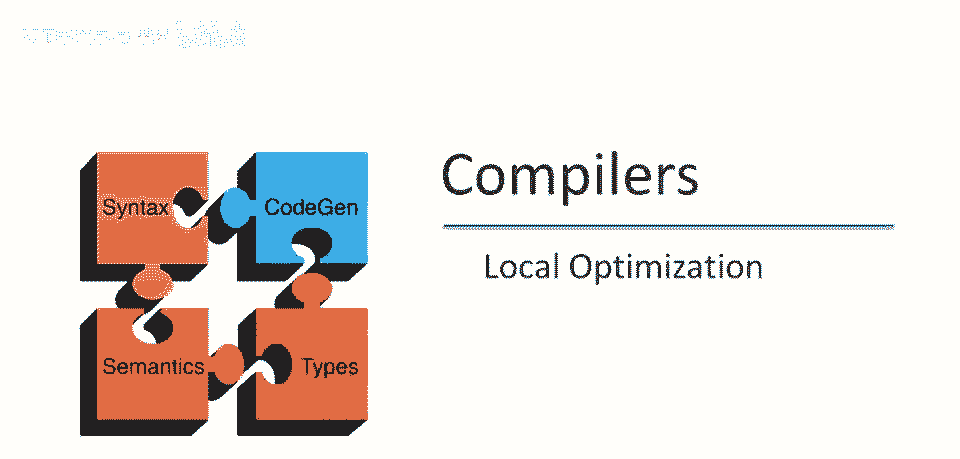

现在准备讨论实际程序优化，我们从局部优化开始。

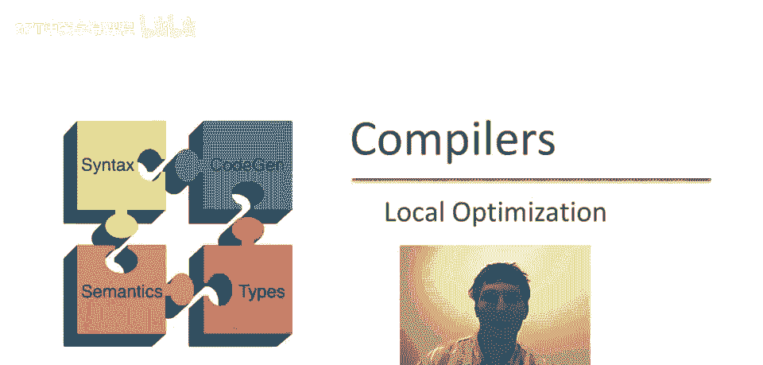

局部优化是最简单的程序优化形式，因为它只关注优化单个基本块，仅一个基本块，特别地，无需担心复杂的控制流，我们不会查看整个方法或过程体。

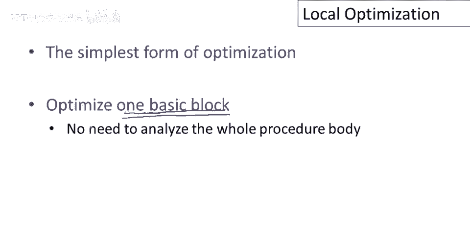

让我们深入研究，并查看几个简单的局部优化，如果x是整型变量，从今往后我们假设x是整型，让我写下来，我们将在本幻灯片的示例中假设x是整型，那么语句x等于x加零，不会改变x的值，零是加法单位元。

我们只是将x赋予它当前的值，因此该语句实际上是无用的，可以从程序中删除，类似地，对于x等于x乘以一，乘以一不会改变x的值，因此该语句也可以删除，在这种情况下，这些是非常棒的优化。

因为我们实际上节省了整个指令，有些语句不能被删除，但可以被简化，一个简单的例子是，如果我们有x等于x乘以零，那么可以替换为赋值，x等于零，同样我们仍然有，我们仍然需要执行一个语句。

但这个语句可能执行得更快，因为它不涉及实际运行乘法运算符，它不涉及引用x的值，假设x是寄存器，实际上不花费任何东西，但你知道，这条指令可能比这条指令执行得更快，在许多机器上这不是事实，实际上。

这个赋值和这个赋值在右边将花费相同的时间，与左边的乘法相同，但正如我们将看到的，嗯，将一个常数赋给一个变量实际上将启用其他优化，所以这仍然是一个非常值得进行的转换，一个几乎肯定优化的例子是。

是用显式乘法替换幂运算符，将一个值提升到二次方，所以这里我们正在计算y的平方，这里我们替换成y乘y，为何这是个好主意，嗯，这个指数运算符很可能不是内置机器指令，可能最终会出现在我们生成的代码中。

是一个调用内置数学库的函数，这会涉及函数调用开销，然后会有一个通用循环，做正确的乘法次数，取决于指数是多少，若指数为2的特例，直接替换更高效，用显式乘法替换幂运算，替换操作类型的一个例子。

若乘数为2的幂，可用左移替换，这里乘8，相当于将x的二进制表示右移3位，嗯，那将你知道，实际上计算相同的事，甚至不必是2的幂，嗯，如果我们有乘以其他数字，那不是2的幂，可以用移位和减法组合替换，好的。

因此，可以用移位和算术操作替换乘法，更简单的算术操作，现在，最后两个这里，我要指出，你知道，现代机器上的有趣变换，通常，这不会导致任何加速，因为在现代机器上，整数乘法操作与其他单指令一样快。

这些实际上是重要优化，所有这些指令都是代数简化的例子，利用数学运算符特性，替换更复杂，嗯，指令或操作。

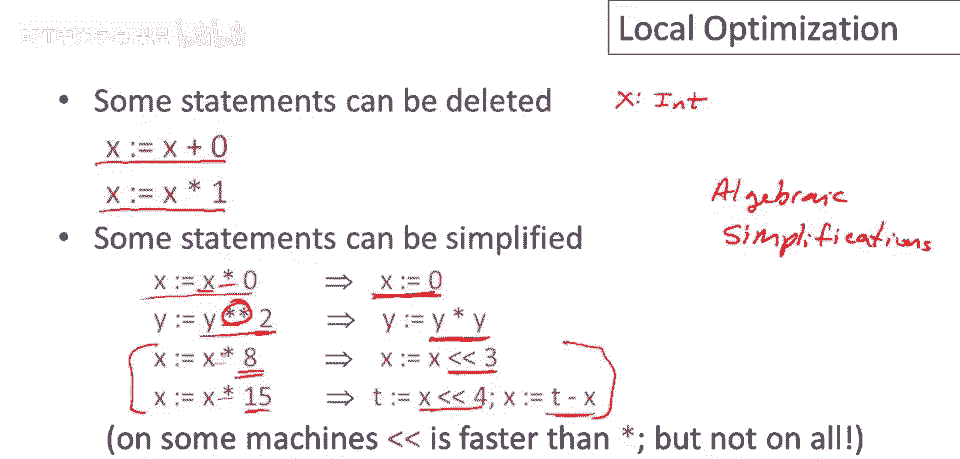

最重要的，和有用的局部优化，是在编译时而非运行时，计算操作结果，例如，假设我们有3地址指令，y和z都是常数，这些都是立即值，这些都是，你知道，指令中的字面量，实际上可以在编译时计算右边的结果。

并用对常数的赋值替换，例如，如果有指令x等于2，加2可以替换为x等于4的赋值，另一个例子是一个非常常见和重要的，如果条件语句的谓词仅由立即值组成，那么我们可以预计算该条件的结果，并决定条件的目标。

编译时决定下一个指令，在这种情况下，我们有这样一个谓词，它将评估为假，因为2不大于0，因此我们不会跳转，如果这个指令是，如果2大于0，它说这是一个保证为真的谓词，那么我们可以用跳转替换这个条件，好的。

这将成为无条件跳转，这类优化称为常量折叠，如我所说。

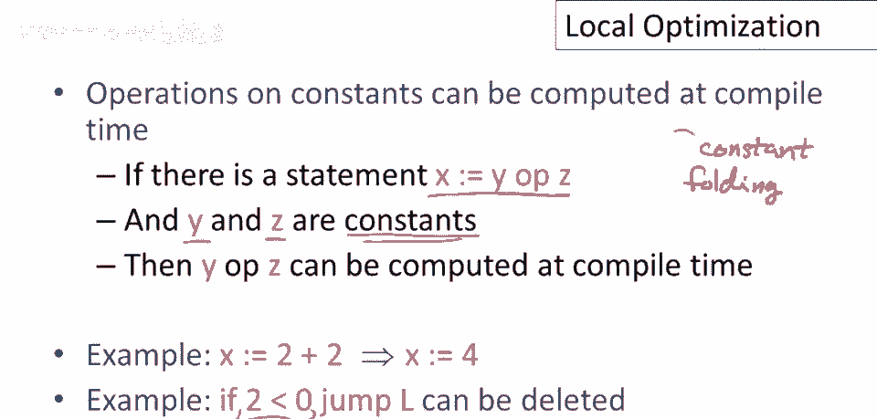

这是编译器执行的最常见和最重要的优化之一，现在有一种情况你应该注意，在这种情况下，常量折叠可能非常危险，这种情况实际上非常具有启发性，虽然它并不常见，我想提到它，因为它真正说明了。

程序优化和编程语言语义的微妙之处，那么这种危险的情况是什么，让我们考虑这个场景，我们有两台机器，我们有机器x和机器y，现在编译器正在机器x上运行，编译器正在产生代码，生成的代码。

这是编译器在这里产生的输出代码，嗯，将在机器y上运行，所以这是一个交叉编译器，好的，你在一个机器上运行编译器，但你为不同的机器生成代码，你为什么要这样做呢？你想要这样做的常见情况，这台机器是否很弱。

运行很慢，内存有限，可能电力有限，开发程序有益，甚至在更强大的机器上编译，许多嵌入式系统代码就是这样开发的，代码在强大的工作站开发，但实际上是为小型嵌入设备编译，将执行代码，现在问题来了，嗯。

如果x和y不同，考虑x和y是不同机器的情况，不同架构，我暗示过它们是，但它们不必是，我的意思是，我的意思是，可以在一种架构上编译，并在同一架构上运行相同代码，但有趣的情况是x和y是不同的架构。

考虑机器x中的情况，假设指令a等于1。5加3。7，好的，您希望将其常数折叠为a等于5。2，现在，问题是，如果您简单地在架构x上执行此浮点操作，舍入，您知道浮点，语义和架构x可能与架构y略有不同。

如果在架构y上直接执行，您可能会得到类似a点5，i等于5。19，浮点结果可能略有不同，取决于您是在这里还是这里执行该指令，这在常数折叠和交叉编译中很重要，因为某些算法确实依赖于浮点数字被非常一致地处理。

所以如果您以某种方式在这里进行舍入操作，您需要每次执行该操作时都这样做，您执行该特定操作，通过将计算从运行时，当它将在架构y上执行时回到编译器，最终执行架构x，您可以更改程序的结果。

那么交叉编译器如何实际处理这个问题，因此，想要小心处理这种事情的编译器，他们会将浮点数字表示为编译器内的字符串，并直接在字符串上执行明显的长形式加法和乘法除法操作，直接在字符串上执行所有浮点操作。

在编译器内保持完全精度，然后在生成的代码中产生精确浮点数字面量，然后让架构y决定如何四舍五入，好的，这是对浮点数进行常数折叠的非常谨慎的方法，如果您担心跨编译。

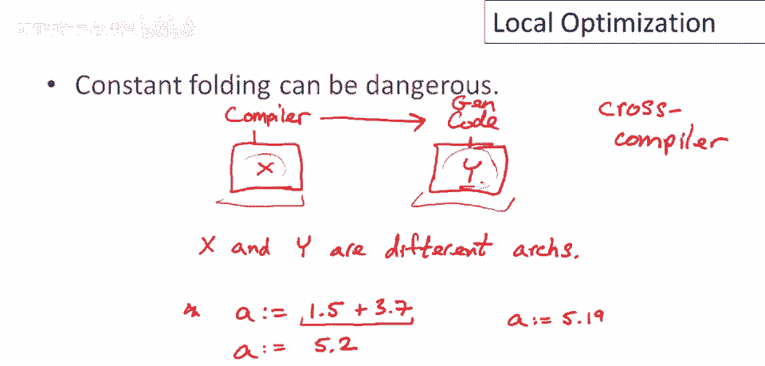

继续进行局部优化，另一个重要的一点是消除不可到达的基本块，什么是不可到达的基本块，这是没有被任何跳转或顺延的目标的基本块，所以如果我有一段代码永远无法执行，它们可能永远不会执行。

因为没有任何跳转跳转到那段代码的开头，并且它不是紧随在可以顺延到它的另一条指令之后，那么在那段代码中那个基本块就是不会被使用的。

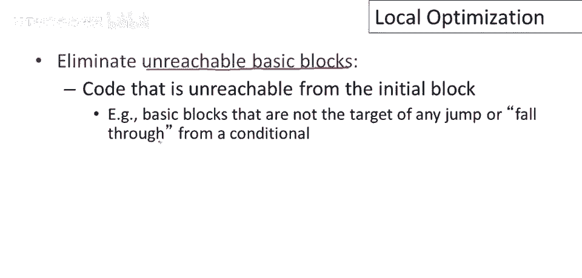

它是不可到达的，可以从程序中删除，这有使代码变小的优点，显然，由于基本块是不可到达的，它不会以指令计数的方式对程序的执行成本做出贡献，所以这段代码永远不会执行，所以它并没有真正减缓代码的速度。

因为你知道，多余的指令正在被执行，但是使程序变小，实际上可以使它运行得更快，因为缓存效应，指令必须适合内存，就像数据一样，如果你使程序变小，它更容易适应内存，并且你可能增加程序的空间局部性。

一起使用的指令现在可能更接近，这可以使程序运行得更快。

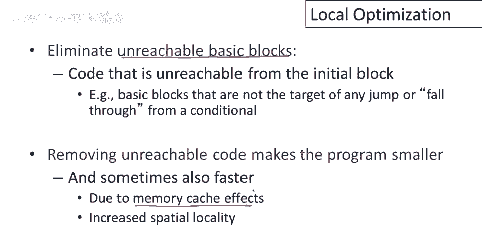

在继续之前，我想说一两句关于为什么不可到达的基本块会出现，所以为什么一个头脑清醒的程序员会写一个程序，其中包含不会被执行的代码，实际上有好几种方式不可达代码可以出现，而且实际上相当常见。

所以这是一个重要的优化，消除不可达代码实际上相当重要，也许最常见的情况是代码实际上是参数化的，只在某些情况下编译和使用，所以在C中，你可能会看到一些像这样代码，嗯，如果调试。

那么你知道执行一些调试是预定义的常量，所以在C中你可以为字面量定义名称，所以你说一些像这样的事情，比如说，你可能将调试定义为0，因此你可能看到这样的程序代码，这实际上意味着这段代码相当于，如果0。

那么巴拉巴拉，巴拉，好吧，所以，当你编译时没有调试，你将调试定义为0，当你编译时带有调试，你会改变这行代码将调试定义为非零常数，所以在这种情况下当你编译时没有调试，会发生什么。

我们会看到此谓词保证为0常数，折叠将处理它，这将导致然后分支上的不可达基本块，然后该代码可以被删除，因此本质上，编译器能够通过优化器，并删除所有不会被使用的调试代码，因为你编译时没有调试。

不可达代码出现的另一个情况是使用库，因此非常频繁地，嗯，程序被编写为使用通用库，但程序可能只使用接口的一小部分，因此库可能提供100个方法来涵盖各种程序员感兴趣的情况。

但对于你的程序你可能只使用其中的3个方法，其余那些方法可能从最终二进制文件中删除以减小代码大小，最后，不可达基本块出现的另一种方式是其他优化的结果，因此我们将看到优化经常导致更多的优化。

并且可能是通过编译器对代码的其他重新排列，嗯，使一些基本块冗余并能够被删除。

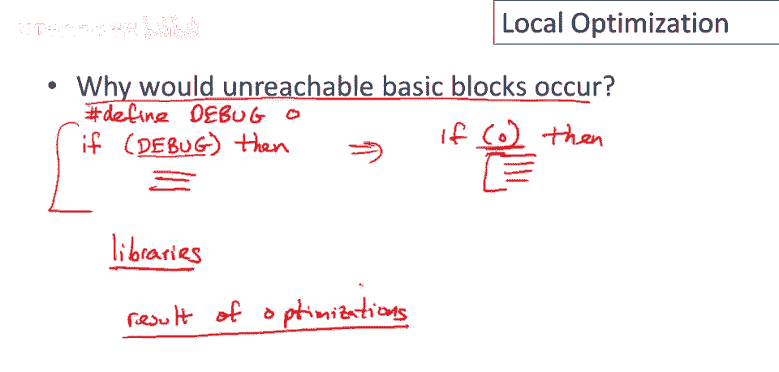

现在一些优化更容易表达，如果每个寄存器只在赋值语句的左侧出现一次，这意味着如果每个寄存器最多被赋值一次，那么这些优化更容易讨论，因此我们将重写我们的中间代码始终为，以便它处于单赋值形式。

所以这称为单赋值形式，这意味着如果我们看到一个寄存器被重用，如这里，我们有对寄存器x的两个赋值，我们只需为这些赋值中的一个引入另一个寄存器名，所以在这种情况下我只是将第一个，嗯，x的使用。

x的定义改为新的寄存器b，将x替换为b的名字，现在我有满足单一赋值形式的等效代码，每个寄存器最多被赋值一次。

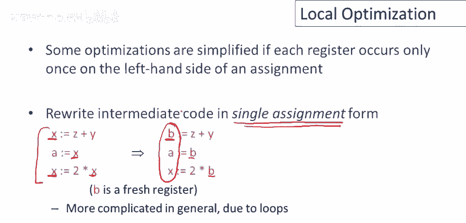

让我们看看依赖于单一赋值形式的优化，因此我们将假设基本块处于单一赋值形式，如果它们是这样，那么，我们将知道一个寄存器的定义，是该块中该寄存器的第一次使用，因此特别地，我们也在排除类似这样的事情。

所以可能像这样，x是红色的，然后稍后x被使用，好的，抱歉，x是红色的，然后稍后x被定义，所以我们不会允许这个，嗯，这里的寄存器必须重命名为其他东西，比如y，然后x稍后的使用重命名为y好吧。

因此我们将坚持，每当我们在基本块中有一个寄存器的定义时，那是该块中该寄存器的第一次使用好吧，如果这是真的，如果我们意味着，如果我们以那种形式放置东西，而且这很容易做到，正如我们所见。

那么当两个赋值具有相同的右侧时，它们保证计算相同的值，所以看看这里的例子，所以假设我们有一个赋值x等于y加c，然后稍后我们有一个另一个赋值，W等于y加z，我们说过，在任何基本块中只能对x进行一次赋值。

所以所有这些对齐的指令，它们不能对x进行赋值，它们也不能对y和z进行赋值，y和z已经有了它们的定义，所以y和z不能改变，这意味着x和w实际上计算相同的值，因此我们可以替换第二个计算。

y加z为我们已经有的它的名字，x好吧，这节省了我们重新计算值的工作，所以这被称为公共子表达式消除公共，这是一个相当长的名字子表达式，这是另一个更重要的编译器优化。

这实际上是一个令人惊讶地经常出现并节省大量工作的事情，如果，如果你执行此优化。

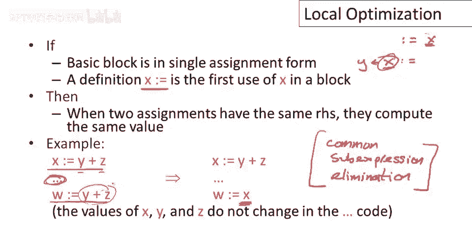

单一赋值形式的另一个用途是，如果我们看到块中的赋值w等于x，所以寄存器w只是从寄存器x复制而来，然后w的所有后续使用都可以替换为使用x，例如，这里我们有一个对b的赋值，然后有一个对a的复制a等于b。

然后在这里我们有一个在最后指令中的a的使用，嗯，最后指令中的a的使用可以用b的使用替换，这称为复制传播，好的，我们正在通过代码传播复制，并且仅此而已，注意这并没有对代码做出任何改进。

实际上仅与其他一些优化结合使用才有用，所以如果，例如，在这种情况下，在我们进行复制传播之后，如果这个指令可以被删除，如果a在代码的其他任何地方都没有被使用，那么现在这个指令可以被移除。

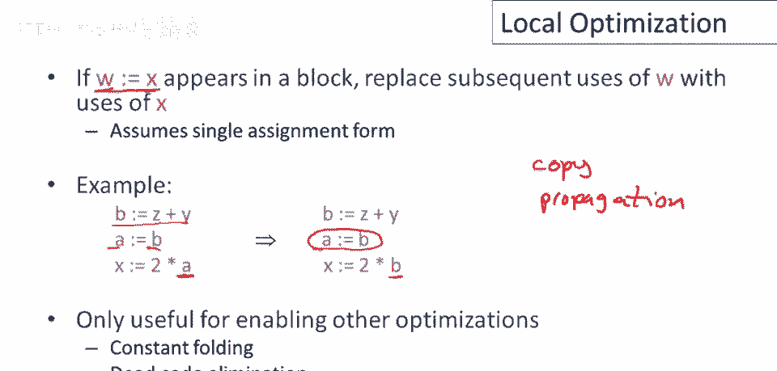

让我们做一个更复杂的例子，并使用我们迄今为止讨论过的优化，在一个稍大的代码片段上，所以我们从左边的这段代码开始，最终将得到右边的这段代码，这是如何工作的呢，首先，我们有一个复制传播，所以a被赋予值为5。

因此我们可以向前传播它，并用5替换稍后对a的使用，我应该说，当值被传播时，是一个常数而不是寄存器名称为常数传播而不是复制传播，但这是完全相同的事情，我们有一个单一的值在右侧被分配。

无论是寄存器名还是一个常数，并且我们正在用该寄存器名或常数替换后续指令中的使用，好的，所以一旦我们将a替换为5，现在我们可以做常数折叠，现在对于这个指令我们有两个常数参数。

所以2乘以5可以被替换为常数10，现在注意我们又有了一个对常数的寄存器赋值，因此我们可以向前传播该常数，我们可以用数字10替换后续对x的使用，现在我们有更多的机会进行常数折叠。

10加6可以被替换为值16，好吧现在我们有另一个值，这是一个常数赋值，抱歉，另一条指令，仅是将常数赋给寄存器，因此我们可以向前传播该常数，最终我们得到10乘以16，我看到这里，在我的最终示例中。

这里我没有费心传播10到x，但我们可以这样做，因此我们可以执行此优化，即x乘以16，如果我们不做传播，将等同于x左移4，或用10乘16替换，那会更好，最终t赋值为160。

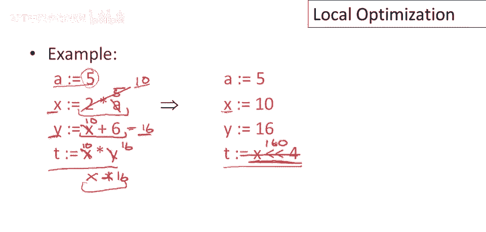

回到一个想法，几页前我提过，假设基本块中有赋值，某个寄存器w赋值为右边的计算结果，但假设w寄存器名在程序中其他地方未使用，它没出现，不仅在这个基本块，但在程序的其他部分，此语句已死，可直接删除。

这里指它对程序结果无贡献，因为我们写入w的值从未被引用，计算w是浪费时间，因此可以删除该计算，这是一个简单例子，假设寄存器a在程序其他地方未使用，我们首先要做的是，这是我们的初始代码，首先。

我们将其转换为单赋值形式，因此，我已将此寄存器x重命名为寄存器b，好的，一旦我们完成，让我做，因此我们说关于b等于z加y和a等于b，然后，我们向前传播此副本，好吧，因此，我们现在已用b替换了a的使用。

这使我们达到了这种状态，这段代码所在位置，现在可以看到我们有一个赋值，A在后续指令中未使用，我们已说过A在基本块外未使用，因此可以将A=B删除。

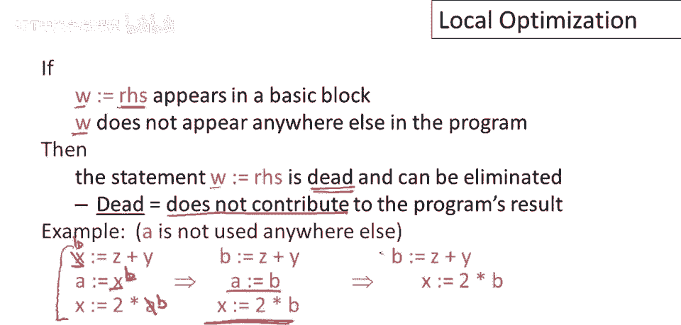

最终得到较短的基本块，每个局部优化本身效果很小，其中一些优化，我展示的一些转换实际上不会加快程序运行，但它们本身并不改进程序，但通常优化会相互作用，因此执行一个优化将使另一个成为可能。

我们在几页前的例子中看到了这一点。

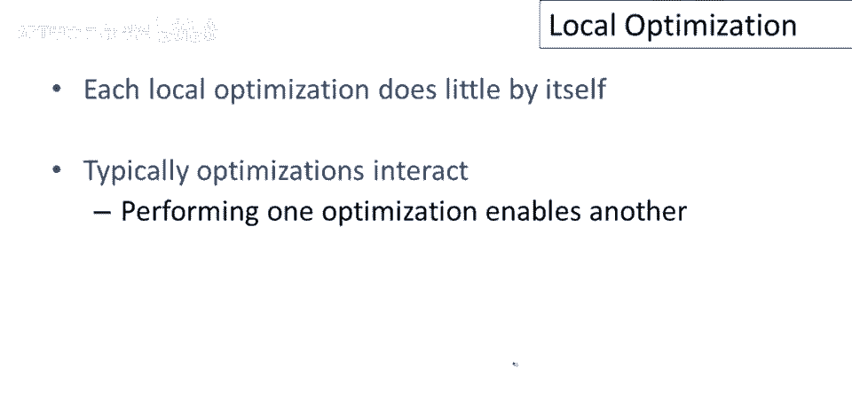

所以关于优化编译器的思考方式是，它有一个装满技巧的大袋子，它知道很多单个程序转换，当面临一个程序时，为了优化它将翻遍它的袋子，寻找适用于代码某一部分的优化，如果它找到一个它将做，优化，将进行转换。

然后它将重复，它将回到程序中再看一遍，看看是否有其他适用的优化，它将一直这样做，直到达到一个点，它知道的任何授权都不能应用于该程序。

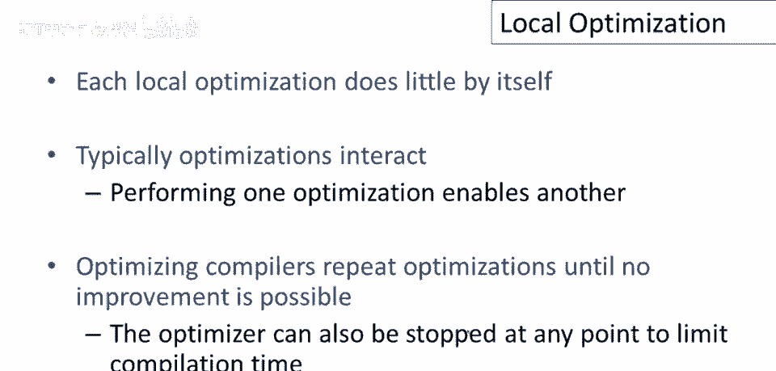

接下来，我们将查看一个更大的例子，并尝试应用我们讨论过的优化，看看我们能走多远，当然，这个例子是为了说明我们讨论过的许多优化而构建的，首先我们可以做，有一些代数简化的机会。

因此我们可以将这里的平方替换为乘法，在这里我们有一个乘以二，我们可以将其替换为左移一位，接下来我们可以观察到有一些副本和常数，因此我们有一个对b的常数赋值和对c的复制赋值。

这些可以向前传播到b和c的使用，一旦我们完成了这一点，我们可以做常数折叠，所以在这里对e的赋值，操作数，移位的参数都是常数，因此那可以替换为一个赋值，e得到值为6。

接下来我们可以观察到有一个公共子表达式，我们可以消除它，因为a和d都有x乘以x的值，对d的赋值可以替换为一个复制，d现在得到a的值，现在我们有两次机会再次进行复制和常数传播。

对d的赋值和对e的赋值可以向前传播，最后我们可以做大量的死代码消除，假设嗯，这些值，b，C，D或e，在程序的其他任何地方都没有使用，这四句都可删除，这里实际有性能提升，我们实际在这，你知道。

保存整个指令，这是最好的节省，最终形式如此，注意a赋值为x*x，f赋值为a+a，然后g赋值为6*f，这并不如能快，实际上可做更多代数优化，注意f实际等于2*a，可重排发现g等于12*f，抱歉，抱歉。

12*a，好，f赋值可能成死代码，可从程序中删除，我认为编译器会找到，但相信当前编译器，许多不会发现最后。

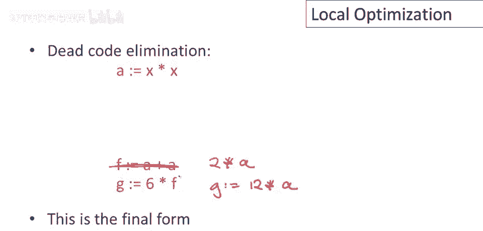

程序重排。