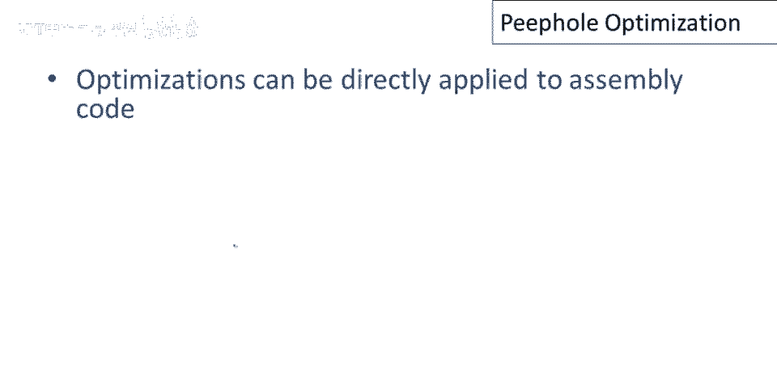
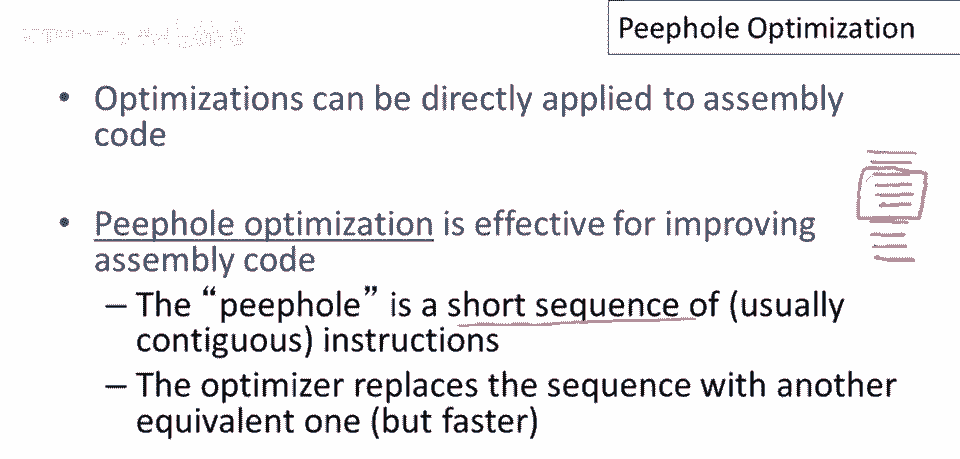
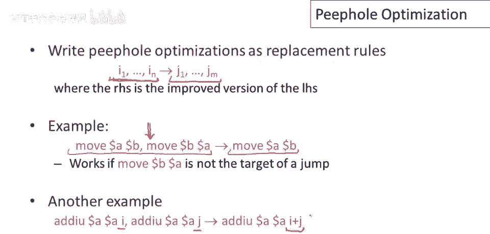
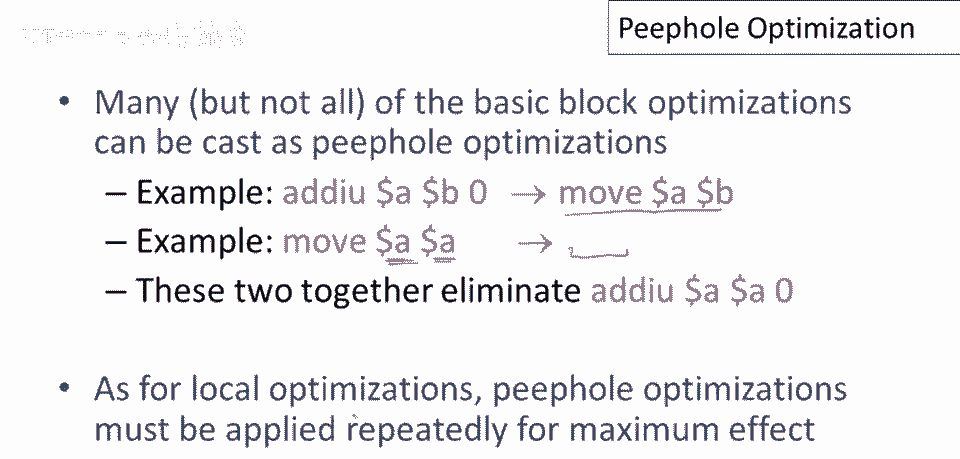

# 编译器原理 P75：窥孔优化 🕵️

在本节课中，我们将学习一种名为“窥孔优化”的编译器优化技术。这是一种直接作用于汇编代码的局部优化方法，通过分析一小段连续的指令序列，并用更高效的序列替换它，从而改进程序性能。


## 窥孔优化的基本思想 💡



上一节我们介绍了局部优化的概念，本节中我们来看看一种直接应用于汇编代码的优化变体。

窥孔优化的核心思想是，不通过中间代码，而是直接在生成的汇编代码上进行优化。它得名于其工作方式：想象我们通过一个“窥孔”来观察程序，每次只能看到一小段连续的指令序列。

## 窥孔如何工作 🔍

窥孔代表程序中的一个滑动窗口，通常包含一小段连续的指令。例如，如果窥孔大小为4，那么优化器每次只能看到4条指令。



以下是窥孔优化的工作流程：
1.  优化器将窥孔窗口对准程序的一部分。
2.  检查窗口内的指令序列。
3.  如果它知道一个更高效的等价指令序列，就用新的序列替换窗口内的旧序列。
4.  将窗口滑动到程序的下一个部分，重复此过程，可能对同一段代码应用多次转换。

## 窥孔优化的规则 📜

窥孔优化通常被编写为一系列的替换规则。规则左边是需要匹配的指令模式，右边是更优的替换序列。

以下是几个典型的窥孔优化示例：

**示例1：消除冗余移动**
如果我们看到以下指令序列：
```assembly
MOV a, b
MOV b, a
```
第二条移动指令是多余的，可以删除。因此，这个两指令序列可以被优化为单指令序列 `MOV a, b`。此优化需确保没有跳转目标指向第二条指令。



**示例2：常数折叠**
如果我们看到连续的加法操作：
```assembly
ADD a, i
ADD a, j
```
我们可以进行常数折叠，将两次加法合并为一次：
```assembly
ADD a, (i+j)
```
这里，`(i+j)` 表示在编译时计算出的常量值。

## 与基本块优化的关系 ⛓️

上一节我们讨论了许多基本块优化，其中许多可以转化为窥孔优化。

以下是可转换的优化示例：
*   **消除加零操作**：指令 `ADD a, 0` 可以优化为 `MOV a, a`（即自身赋值）。
*   **消除自身赋值**：指令 `MOV a, a` 是冗余的，可以被完全删除，替换为空指令序列。



综合应用这两条规则，`ADD a, 0` 首先被转换为 `MOV a, a`，随后 `MOV a, a` 被删除。这个小例子也说明，与局部优化一样，窥孔优化需要反复应用才能达到最佳效果。

## 总结与核心观点 🎯

本节课中我们一起学习了窥孔优化技术。我希望这个简单的讨论已经表明，许多优化可以直接应用于汇编代码。

这里需要强调一个重要的观点：对中间代码进行优化并没有特别的“魔力”。对于任何语言编写的程序——无论是高级语言、中间语言还是汇编语言——讨论如何转换该语言的程序以改善其行为都是有意义的。


最后，必须指出“程序优化”这个术语可能有些误导。编译器并不会偶然产生“最优”代码。实际上，编译器所做的是应用一系列已知的“程序改进”转换。它们会尽可能地应用这些转换来改善程序行为。因此，**程序优化的本质是程序改进**，我们的目标是让程序变得更好。