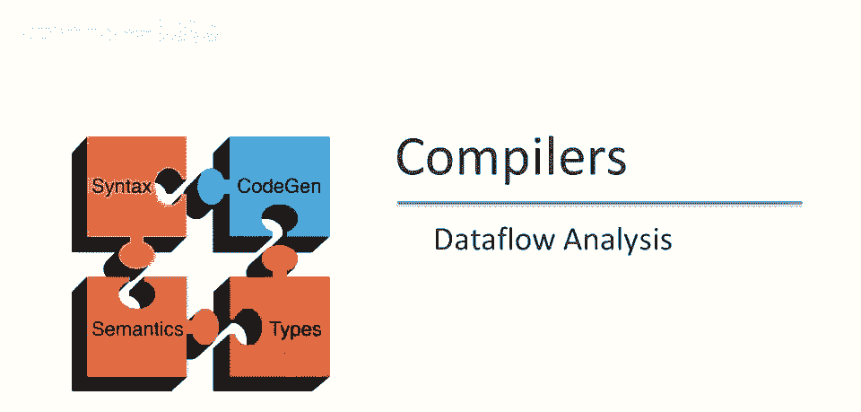
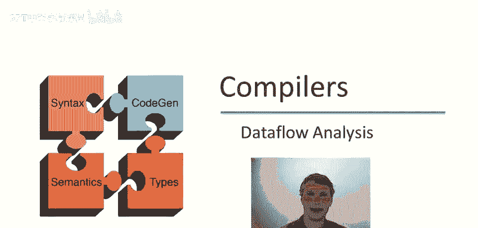
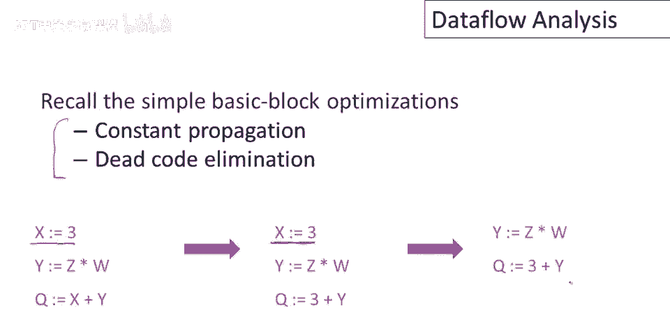
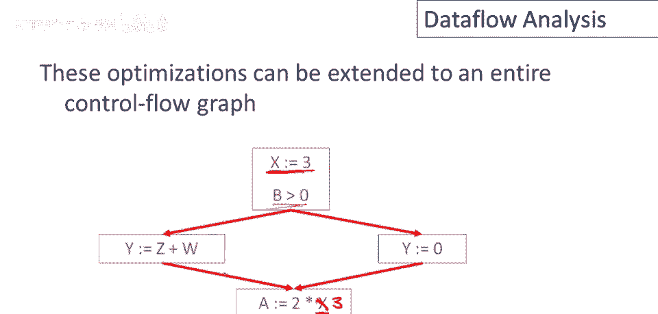
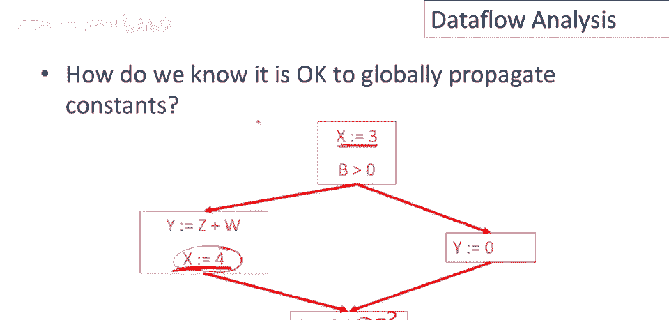
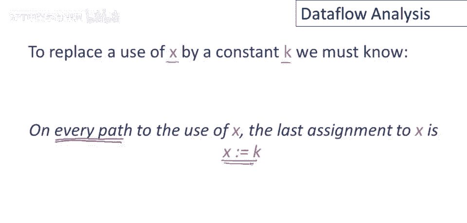
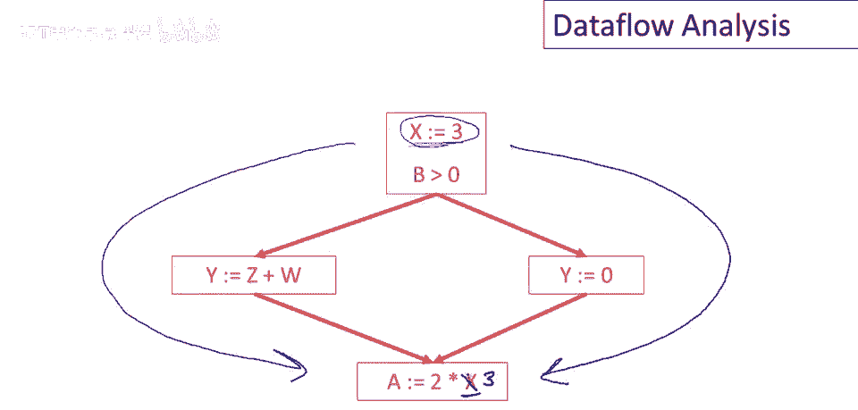
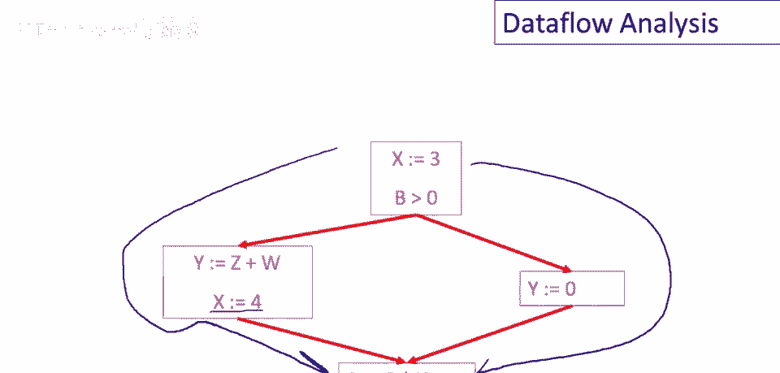
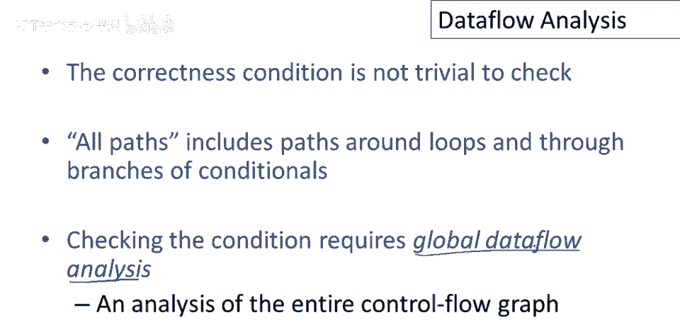
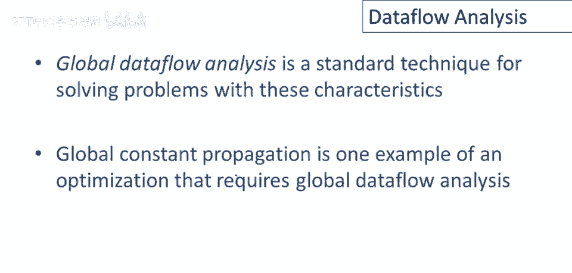

# 课程 P76：全局数据流分析入门 🧠

在本节课中，我们将要学习**全局程序优化**的基础，特别是理解为何需要一种名为**数据流分析**的技术。我们将从回顾简单的局部优化开始，逐步扩展到整个程序的控制流图，并探讨如何安全地进行全局常量传播。



---

## 回顾：基本块优化 🔄

上一节我们介绍了全局优化的概念，本节中我们先回顾一下简单的基本块优化，特别是常量传播和死代码消除。



以下是一小段代码示例：
```c
x = 3;
y = x + 5;
```
我们注意到变量 `x` 被赋予了一个常数 `3`。在局部优化中，这个常量赋值可以向前传播。如果基本块是单赋值形式，这特别容易做到。如果 `x` 的值在程序中的任何其他地方都未被使用，那么该赋值语句就是死代码，可以被删除。

这是一个在单个基本块内合并常量传播和死代码消除的简单示例。

---



## 扩展到控制流图 🌐

上一节我们介绍了基本块内的优化，本节中我们来看看如何将这些优化扩展到整个控制流图。

控制流图是基本块的图，其中节点是基本块，边表示基本块之间的控制转移。例如，第一个基本块可能包含一个测试和 `if` 语句，根据测试结果跳转到不同的基本块。

在下面的控制流图示例中，我们观察到 `x` 被赋予常数，随后有对 `x` 的使用。在某些情况下，像在单个基本块中一样，用常数 `3` 全局替换 `x` 的使用是安全的。



---

## 全局常量传播的安全性 🛡️

然而，并非所有情况都允许安全地进行常量传播。让我们看一个反例。



考虑以下情况：变量 `x` 在程序的不同路径上被赋予了不同的常数值。例如，一条路径上 `x = 3`，另一条路径上 `x = 4`。在两条路径汇合后使用 `x` 的地方，我们不能简单地将 `x` 替换为 `3` 或 `4`，因为实际值取决于执行路径。

那么问题来了：我们如何知道何时可以安全地进行全局常量传播？

---



## 全局常量传播的条件 ✅

对于常量传播，有一个简单的判断标准：要用常数 `k` 替换变量 `x` 在某个位置的使用，我们必须知道以下事实：



**在每一条能够到达该 `x` 使用位置的程序路径上，`x` 的最后一次赋值都必须是 `x = k`。**

这个条件很直观：要保证 `x` 在使用点一定是 `k`，就必须确保所有可能的执行路径在到达该点前，最后都给 `x` 赋了值 `k`。

让我们再次审视之前的例子。要安全地将某处的 `x` 替换为 `3`，我们需要检查所有能到达该点的路径。如果每条路径上 `x` 的最后一次赋值都是 `3`，那么替换就是安全的。反之，如果存在一条路径使得 `x` 的最后赋值是其他值（如 `4`），那么替换就不安全。



---

## 全局数据流分析简介 🧩

检查“所有路径”的条件并不容易，因为路径可能包含循环和条件分支。实现这类检查的技术统称为**全局数据流分析**。它之所以被称为“全局”，是因为它需要对整个程序的控制流图进行分析。

暂时退一步看，编译器需要执行的许多全局优化（如常量传播）都依赖于知晓程序在特定点的某些属性（例如，“变量 `x` 在此处是否一定是常数？”）。然而，证明这样一个局部事实通常需要推理整个程序，这是一个复杂且可能计算量很大的问题。

幸运的是，在优化中我们总是可以采取**保守策略**。这意味着：
*   如果我们能**肯定**某个属性成立，我们就应用优化。
*   如果我们**不能确定**属性是否成立，我们最坏的情况就是放弃这次优化，以保证程序行为的正确性。

因此，数据流分析可以采用近似技术，只要在它声称属性成立时保证正确即可；当它不确定时，就选择不优化。

总之，全局数据流分析是一套用于解决上述问题的标准技术族。全局常量传播就是一个需要数据流分析的典型优化示例。

---

## 总结 📝

本节课中我们一起学习了：
1.  **基本块优化**的回顾：包括常量传播和死代码消除。
2.  将优化思想**扩展到控制流图**，并认识到全局优化的复杂性。
3.  明确了**全局常量传播**的安全条件：在所有可达路径上，变量的最后一次赋值必须是目标常量。
4.  引入了**全局数据流分析**的概念，它是一种通过分析整个控制流图来推导程序各点属性的技术，并理解其保守近似的特性。



在接下来的课程中，我们将更详细地探讨全局常量传播及其他数据流分析技术的具体实现。