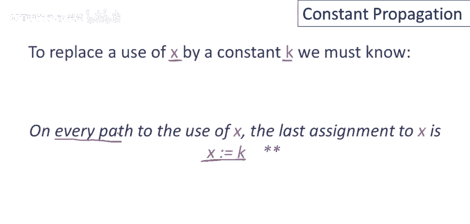
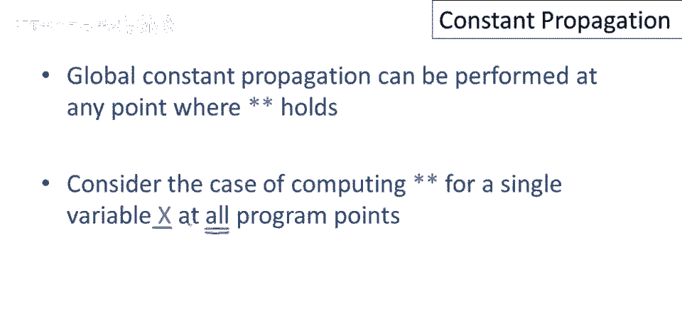
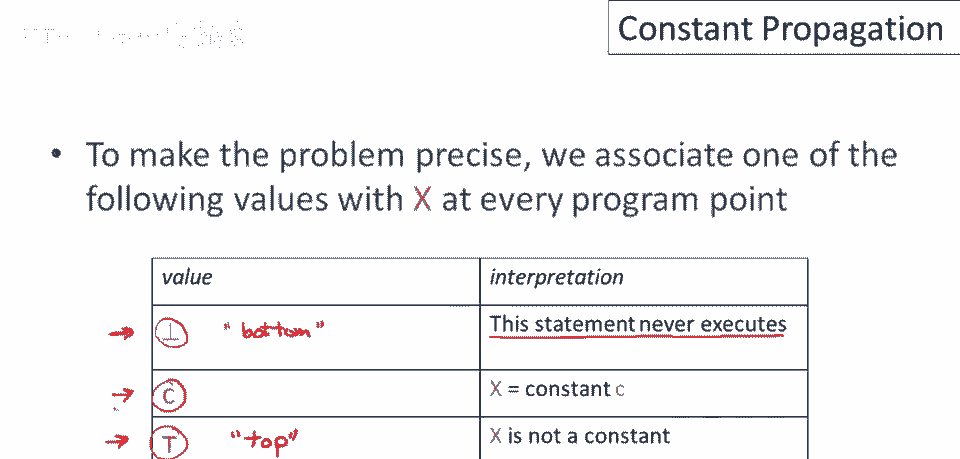
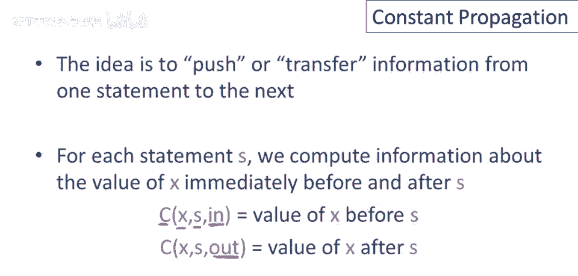
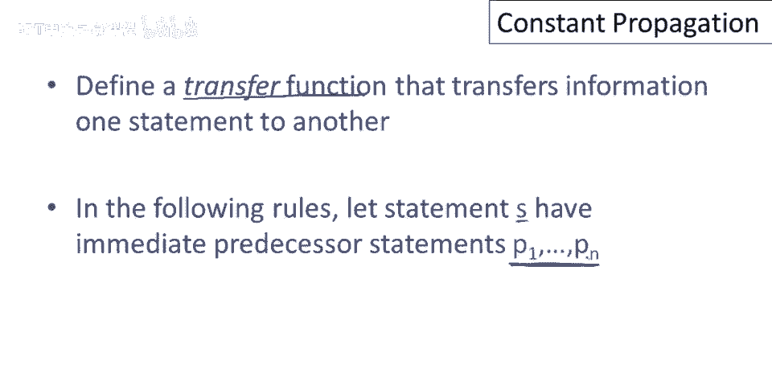
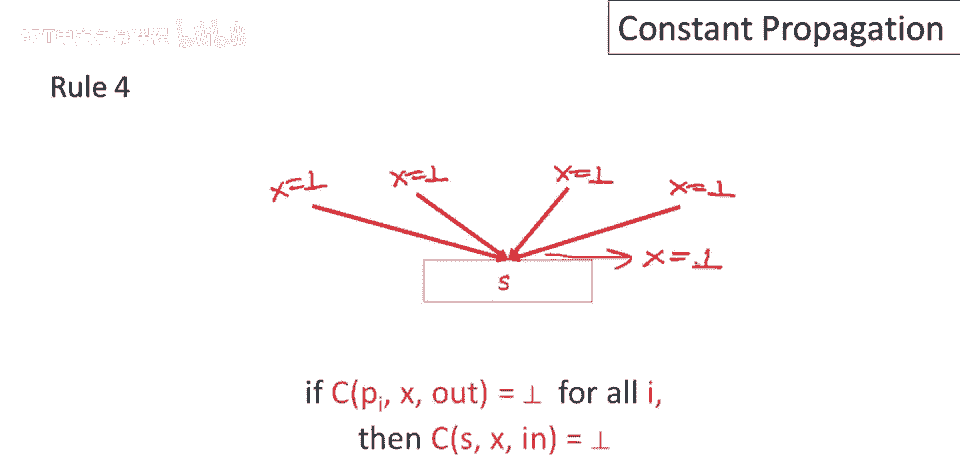
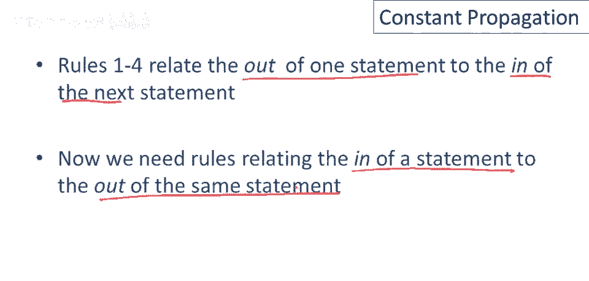
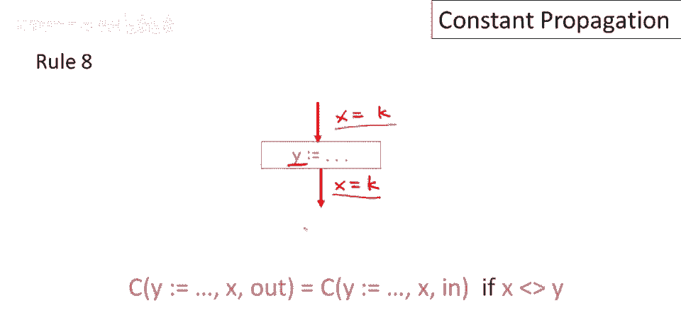
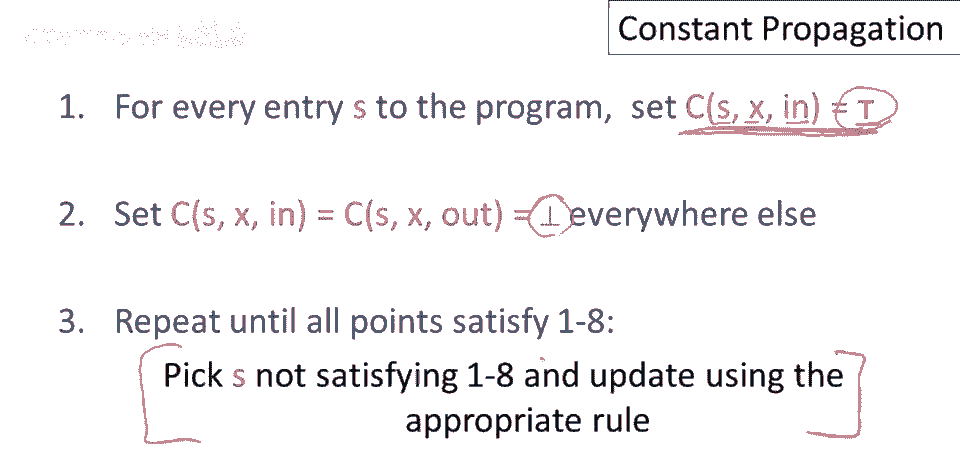
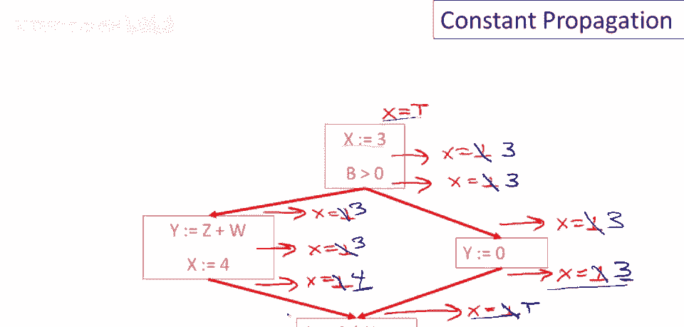

# 课程 P77：全局常量传播详解 🧮


在本节课中，我们将深入探讨全局数据流分析中的一个重要应用——全局常量传播。我们将学习其工作原理、核心概念以及如何通过系统化的算法为程序中的每个点计算变量的常量属性。



---



## 概述

全局常量传播的目标是，在满足特定条件时，用常量值替换程序中变量的使用。为了实现这一点，我们需要分析程序的控制流，并确定在每一个程序点上，变量是否具有一个已知的常量值。

---

## 常量传播的条件

要进行全局常量传播，必须满足一个关键属性：对于变量 `x` 的每一次使用，在到达该使用的每一条执行路径上，`x` 的最后一次赋值都必须是 `x = k`（其中 `k` 是一个常量）。



**公式表示：**
对于变量 `x` 在点 `p` 的使用，需满足：
```
∀ path → p, last assignment to x on path is x = k
```

这意味着，只有当我们能证明在所有可能执行到该点的路径上，`x` 都被赋予了同一个常量值时，才能安全地进行替换。

---

## 程序点的值状态

为了进行计算，我们需要为每个程序点上的变量 `x` 关联一个“值状态”。这个状态可以是以下三种之一：

1.  **⊤ (Top)**：表示我们不知道 `x` 在该点是否为常量。这是最安全（但最不精确）的假设，意味着 `x` 可以取任何值。
2.  **c (Constant)**：表示我们已证明在该程序点上，`x` 始终是某个特定的常量值 `c`。
3.  **⊥ (Bottom)**：表示该程序点可能永远无法执行（语句不可达）。在这种情况下，`x` 的值无关紧要。

**核心概念：**
变量 `x` 在程序点 `p` 的状态 ∈ { `⊥`, `c`, `⊤` }

---


## 手动分析示例


让我们通过一个简单的控制流图来手动理解这个过程。

假设我们有以下代码片段（已转化为控制流图）：
1.  `x = 3`
2.  条件分支（不涉及 `x`）
3.  右分支：`y = ...` (不影响 `x`)
4.  左分支：`y = ...`; `x = 4`
5.  汇合点：`a = 2 * x`


**分析步骤：**
*   **入口点**：程序开始前，我们不知道 `x` 的值，所以 `x = ⊤`。
*   **执行 `x = 3` 后**：我们确定 `x = 3`。
*   **经过条件分支后**：分支不改变 `x`，所以在两个分支的起点，`x` 仍为 `3`。
*   **右分支执行 `y = ...` 后**：`x` 不变，仍为 `3`。
*   **左分支执行 `y = ...` 后**：`x` 仍为 `3`；执行 `x = 4` 后，`x` 变为 `4`。
*   **汇合点 (`a = 2 * x`) 之前**：来自右分支的 `x` 是 `3`，来自左分支的 `x` 是 `4`。两条路径的值不一致，因此我们无法确定 `x` 是常量。所以在此点，`x = ⊤`。



这个例子展示了如何在路径汇合时，常量信息可能丢失（变为 `⊤`）。

---



## 数据流分析算法原理

上一节我们通过例子直观理解了常量传播。本节中我们来看看如何系统化地计算这些属性。

全局数据流分析的核心思想是：复杂的全局程序分析，可以通过组合只关注相邻语句间信息变化的简单局部规则来实现。

我们将定义一组**传递函数**，它们描述了信息如何从一个语句“流动”到下一个语句，以及如何被语句本身所改变。

---

### 语句间的信息传递规则 (前驱 → 当前语句)

对于一个语句 `s`，它有若干个直接前驱语句 `P1, P2, ..., Pn`。`x` 在 `s` 执行之前的状态，取决于它在所有前驱语句执行之后的状态。



以下是决定 `x` 在进入 `s` 之前（`in[s]`）状态的规则：



**规则列表：**
以下是基于前驱状态的组合规则：
*   **规则 1**：如果**任何一个**前驱之后 `x = ⊤`，那么 `in[s]` 中 `x = ⊤`。
*   **规则 2**：如果两个前驱之后 `x` 是不同的常量（例如 `c` 和 `d`，且 `c ≠ d`），那么 `in[s]` 中 `x = ⊤`。
*   **规则 3**：如果**所有**前驱之后 `x` 都是**同一个**常量 `c`，或者某些是 `c` 而另一些是 `⊥`，那么 `in[s]` 中 `x = c`。（因为 `⊥` 表示路径不可达，不影响可达路径的一致性）。
*   **规则 4**：如果**所有**前驱之后 `x = ⊥`，那么 `in[s]` 中 `x = ⊥`（表示 `s` 本身不可达）。

---

### 语句内部的信息传递规则 (输入 → 输出)

上一组规则连接了不同语句。我们还需要规则来描述单个语句如何改变信息，即从语句 `s` 的输入状态 (`in[s]`) 产生输出状态 (`out[s]`)。

**规则列表：**
以下是语句 `s` 对 `x` 状态的影响规则：
*   **规则 5**：如果 `in[s]` 中 `x = ⊥`，那么 `out[s]` 中 `x = ⊥`。（语句不可达，则其输出点也不可达）。
*   **规则 6**：如果语句 `s` 是 `x = c`（常量赋值），那么无论 `in[s]` 中 `x` 是什么（`⊤` 或某个常量 `d`），`out[s]` 中 `x = c`。（注意：规则5优先级更高，若 `in[s]` 为 `⊥` 则应用规则5）。
*   **规则 7**：如果语句 `s` 是 `x = f(...)`（非常量复杂表达式赋值），且 `in[s]` 中 `x ≠ ⊥`，那么 `out[s]` 中 `x = ⊤`。（我们无法计算复杂表达式的结果）。
*   **规则 8**：如果语句 `s` 是对**其他变量**（不是 `x`）的赋值或无关操作，那么 `out[s]` 中 `x` 的状态与 `in[s]` 中相同。

---



## 算法执行过程

现在我们可以将这些规则整合成一个具体的算法。

**算法步骤：**
1.  **初始化**：
    *   在程序**入口点**，将 `x` 的状态设为 `⊤`（因为最初值未知）。
    *   在所有**其他程序点**，将 `x` 的状态保守地初始化为 `⊥`（假设它们都不可达）。
2.  **迭代求解**：
    *   反复扫描程序中的所有语句和程序点。
    *   检查当前的状态分配是否违反了上述8条规则中的任何一条。
    *   如果发现不一致，就根据相应的规则更新该点的状态。
3.  **终止**：
    *   当一次完整的扫描不再引起任何状态更新时，算法终止。此时得到的状态分配满足所有数据流规则，就是最终的分析结果。



**算法特点：**
这是一个**约束满足**或**不动点迭代**算法。它从最保守的假设（`⊥`）开始，逐步沿着控制流传播已知信息（常量 `c`），直到所有点的状态不再变化。

---

## 总结

本节课中我们一起学习了全局常量传播的完整流程。

我们首先明确了进行常量替换必须满足的**路径条件**。接着，我们引入了 `⊤`、`c`、`⊥` 这三个关键概念来描述程序点的值状态。通过一个**手动示例**，我们直观看到了信息在控制流图中的传播与合并。

然后，我们深入探讨了系统化的**数据流分析算法**，将其分解为两组核心规则：一组管理语句间的信息传递，另一组管理语句内部的信息转换。最后，我们描述了如何通过**初始化**和**迭代求解**来执行这个算法，从而为程序中所有点计算出变量的常量属性。



掌握这个算法是理解许多编译器优化（如常量折叠、常量传播）的基础。