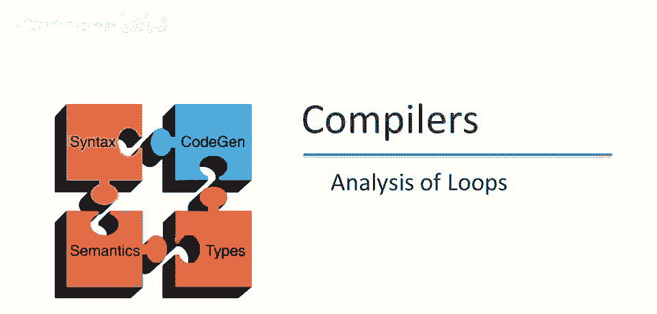
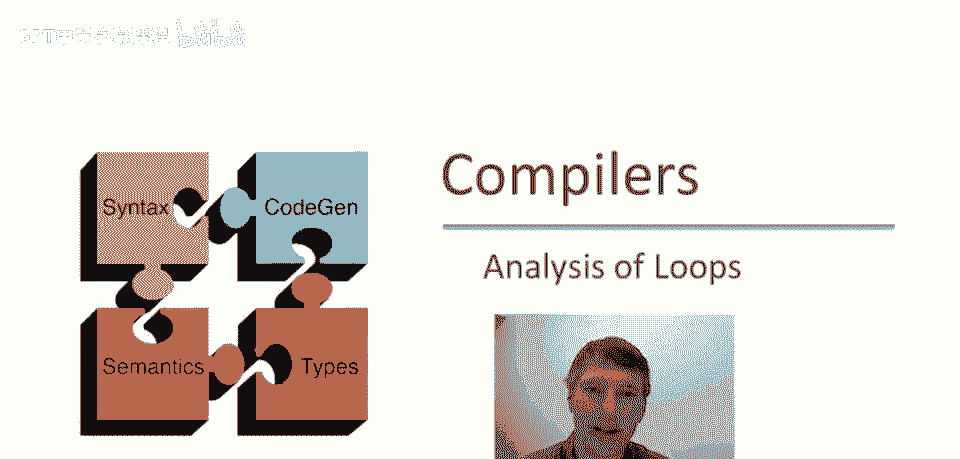
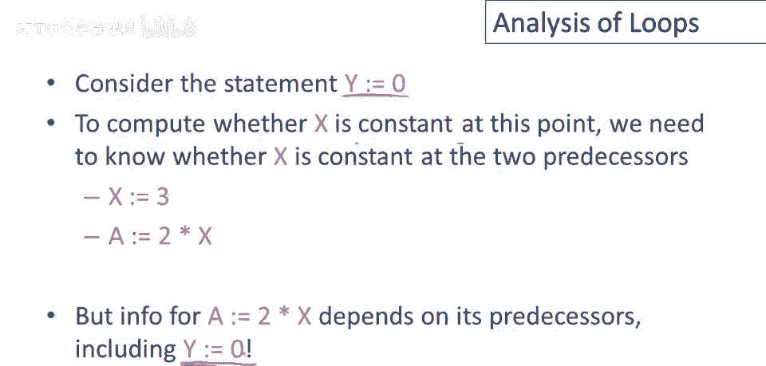

# 课程 P78：循环分析 🔄

在本节课中，我们将学习控制流图分析中最有趣的部分——循环分析。我们将通过一个具体的例子，理解当分析遇到循环时如何打破递归，并最终计算出程序中变量的常量值。

---

## 概述

我们将分析一个包含循环的控制流图。分析循环时，会遇到信息相互依赖的递归问题。为了解决这个问题，我们需要引入一个特殊的初始值（bottom），并通过迭代更新的方式，逐步推导出最终的正确信息。

---

## 循环分析示例

这是一个包含循环的控制流图示例。分析中需要特殊元素 **bottom** 的需求，这与循环分析紧密相关。

让我们思考如何用这个特定的控制流图进行常量传播分析。关于变量 `x`，我们最初一无所知。

在进入控制流图之前，`x` 的值为 **top**（表示未知）。在赋值为 `3` 后，我们知道 `x` 的值为 `3`。这里的条件分支，其谓词不会影响 `x` 的值，因此两条分支上 `x` 的值都是 `3`。对 `y` 的赋值不会影响 `x`，因此这里 `x` 的值也是 `3`。

现在，我们关注循环中的这个语句。分析 `x` 在 `y` 等于 `0` 时的规则是：`x` 在赋值给 `y` 之前的值，是其所有前驱节点值的函数。

我们还没有这里 `x` 的值。所以问题是：这条边上 `x` 的值是什么？为了弄清楚这一点，我们需要看它的前驱节点。

它的前驱节点包括：谓词之后的一个点、两个语句之间的一个点、以及执行 `y` 赋值之后的一个点。我们正在沿着边向后追溯。为了知道 `x` 在这里的信息，我们需要知道它在前驱节点的信息。因为这个边意味着，我们再次需要在 `y` 等于 `0` 的两个前驱节点上知道 `x` 的信息。

现在我们处于循环中。这并不令人惊讶。如果关于 `x` 的信息依赖于其语句的前驱，并且你确实遵循递归追溯，那么最终你会陷入这样的循环。目前没有立即明显的方法来解决这个问题。

我们如何获取关于前驱的信息，当 `y` 的前驱又依赖于自身时？更精确地说，再次查看那个特定语句：为了计算在语句 `y` 等于 `0` 之前，`x` 是否为常数，我们需要知道 `x` 在其两个前驱处是否为常数。而该信息又依赖于其前驱，其中包括 `y` 等于 `0` 这个点本身。这就是难题：我们如何解决这个递归问题？

---

## 解决方案：打破循环

有一个标准解决方案，实际上在许多数学领域都使用，不仅仅是循环分析。当你有这些类型的递归关系或递归方程时，标准解决方案是**打破循环**。

具体做法是：从一些**初始猜测**开始。所以你有一个初始近似值，它可能甚至不是最终结果，但允许你开始计算。

由于循环的存在，所有程序点在所有时间都必须有一个值。因此，我们将为所有点分配一个初始值。这就是 **bottom** 的作用。**bottom** 意味着“到目前为止，我们知道控制从未到达这一点”。记住这一点，我们几段视频之前说过。这将使我们能够取得进展。

---

## 逐步分析过程

让我们继续分析这个控制流图。我们假设在所有点，最初 `x` 有一个 **bottom** 值，除了入口点。

入口点是特殊的，我们假设我们不知道关于 `x` 的任何信息（即 **top**），因为我们知道控制达到了初始点。但最初，我们将其他地方 `x` 的值都设为 **bottom**。

现在，我们有初始设置。记住程序是什么，我们去看信息不一致的地方，然后更新它。

信息不一致的地方在哪里？显然，在 `x = 3` 赋值之后，`x` 的值是 **bottom** 是不正确的。因为如果控制到达 `x = 3` 之前，那么赋值后 `x` 将等于 `3`。同样，谓词不会改变 `x` 的值，所以我们必须更新两个分支在谓词之后、以及在这个不影响 `x` 的赋值之后的结果，使信息一致。

我们现在回到有趣的情况。我们知道 `x` 等于 `3`，进入 `y = 0` 的这条分支。就我们所知，控制从未到达另一个前驱（其值仍是 **bottom**），所以我们将开始假设那条路径从未被采取。

如果那条路径从未被采取，那么它不会贡献任何信息。所以在程序的这个点，我们将知道 `x` 等于 `3`。假设所有这些信息都是正确的，我们将能够得出结论：`x` 等于 `3`。

注意我们如何打破循环并开始：我们就假设循环中的最后一条边从不执行。如果不是这样，我们稍后会发现的，这个下面的值将不再是 **bottom**，然后我们会再次更新赋值。

让我们继续。在 `y` 被赋值为 `0` 之前，`x` 等于 `3`。对 `y` 的赋值不会影响 `x` 的值，所以使之后的信息一致，我们更新该点 `x` 等于 `3`。

现在有两个路径的合并。在执行这个赋值之前，我们也知道 `x` 等于 `3`。赋值 `a` 不会影响 `x`，我们会更新那一点。谓词不会影响 `x` 的值，所以我们会知道 `x` 在这条回边上等于 `3`。

现在信息已经改变。我们知道控制可以到达这条边，因为我们遵循了一条控制路径，一路到这里我们有了关于 `x` 的新信息。所以现在我们必须再次检查一切是否仍然正常。

这里我们有 `x` 等于 `3` 在这条边上，`x` 等于 `3` 在这条边上。我们之前的结论是 `x` 在进入语句 `y = 0` 时等于 `3`，那仍然是一致的。控制流图中没有不一致的地方，所以所有信息都与所有规则一致。我们完成了。

这是最终分析。我们能够得出结论：在所有这些点（除了入口点），`x` 实际上是常数 `3`。

---

## 总结

本节课中，我们一起学习了循环分析。我们看到了分析循环时遇到的递归依赖问题，并学会了通过引入 **bottom** 作为初始值来打破循环。通过迭代更新信息，我们最终能够推导出程序中变量的常量值。这个方法是在存在循环的控制流图中进行静态分析的基础。