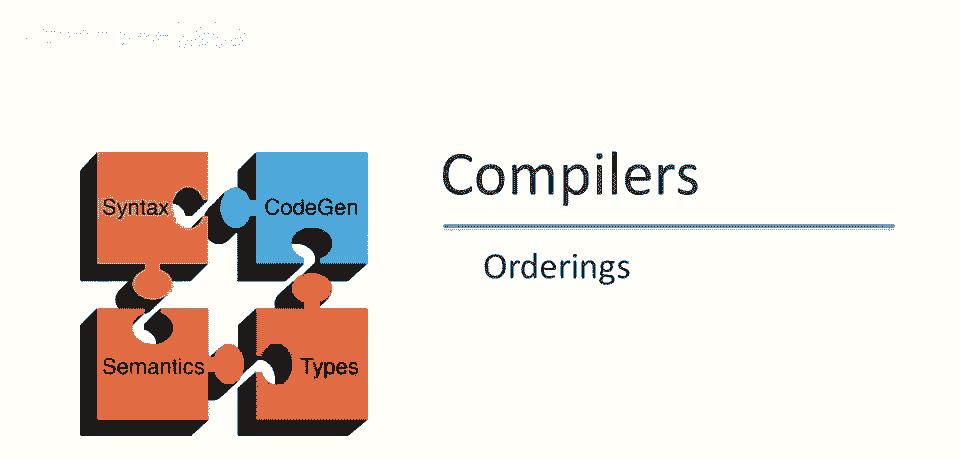
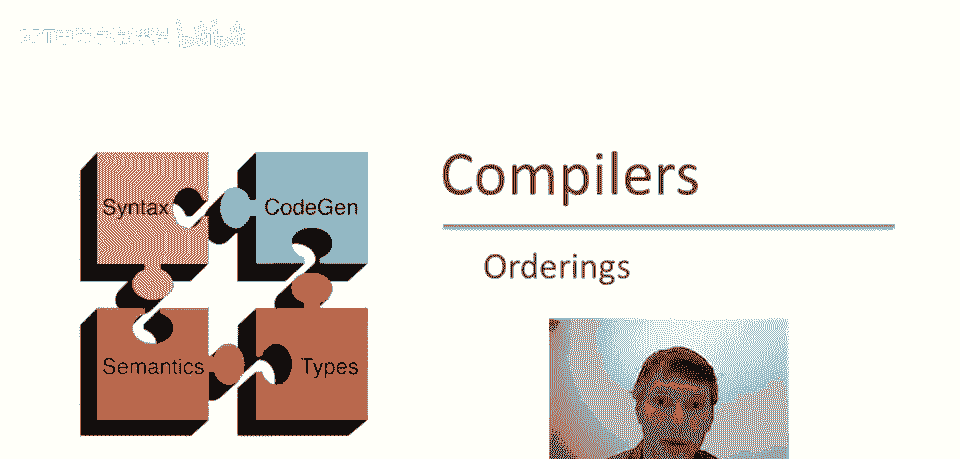
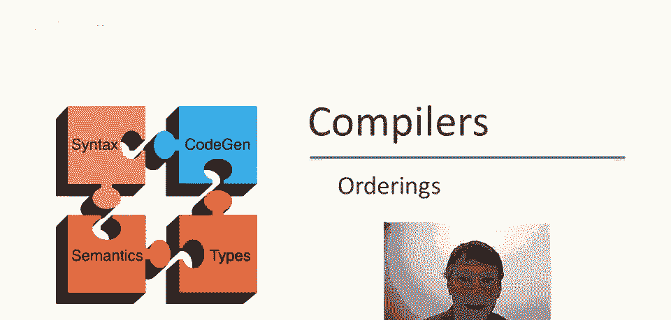
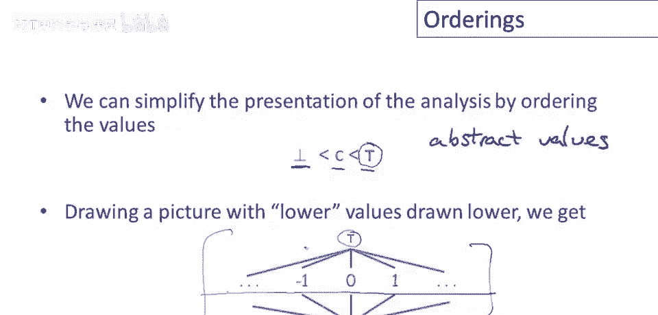
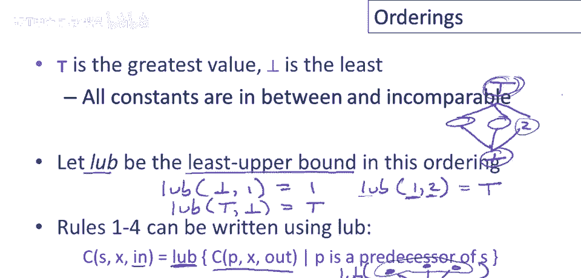
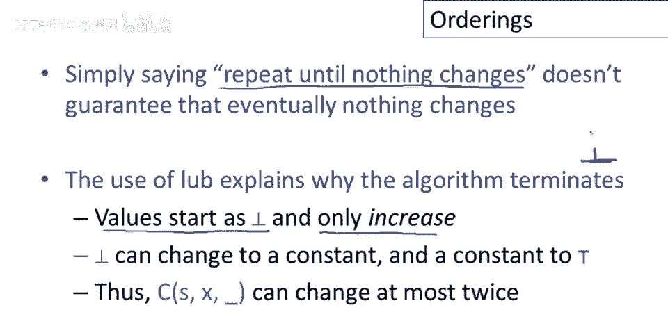

# 课程 P79：抽象值与偏序关系 🧮

在本节课中，我们将学习程序分析中抽象值的概念，并引入一个关键的工具——偏序关系。我们将看到如何用偏序来组织抽象值，以及它如何帮助我们理解分析算法的行为，特别是其终止性。



## 抽象值与具体值 📊



上一节我们介绍了程序分析的基本概念。本节中，我们来看看分析中使用的“值”有何不同。

在程序分析中，我们计算的值（如“底部”、“常数”和“顶部”）被称为**抽象值**。这是为了与**具体值**相区分。

*   **具体值**：程序在运行时实际计算的值，例如具体的数字或对象。
*   **抽象值**：程序分析所使用的、更为抽象的值。一个特定的抽象值可以代表一组可能的具体值。

在常量传播分析所使用的抽象值集合中，有一个非常抽象的值——**顶部**。它代表任何可能的运行时值，即所有运行时值的集合。

## 抽象值的偏序关系 ⬆️⬇️

理解了抽象值的概念后，我们如何组织它们呢？本节我们将引入一个核心概念：偏序关系。



我们可以通过定义一种顺序来简化我们一直在讨论的分析。我们规定：
*   **底部** 小于所有常数。
*   所有常数小于 **顶部**。

如果我们用一张图来表示，将较低的值画在下方，较高的值画在上方，就能得到以下关系图：
*   **底部** 在最下方，低于所有其他值。
*   所有常数位于中间层。
*   常数之间是**不可比**的。例如，0 不大于 1，1 也不大于 0，它们彼此没有大小关系。
*   **顶部** 位于最上方，大于其他一切值。

这个关系可以用一个简单的公式来描述抽象值 `a` 和 `b` 之间的“小于或等于”关系 `⊑`：
*   `⊥ ⊑ c` （对于任何常数 `c`）
*   `c ⊑ T` （对于任何常数 `c`）
*   `⊥ ⊑ T`

## 最小上界（LUB）运算 🔗

定义了顺序之后，我们就可以定义在值集合上的一个关键操作：**最小上界**。

最小上界是指，在排序中，大于或等于集合中所有元素的**最小**的那个元素。

以下是几个例子：
*   `{⊥, 1}` 的最小上界是 `1`。
*   `{⊥, T}` 的最小上界是 `T`。
*   `{1, 2}` 的最小上界是 `T`。因为 `1` 和 `2` 不可比，大于它们两者的最小元素就是 `T`。

这个概念非常重要，因为它精确地描述了之前课程中规则1到4所做的事情。语句 `S` 的输入信息 `in[S]`，就等于其所有前驱语句输出信息 `out[P]` 的**最小上界**。



用代码逻辑可以表示为：
```python
in[S] = LUB({out[P] for P in predecessors_of(S)})
```
其中 `LUB` 函数计算给定集合的最小上界。

## 偏序如何保证算法终止？🔄

我们一直说分析算法会不断应用规则直到没有变化，但为什么这个过程一定会停止，而不是永远循环下去呢？本节将揭示偏序关系在此起到的作用。

算法保证终止，原因在于抽象值的偏序结构以及规则的特性。

1.  **初始状态**：除了程序入口点，所有信息在开始时都被初始化为**底部**（即排序中的最低点）。
2.  **规则的单向性**：仔细观察所有转移规则，它们只会使一个程序点上的值**增加**（在偏序的意义上向“上”移动）。
    *   一个值可以从 `⊥` 提升到某个常数 `c`。
    *   之后可以从常数 `c` 提升到 `T`。
3.  **有限的上升空间**：一旦值达到 `T`，就没有比它更大的元素了，因此无法再被更新。



这意味着，对于每个程序点上的每个变量（无论是 `in` 还是 `out`），其值最多只能改变**两次**（`⊥ → c → T`）。因此，我们描述的常量传播算法，其时间复杂度实际上是**程序大小的线性级别**。

算法可能执行的总步数被常数（每个值最多改变2次）和程序点的数量所限制。粗略估计，总步数不会超过 `(程序语句数量) * 4`。

## 总结 📝

本节课中我们一起学习了：
1.  **抽象值**与**具体值**的区别，理解了 `⊥`（底部）、常数和 `T`（顶部）的含义。
2.  如何用**偏序关系**（`⊑`）来组织这些抽象值，构建出 `⊥ < 常数 < T` 且常数间不可比的层次结构。
3.  定义了**最小上界**运算，并认识到分析规则中的合并操作本质上就是在计算前驱值的最小上界。
4.  最关键的是，我们明白了**偏序关系如何保证了分析算法的必然终止**：因为值只能从低向高有限地变化，最终必然会达到一个不再变化的稳定状态。


通过引入偏序这一数学工具，我们不仅更清晰地描述了分析过程，也严谨地论证了算法的可行性。这是将直观分析思想形式化的重要一步。