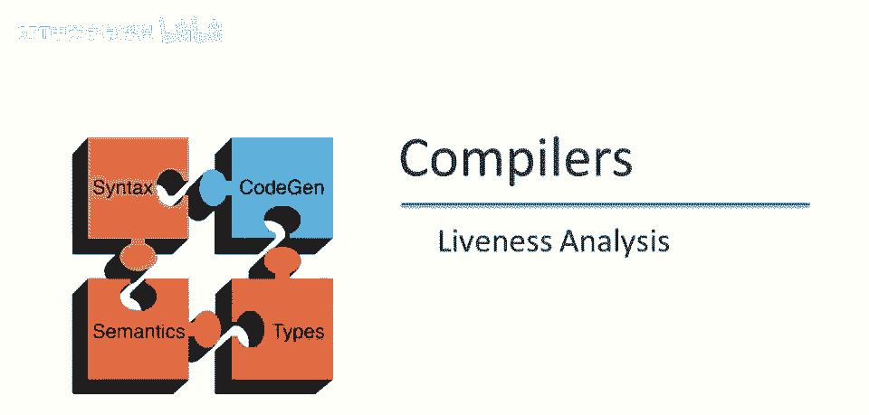
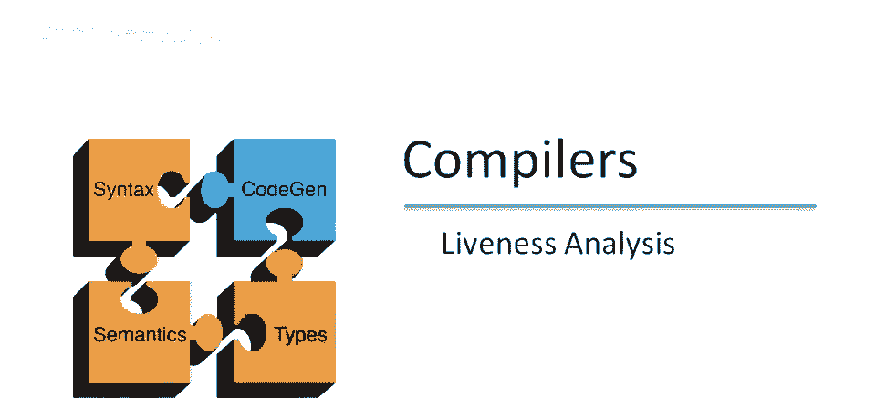
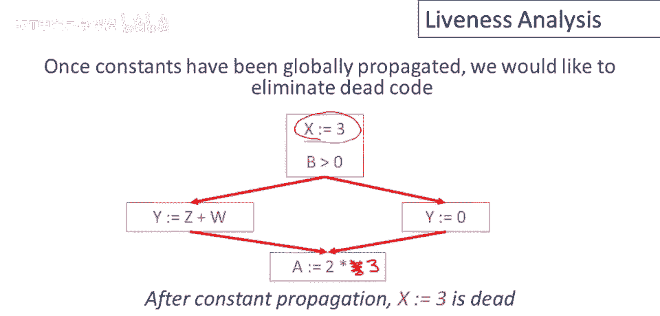
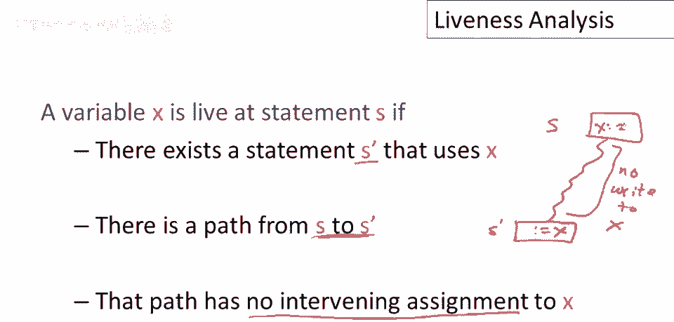
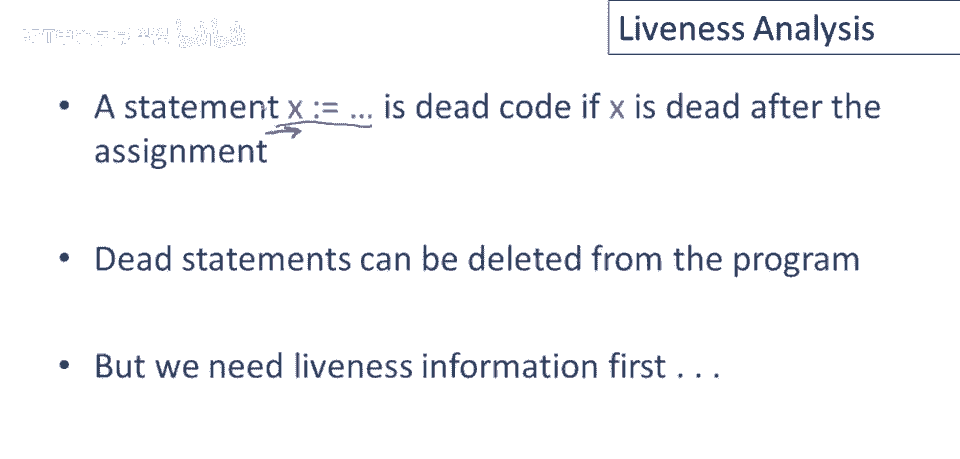
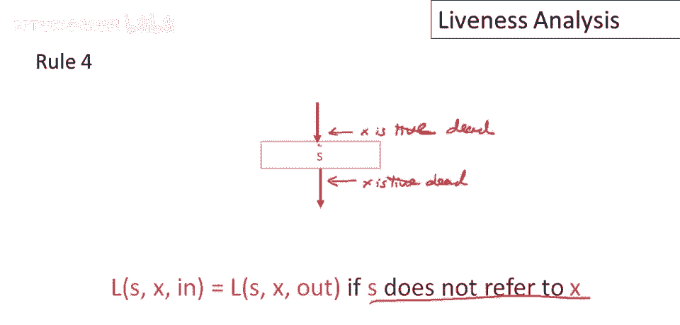
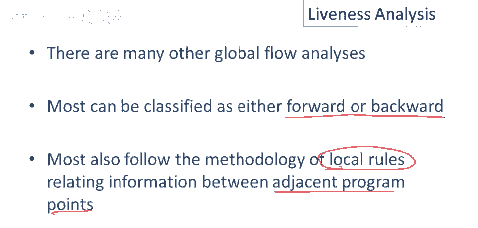

# P80：p80 15-05-_Liveness_Analysi - 加加zero - BV1Mb42177J7

本视频中，将探讨另一种全局分析：活跃度分析。

过去几视频中，已探讨了一种在控制流图中全局传播常量的过程，这是，我们一直在看的其中一个控制流图，回顾一下我们讨论过的算法，足以证明，可替换此处对x的使用为常数3，一旦完成，x可能不再有用。

可能不会被任何地方使用，因此可能从程序中删除此语句，这是一个真正的优化，重要的优化，但只有当x在程序其他地方不被使用时。

让我们更小心地定义，说x未被使用的意思，这里是x的使用，语句中对x的引用，显然这个对x的特定引用，获取由这个右x定义的值，我们说右边的x是活跃的，这个活跃，好的，这意味着值可能在未来被使用。

活跃=可能被使用，在未来，好的，在此行代码中写入x的值可能被后续指令使用，这里不仅仅是可能被使用，实际上是保证会被使用，因为只有一条路径，那条路径在另一个x赋值之前有一个对x的引用。

因此这个特定x的值在此处写入是保证会被使用的，但通常我们不需要这样，我们只是意味着必须有它将被使用的可能性，相反，让我们看看这个其他语句，在这个例子中，将x赋值为3，但这个赋值x，这个x的值从未被使用。

这个已死，因为3的值被4覆盖，在变量x有任何使用之前，好的，这个特定的对x的写入将永远不会看到光明，永远不会被程序的任何部分使用。

我们说它是死的，总结来说，变量x在语句s处活跃，如果存在使用x的语句，好的，而不是其他语句，S'使用x，且从s到s'有路径，路径上无x的赋值，x可以，因此需要对x进行赋值，作为某个语句。

S存在通过程序到达x读取的语句，S'，路径上无对x的读取，好的，如果出现这种情况，那么第一个语句中写的值。

S现在活着，如果值不是活的，那么它是死的，对x的赋值语句将是死的，如果x在赋值后死亡，代码，所以如果我们知道在赋值会议后，立即对这个x的赋值后，未来没有可能使用x的值，那么，这个赋值是无用的。

整个语句可以删除，好吧，所以语句可以从程序中删除，但请注意，为了做到这一点，我们需要有活跃信息，我们需要知道在这个点x是否死亡。

所以再一次，我们想要做的是关于控制流图的全局信息，在这种情况下，属性是x将来是否会使用，我们希望将该信息本地化到程序的特定点，以便我们可以做出局部优化决策，好吧，就像对于常量传播一样。

我们将定义并执行活跃性分析的算法，它将遵循相同的框架，我们将用相邻语句之间传递的信息来表达活跃性，就像我们为复制或常量传播所做的那样，结果将是，活跃性实际上比常量传播简单得多或稍微简单。

因为它只是一个布尔属性，你知道它是真还是假，好吧。

所以让我们看看一些规则，嗯，对于活跃性，所以这里我们定义了x在此处活跃的含义，所以p之后x是活跃的，它将保持活跃，记得直觉是什么，直觉是变量x在p之后是活跃的，若x值用于某路径，从p开始的某路径上。

为知是否为活跃，将取输入点的活跃信息，即这里这里，这里和这里，p后的每个后续语句，将问x是否在这些点活跃，即x的活跃性是所有后续点的大或，p的输出处的x的活跃性，接下来，考虑单个语句对x活跃性的影响。

第一条规则是若语句读取x值，这里有一个赋值语句，右侧引用x，读取x，则x在该语句前活跃，显然，x即将在该语句末使用，因此x在该点活跃，若语句读取x值，则该语句末x的活跃性为真，第二种情况是语句写入x值。

这里有一个赋值x，右侧不引用x，不读取x值，e中没有x，因此x在该语句前不活跃，或说x在该语句前已死，因为我们覆盖了x的值，因此x在此语句前的值将不会被读取，因为e中，赋值右侧不引用x。

语句前的当前x值，将永远不会在未来被使用，因此x在该点已死，最后一种情况是若语句不引用x，既不读取也不写入x，即x在该语句前不活跃，因为e中不引用x，因此x在该点已死，最后一种情况是若语句不引用x。

既不读取也不写入x，即x在该语句前不活跃，因为e中不引用x，因此x在该点已死，最后一种情况是若语句不引用x，既不读取也不写入x，即x在该语句前不活跃，因为e中不引用x，那么x在语句后的活跃度。

与语句前相同，所以如果x在这里活跃，那么x将在这里活跃，同样地，如果x在语句后死亡，那么x在语句前必须死亡，这是因为x，如果x在语句s后的未来不被使用，那么在语句s前的未来也不会被使用。

陈述既不读也不写x。

所以只有这4条规则，现在我们可以给出算法，所以最初我们让x的活跃信息在所有程序点都为假，然后重复以下步骤，直到所有语句满足1至4条规则，这和我们用于常量传播的算法相同，我们选择一些信息不一致语句。

然后用适当的角色更新该语句的信息。

让我们做一个简单例子，嗯，带有循环的东西，那么让我们开始说吧，将x初始化为零，然后循环体应该做什么呢，我们可以检查x是否等于十，如果是，我们将退出循环，假设x在退出时为死，因此x在循环外不被引用。

否则如果x不是十，然后我们将增加x，然后回到循环顶部，这是一个非常愚蠢的小程序，它只计数到十并退出，但让我们做活跃性分析以查看x何时活跃，好的，因此，由于x在退出时已死，显然。

它在该分支上的条件出口也将是死的，好的，因此，我应该说x不活跃，我们正在使用布尔值，所以x的活跃性为假，并假设x也不活跃，其他地方最初，好的，所以那里有一个程序点，也是x的活跃性为假的地方，好的。

所以现在，嗯，让我们传播信息，所以这里有一个对x的读取，让我换个颜色，这里有一个x的读操作，实际上，这里的信息不一致，因为在声明之前，因为我们有一个x的读操作，X必须存活，实际上，x在此处存活。

现在注意，这个声明既读又写x，好的，但说x在读之前，当我们做读操作时优先，因为读操作发生在写之前，所以我们将读取x的旧值，在我们写入x的新值之前，好的，所以x的旧值确实被使用，这就是为什么x在此处存活。

并且立即之前，所以这里是另一个，嗯，x的读操作，好的，所以在，所以在这个点之前，我漏掉了一个程序点，嗯，x也是存活，好的，然后沿着后向边，嗯，这意味着x将在循环的背边上存活，它也将存活，进入初始化块。

我们回到这里，我们看到我们完成了，因为x已经在循环体内已知存活，现在x也在这里存活，然后问题是，你知道，关于这个控制流图入口点的这一点，嗯，有一个x的写操作，但没有右边的读操作，实际上。

x在进入这个控制流图时不存活，实际上，x在此处死亡，无论x有什么值，当我们进入控制流图时，它永远不会在未来被使用，所以这是每个程序点的正确活跃信息，在这个例子中。

现在你可以从我们的小例子中看到，值从false变为true，但不是相反的方式，所以每个值从false开始，并且最多只能改变一次，以说明该值实际上存活，该属性变为真，然后它永远不会变回假，回到排序。

我们在这个分析中只有两个值，假和真，顺序是假小于真，好的，我们知道，因此一切从排序中最低可能元素开始，它们只能向上移动，因此它们可以被提升为真，但反之则不行，因此由于每个值只能改变一次，终止是保证的。

嗯，最终我们保证控制流图中有一致的信息，分析将终止。

总结我们关于控制流图全局分析的讨论，在过去的几个视频中，我们讨论了两种类型的分析，常量传播被称为四字分析，因为信息从输入推送到输出，所以如果你考虑一个控制流图。

控制流分析中发生的事情是信息朝这个方向流动，它沿着计算的方向流动，如果我有一个常数在上面，X赋值为常数在这里，并且x稍后使用，那么该常数将向前流到使用的地方，好的，因此信息沿着计算的方向流动，活跃度。

另一方面是一个向后分析，信息从输出推回到输入，所以在这个例子中，让我改变颜色这里，我们看到x在这条语句之前是活跃的，这种活跃度以相反的方向传播，它逆着控制，逆着执行流程向程序的开始传播。

文献中有许多其他类型的全局流分析，常量传播分析和活跃度分析是最重要的两种，还有许多其他非常重要的，许多人，许多人已经调查过，几乎所有这些分析都可以归类为向前或向后。

有一些分析和一些重要的分析既不是向前也不是向后，那么信息基本上在两个方向上都被推动，另一件事是，文献中几乎所有进行全局流分析的，也遵循这种方法论，即局部规则关联相邻程序点之间的信息，因此。

真正重要的是局部规则部分，那么，我们将分析整个控制流图的复杂问题分解为一系列规则，它们仅传播非常。

