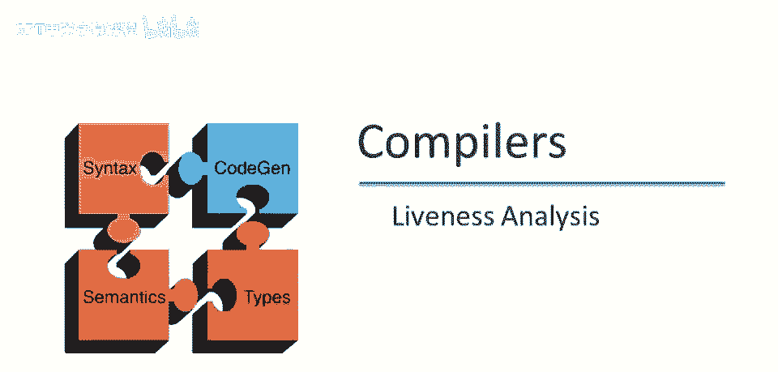

# 课程 P80：活跃度分析 🔍

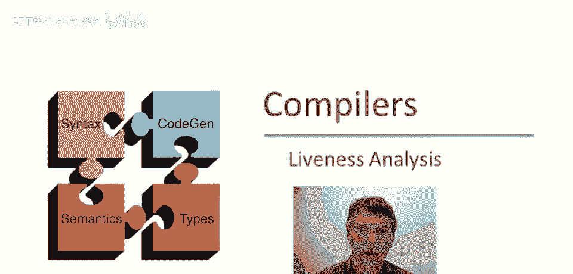

在本节课中，我们将要学习一种名为“活跃度分析”的全局数据流分析技术。我们将了解其核心概念、分析规则，并通过一个简单例子演示其工作过程。活跃度分析是编译器优化中的一项关键技术，用于识别程序中哪些变量的值在特定点之后还会被使用。

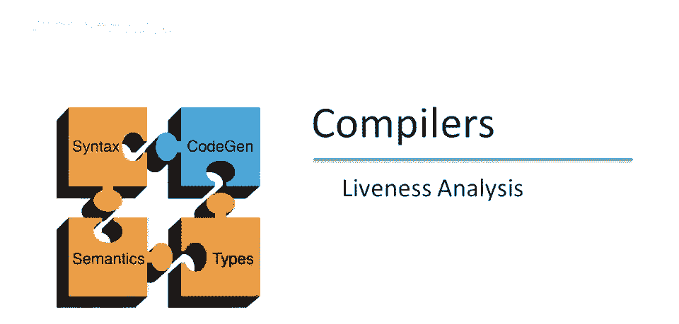

---

## 概述 📋

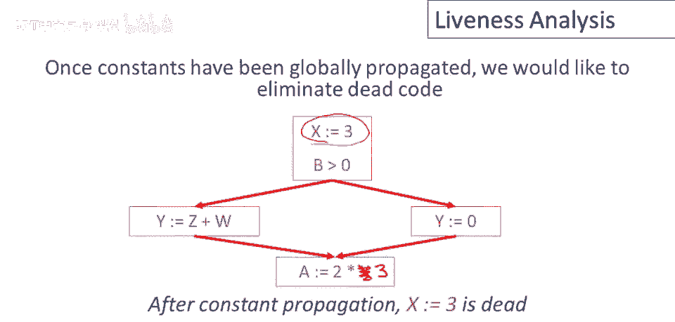

本视频探讨了另一种全局分析：活跃度分析。在过去的几个视频中，我们探讨了在控制流图中全局传播常量的过程。回顾我们讨论过的算法，足以证明在某些情况下，我们可以将变量替换为常数。一旦完成，该变量可能不再有用，因此可能从程序中删除该语句。这是一个重要的优化，但前提是该变量在程序其他地方确实不被使用。

上一节我们介绍了常量传播，本节中我们来看看活跃度分析，它关注的是变量值在未来的“使用可能性”。

---

## 活跃度的定义 📖

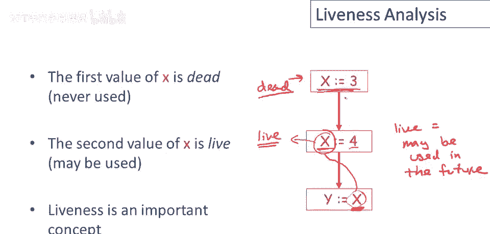

让我们更精确地定义“变量未被使用”的含义。在语句中对变量的引用，我们称之为“使用”。如果一个变量在某个程序点之后，其值可能在未来被使用，我们就说该变量在该点是**活跃的**。

**活跃 = 值可能在未来被使用。**

例如，在某行代码中写入变量`x`的值，如果该值可能被后续指令使用，那么`x`在该写入点就是活跃的。在某些情况下，该值甚至是保证会被使用的。相反，如果变量`x`被赋值后，其值在后续任何使用之前就被新的赋值覆盖，那么这个赋值就是**死的**，因为写入的值永远不会被程序的任何部分使用。

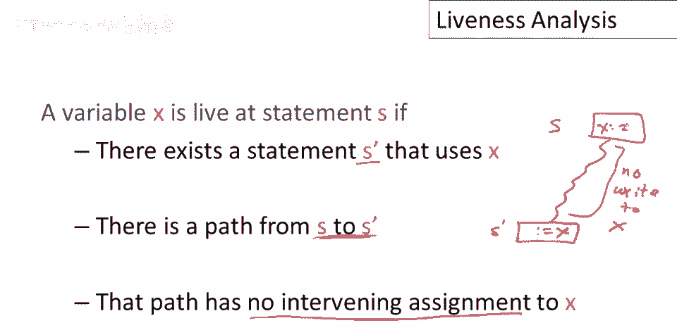

---

## 活跃度的形式化定义 🔬

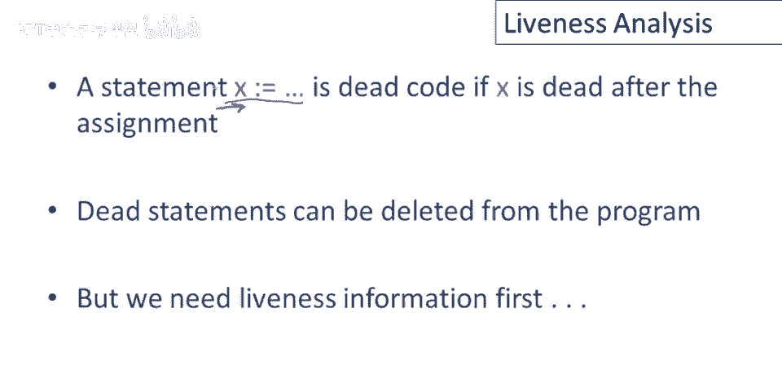

总结来说，变量`x`在语句`s`处活跃，当且仅当存在一个使用`x`的语句`s'`，并且从`s`到`s'`存在一条路径，且该路径上没有对`x`的其他赋值。这意味着`s`处写入的`x`值，最终会被`s'`读取。

如果变量不是活的，那么它就是死的。如果一个对`x`的赋值语句之后，`x`立即死亡，那么这个赋值是无用的，整个语句可以从程序中删除。为了做到这一点，我们需要活跃度信息。

---

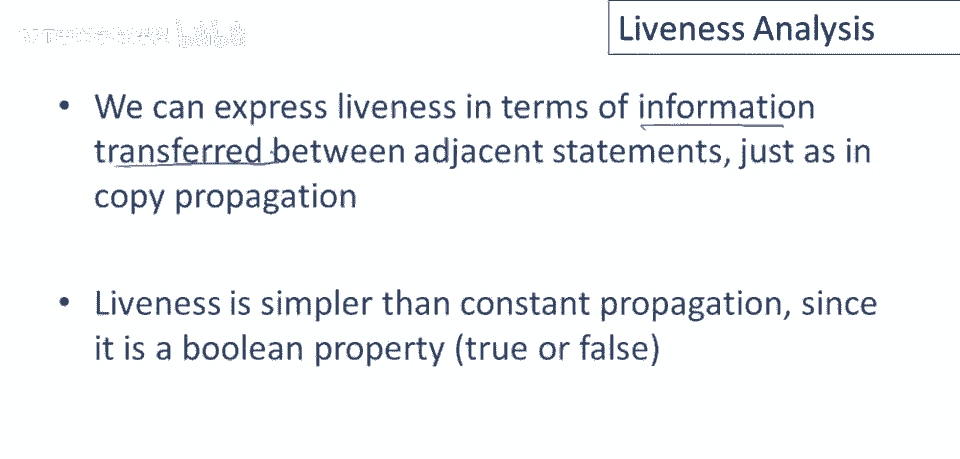

## 活跃度分析框架 🏗️

与常量传播类似，我们希望将“变量未来是否会被使用”这一全局信息，关联到程序的特定点上，以便做出局部优化决策。我们将定义并执行活跃度分析的算法，它遵循相同的框架：用相邻语句之间传递的信息来表达活跃度。

活跃度分析实际上比常量传播更简单，因为它只是一个布尔属性（真或假）。

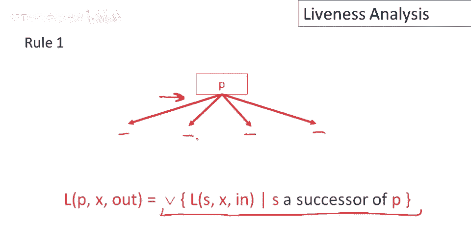

---

## 活跃度传播规则 📜

以下是决定变量`x`活跃度的四条核心规则。这些规则定义了信息如何在相邻程序点之间流动。

1.  **后继点规则（控制流合并）**：在程序点`p`之后，`x`的活跃度是`p`所有后继程序点`x`活跃度的逻辑或（`OR`）。公式表示为：`live_out(p) = OR(live_in(s)) for all successors s of p`。直觉是，只要`x`在`p`之后的某条路径上会被使用，它在`p`点就是活跃的。

2.  **读操作规则**：如果语句`s`读取了`x`的值（例如 `y = x + 1`），那么在语句`s`之前，`x`是活跃的。因为`x`的值即将被使用。规则为：`live_in(s) = true`（如果`s`读取`x`）。

3.  **写操作规则**：如果语句`s`写入了`x`的值，且其右侧表达式`e`中没有引用`x`（例如 `x = 5`），那么在语句`s`之前，`x`是死的。因为`s`将覆盖`x`的旧值，而旧值不会被`s`本身使用。规则为：`live_in(s) = false`（如果`s`写入`x`且`e`不含`x`）。

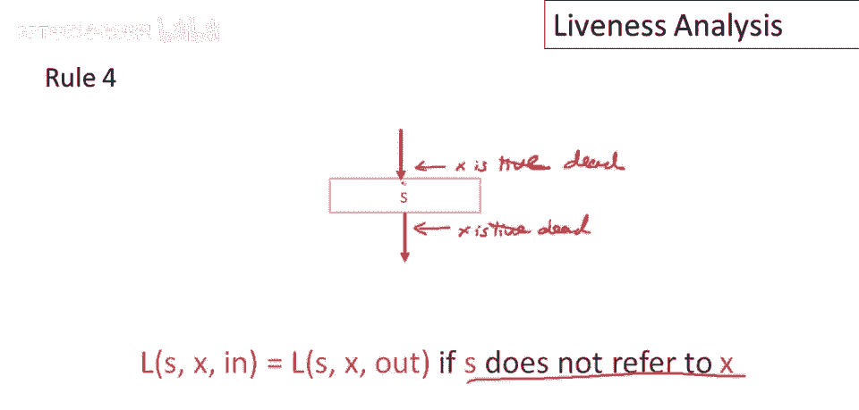

4.  **无关操作规则**：如果语句`s`既不读取也不写入`x`，那么`x`在`s`之前的活跃度与在`s`之后相同。规则为：`live_in(s) = live_out(s)`。

---

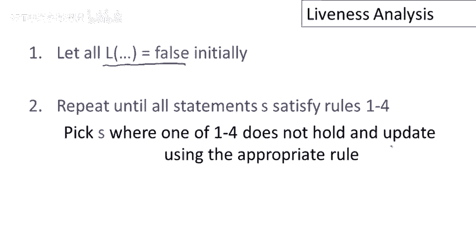

## 活跃度分析算法 ⚙️

基于以上规则，我们可以给出算法：

1.  初始化：假设变量`x`在所有程序点的活跃度信息都为`false`（死亡）。
2.  重复以下步骤，直到所有语句的信息都满足上述四条规则：
    *   选择一个信息不一致的语句。
    *   根据适当的规则更新该语句的活跃度信息。

这个算法与我们用于常量传播的算法结构相同。

---

## 实例分析 🔎

让我们分析一个简单的带循环的程序：
```c
x = 0;
while (x != 10) {
    x = x + 1;
}
// 假设循环结束后不再使用 x
```

以下是分析步骤：
*   **初始假设**：假设`x`在程序出口（循环后）是死的（`false`）。所有其他点初始也为`false`。
*   **应用规则**：
    1.  在语句 `x = x + 1` 处，它**读取**了`x`。根据规则2，在该语句之前，`x`必须为活跃（`true`）。
    2.  这个活跃信息会沿着控制流反向传播（规则1和规则4）。因此，在循环条件 `x != 10` 判断之前，`x`也是活跃的。
    3.  信息继续反向传播到循环入口和初始化语句 `x = 0` 之后。
    4.  对于初始化语句 `x = 0`，它**写入**`x`且右侧没有读取`x`。根据规则3，在该语句之前，`x`是死的（`false`）。这与我们从循环体反向传播来的`true`信息在入口点汇合，但根据规则1（`OR`运算），`true OR false = true`，所以入口点`x`为活跃。然而，由于程序入口前没有其他路径，且`x`是局部变量，其初始值无意义，通常我们更关心`x = 0`这个赋值本身是否有用。分析显示，在`x = 0`之后，`x`是活跃的（因为马上要进入循环判断），所以这个赋值是必要的。

通过这个过程，我们得到了每个程序点上`x`的正确活跃信息。

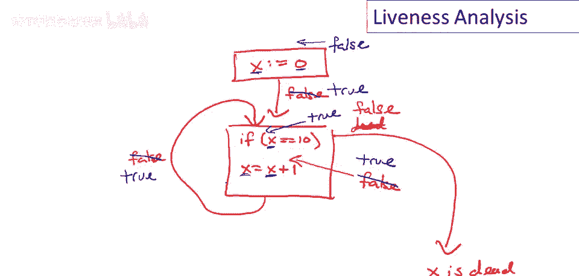

---

## 算法性质与终止性 ✅

从我们的例子可以看出，活跃度信息只能从`false`变为`true`，而不会从`true`变回`false`。在数学上，我们有两个值：`false`（低）和`true`（高），构成一个偏序集。算法从最低值（`false`）开始，信息只能向更高的值（`true`）移动。

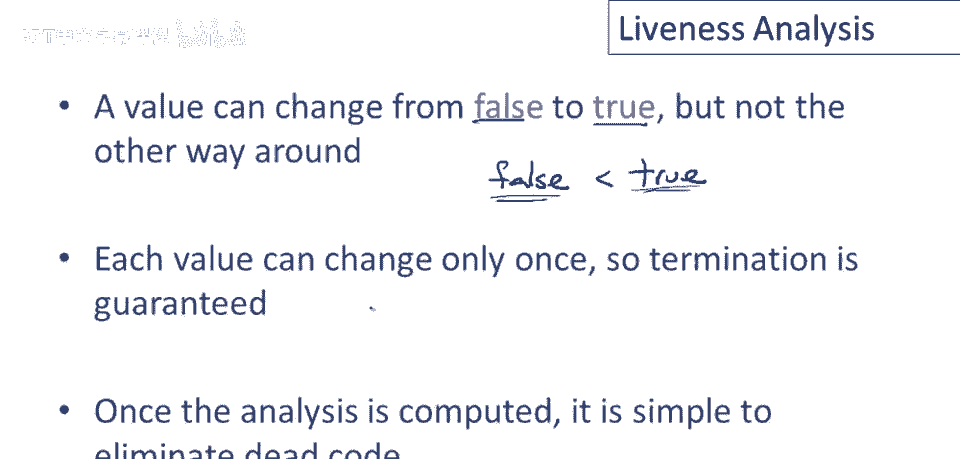

由于每个程序点的值最多只能改变一次（从`false`到`true`），因此算法保证会在有限步内终止，最终为控制流图提供一致的活跃度信息。

---

## 总结：前向分析与后向分析 🔄

总结我们关于控制流图全局分析的讨论，我们介绍了两种主要类型的分析：

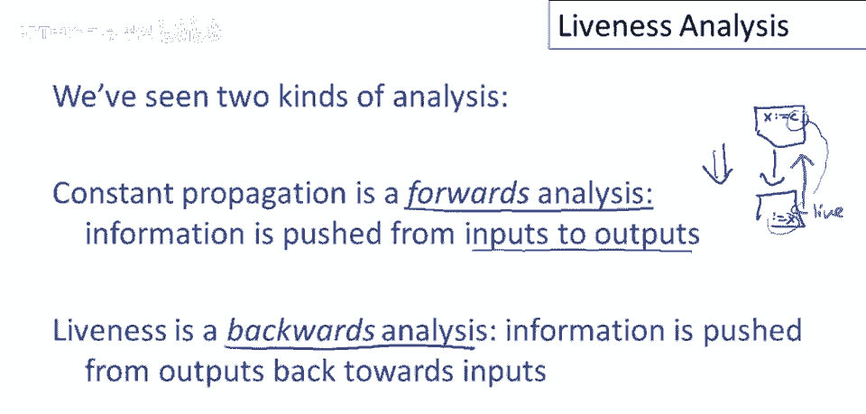

*   **常量传播是前向分析**：信息沿着程序执行的方向（从前向后）流动。例如，一个常数值从定义点传播到使用点。
*   **活跃度分析是后向分析**：信息逆着程序执行的方向（从后向前）流动。例如，一个变量的使用点会将其活跃性反向传播到其定义点。

文献中有许多其他类型的全局数据流分析，常量传播和活跃度分析是最重要的两种。它们都可以归类为前向或后向分析。几乎所有这类分析都遵循相同的方法论：定义**局部规则**来描述相邻程序点之间的信息如何传递，从而将分析整个复杂控制流图的问题，分解为一系列简单的、局部的推理步骤。

---

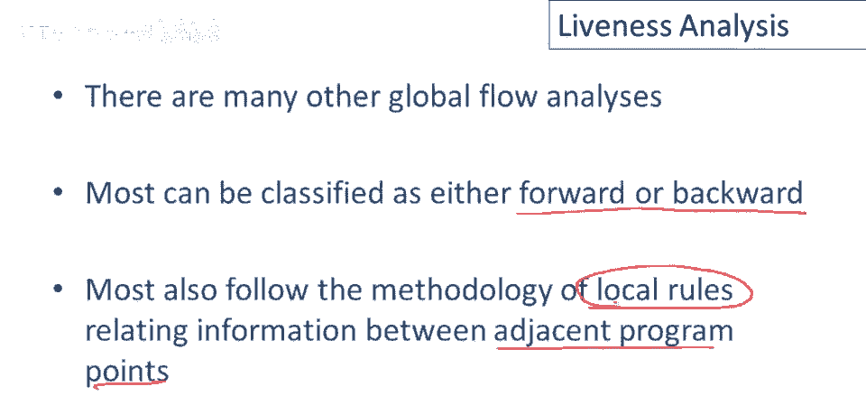

本节课中我们一起学习了活跃度分析的核心概念、四条传播规则、迭代算法及其工作实例，并理解了它作为一种后向分析与前向分析（如常量传播）的区别。掌握这些基础是理解更复杂编译器优化技术的关键。