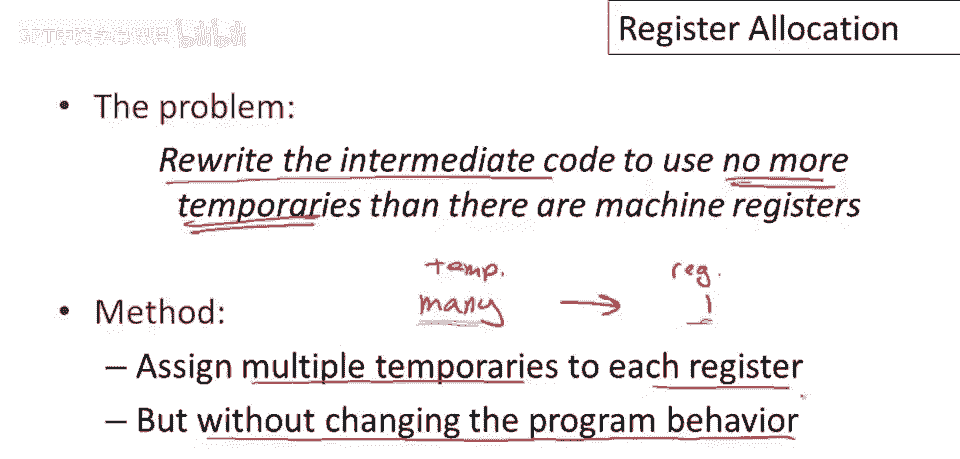
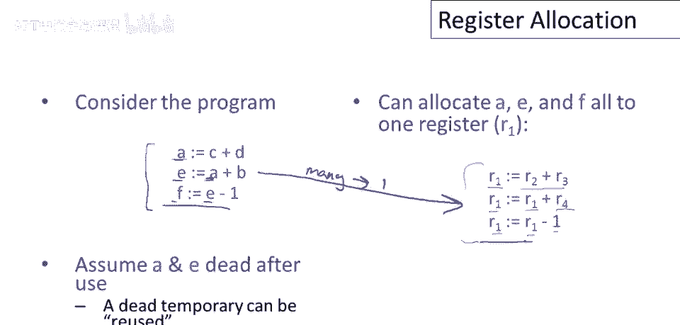
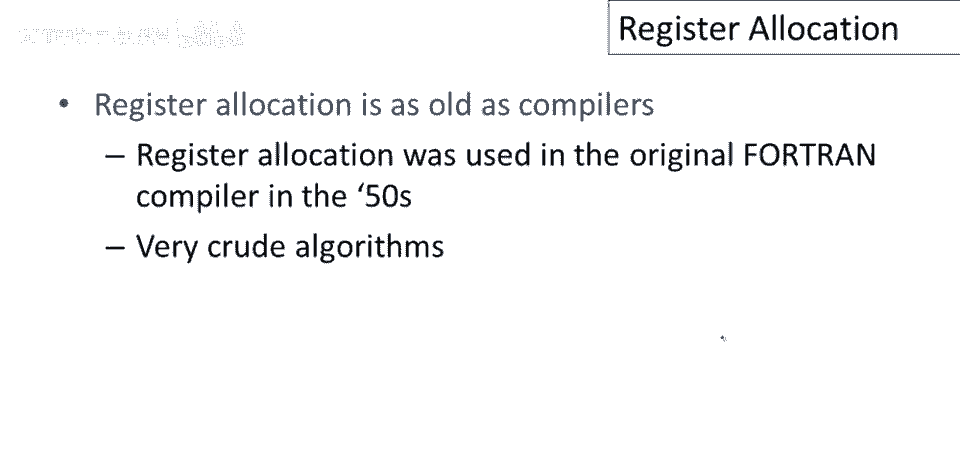
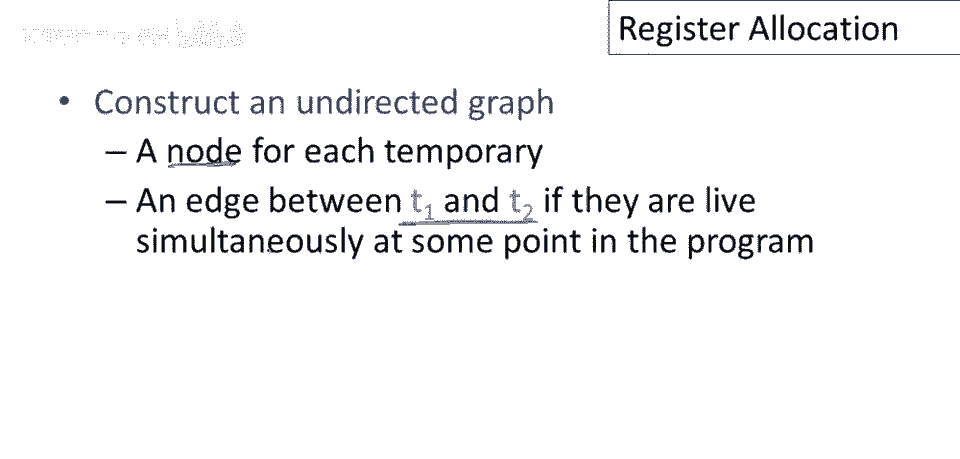
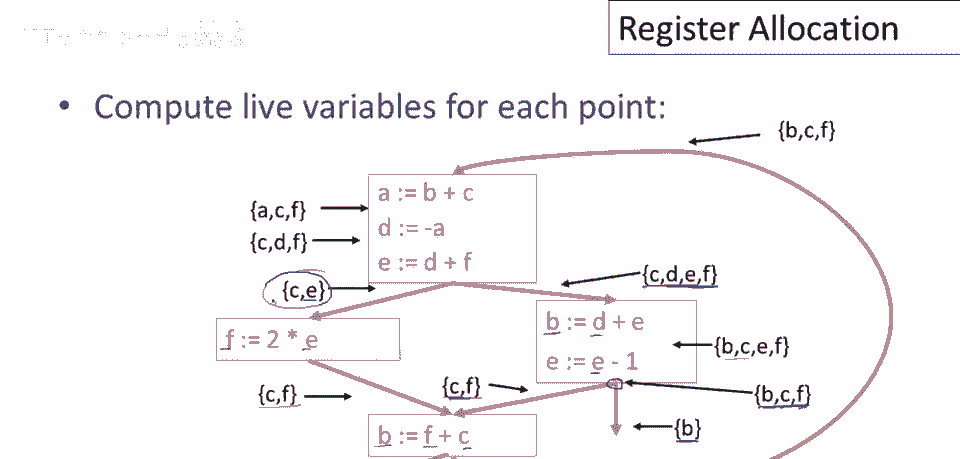
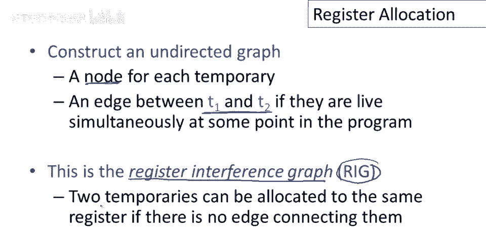
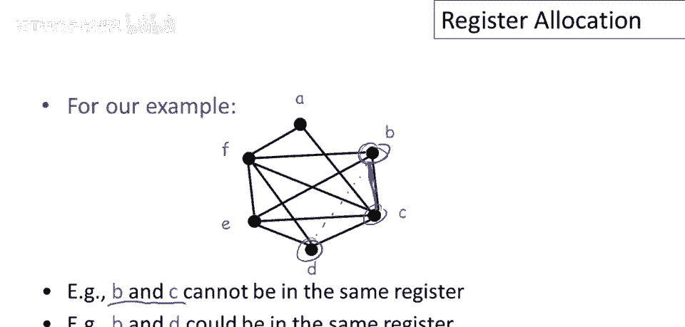
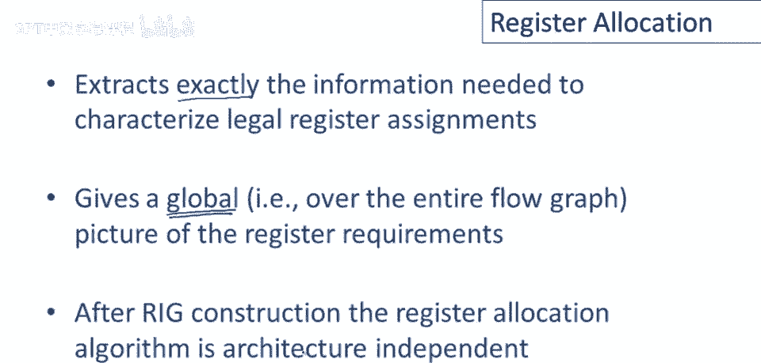

# 课程P81：寄存器分配基础 🧠


在本节课中，我们将要学习编译器后端的一个核心环节——寄存器分配。我们将了解为何需要寄存器分配，以及如何利用全局活跃变量分析来构建寄存器干扰图，从而将中间代码中的大量临时变量映射到有限的物理寄存器上。

---


## 为何需要寄存器分配？🤔

上一节我们介绍了中间代码生成。回忆一下，中间代码可以使用无限多的临时变量。这简化了优化过程，因为我们无需担心寄存器的数量限制。

但这也带来了问题。最终生成的汇编代码必须运行在真实的硬件上，而硬件寄存器的数量是有限的。如果中间代码使用了过多的临时变量，我们就无法将它们全部放入寄存器中。



因此，我们需要一个步骤：**重写中间代码，使其使用的临时变量数量不超过机器的物理寄存器数量**。我们的目标是通过算法，将多个临时变量分配到同一个寄存器中，形成一个从临时变量到寄存器的“一对多”映射。

显然，如果临时变量太多，我们无法全部放入寄存器。这时我们需要一些“技巧”，甚至备用方案。但默认的计划是尽可能多地将临时变量放入同一个寄存器，同时不改变程序的行为。

---

## 核心思想：共享寄存器的条件 🔄

我们如何实现这个“魔法”，让一个寄存器保存多个值呢？关键在于：一个寄存器可以保存多个值，但**在同一时间只能保存一个值**。



让我们考虑一个简单的三语句程序：
```
a = b + c
e = a + d
f = e - 1
```
注意：
*   `a` 在第一句被写入，在第二句被读取。
*   `e` 在第二句被写入，在第三句被读取。
*   `f` 仅在第三句被写入。

假设 `a` 和 `f` 在其他地方未被使用，那么 `a`、`e`、`f` 这三个变量的生命周期（活跃期）**并不重叠**。因此，它们可以共存于同一个寄存器（例如 `R1`）中。



分配后的代码可能如下：
```
R1 = R2 + R3  // a = b + c
R1 = R1 + R4  // e = a + d
R1 = R1 - 1   // f = e - 1
```
这就实现了一个寄存器（`R1`）对应多个临时变量（`a`, `e`, `f`）的映射。

---


## 历史与现代方法 📜


寄存器分配是一个古老的问题，早在1950年代的FORTRAN项目中就被识别出来。早期的算法比较粗糙，人们很快发现，寄存器分配的能力是制约代码生成质量的瓶颈。

约30年后，在1980年，IBM的研究人员取得了突破。他们提出了一种**基于图着色**的寄存器分配方案。该方案的优点是简单、易于解释，并且是全局性的（利用整个控制流图的信息），同时在实践中效果良好。

---


## 基本原则：活跃变量分析 📊

现代寄存器分配算法的基本原则是：**两个临时变量可以共享同一个寄存器，当且仅当它们不在同一时间活跃**。

换句话说，如果在程序的任何一点，`T1` 和 `T2` 中最多只有一个变量是活跃的，它们就可以共享寄存器。更简洁的否定表述是：**如果 `T1` 和 `T2` 同时活跃，那么它们就不能共用同一个寄存器**。因为如果需要同时使用两个值，就必须有两个不同的存储位置。

为了应用这个原则，我们需要知道每个程序点上哪些变量是活跃的。这就需要用到上一节课介绍的**活跃变量分析**。这是一种数据流分析，通过逆向遍历控制流图，计算出在每个程序点，哪些变量在未来会被使用（即“活跃”）。

---

## 构建寄存器干扰图 (RIG) 🕸️


本节中我们来看看如何利用活跃信息进行寄存器分配。核心是构建一个**寄存器干扰图**。



以下是构建步骤：
1.  为每个临时变量创建一个图节点。
2.  如果两个临时变量在程序的**任何一点**同时活跃，就在它们对应的节点之间添加一条无向边。

这条边表示一个约束：**这两个变量不能分配到同一个寄存器**。



让我们看一个例子。假设在某个程序点，分析显示变量 `c` 和 `e` 都处于活跃集中。那么，在寄存器干扰图中，节点 `c` 和节点 `e` 之间就会有一条边。



这个图称为**寄存器干扰图**。其核心思想是：**两个临时变量可以被分配到同一个寄存器，当且仅当在寄存器干扰图中，它们之间没有边直接相连**。

---

## RIG的优势与寄存器分配 🎯



寄存器干扰图有三大优势：
1.  **精确描述问题**：它提取了描述合法寄存器分配所需的全部约束信息。
2.  **全局视图**：它基于整个控制流图的分析结果，帮助我们做出全局性的寄存器重要性决策。
3.  **与架构无关**：算法本身不依赖于具体的机器指令集，只依赖于一个关键属性——**机器的物理寄存器数量**。这正是我们使用该算法进行分配时所需要知道的。

从RIG到具体的寄存器分配，可以类比为**图着色问题**：我们有 `K` 种颜色（代表 `K` 个物理寄存器），需要为图中每个节点（临时变量）着色，并保证任何一条边连接的两个节点颜色不同。找到一种 `K` 着色方案，就找到了一个合法的寄存器分配。

---

## 总结 📝



本节课中我们一起学习了寄存器分配的基础知识。我们了解到，由于硬件寄存器有限，必须将中间代码的众多临时变量映射到有限的物理寄存器上。关键在于利用**活跃变量分析**来识别变量生命周期的重叠情况，并据此构建**寄存器干扰图**。RIG以图的形式精确刻画了“哪些变量不能共享寄存器”的约束，将寄存器分配问题转化为了图着色问题，为后续设计高效、全局的分配算法奠定了坚实的基础。