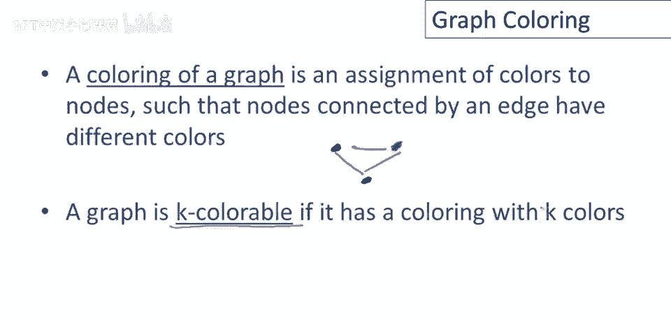
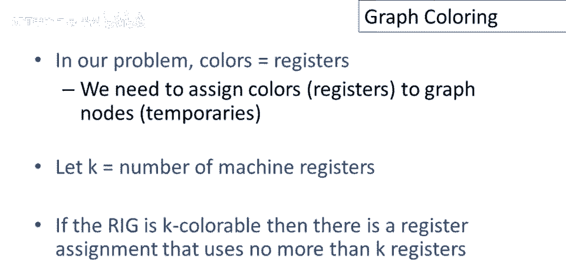
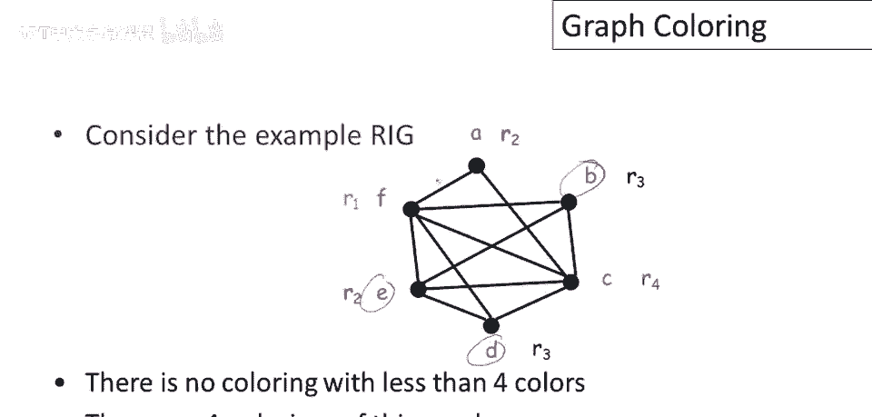
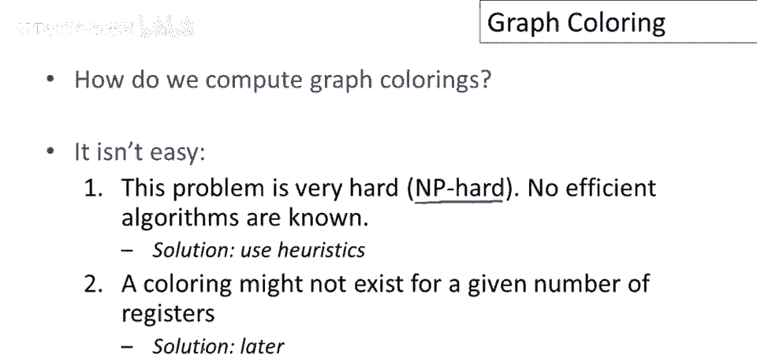
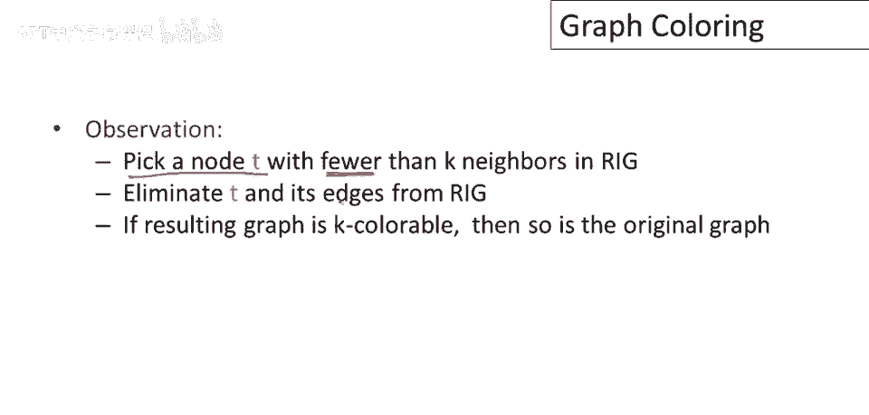
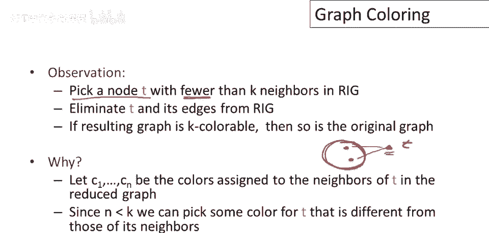
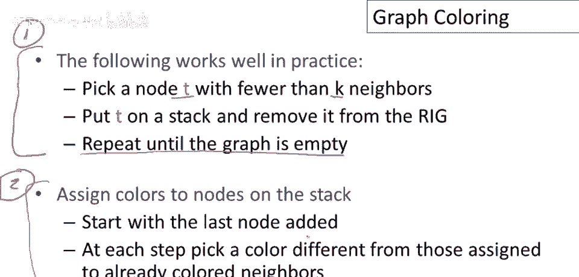
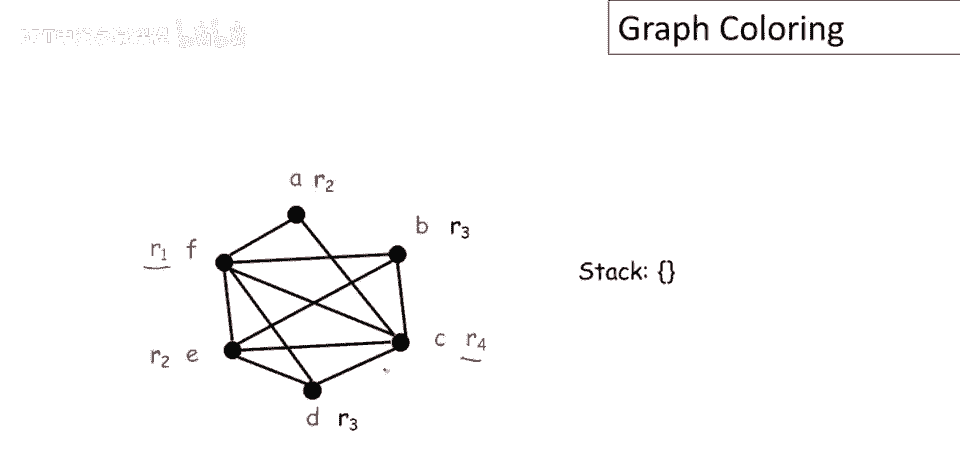

# 课程 P82：寄存器分配与图着色 🎨

在本节课中，我们将学习如何利用图着色技术为程序中的变量分配寄存器。我们将从寄存器干扰图出发，理解图着色的基本概念，并学习一种在实践中广泛使用的近似着色算法。

## 图着色基础 📚

上一节我们介绍了寄存器干扰图，本节中我们来看看图着色的核心定义。

图着色是指为图中的节点分配颜色，使得任何由边连接的两个节点具有不同的颜色。

如果一张图可以使用 `k` 种或更少的颜色完成着色，则称该图是 **k可着色** 的。

在我们的寄存器分配问题中，颜色对应着物理寄存器。我们设 `k` 为可用物理寄存器的最大数量。如果寄存器干扰图是 **k可着色** 的，那么就存在一种寄存器分配方案，使得程序使用的寄存器数量不超过 `k` 个。

## 图着色示例 🔍

让我们看一个寄存器干扰图的着色示例。

对于这个特定的图，我们使用不超过4种颜色完成了着色。图中用彩色标签和寄存器名称标明了每个节点的分配结果。

请注意，尽管图中节点（临时变量）数量超过4个，我们仍然只用了4种颜色。这意味着多个节点可以共享同一个寄存器，例如节点 `D` 和 `b` 共享颜色，节点 `e` 和 `a` 共享颜色。

## 着色算法的挑战 ⚠️

我们讨论了寄存器干扰图是什么，也定义了图着色，但尚未讨论如何计算图着色。这并不容易。

图着色是一个 **NP难** 问题。这意味着没有已知的、能在所有情况下都快速求解的完美算法。因此，编译器实际使用的都是近似技术。

此外，我们还会遇到第二个问题：给定数量的寄存器可能不足以对图进行着色。例如，我们只有8个寄存器，但图可能需要9或10种颜色才能着色。这个问题我们稍后会处理。

## 图着色启发式算法 🛠️

现在，我将介绍一种最流行的为寄存器干扰图着色的启发式算法。其基本思想是分而治之。

算法的核心是选择一个邻居数量少于 `k` 的节点 `t`，将其从图中移除。如果移除 `t` 后得到的子图是 **k可着色** 的，那么原始图也是 **k可着色** 的。

其原理是：节点 `t` 的邻居少于 `k` 个。在为子图着色后，`t` 的邻居最多使用了 `k-1` 种颜色，因此至少有一种颜色剩余，可以分配给 `t`。

## 算法步骤详解 📝

该算法分为两个阶段：**简化** 和 **着色**。

### 第一阶段：简化

以下是简化阶段的步骤：
1.  在寄存器干扰图中，选择一个邻居数量少于 `k` 的节点 `t`。
2.  将节点 `t` 压入栈中，并将其从图中删除（包括与其相连的所有边）。
3.  重复步骤1和2，直到图为空。

这个阶段的目标是为图中的节点生成一个处理顺序。

### 第二阶段：着色

以下是着色阶段的步骤：
1.  从栈中弹出栈顶节点（即最后被移除的节点）。
2.  将该节点加回图中，并恢复其原有的边。
3.  为该节点分配一个颜色（寄存器），该颜色必须与其所有已着色邻居的颜色不同。通常选择编号最小的可用寄存器。
4.  重复步骤1到3，直到栈为空，所有节点都完成着色。

## 算法实例演示 🧮

让我们通过一个具体例子来理解算法。假设我们有下图，且 `k = 4`（即有4个可用寄存器）。

**第一阶段：简化**
1.  选择节点 `a`（2个邻居），移除并压栈。栈：`[a]`。
2.  选择节点 `d`（3个邻居），移除并压栈。栈：`[d, a]`。
3.  选择节点 `c`（此时邻居少于4），移除并压栈。栈：`[c, d, a]`。
4.  选择节点 `b`，移除并压栈。栈：`[b, c, d, a]`。
5.  选择节点 `e`，移除并压栈。栈：`[e, b, c, d, a]`。
6.  选择节点 `f`，移除并压栈。栈：`[f, e, b, c, d, a]`。图空。

**第二阶段：着色**
我们按出栈顺序（`f, e, b, c, d, a`）为节点分配寄存器（`r1, r2, r3, r4`）。
1.  `f` 入图，无邻居，分配 `r1`。
2.  `e` 入图，邻居 `f` 用 `r1`，分配 `r2`。
3.  `b` 入图，邻居 `f`(`r1`)、`e`(`r2`)，分配 `r3`。
4.  `c` 入图，邻居 `f`(`r1`)、`e`(`r2`)、`b`(`r3`)，分配 `r4`。
5.  `d` 入图，邻居 `f`(`r1`)、`e`(`r2`)、`c`(`r4`)，分配 `r3`。
6.  `a` 入图，邻居 `b`(`r3`)、`c`(`r4`)，分配 `r2`。

最终，我们使用4个寄存器完成了对6个节点的着色分配。

## 总结 ✨

本节课中，我们一起学习了寄存器分配中的图着色技术。我们首先明确了图着色与寄存器分配的对应关系，即颜色代表寄存器。然后，我们认识到精确的图着色是NP难问题，因此编译器采用启发式算法。

我们重点学习了一种基于“简化-着色”两阶段的经典启发式算法。该算法通过不断移除低度数的节点来简化图，然后逆序为节点分配颜色，从而高效地找到近似最优的寄存器分配方案。通过实例演示，我们看到了该算法如何在实际中运作。