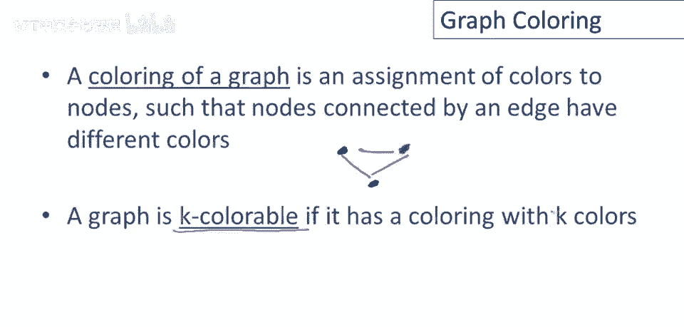
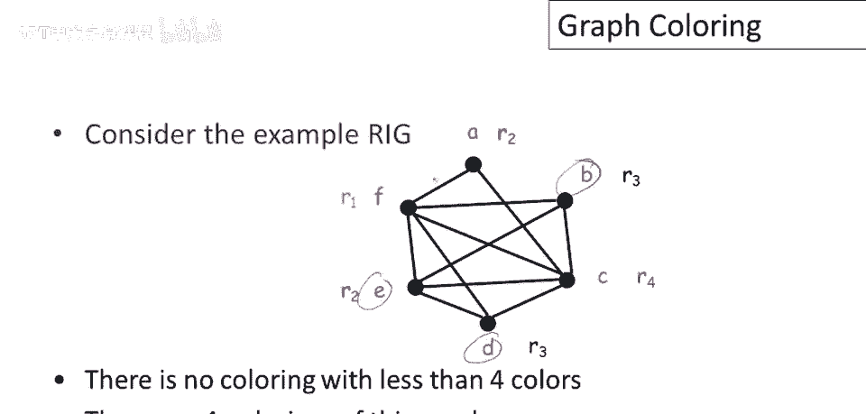
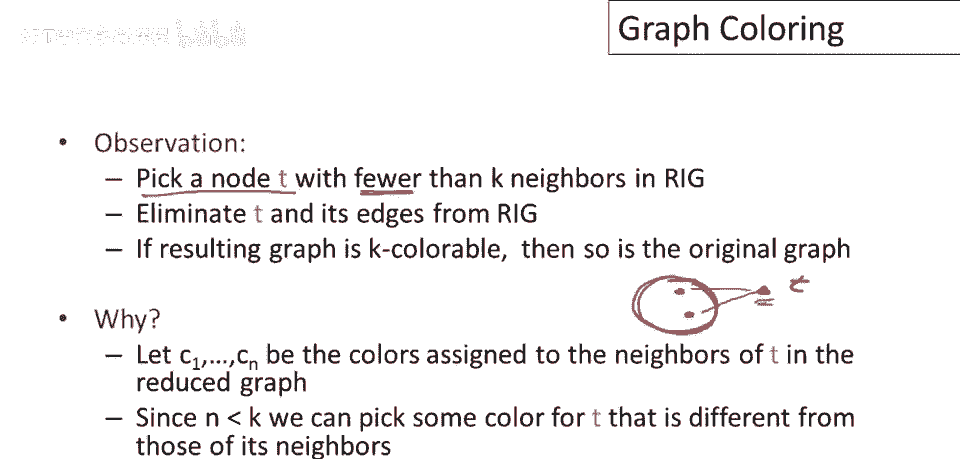
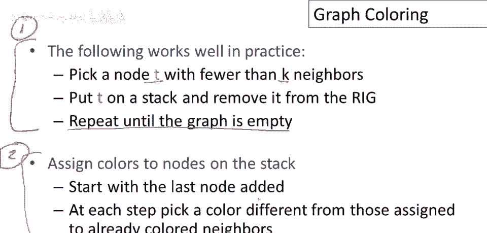
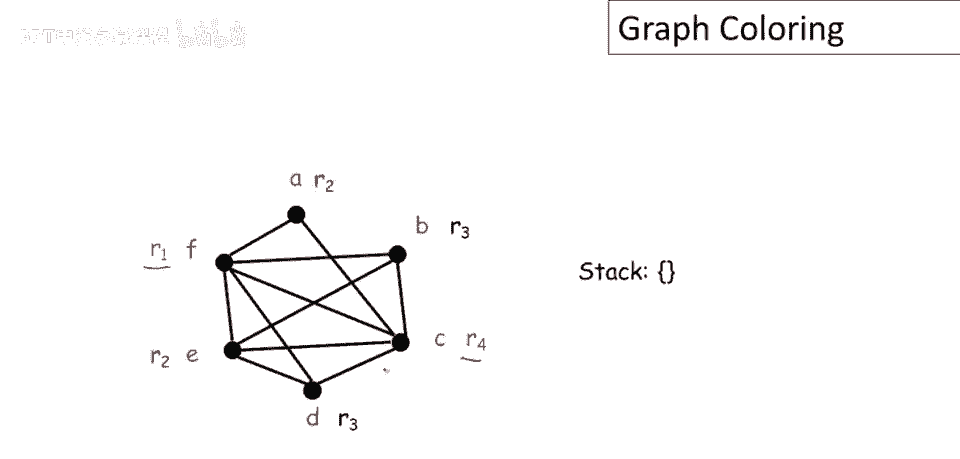

# P82：p82 16-02-_Graph_Coloring - 加加zero - BV1Mb42177J7

本视频中，我们将继续讨论寄存器干扰图，并讨论如何使用图来为过程分配寄存器，我们将研究一种流行的技术，称为图着色。

首先，几个定义，图着色是对节点的颜色分配，使得由边连接的节点具有不同的颜色，所以，如果我有一个图，假设有3个节点，并且完全连接，每个节点与其他节点相连，然后图的着色就是颜色分配。

使得每对相连节点颜色不同，例如，我可以将这个节点涂成蓝色，我可以将这个节点涂成绿色，我可以将这个节点涂成黑色，好的，然后这就是图的有效着色，因为每对邻居颜色不同，然后图是k可着色的，若用k色或更少染色。

在我们的问题中，颜色对应寄存器，我们想要做的是为图节点分配颜色或寄存器，我们让k为，允许使用的最大颜色数，为机器寄存器的数量，因此，实际上的寄存器数量是我们在为生成代码的架构，然后如果，如果刚体。

若寄存器干扰图k可染色，则存在一种寄存器分配，使用不超过k个寄存器。

让我们看一个示例RIG，对于这个特定图，没有着色，结果他使用了少于4种颜色，但至少有一种对这个图的着色，这就是，我用彩色标签，但也用寄存器名称，这样你可以看到我们可以将哪些寄存器分配给每个节点，注意。

尽管有很多，超过4个临时变量或节点，我们只用4种颜色着色，一些节点颜色相同，例如，D和b与e和a颜色相同。

提醒我们寄存器冲突图来源，这是原始控制流图，一旦我们有图的颜色，现在可做寄存器分配，可用寄存器名替换临时变量，然后得到这个控制流图，这里仅将程序中的每个变量，重命名为分配给它的寄存器，现在非常接近了。

如您所见，嗯，即将生成可在目标架构上执行代码，我们讨论了寄存器干扰图是什么，定义了图着色的概念，但尚未讨论如何计算图着色，这是下一个要解决的问题，不幸的是，这并不容易，图着色是一个极其困难的问题。

如果您上过计算机科学理论课，那么这会有所帮助，我说它是NP难问题，计算图着色，如果您之前没有听说过NP难，没关系，重要的是没有人知道该问题的有效算法，因此没有已知的快速程序，我们将讨论的解决方案。

每个编译器使用的技巧，基本上是近似技术，不能完全解决问题，但还有第二个问题，即给定数量的寄存器可能不存在着色，我们可能只有8个寄存器，图着色可能无法使用少于9或10种颜色，因此我们不得不处理这个问题。

稍后我们会讨论。

现在不会多说该问题的解决方案，现在我将介绍最流行的着色寄存器干扰图技巧，基本思想非常简单，我们将选择节点t，它在寄存器干扰图中，少于k个邻居，好的，这实际上是关键，只需在图中找到任何少于k个邻居的节点。

然后从寄存器干扰图中消除t及其边缘，只需删除该节点及其相邻的所有边缘，如果结果子图是可k着色的，那么原始图也是可k着色的，这里的想法是做一种分而治之的方法，我们选择一个节点，从图中删除它，着色剩余的图。

好的，这是一个节点少一个的较小问题，当我们完成那个之后，我声称我们可以为原始图找到着色。

那为何如此呢，这里画个图，假设有个节点少于k个邻居，姑且说它有2个邻居，这是其余的图，这个大圆是其余的图，这是要删除的节点t，假设它只有2个邻居，好的，现在我们要做的是，概念上删除t，然后给子图着色。

假设成功着色子图，现在这个大球用红色着色，现在要为这个大球，加上节点t着色，因为说少于k色可着色子图，2当然小于k，t必定有剩余颜色，看t相邻节点的颜色，少于k个，不能用尽k色，为t选剩余颜色。

实践中很有效的方法，先选少于k邻居的节点t，将t入栈并从冲突图删除，递归，重复直到图空，不断选少于k邻居的节点，入栈并从图中删除，直到图完全清空，这是第一阶段，这是第一部分，然后第二部分着色。

为栈上的节点构建着色，按逆序处理节点，它们被添加，所以最后加入栈的节点先处理，每一步我们做的是，选不同于已着色邻居的颜色，想法是取栈顶节点，弹出栈，现在加回图中，连同它在原图中的边，然后着色，然后看。

看它的邻居，删除时少于k邻居，加回时也少于k，会有可用颜色，我们着色它，然后从栈中选另一个节点重复，直到处理完所有图节点。

让我们举个例子，这是我们的寄存器干扰图，我们将用k等于四处理这个图，所以最初我们有整个寄存器干扰图，栈是空的，好的，第一步是选一个邻居少于四个的节点，让我们选a，因为它只有两个邻居，我们做什么。

我们从图中删除a并把它推入栈中，所以那一步后我们的图，这是移除a后的图，这是我们的栈，现在我们要选另一个邻居少于k的节点，抱歉，少于四个邻居，如果我们看这张图，我们可以看到我们有选择几个不同节点的选项。

我们可以选择d或b，实际上只有两个不同的节点我们可以选择，因为c，E和f都有四个邻居，所以让我们移除d，这里是任意选择，我们选择哪一个并不重要，现在栈将会有dna，我们的图将减少到这四个节点，现在。

这里有一个有趣的现象值得注意，此时所有节点邻居都少于四个，因此，由于图中每个节点的邻居数都少于我们允许使用的颜色数，在这一点上，图着色是保证成功的，因为每次我们移除一个节点。

我们只能减少图中其他每个节点的邻居数，同样有趣的是，即使在前一步中一些节点有四个邻居，因此可能不可着色，那时我们不能选择它们，因为可能邻居的着色会使用完所有颜色，注意现在它们都少于四个邻居，这是这个图。

着色启发式的一个有趣属性，即使一个节点有超过k的邻居，最终我们可能从图中移除足够的节点，使它的邻居数低于可用颜色数，然后我们将能够着色它，无论如何，现在选哪个节点不重要，因为我们可以按任何顺序处理它们。

现在从图中删除c，现在选择另一个节点，我们可以删除b，现在只剩下一个2节点图，让我们选择e并删除它，现在只剩下一个1节点图，我们从图中移除f，现在图是空的，我们有了栈，注意栈，实际上，在这个过程中。

我的意思是，这个程序第一阶段的目的是，给图中的节点排序，这是我们应该为图中的节点分配颜色的顺序，对，所以现在往回工作，嗯，之后，你知道，完成第一部分后，现在我们必须做第二部分，我们实际上要分配颜色。

我们将从栈的顶部开始，所以我们将节点f放回图中，我们将给它分配一个颜色，让我们假设我们将选择，未被其任何邻居使用的编号最低的寄存器，因为f在图中是单独的，我们将给它分配寄存器r1现在我们将e放回图中。

它必须与f有不同的寄存器，因为寄存器因为f正在使用寄存器r1，我们将给e分配寄存器r2，现在我们将b放回图中，它必须与f和d有不同的颜色或寄存器，所以我们将给它分配寄存器r3，我们将c放回图中。

现在注意c有所有的f，e和b作为邻居，正在使用前三个寄存器，所以c将被分配寄存器r4现在没有寄存器了，我的意思是这些四个节点正在使用所有的寄存器，但因为我们在第一阶段删除了正确的东西，我们知道。

那么当我们添加其他节点时，栈上的其余节点，它们不会拥有所有这些节点作为邻居，所以将有一些寄存器可用于分配，查看寄存器d，对不起，查看节点d，这里有了，它与其邻居共享，F e 和 c，因此。

唯一可分配的寄存器是我们的三个，与b相同的寄存器，这是唯一未被邻居使用的寄存器，好的，所以d被分配寄存器r三，然后分配a抱歉，我们在图中添加一个回退，我们查看其邻居，它们正在使用寄存器r一和r四，因此。

a可以被分配寄存器r二或r三，由于我们的规则只是使用，未被邻居使用的编号最低的寄存器，我们将分配它寄存器r二。

