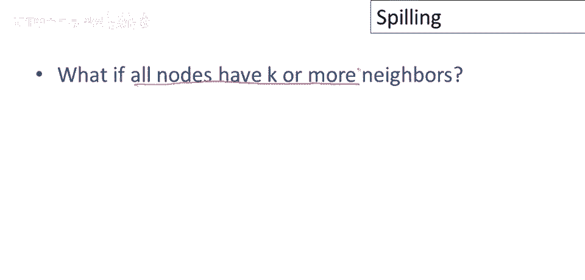
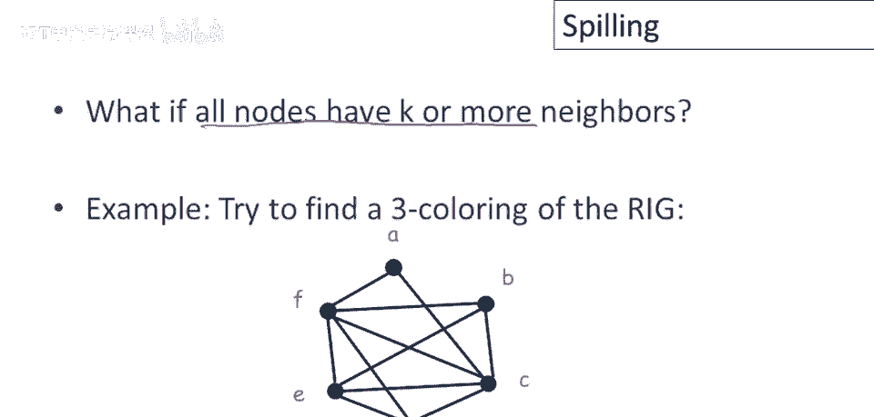
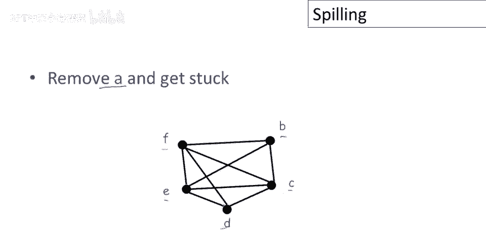
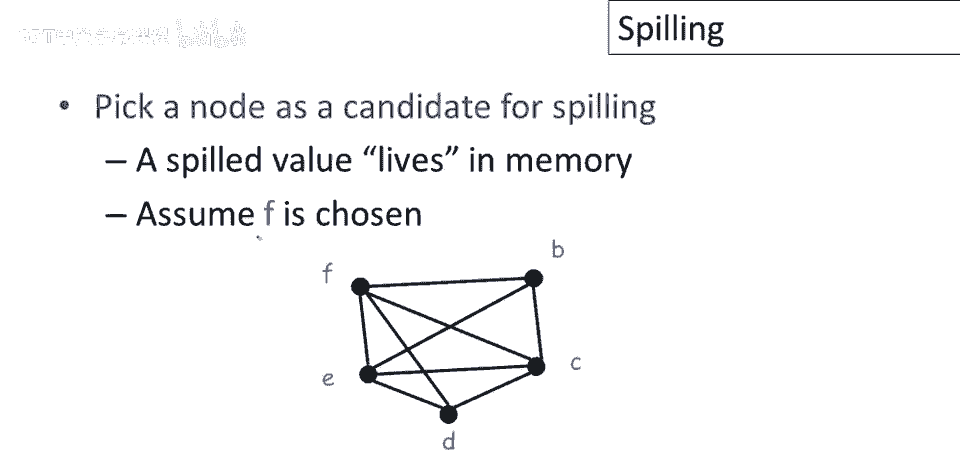
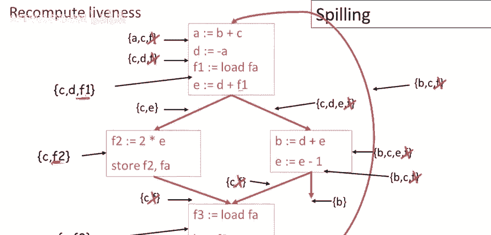
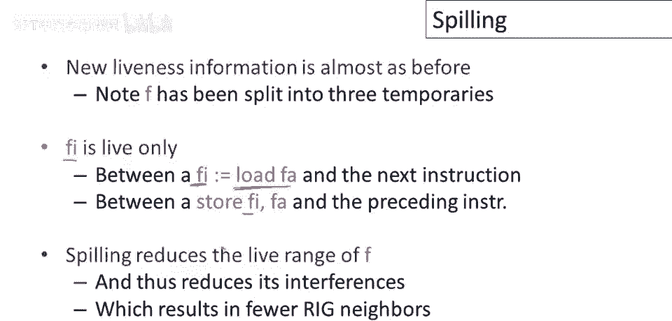

# P83：p83 16-03-_Spilling - 加加zero - BV1Mb42177J7

本视频继续讨论寄存器分配，这次，将讨论图无法成功着色时的情况。

即需进行称为溢出的操作。

上期视频中讨论的图着色启发式，并不总能成功着色任意图，可能陷入困境，无法找到着色，因此在这种情况下，我们只能得出无法在寄存器中，我们有更多的临时值，超出了寄存器的容量，这些临时值得存哪呢。

它们将不得不存入内存，那是我们唯一的其他存储，我们将挑选一些值溢出到内存，脑海中的画面应是一个桶，可容纳固定量的物品，它们是寄存器，当它太满时，有些东西溢出，最终在其他地方。

何时图着色启发式会卡住，唯一无法进展的情况是，如果所有节点都有k或更多邻居。

让我们看看我们最喜欢的寄存器冲突图，我们在示例中一直使用的，现在假设我们想要使用的机器只有三个寄存器，因此我们不是寻找这个图的四色着色，我们需要找到三色着色。

所以让我们思考如何找到这个图的三色着色，若应用启发式，将a从图中移除，但我们会陷入困境，因一旦移除a及其边，图中剩余节点均有3个以上邻居，至少有3个邻居，因此图中无节点可删，以确保能为其找到着色。

按上视频讨论的启发式。

在此情况下，我们将要做的，将选节点作为溢出候选，我们或临时节点可能，或认为需分配内存而非寄存器，假设选f为例，稍后讨论如何选溢出节点，选择特定溢出节点有多种方法，为示例说明，如何选不重要。

只需从图中移除一个节点，好的，我们将移除它。

我们将溢出f，然后我们会这样做，像之前一样从图中删除它，然后继续简化，这现在将成功，因为一旦我们移除f，我们可以看到所有节点，实际上一些节点少于三个邻居，所以b c和d，抱歉，只有b和d有两个邻居。

一旦它们被删除，E和c将只有一个邻居，因此着色现在将成功，这是一个成功顺序的例子。

在我们决定溢出f并成功着色子图后，现在我们必须尝试为f分配颜色，它可能是，我们可能很幸运地发现，即使f有超过三个邻居或三个或更多邻居，当我们从图中移除它时，当我们尝试为子图构建着色时。

那些邻居实际上并没有使用所有的寄存器，最终可能是所有这些邻居，例如，被分配到相同的寄存器，因此有足够的寄存器留给f，这称为乐观着色，我们选择一个溢出的候选者，我们尝试着色子图，一旦我们有子图的着色。

然后我们看看我们是否只是幸运地能够为f分配一个寄存器，在这种情况下，我们可以继续着色其余的图，好像什么都没发生，所以在这种情况下让我们看看，会发生什么，我们将f加回到图中，和和看它的邻居。

我们看到有一个邻居在使用我们的1，有一个邻居在使用r二，有一个邻居在使用我们的三，在这种情况下乐观着色将不起作用，实际上，F有超过k的邻居，在我们着色子图后，结果那些邻居正在使用所有k。

在这种情况下三个，所有三个寄存器名称，因此f没有剩余的寄存器。

我们将实际溢出并存储在内存中，因此如果我要使着色失败，就像这个例子一样，然后我们溢出f，我们将分配一个内存位置给f，通常这意味着将在当前堆栈帧中分配一个位置，让我们称这个地址为a，是f的地址。

然后我们要修改控制流图，我们将更改正在编译的代码，因此在读取f的每个操作之前，我们将插入一个加载，从该地址加载，f的当前值到一个临时名称，好的，这很有意义，因为如果值在内存中。

那么如果我们有一个需要实际使用的操作，呃，这个值我们得先从内存中加载到寄存器中，类似地，在每次对f的写入之后，我们将插入一个存储，因此我们将f的当前值保存到其在内存中的位置。

这是我们从构建寄存器干扰图中得到的原始代码，注意这里有一些对f的引用，我们只是突出显示它们，对吧，所以我们有一些读取和一些写入。

那么现在我们要做什么，所以这里我们有一个这里，我们使用了f，这个语句中的f的读取，现在我们在其前面插入了一个加载，并且注意我在这里给了个新名字，我称之为f1，因为在控制流图中f的不同使用。

不必有相同的临时名称，实际上将它们是分开的好主意，因此f的每个不同使用将获得自己的名称，所以我们加载了f的值，然后它在该语句中被使用，我们对f有一个写入，因此我们存储了f的当前值。

注意这里我给了它不同的名称，f2，临时值在这里计算，它将被存储，它被称为f2，最后f的第三个使用，这里有一个对f的另一个加载，就在这里，然后它被用于这个计算b这里，好的。

这是一种系统化的修改代码以使用存储中f的方法，现在我们必须重新计算f的活跃度，那么会发生什么呢，好吧，这是计算寄存器干扰图的原实时信息，好的，现在注意f不见了，程序中不再使用f。

可以删除所有提到f存活的地方，现在我们有3个新名称，F1、F2和F3，需要添加它们的存活信息，在这里创建了一些新的程序点，插入了语句，当然，当我们加载当前f值时，该值在下一语句使用前是活的，这里我们有。

当前f值的右侧，在存储前是活的，然后这里是当前f值的另一个加载，直到存储都是活的，抱歉，直到下一语句使用，好的，现在注意这里f曾经在很多很多，很多地方在代码中存活。

现在不仅f或不同版本的f存活的地方更少，而且我们已区分它们，实际上我们已分离了f的不同使用，它们将有自己的节点和图中的干扰集，不会与其他f的使用共享，实际上这也将减少图中的边数。

总结一下上一页的例子，一旦我们决定实际上要溢出临时变量f，这意味着我们要改变程序，我们将会有加载和存储到程序中，现在我们将有一个不同的程序，这将改变我们的寄存器分配问题，因此我们不得不重新计算存活信息。

我们将不得不重建寄存器干扰图，然后我们将不得不再次尝试着色该图，事实证明，这个新的存活信息几乎与之前相同，除了f之外的所有临时名称几乎不受新添加的语句的影响，由新语句添加的只有几个新的程序点。

它们可能存活，但之前它们存活的所有地方仍然存活，而f本身已经发生了相当大的变化，它的存活信息发生了相当大的变化，当然，旧名称f不再使用，因此它的存活信息消失了，然后我们还将f分成三个，在这种情况下。

三个不同的临时变量，控制流图中每个不同f使用的各一个，现在注意每个这些新的f使用，或这些新的f版本只在非常，非常小的区域存活，因此，加载指令的加载是我们要加载的，临时变量，我们正在加载。

Fi只在加载和下一个使用它的指令之间存活，Fi只在加载和下一个使用它的指令之间存活，同样适用于商店，临时fi的商店仅在商店本身和前一条指令之间存活，创建fi的那个。

这样做的效果是大大减少了溢出变量的生命周期，因此，无论我们决定溢出哪个名称，通过在那些值被使用的位置附近添加加载和存储，我们极大地减少了生命周期，并且，此外，如我之前在幻灯片上提到的。

通过将名称f分成多个不同的名称，我们也，你知道，避免不同版本f的共享不同生命周期。

因此，f的生命周期通过溢出减少，在新程序中，它的干扰比旧程序少，特别是这意味着，在重建的寄存器干扰图中，F将有更少的邻居，它以前的一些邻居已经消失了，因为它只在更少的地方存活。

所以如果我们看新的寄存器干扰图，我们看到在所有版本中，记住f已拆分为3个临时变量，我们看到它们现在只与and c冲突，而之前f图中有其他邻居，现在，实际上，这个新图可3色化。

当然可能无法只拆一个名字，我们可能需拆多个临时变量，难点是决定拆哪个，这是注册分配中必须做出的艰难决定，任何选择都是正确的，只是性能问题，你知道一些溢出选择将产生比其它更好的代码。

但任何溢出选择都将导致正确的程序，人们使用一些启发式方法选择溢出的临时变量，这里是一些，或我认为最流行的三个，一个是溢出具有最多冲突的临时变量，原因是这是临时变量，你能存入记忆的一件事。

将最影响图中干扰数，所以想法是可能溢出这一个变量，我们将移除足够的边从图中，使其可用注册数染色，另一种可能是溢出定义和使用的临时变量，这里的意思是通过溢出这些，因为它们使用不多。

加载和存储的数量将相对较小，所以如果一个变量没有在太多地方使用，在额外指令执行的代价上相对较小，还有另一个，这实际上是编译器，我认为都会实现的，以避免溢出和内循环，所以如果你在溢出。

程序内最内层循环中使用的变量，和另一个在其他地方使用的变量之间有选择，你可能更倾向于切换到溢出，那个不在最内层循环中使用的，因为这样会导致更少的加载和存储，你真正想要避免的是向内循环添加额外的指令。

总结本视频，寄存器分配是编译器最重要的工作之一，如今，任何合理生产编译器必备，需要它的原因是中间代码通常使用太多临时变量，我们可以对中间代码稍显随意，正是因为我们有好的寄存器分配算法。

另一个原因是寄存器是非常重要的资源，充分利用寄存器，有程序高效利用寄存器可大大改善最终代码，更高效的代码，现在描述的寄存器分配算法针对风险机，因此对于风险机，精简指令集计算机，这类机器。

可以几乎采用我描述的寄存器分配算法，对许多这些机器，它可直接使用，CISC机器，意为复杂指令集计算机，通常对寄存器的使用有限制，某些操作只能与特定寄存器配合使用，你可能注册了不同尺寸，只能存储特定值。

因此为这些机器进行寄存器分配变得更加复杂，人们所做的就是适应我描述的图着色过程，因此，基本思想完全相同，您会认出这些算法主要是，我们讨论的图着色算法，这些算法中只有附加步骤。

以及必须观察特定寄存器可以使用的地方。

