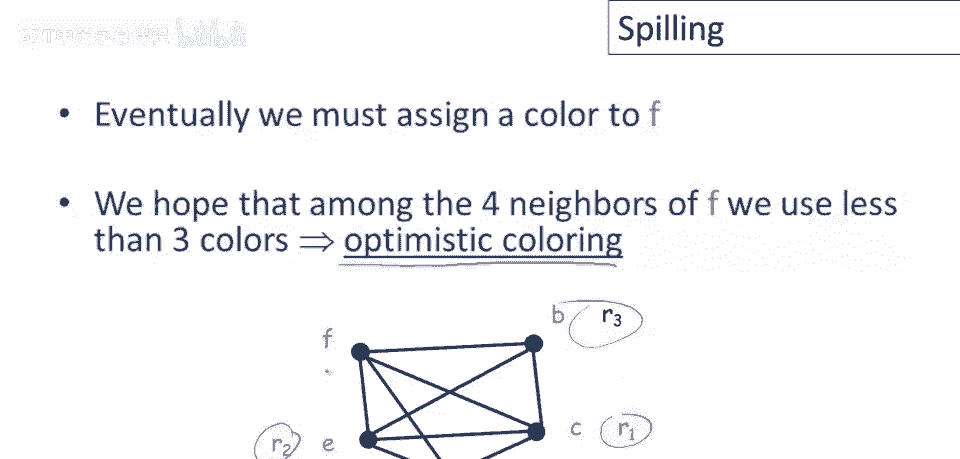
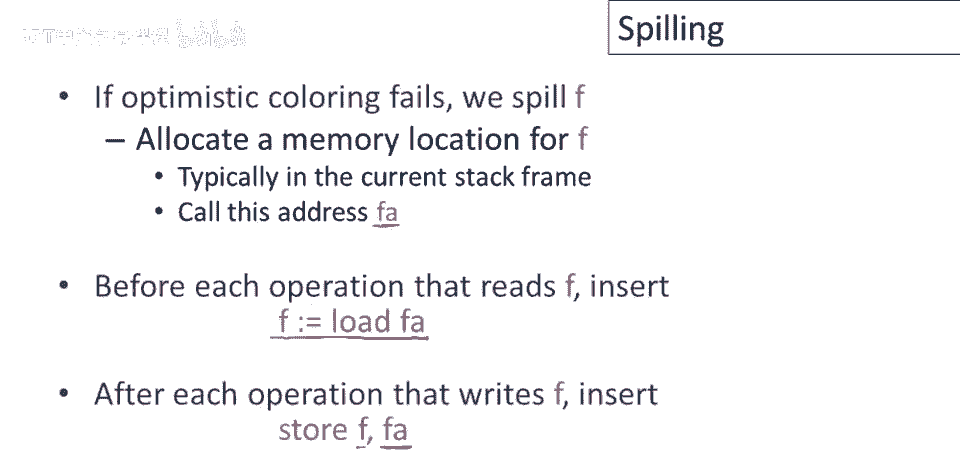
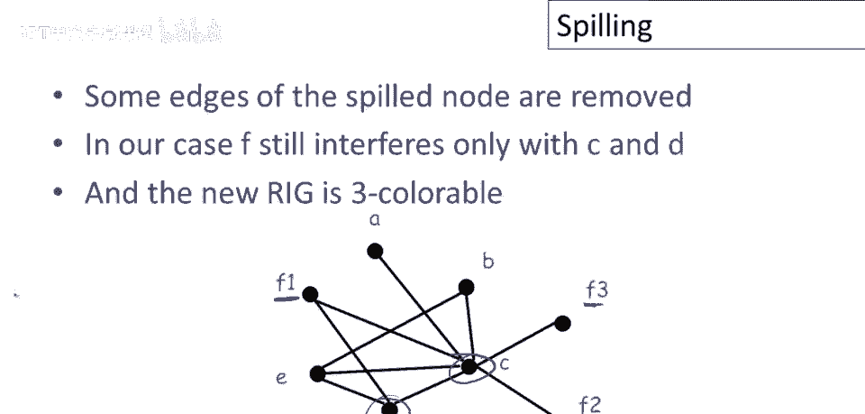
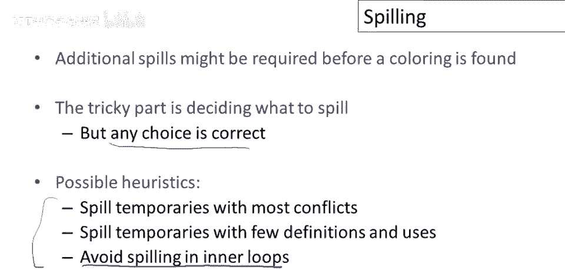
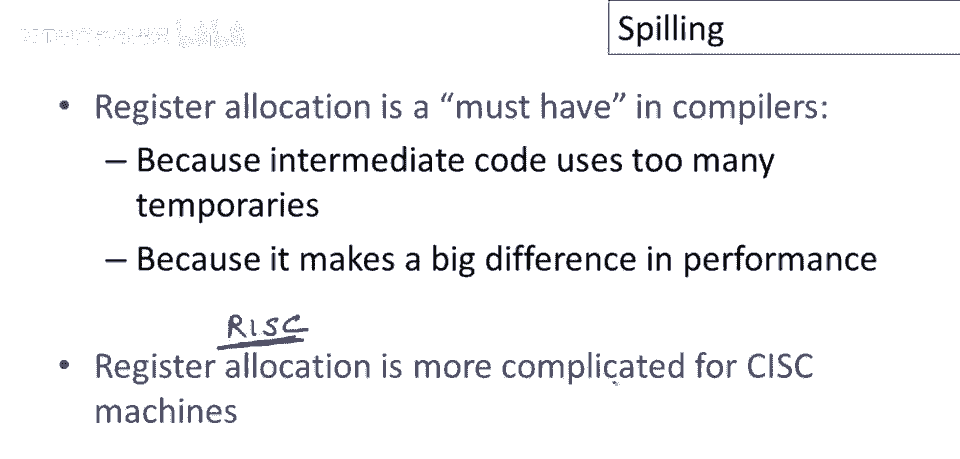

# 课程 P83：寄存器分配中的溢出处理 🎨

在本节课中，我们将要学习当寄存器分配中的图着色算法失败时，如何通过“溢出”操作将临时变量存储到内存中，并修改程序代码以完成分配。

上一节我们介绍了图着色寄存器分配的基本启发式方法。本节中我们来看看当图无法成功着色时，我们该如何处理。

## 溢出操作概述 💡

图着色启发式算法并不总能成功为任意图着色。当算法陷入困境，无法找到着色方案时，意味着需要分配的临时变量数量超过了可用寄存器的容量。此时，我们必须将一些临时变量“溢出”到内存中。内存是我们除寄存器外唯一的其他存储位置。

## 图着色失败的情形 🔍

图着色启发式算法唯一无法进展的情况是：图中所有节点的邻居数量都大于或等于可用寄存器数量 `k`。

让我们通过一个熟悉的寄存器冲突图示例来说明。假设目标机器只有三个寄存器（`k=3`），我们需要为该图寻找三色着色方案。

应用启发式算法，我们尝试移除节点 `a`。然而，移除 `a` 及其边后，图中剩余的所有节点都至少有3个邻居。这意味着没有节点可以安全移除，以确保后续能找到着色方案，算法因此卡住。

## 选择并移除溢出候选节点 🎯

在这种情况下，我们需要选择一个节点作为“溢出”候选。这意味着该临时变量可能被分配到内存而非寄存器。有多种方法选择特定的溢出节点，为示例说明，我们假设选择节点 `f`。

我们将从图中移除节点 `f`，然后继续简化图。移除 `f` 后，图中出现邻居数少于3的节点（例如 `b` 和 `d`），简化过程得以继续，并最终成功找到着色顺序。

## 乐观着色尝试 ✨

在决定溢出 `f` 并成功为子图着色后，我们必须尝试为 `f` 本身分配颜色。有时我们可能很幸运：即使 `f` 有 `k` 个或更多邻居，但在子图着色后，这些邻居可能并未占用所有寄存器，从而有剩余寄存器可分配给 `f`。这称为“乐观着色”。

让我们将 `f` 加回图中，检查其邻居的着色情况。假设其邻居分别占用了寄存器 `R1`、`R2`、`R3`，即所有三个可用寄存器。在这种情况下，乐观着色失败，`f` 确实没有可用的寄存器。

## 实际溢出与代码修改 🔄

当乐观着色失败时，我们必须实际执行溢出操作。我们将为 `f` 在内存中（通常是当前堆栈帧）分配一个地址，记作 `A`。接着，我们需要修改控制流图（即正在编译的代码）：

*   在每次读取 `f` 的操作之前，插入一条**加载指令**，将 `f` 的当前值从地址 `A` 加载到一个新的临时变量中。
*   在每次写入 `f` 的操作之后，插入一条**存储指令**，将 `f` 的当前值保存回地址 `A`。

以下是修改代码的示例。原始代码中对 `f` 有多次引用：

修改后的代码为每次 `f` 的使用创建了新的临时名称（`f1`， `f2`， `f3`），并插入了相应的加载和存储指令：

## 重建活跃信息与干扰图 📊

修改代码后，程序不再使用原始变量 `f`，而是使用了新的临时变量 `f1`， `f2`， `f3`。因此，我们必须：
1.  删除所有关于 `f` 的旧活跃信息。
2.  为 `f1`， `f2`， `f3` 计算新的活跃信息。
3.  基于新的活跃信息，**重新构建寄存器干扰图**。

这种修改带来了关键好处：
*   **生命周期缩短**：每个新的 `fi` 只在其加载指令和下一次使用之间（或计算指令和存储指令之间）存活，生命周期大大减少。
*   **干扰减少**：由于生命周期缩短，每个 `fi` 在图中冲突的邻居数量比原来的 `f` 要少。
*   **解耦使用**：将 `f` 拆分为多个独立变量，避免了不同使用点之间不必要的干扰。

在新的干扰图中，`f1`， `f2`， `f3` 可能只与少数变量（如 `a` 和 `c`）冲突，从而使得新图能够用三种颜色成功着色。

## 如何选择溢出变量？ 🤔

一次溢出可能不足以解决问题，我们可能需要溢出多个临时变量。选择溢出哪个变量是一个性能优化问题，任何选择都能产生正确代码。以下是常用的启发式方法：

以下是选择溢出候选变量的常见启发式方法：
1.  **溢出冲突最多的变量**：移除该变量能最大程度地减少图中的边数，可能使图变得可着色。
2.  **溢出定义和使用较少的变量**：这样的变量插入的加载/存储指令较少，性能开销相对较小。
3.  **避免溢出最内层循环使用的变量**：向内层循环添加额外指令的代价很高，应优先选择溢出在循环外使用的变量。

## 总结与拓展 🏁

本节课中我们一起学习了寄存器分配中溢出处理的全过程。当图着色失败时，我们通过选择候选变量、尝试乐观着色、实际溢出并修改代码、最后重新计算活跃信息和干扰图来解决问题。溢出操作通过缩短变量生命周期和分离不同使用点来降低图的复杂度，使其最终可着色。

寄存器分配是现代编译器后端至关重要的一步，它使得中间代码可以自由使用大量临时变量，同时高效利用有限的物理寄存器资源，从而生成高性能的目标代码。

**核心公式与概念总结**：
*   **溢出条件**：当图中所有节点度数 >= `k`（寄存器数量）时。
*   **代码修改**：对溢出变量 `v`，在每次使用前插入 `v_new = load [A]`，在每次定义后插入 `store v_new， [A]`。
*   **关键效果**：溢出操作将长生命周期的变量 `v` 拆分为多个短生命周期的 `v_i`，从而减少寄存器干扰。

> 注：本节描述的算法主要针对RISC（精简指令集）架构。对于CISC（复杂指令集）架构，由于寄存器使用存在更多限制（如专用寄存器、不同尺寸等），需要在此基础上进行适配，但图着色的核心思想保持不变。