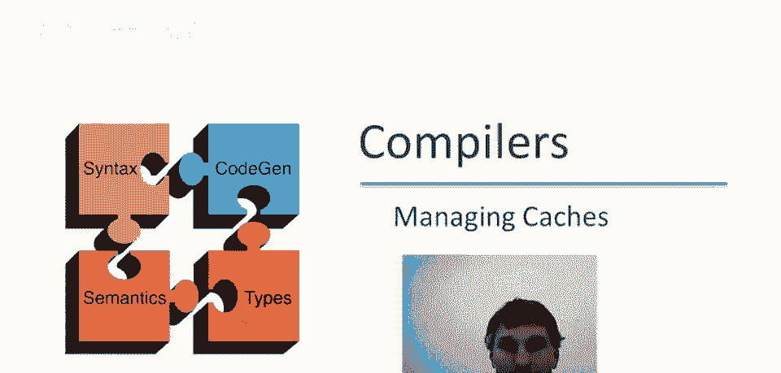
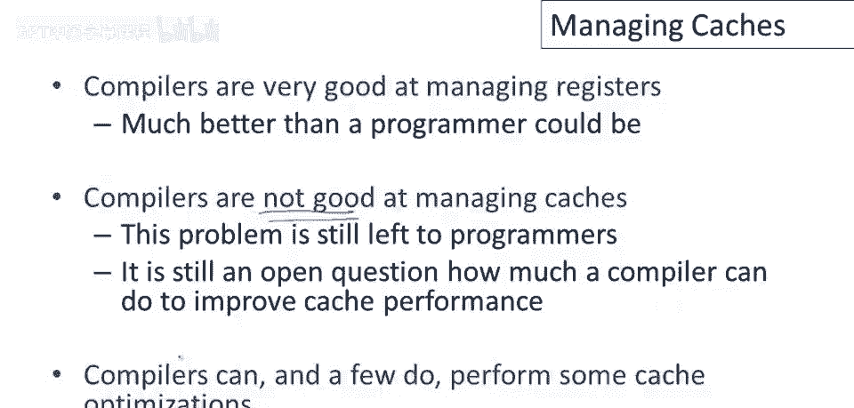
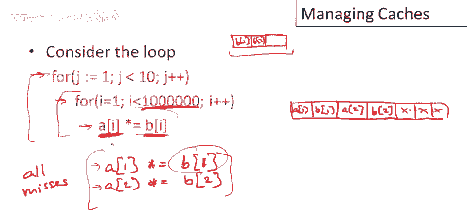
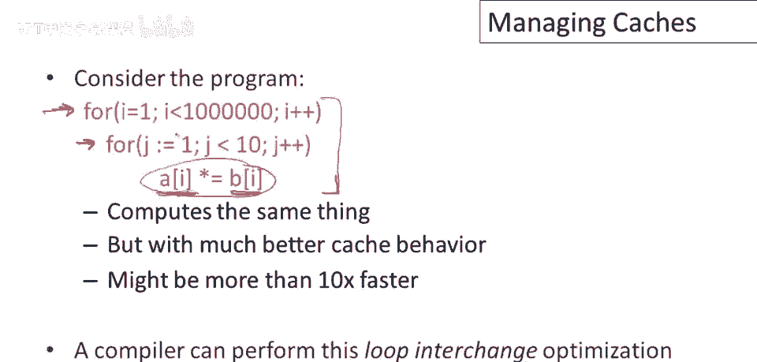

# 课程 P84：缓存管理 🧠



## 概述

在本节课中，我们将要学习计算机系统中一个至关重要的资源——缓存。我们将探讨现代计算机的内存层次结构，理解缓存未命中的高昂代价，并分析编译器在管理缓存方面的能力与局限。最后，我们将通过一个具体的代码示例，学习如何通过改变代码结构（如循环交换）来显著提升程序的缓存性能。

---

## 内存层次结构 🗂️

上一节我们提到了管理寄存器，本节中我们来看看另一项重要资源——缓存，以及编译器能做什么和不能做什么。

现代计算机系统拥有复杂的内存层次结构。若从离处理器最近的一层开始，会发现芯片上有若干寄存器。这些寄存器的访问速度极快，通常可以在单个时钟周期内完成访问。但问题是，建造如此高性能的内存非常昂贵，因此我们无法拥有很多寄存器。


通常，处理器上总共可用的寄存器容量可能在256字节到8千字节之间。现代处理器芯片的很大一部分面积将用于缓存。缓存性能也非常高，但不如寄存器。平均可能需要3个周期从缓存中获取数据，但你可以得到更多的缓存容量。

现代处理器最多可拥有1兆字节的缓存。离处理器更远的是主内存（DRAM），访问它需要更多时间，代价更高，典型值是20到100个周期。虽然访问慢，但你能得到很大的容量，例如32GB甚至更多。离处理器最远的是典型的硬盘，访问需要极长的时间，达数十万或数百万个周期，但可拥有海量存储，从GB到TB级别。

---

## 缓存的重要性与挑战 ⚡


正如前文所说，寄存器和缓存的大小与速度都有限制，这些限制受功耗等因素制约。因此，人们希望拥有尽可能多、尽可能快的寄存器和缓存，但在做大做快方面存在实际限制。

不幸的是，缓存未命中的代价非常高。如果数据能在几个周期内从缓存中获取，而它不在缓存中，则可能需要几个数量级更长的时间从主内存中取出。因此，人们尝试在处理器和主内存之间构建缓存，以隐藏主内存的延迟，使得大部分数据访问发生在缓存中。

如今，通常需要多级缓存才能很好地匹配快速处理器与庞大主内存之间的速度差异。现代处理器中通常有2级缓存，一些甚至拥有3级缓存。关键在于，为了获得高性能，正确管理这些资源（特别是寄存器和缓存）至关重要。

---



## 编译器在资源管理中的角色 🔧

若要程序性能好，编译器已变得非常擅长管理寄存器。实际上，今天大多数人会同意，对于几乎所有程序，编译器比程序员更擅长管理寄存器。因此，将分配寄存器的任务留给编译器是非常值得的。

然而，编译器并不擅长管理缓存。虽然编译器能做一点优化，但大部分情况下，如果程序员想要获得良好的缓存性能，他们需要了解机器上缓存的运行行为、了解程序正在做什么、了解编译器能做什么，然后仍需编写有利于缓存友好的程序。这仍是一个开放的研究问题，即编译器能在多大程度上提高缓存性能，尽管我们发现编译器确实能做几件事。

---

## 案例分析：糟糕的缓存性能 ❌

为了具体了解编译器能做到什么，让我们看看以下示例循环。这个循环的缓存性能极差。

```c
for (j = 0; j < 10; j++) {
    for (i = 0; i < N; i++) {
        a[i] = a[i] + b[i];
    }
}
```

在这个循环中，外层循环是 `j`，内层循环是 `i`。每次内层循环都会读取 `b[i]`，进行计算，然后将结果存入 `a[i]`。

这个程序缓存性能会很差。假设缓存按内存块工作，在第一次迭代中，我们会加载 `b[1]` 并存储结果到 `a[1]`，那么 `a[1]` 和 `b[1]` 会被加载到缓存中。在第二次迭代中，我们会加载 `b[2]` 并写入 `a[2]`，那么 `a[2]` 和 `b[2]` 又会被加载到缓存中，以此类推。

重要的是，在循环的每次迭代中，我们引用的都是全新的数组元素。因此，几乎每一次对 `a` 和 `b` 的引用都会导致缓存缺失（假设数据项足够大，占满整个缓存行）。如果循环边界 `N` 非常大（远大于缓存容量），当我们执行到循环末尾时，整个缓存将被来自 `a` 和 `b` 后半部分的值填满。然后，当我们开始外层循环 `j` 的下一次迭代，并再次从 `i=0` 开始时，需要引用的 `a[1]`、`b[1]` 等数据已经不在缓存中了，又会导致缓存缺失。

这个循环的基本问题是，如果数据足够大，几乎每一个内存引用都是缓存缺失，程序将以主内存的访问速度运行，而不是缓存的速度。

---

## 优化方案：循环交换 ✅

现在，让我们考虑相同程序的另一种结构。我们交换内层和外层循环的顺序。

```c
for (i = 0; i < N; i++) {
    for (j = 0; j < 10; j++) {
        a[i] = a[i] + b[i];
    }
}
```



在这里，我们将 `i` 循环放在外层作为外循环，将 `j` 循环放在内层作为内循环。我们所做的是：加载 `b[i]` 并写入 `a[i]`，然后在相同的 `i` 值上将这个计算重复十次。

这种结构将获得出色的缓存性能。对 `a[i]` 和 `b[i]` 的第一次引用将是缓存缺失，但随后的九次引用，数据已经位于缓存中。完成内层循环后，我们再继续处理下一个 `i` 值（即 `a[i+1]` 和 `b[i+1]`）。

这种结构的优点是：它将特定数据项（`a[i]` 和 `b[i]`）带入缓存，然后尽可能多地重复使用该数据，然后再处理下一个数据项。而不是像之前那样，对所有数据项都做一点操作，然后必须重新遍历所有数据项。

这种特定的优化称为**循环交换**。它计算完全相同的结果，但可能拥有超过10倍更好的缓存性能，从而运行得更快。编译器可以进行这种简单的循环交换优化，但通常很难自动判断在何种情况下交换循环顺序是合法的（即不改变程序语义）。因此，通常需要程序员自己识别并实施这种优化以提高性能。

---

## 总结

本节课中，我们一起学习了：
1.  计算机系统的内存层次结构，以及缓存位于处理器和主内存之间，用于隐藏内存延迟。
2.  缓存未命中的代价高昂，因此管理缓存对性能至关重要。
3.  编译器擅长管理寄存器，但在管理缓存方面能力有限。
4.  通过一个具体的双循环例子，我们分析了导致缓存性能低下的代码模式：在循环中频繁跳转访问不同的大数据项。
5.  我们学习了**循环交换**这种优化技术，通过改变循环嵌套顺序，使程序访问模式更符合**时间局部性**原理（重复使用已加载到缓存的数据），从而大幅提升缓存命中率和程序运行速度。



理解缓存的工作原理并编写缓存友好的代码，是进行高性能编程的关键技能之一。