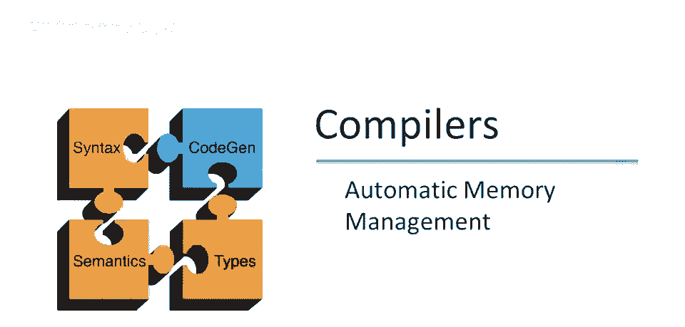

# 课程 P85：自动内存管理概述 🧠


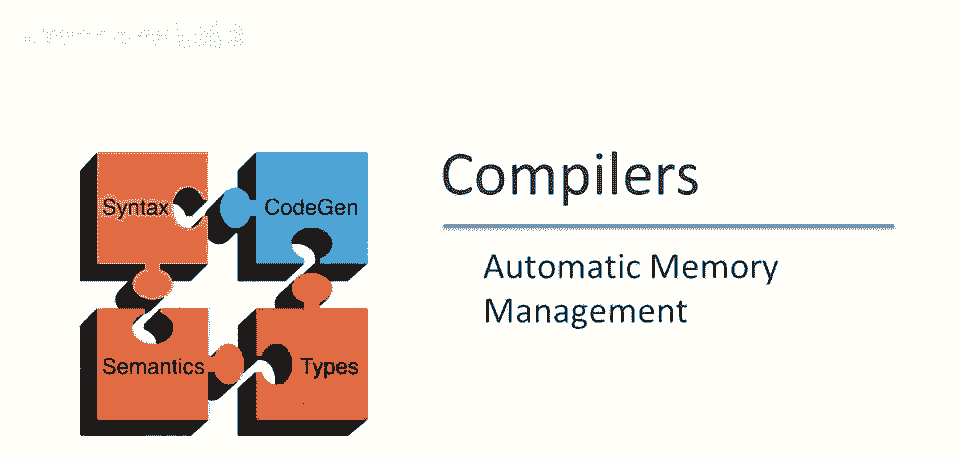

在本节课中，我们将要学习自动内存管理，特别是垃圾回收的基本概念。我们将探讨手动管理内存带来的问题，理解自动内存管理的必要性，并学习如何定义和识别程序中的“可达”与“不可达”对象。

---

## 手动内存管理的问题

上一节我们介绍了本课程的主题。本节中，我们来看看手动管理内存会带来哪些具体问题。

手动管理内存意味着程序员需要负责所有内存的分配和释放。这在C和C++等语言中很常见。这种做法编程困难，容易导致难以消除的程序错误。

以下是手动管理内存时可能出现的几种主要存储错误：

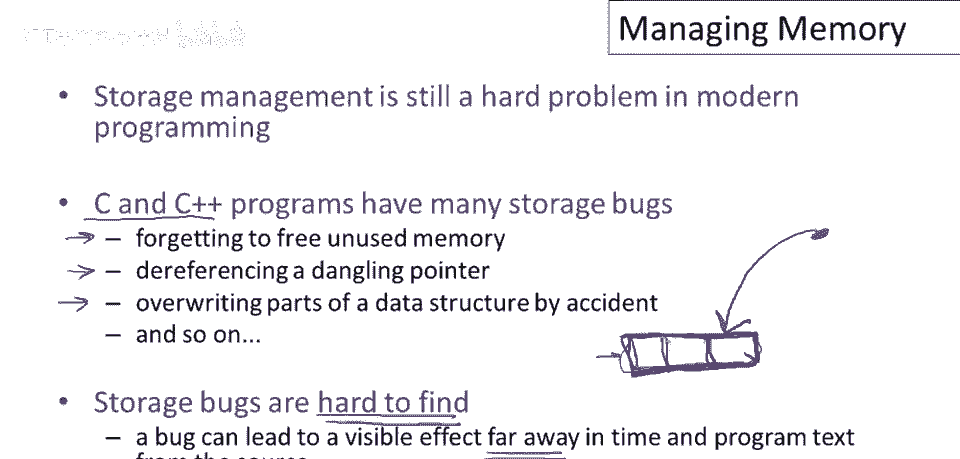

*   **内存泄漏**：忘记释放不再使用的内存。
*   **悬垂指针**：释放内存后，仍有指针指向该无效内存区域。
*   **数据覆盖**：无意中覆盖了数据结构的一部分。

这些错误通常很难发现，因为它们的影响可能在时间和空间上都远离错误源头，并且经常在代码投入生产后很长时间才暴露出来。

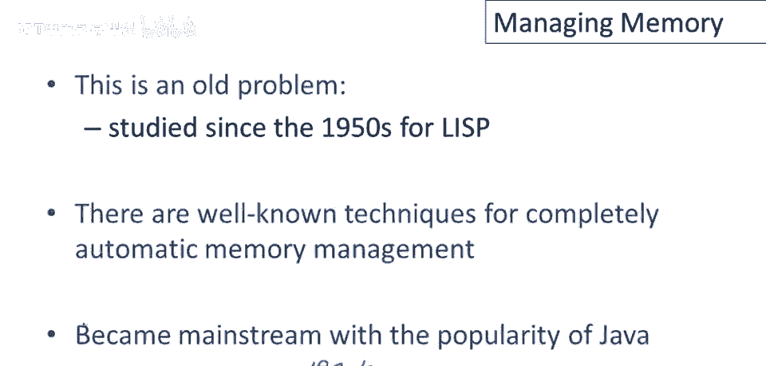

## 自动内存管理的核心思想

了解了手动管理的问题后，我们来看看自动内存管理如何解决它们。自动内存管理的基本策略相当简单。

当一个对象被创建时（例如使用 `new` 关键字），运行时系统会自动找到未使用的内存空间并分配给该对象。

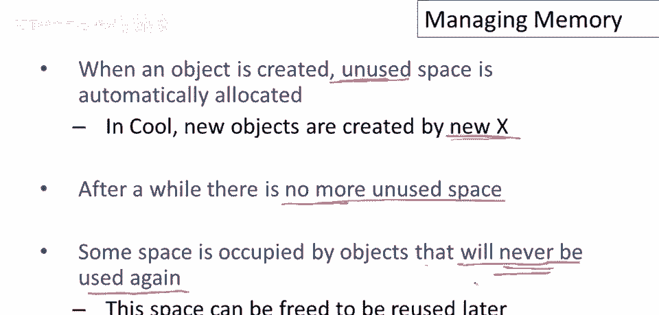

```cpp
// 系统自动分配内存
Object* obj = new Object();
```

重复执行此操作，最终会耗尽可用空间。此时，系统需要回收部分空间以分配新对象。垃圾回收系统基于一个关键观察：部分被占用的空间可能存放着程序**不再使用**的对象。如果我们能找出这些对象，就可以回收并重用它们的内存。

## 如何判断对象不再被使用？

那么，核心问题来了：我们如何知道一个对象将不再被使用？目前大多数垃圾收集技术都基于以下观察：**程序只能使用它能“找到”的对象。**

让我们通过一段伪代码来理解：

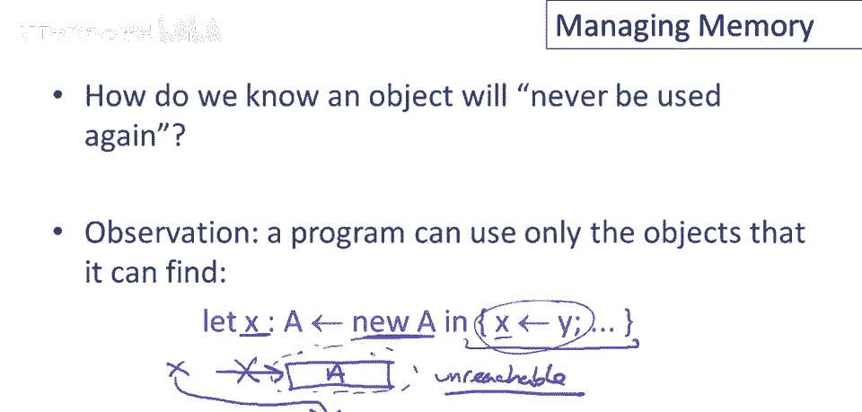

```cpp
let x = new A(); // 分配对象a，x指向它
x = y;           // 将x指向y所指向的对象
```

执行这段代码后，最初创建的对象 `a` 变得**不可达**，因为程序中没有任何变量或数据结构指向它。既然程序无法找到它，未来也绝不可能再使用它，其占用的空间就可以被回收。

## 可达性的正式定义

实际上，我们需要一个比上例更广义的对象“可达性”定义。

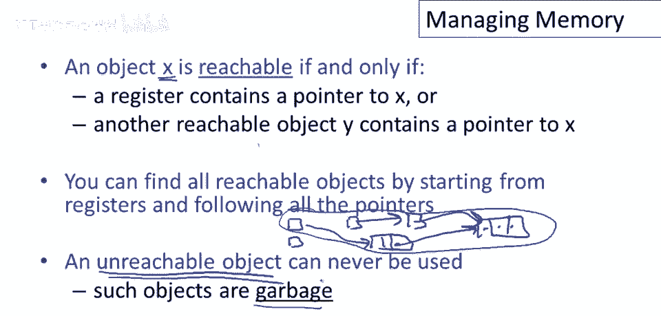

**对象x是可达的，当且仅当满足以下条件之一：**
1.  某个寄存器（包含局部变量等程序可直接访问的值）持有指向x的指针。
2.  存在另一个可达对象y，且y包含指向x的指针。

这意味着，可达对象的集合是从所有寄存器（称为“根”）开始，递归地跟随所有指针所能触及的**所有对象**。这个集合的补集，即那些无法通过此过程触及的对象，就是“不可达”对象，也就是垃圾。

## 可达性是一种近似

值得注意的是，可达性是对“未来不再使用的对象”的一种**近似**判断。

如果一个对象不可达，它**肯定**不会再被使用。然而，仅仅因为一个对象是可达的，并**不意味着**它将来一定会被再次使用。有些可达对象可能在程序的后续执行中永远不会被访问，但由于编译器或运行时无法精确预知程序的所有执行路径，它们仍会被视为“存活”而无法被回收。

## 在Cool语言中的垃圾收集

现在让我们谈谈在Cool语言中如何进行垃圾收集。Cool语言的结构相对简单。

垃圾收集器需要从一组“根”开始跟踪所有可达对象。在Cool中，“根”包括：
*   **累加器**：通常指向当前操作的对象。
*   **栈**：每个栈帧中可能包含指向对象的指针（如方法参数）。

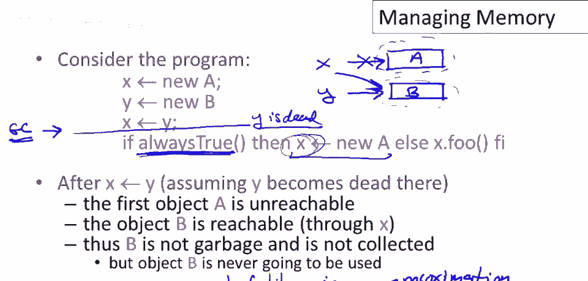

编译器必须为每种方法的激活记录（栈帧）布局保留信息，以便垃圾收集器在运行时能识别帧中的哪些位置存储的是对象指针，哪些是非指针数据（如返回地址）。

## 垃圾收集过程示例

在Cool中，垃圾收集的过程可以概括如下：

我们从累加器和栈指针这些“根”开始。遍历从这些根出发所有能通过指针链访问到的对象，并将它们标记为“可达”。

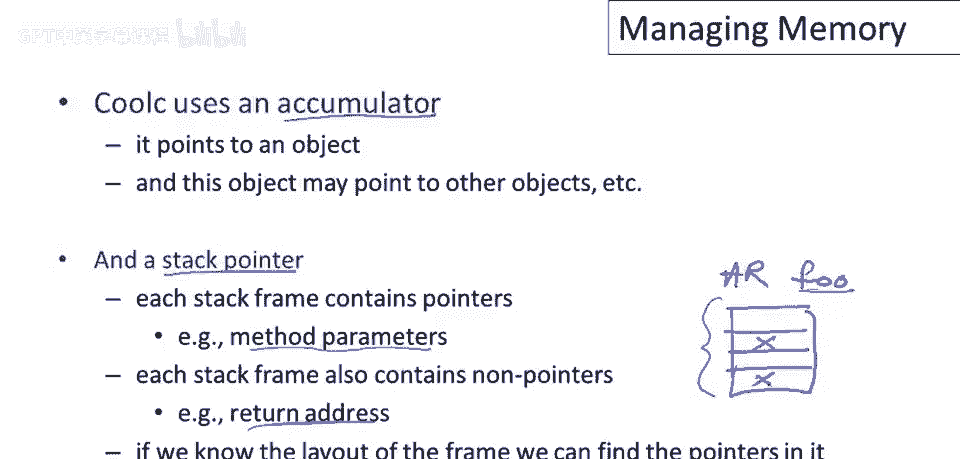

未被标记的对象，即使它们内部可能互相指向（例如，一个不可达对象指向另一个不可达对象），也属于“不可达”集合。这些对象的内存可以被安全地回收和再利用。

## 垃圾收集的基本步骤

以下是垃圾收集方案的基本步骤：

1.  **按需分配**：为新对象分配空间。
2.  **持续分配**：只要还有空闲空间，就继续分配。
3.  **触发回收**：当空闲空间耗尽或根据特定策略需要时，触发垃圾回收。
4.  **标记可达**：通过跟踪从根寄存器集合出发的所有指针，找出所有可达对象。
5.  **释放内存**：释放那些不在可达集合中的对象（即不可达对象）所占用的内存。

有些策略会在空间完全耗尽之前就主动进行垃圾回收，我们将在后续视频中探讨其中之一。

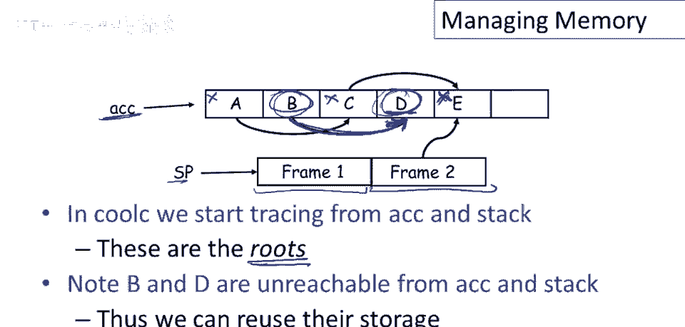

---

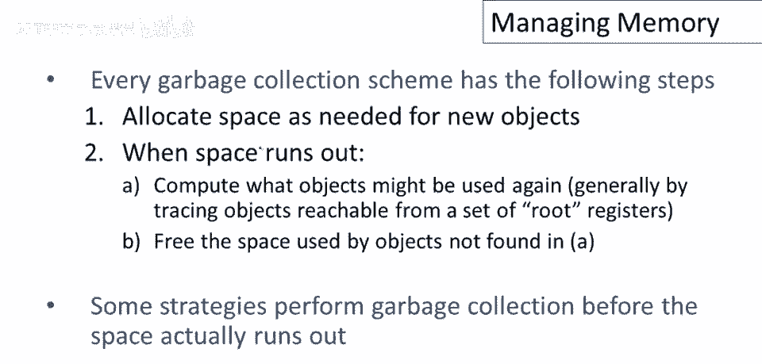

## 总结

本节课中我们一起学习了自动内存管理的基础知识。我们了解了手动内存管理的弊端，认识了自动内存管理和垃圾回收的核心思想——通过判断对象的“可达性”来识别垃圾。我们学习了可达性的正式定义，并认识到它是对程序未来行为的一种安全近似。最后，我们概述了在Cool语言中实施垃圾收集的基本框架和步骤。在接下来的课程中，我们将深入探讨具体的垃圾回收算法。