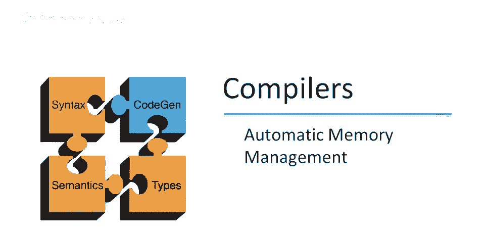
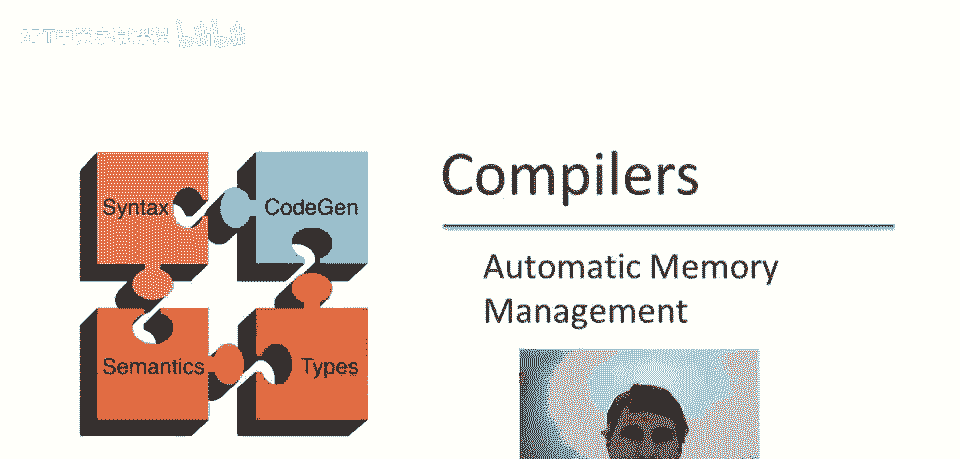
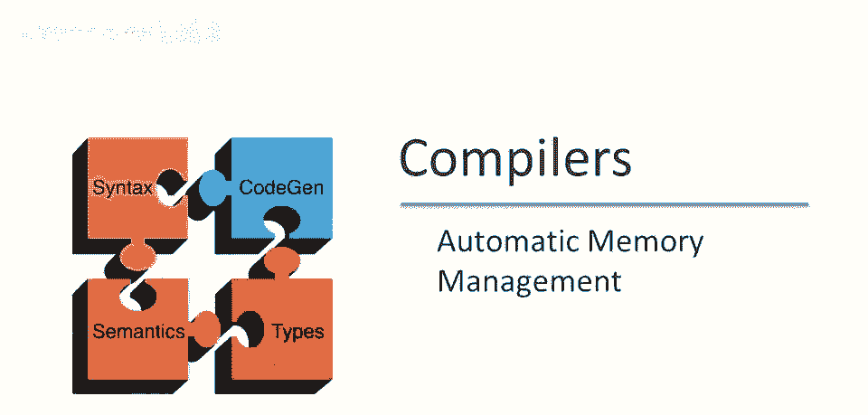
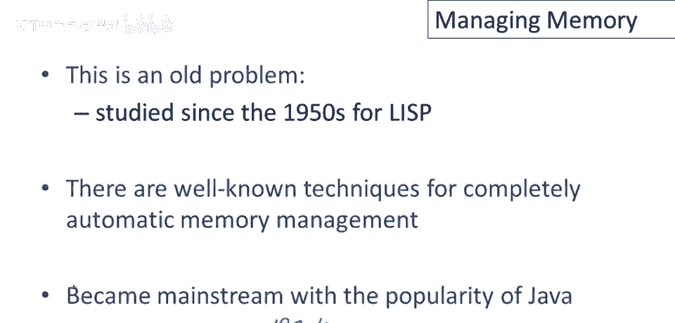
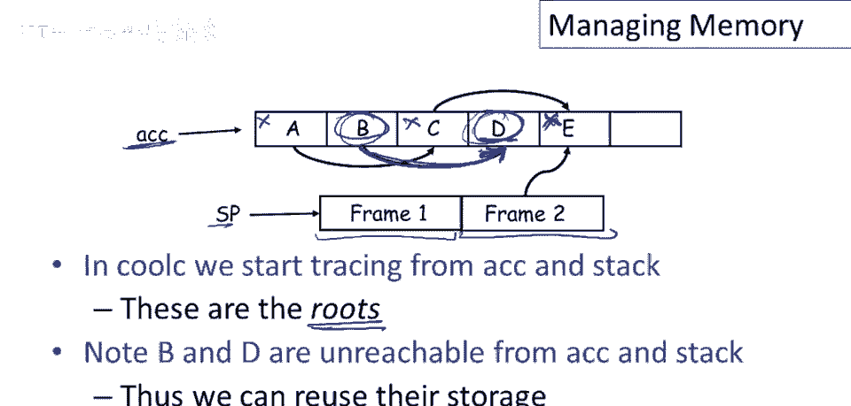

# P85：p85 17-01-_Automatic_Memory - 加加zero - BV1Mb42177J7

本视频将讨论垃圾回收，需要几段视频讲解，本段为问题概述，后续视频将讨论具体技术。

为铺垫，先讨论要解决的问题，若手动管理内存，意味着所有分配和释放需手动完成，编程困难，易导致难以消除的程序错误，如今主要见于C和C++程序，这些是主要使用，手动内存管理的语言，因手动管理内存。

可能出现的存储错误，如忘记释放未用内存，导致内存泄漏，引用，悬垂指针，无意覆盖数据结构部分，实际上还有更多问题，尽管这些可能是最常见的，这些错误很难发现，强调这些错误通常是，复杂系统中最后发现的。

它们经常存在于生产中，有时甚至在代码投入生产后很长时间，使用和原因，存储错误通常影响远离源的时间空间，如何发生？考虑内存中的某个对象，假设它有一些字段，假设有几个字段，我保留了一些指针指向它。

程序中某个地方有对该对象的引用，现在我释放它，我手动管理内存，释放该对象，但我忘了有这个指针，现在发生了什么，该存储已被释放，不再是有效内存，但指针仍指向它，然后当我分配其他东西时。

可能会分配同一块内存，这可能是另一种对象，好的，这里可能不同类型，甚至这块内存可能用于完全不同的事情，现在我有一个指针说它认为它是一个红色对象，它指向一个蓝色物体，当我进来写入这个对象时。

当然我写的都是废话，所以这无论哪段代码持有这个指针，都认为它还是旧类型的对象，它会在这里写入一些位，当我进入程序的其他部分，可能在很远的地方并读取出来，这是一个蓝色物体，我将得到一些随机垃圾。

这可能会导致程序崩溃。

这是一个非常古老的问题，自20世纪50年代以来一直在研究，我是在Lisp中首次认真考虑的，有一些众所周知的完全自动内存管理技术，因此，您不必自己管理内存，这只是在20世纪90年代才成为主流，实际上。

在Java流行之前，当时没有主流语言使用自动内存管理，因此，在那之前，没有主流语言使用自动内存管理，所以现在仅剩最后一步，近二十年来，垃圾收集和自动管理已成为主流编程技术。

自动内存管理的基策略相当简单，当一个对象被创建时，当我们分配一个新对象时，系统，运行时系统将找到未使用的空间分配给该对象，它将直接分配它，因此，当你使用'new'和某个类名时，系统将自动分配一些内存。

系统自动分配未用内存，重复多次同样操作，不久将用完空间，最终无剩余未用空间，最终需采取措施，需回收部分空间分配更多对象，垃圾回收系统依赖观察，部分使用空间可能被不再使用的对象占用，它们。

这些对象不会被程序再次引用，如果我们能找出，那些是，哪些不再使用的物体，然后我们可以定位它们并重新利用空间。

所以大问题来了，我们如何知道一个物体将不再被使用，目前大多数垃圾收集技术都基于以下观察，程序只能使用它能找到的物体，我们所说的'它'是什么意思，我将切换颜色，嗯，让我们看看这段代码，那么会发生什么呢。

当我们执行这个时，首先，我们将分配一个a对象，并将其分配给x，因此，x将指向该对象，然后在let的主体中会发生什么呢，我们将把x，分配给y指向的值，所以y是另一个变量，它指向内存中的其他对象，好的。

接下来会发生什么，现在x将指向这个对象，现在注意，这个对象a不可达，意味着它没有引用，不再有任何指针指向它，我怎么知道这一点呢？因为它在这里是全新的，当它被创建时，我只创建了一个指针指向它x。

然后我立即将x赋给了其他东西，所以我丢失了唯一的指针，程序中没有对a的任何引用，因此程序将永远无法找到它，如果程序，如果程序中没有变量或数据结构指向a，那么a将永远无法被程序引用，在未来，在未来。

后续程序执行无指针指向，因此将不再使用a，空间可回收用于其他对象。

实际上需要更广义对象可达性定义，而非示例所示，让我们看看，对象x可达，当且仅当以下之一为真，要么寄存器含x指针，要么x可立即从某寄存器访问，记住寄存器包含局部变量等，它们只是，你知道。

程序可立即访问的值，或另一个可访问对象y包含指向x的指针，这说明了什么，嗯，这意味着你将从寄存器开始，所以程序可能使用几个寄存器，然后你会查看那些寄存器指向的所有东西，它们指向的所有对象。

你会查看这些对象中的指针和它们能指向的所有内容，好的，其中一些可能会重叠，我的意思是，其中可能有一些可以通过多个路径到达的东西，从寄存器开始，你可以到达的完整集合，从寄存器开始，跟随所有可能的指针。

这些都是可达对象，然后该集合的补集，不可达对象，即不可触及之物，其余所有对象，那些你无法通过递归，从寄存器开始并跟随指针，所能触及的，那些对象永远无法使用，显然实现只能通过寄存器访问，然后仅能通过。

你知道的，从寄存器可触及的对象中加载指针，凡不能通过步骤触及，将不再使用，是垃圾。

让我们看另一个例子，展示可达性和自动内存管理的有趣方面，例子首先做什么？它在堆上分配一个a对象，并将其赋给变量x，所以x是指向该对象的指针，然后它分配一个b对象，y将指向该对象，然后将y的值赋给x。

我们有这个配置，现在，嗯，让我们，嗯，在这里画条线，好的，我们稍后会回来，记住这个时间点，这个时间点事物看起来如何，然后我们会离开，我们将执行这个条件，知道条件会做什么，它总是为真，好吧。

因此谓词始终为真，因此它永远不会走假分支，它将永远只走真分支，那它将做什么，它将立即覆盖x，因此x最终将指向，另一个新对象，无论它是什么，现在让我们说在这一点，在这里我们尝试进行垃圾回收，所以你知道。

出于某种原因，程序在此停止，尝试回收未用内存，它能收集什么，就像以前一样，因为到这一点的例子本质上相同，嗯，我们可以看到此对象不可达，好的，因此，第一个a对象在那时变得不可达，现在可以收集。

第二个对象呢，嗯，它是可达的，显然可达，可通过x到达，好的，在这一点上，它也可以通过y到达，所以它不是垃圾，不会被收集，但请注意，x的值总是会被覆盖，好的，因此，程序，编译器不知道这个分支总是为真。

所以它没有意识到x在此处的值，将永远不会再次被使用，但该值每次我们采取这个条件时都会被立即覆盖，此外，如果y在程序的其他地方不被使用，如果y在此处已死，假设y在这里死了。

那么对b的这两个引用将永远不会被触及，实际上，b的值将永远不会再次被使用，尽管它是可达的，这告诉你可达性是一个近似值，我的意思是，它是一个永远不会再次被使用的对象的近似值，我们真正感兴趣的是。

当我们做垃圾收集时，是收集未来执行程序时将不会被使用的对象，因为显然，这个空间被浪费了，可以用于其他可能更好的用途，可达性近似于此，如果一个对象不可达，它肯定不会再被使用，然而。

仅仅因为一个对象是可达的，并不意味着它将被再次使用。

所以现在让我们谈谈如何在酷C中做垃圾收集，酷C有一个相当简单的结构，它使用一个累加器和，它指向一个对象，当然，指向一个对象，该对象可能指向其他对象等等，因此，我们必须跟踪从累加器可达的所有对象。

但我们也要担心堆指针，栈上也有可访问的东西，每个栈帧，当然，可能包含像这样的指针，和，例如，存储在栈上的方法参数，每个栈帧也可能包含一些非指针，好吧，所以如果我想激活记录的布局。

现在将有一些指针和非指针的混合，比如返回地址，所以我们必须知道帧的布局，但如果我们知道布局，当然编译器决定布局，所以它自然地知道布局，它可以找到帧中的所有指针。

所以本质上编译器必须为每种激活记录保持记录，它为每个方法构建，所以如果你有一个方法Foo的激活记录，假设该激活记录有四个插槽，那么编译器需要跟踪哪些是对象指针。

也许帧的第二和第四个元素总是指向对象的指针，其他两个总是非指针，所以编译器必须在某个地方跟踪这些信息，以便垃圾收集器在运行时知道，当它查看Foo的激活记录时，需要跟随的指针在哪里。

所以在Cool See中，我们从累加器和栈开始跟踪，这些被称为根，好的，在垃圾收集术语中，根是从您开始跟踪所有可达对象的所有寄存器，如果我们这样做，所以你可以看到，我们这里有我们的对象。

这里我们有累加器，对不起，还有我们的栈指针，所以我们可以简单地浏览这个内存的小图表并找到所有可达的对象，累加器指向对象a，所以我们将它标记为可达，A指向C，所以我们将它标记为可达，C指向E。

所以我们将它标记为可达，栈指针有几个帧，第一个帧没有指针，第二个帧指向E，我们已触及那个，它已被标记，因此可再次标记，但没关系，只要有人标记，现在未标记的皆不可达，我们遍历可达对象时未触及哪些对象。

它们是对象b和d，因此是不可达对象，它们可被回收，存储可再利用，注意，一个对象有指针指向，并不意味着它可达，注意这里对象d指向它，好的，但对象d不可达，为什么？因为指向它的指针，都来自其他不可达对象。

所以重要的是要知道，并非所有不可达对象都没有指针，将会有一些不可达对象，或可能有一些不可达对象实际上有指针指向它们。

但它们只会来自其他不可达对象，垃圾收集方案如下步骤，按需为新对象分配空间。

只要还有空间，就继续分配新空间，或当我们需要时，当空间用尽时，在需要计算时，哪些对象可能再次被使用，通常通过跟踪从一组根寄存器可达的对象来完成，然后释放该集合的补集，有些策略会在空间耗尽前进行垃圾回收。

我们将在下期视频中查看其中之一。