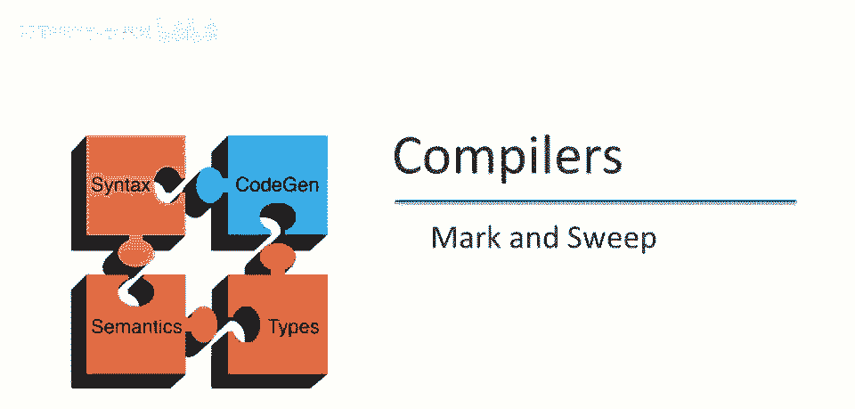
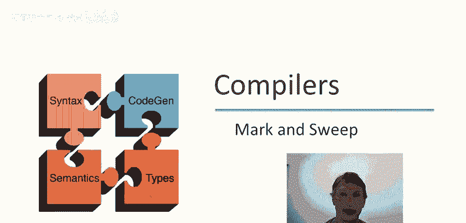
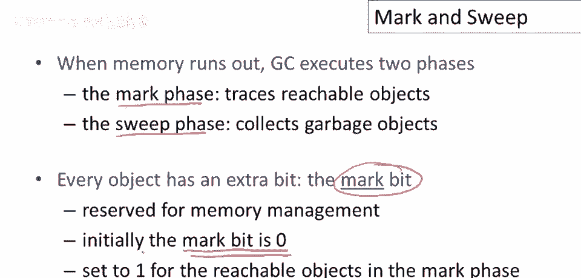
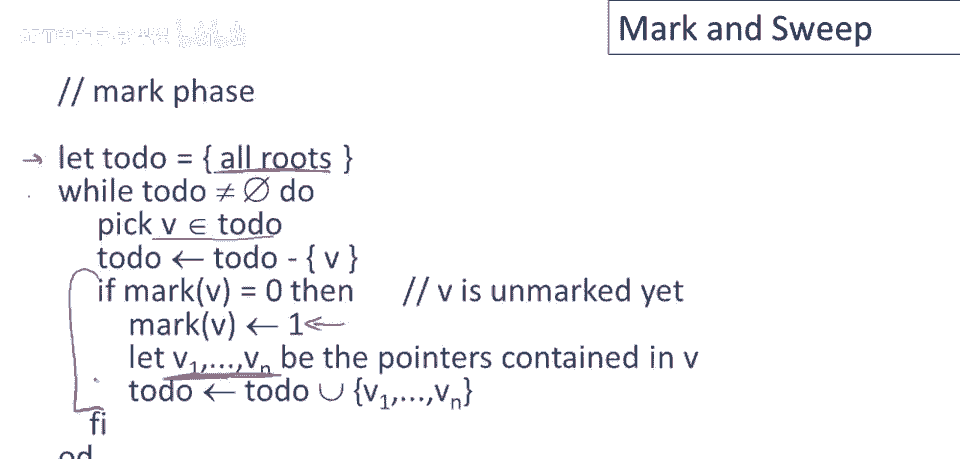
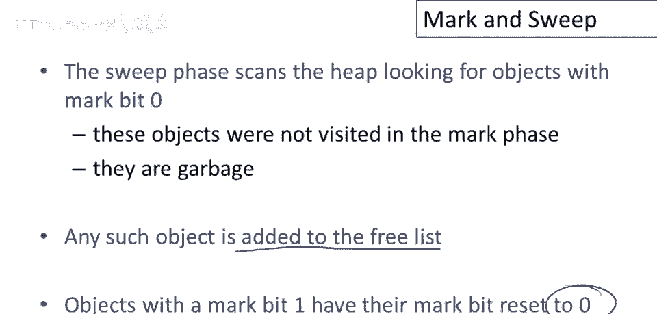
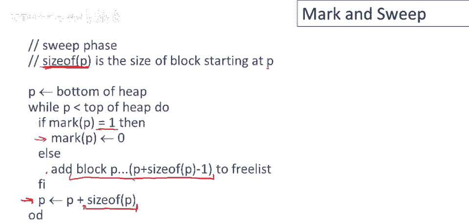
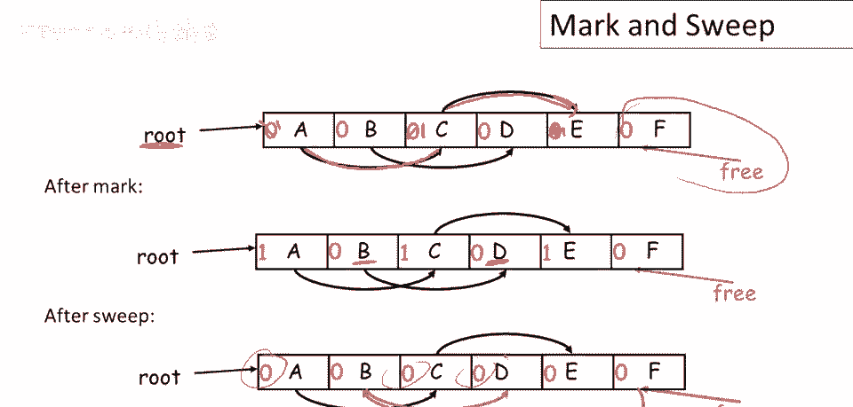
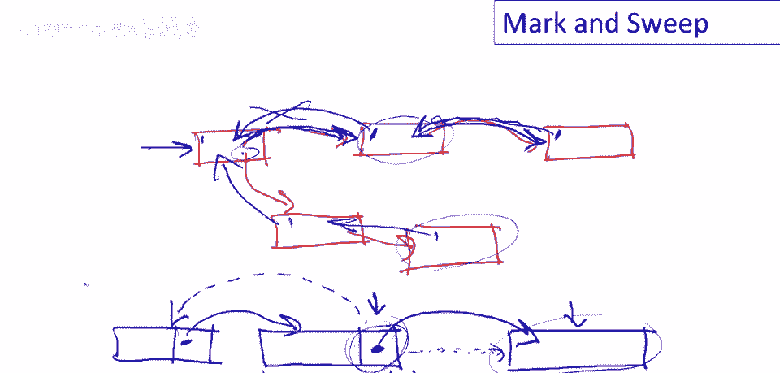
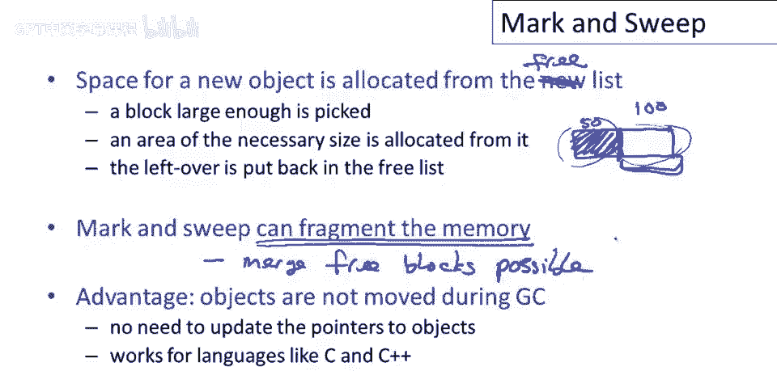

# P86：p86 17-02-_Mark_and_Sweep - 加加zero - BV1Mb42177J7

本视频将讨论，三种垃圾收集技术中的第一种，我们将详细查看，第一种是标记清除。

标记清除分两个阶段，不出所料地称为，标记清除，标记阶段将跟踪所有可达对象，当内存用尽并停止垃圾收集时，我们首先要做的是找出所有可达对象，然后清除阶段将收集所有垃圾对象，为了支持这一点。

每个对象将有一个额外的位，其中某个地方称为标记位，这是为内存管理保留的，除了垃圾收集器外，它不会被任何东西使用，在开始垃圾收集之前，每个对象的标记位始终为零，然后在标记阶段将标记为可达对象的位设置为1。

因此，当我们标记一个对象时，我们用1标记它，这表示该对象可达。

这是标记阶段，它将是一个基于工作列表的算法，因此，我们最初的工作列表包含所有根，即所有初始指针保存在寄存器中，然后，只要工作列表，待办事项列表不为空，我们将执行以下操作。

我们从待办事项列表中取出某个元素v，我们从待办事项列表中删除它，好的，这是算法的核心，如果对象v尚未标记，那么我们将标记它，好的，我们将它的标记位设置为1，然后，我们找到它内部的所有指针。

然后将它们添加到我们的工作列表中，好的，现在，v指向的所有内容都将添加到工作列表中，如果v已经标记，那么我们已经处理过它，并且我们已经将所有它指向的内容添加到工作列表中，那么然后我们什么也不做。

这里没有else分支，我们只是丢弃它，嗯，从待办事项列表中。

因此，一旦我们完成了标记阶段，每个可达对象都被标记，然后甜阶段将扫描堆，寻找标记位为零的对象，甜阶段将遍历所有内存，它将从堆的底部开始，遍历堆中的每个对象并检查其标记位。

所以它找到的所有标记位为零的对象，它们在标记阶段未被访问，显然不可达，所以所有这些对象将被添加到空闲列表，当我们遍历内存时，还有一个重要的细节，任何标记位被设置的对象，它的标记位将被重置为零。

以便为下一次垃圾收集做好准备。

这是清扫阶段的伪代码，这个小函数size_of_p是块的大小，指针p开始的对象的大小，正如您将看到的，这是我们在Cool对象中编码对象大小的原因，记住，在Cool对象的标题中，有一个大小字段。

这是为了垃圾收集器，当它在内存中行走时，可以弄清楚对象的大小，无论如何，我们从堆的底部开始，只要我们还没有到达堆的顶部，我们这样做，我们看看我们指向的地方，然后我们将始终指向一个对象的开始。

所以我们检查该对象的标记位是否为1，如果是，那么它是一个可到达的对象，所以我们只是将其标记位重置为零，否则，如果其标记位为零，那么我们将该块内存，即对象的大小添加到空闲列表，好吧，并将其添加到空闲列表。

最后，在任何情况下，好吧，我们将p递增为其指向的对象的大小，所以我们指向下一个对象，我们将重复该循环一遍又一遍，嗯，重置被触及的东西的标记位，并将未被触及的东西添加到空闲列表。

直到我们触摸了堆中的每个对象。

这里有一个小例子，所以我们现在从这里开始有一个堆，我们将假设只有一根根简单起见，这里是所有对象，初始标记位为0，我们有空闲列表，这里是初始空闲列表，注意，你知道有一些内存在空闲列表上，好的。

标记阶段后发生了什么？我们遍历了所有可达对象，我们从A开始，当然，我们将其标记位设为1，然后跟随从A可达的指针设置标记，但跟随从C可达的指针，设置那里的标记位，因此我们最终得到一个，C和E被标记。

其他什么都没标记，好的，现在甜蜜阶段将遍历，内存将重置所有标记位，呃，为零，并在发现不可达对象时，例如，B和D，将其添加到空闲列表，因此最终空闲列表将是什么？将是一个内存块链表，可供未来分配。

现在，这个算法非常简单，概念上我认为它是，它非常清楚如何工作，但有一些棘手的细节，这是自动内存管理算法非常典型的，并且标记阶段实际上有一个严重问题，这也是垃圾收集算法非常典型的，现在请注意。

我们仅在用完空间时运行此算法，好的，整个目的是我们正在垃圾收集，因为已经没有系统内存可用于分配新对象，并且我们有一个待办事项列表，好的，请注意待办事项列表的大小没有限制，没有关于我们将有多少元素的保证。

在待办事项列表上，我认为很容易看出该数据结构实际上可能相当大，正确，因此我们不能为待办事项列表分配固定数量的内存，或保留一些恒定的空间，但我们需要处理的事实是，当我们开始进行垃圾收集时。

实际上没有任何空间，现在有一种技巧可以在标记阶段维护待办事项列表，而无需使用任何额外存储，那就是执行所谓的指针反转，因此，当指针被跟随时，它将反转以指向其父。

这将使我们实际上能够跟踪堆中哪些元素或哪些对象，仍然需要处理而无需使用任何额外空间。

如果你不明白这一点，马上举一个例子，还想提第二个问题，你知道自由列表存储在哪，这个更容易看出如何工作，自由列表由内存块组成，用这些块的空间维护自由列表，块内存的第一个词或类似的东西包含块的大小。

第二个词指向列表中的下一个块，类似这样，我们可以使用块本身的空间来维护自由列表，现在回到反转的想法，假设我们有一些对象，我们要跟踪可达性，好的，不能在单独的数据结构中维护待办事项列表，好吧，嗯。

那么我们将如何做到这一点呢，好的，这就是想法，让我改变颜色，我们将进入这里，我们将标记第一个对象，假设这个对象从根部可达，现在这是根，第一个对象，现在我们将跟随这个对象中的指针，假设这是一个。

这是对象中的第一个指针，我们将跟随它，然后我们将反转它，我们将让它指向父节点，所以现在我们将标记这个对象，然后我们将跟随这个对象中的指针，好的，当我们向下走时，这个指针将指向回，然后我们将标记这个对象。

现在对象中没有指针了，所以我们需要回到并处理任何未被，在我们已经看到的对象中覆盖的指针，好的，我们如何找到回去的路呢，这就是指针反转的目的，所以我们沿着蓝色箭头回到这里，当我们回来时。

我们将恢复原始指针，我们将删除反转的指针，这个对象中也没有更多的指针了，所以我们将回到上一个对象，当然，这个指针也会消失，我们将恢复原始指针，现在我们在这个对象中，我们看到还有一个未跟进的指针，好的。

然后我们会跟随它并反转它，我们将跟随这个指针并反转它，当我们到达这个对象时，我们将标记这两个对象，我们发现没有其他指针，我们可以使用这些蓝色箭头回溯，当我们向上遍历对象时，我们将恢复红色箭头，本质上。

指针反转的作用是，它帮助我们为图的深度优先搜索维护栈，所以如果你正在对图进行深度优先搜索，并且你想确保覆盖所有可到达的节点，那么你必须能够回溯，反向指针允许我们这样做，关于反向指针还有一个小问题。

注意这里有一点问题，当我谈论反向指针时，让我画两个新对象，只是为了说明这一点，假设我从这个对象指向那个对象，当我跨过指向的对象时，反转这个指针意味着什么，嗯，你知道指针的空间实际上在这个对象中。

目标对象中可能根本没有指针的空间，我即将到达的，实际上会发生的是，假设这是一系列对象的一部分，好的，这个问题很容易解决，问题只是一个偏移量为一的问题，我在对象中有指针的空间，我可以更改那个指针。

我不知道这个对象中是否有任何指针，但假设这是一系列对象的一部分，好的，我沿着这个链走到了这个特定对象，当我跨过到第三个对象时，但我要反转的指针是这个，我会让它指向前一个对象，好的。

然后我会记住这个特定对象，我会将这个特定对象的指针保存在寄存器中，我会将最后遍历的指针保存在寄存器中，我会将来自上一个对象的指针保存在寄存器中，然后当我继续到另一个对象时。

我将使用当前对象中正在遍历的指针，指向前一个对象的父对象，好的，所以只是一个稍微偏移量为一的问题，需要一个寄存器保留上次访问的对象，然后可以反向指针回到父辈和祖辈。

总结标记和清除讨论，从空闲列表分配新对象的空间，那里有个打字错误，我们总是选择一块，总是从空闲列表中选择一块，足够大以容纳要分配的对象，从该块中分配所需大小的区域，剩余部分放回空闲列表。

假设空闲列表有一个块，说它有100字节，然后我们需要一个50字节的物体，所以会发生的是这个块将被分割，我们使用第一个一半，第一个50个用于对象，然后这部分剩余的放回空闲列表，那种策略的结果是。

我们必须找到足够大的块，但可能不会使用整个块，标记和清除会碎片化内存，我们可能会留下很多小块剩余内存，可能没有足够大的块来实际持有对象，这些块，这些小块可能散布在各个地方，因此实际上对于标记和清除来说。

也，嗯，合并块是可能的，因此，我们需要在可能的情况下合并空闲块，因此，当清除阶段处理空闲列表时，它需要识别何时有两个相邻的内存块，它们在内存中是立即相邻的。

所以如果我有两个连续的块，我真正想要做的是将它们合并成一个大的块，并在空闲列表中只保留一个条目，以对抗内存碎片化，现在一个很大的优势，也许是最大的优势是标记和清除，在垃圾收集期间对象不会被移动。

这意味着我不需要更新指向对象的指针，对象保持不动，它们不会作为垃圾收集的一部分移动，这意味着，实际上有可能为像C和C这样的语言适应标记和清除，加加，所以在C和C加加中指针暴露给程序员。

所以程序员可以操作指针和测试指针，在C和C加加中不能移动对象，因为你知道指针是它们的语义的一部分，指针地址，我应该说，是它们语义的一部分，人们实际上已做到，或者你知道，C和C++的标记清除垃圾收集变种。

正是因为对象不会移动。