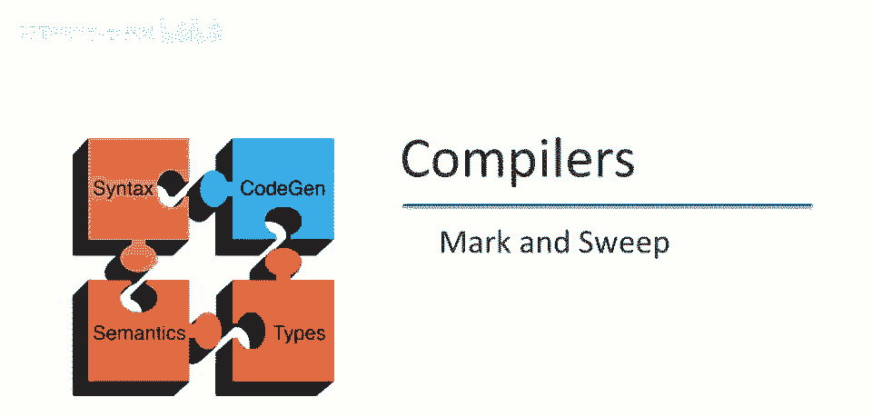

# 课程 P86：垃圾收集技术（一）——标记清除算法 🧹

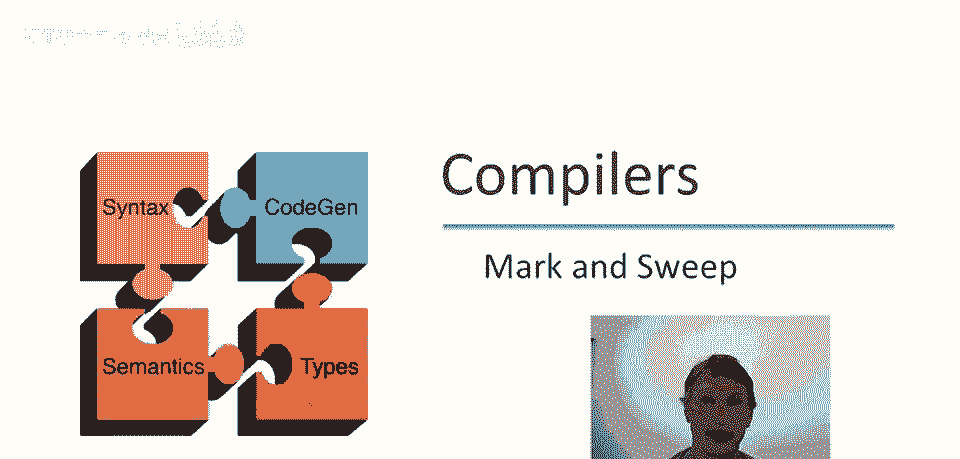

在本节课中，我们将要学习三种垃圾收集技术中的第一种：**标记清除算法**。我们将详细查看其工作原理、执行阶段以及实现时需要注意的细节。

---

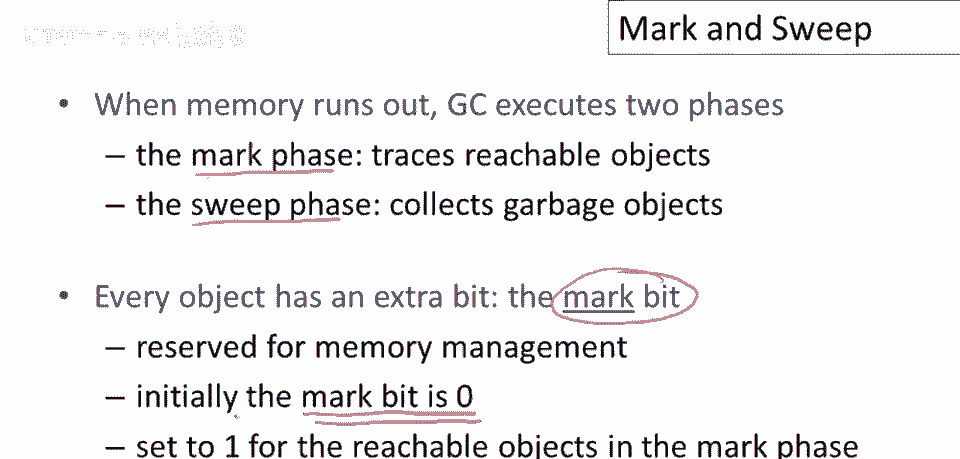

## 概述 📋

标记清除算法是一种经典的自动内存管理技术，用于回收程序中不再使用的内存（即“垃圾”）。它主要分为两个阶段：**标记阶段**和**清除阶段**。该算法通过追踪所有可达对象来识别垃圾，然后回收这些垃圾对象占用的内存。

---

## 标记清除的两个阶段

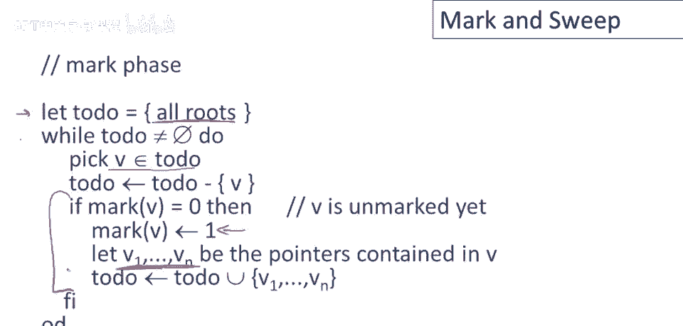

上一节我们介绍了算法的整体概念，本节中我们来看看它的两个核心阶段是如何工作的。

### 1. 标记阶段 🎯

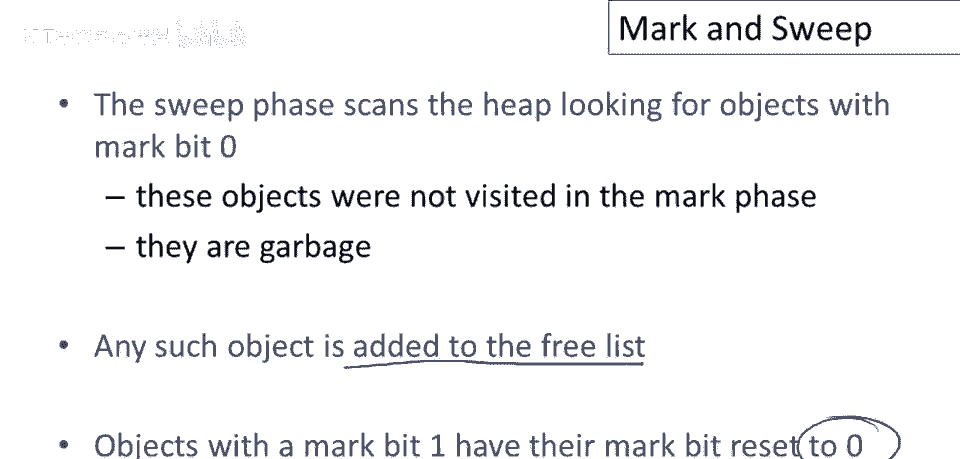

标记阶段的目标是找出堆中所有**可达对象**。为了支持这一点，每个对象都带有一个额外的**标记位**，该位专为垃圾收集器保留，程序本身不会使用。

在开始垃圾收集前，所有对象的标记位被初始化为 `0`。标记阶段会遍历所有从“根”（如寄存器中的指针）开始的可达对象，并将其标记位设置为 `1`。

以下是标记阶段基于工作列表的算法核心步骤：

1.  初始化一个工作列表，其中包含所有根指针。
2.  只要工作列表不为空，就重复以下步骤：
    *   从列表中取出一个对象 `v`。
    *   如果 `v` 的标记位为 `0`（未标记）：
        *   将其标记位设置为 `1`。
        *   找出 `v` 内部的所有指针，并将这些指针指向的对象加入工作列表。
    *   如果 `v` 已被标记（标记位为 `1`），则直接丢弃，不做任何操作。

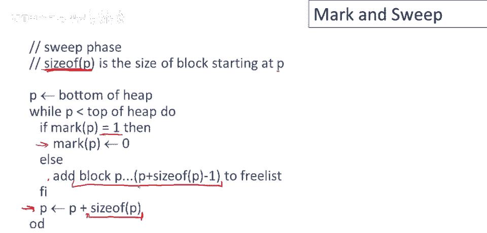

当此阶段结束时，所有可达对象的标记位都将是 `1`，而不可达对象（垃圾）的标记位仍为 `0`。

### 2. 清除阶段 🧽

标记阶段完成后，我们知道了哪些对象是垃圾。清除阶段的任务就是回收这些垃圾对象占用的内存。

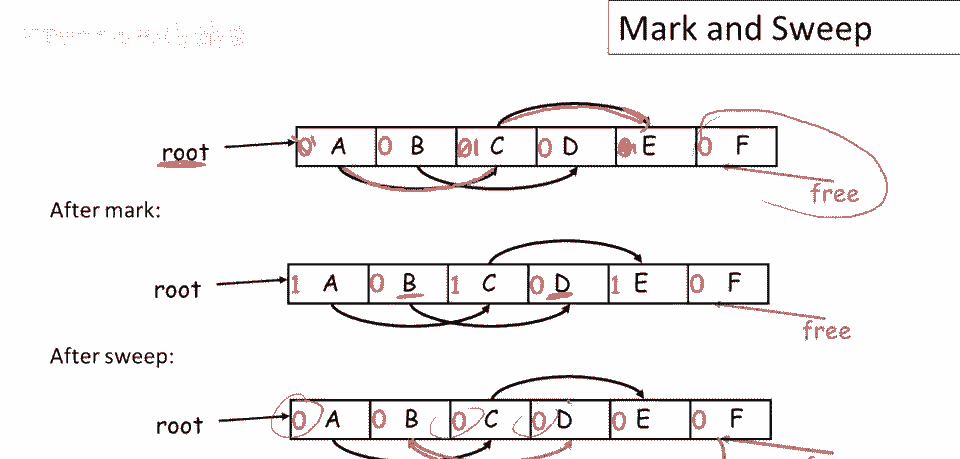

清除阶段会**扫描整个堆**，检查每个对象的标记位：
*   如果标记位为 `1`（可达对象），则将其标记位重置为 `0`，为下一次垃圾收集做准备。
*   如果标记位为 `0`（垃圾对象），则将该对象占用的内存块添加到**空闲列表**中，以供未来分配新对象时使用。

以下是清除阶段的伪代码描述。其中 `size_of(p)` 函数用于获取指针 `p` 所指向对象的大小（这通常存储在对象的头部信息中）。

```pseudocode
p = bottom_of_heap
while (p < top_of_heap)
    if (mark_bit(p) == 1)
        mark_bit(p) = 0  // 重置可达对象的标记位
    else
        add_block_to_freelist(p, size_of(p)) // 将垃圾块加入空闲列表
    p = p + size_of(p) // 移动到堆中的下一个对象
```

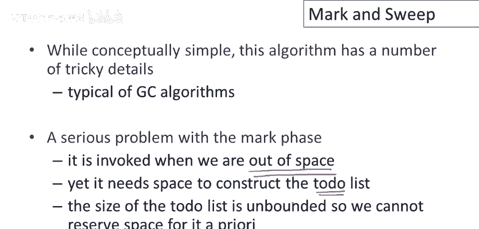

---

## 算法示例与图解

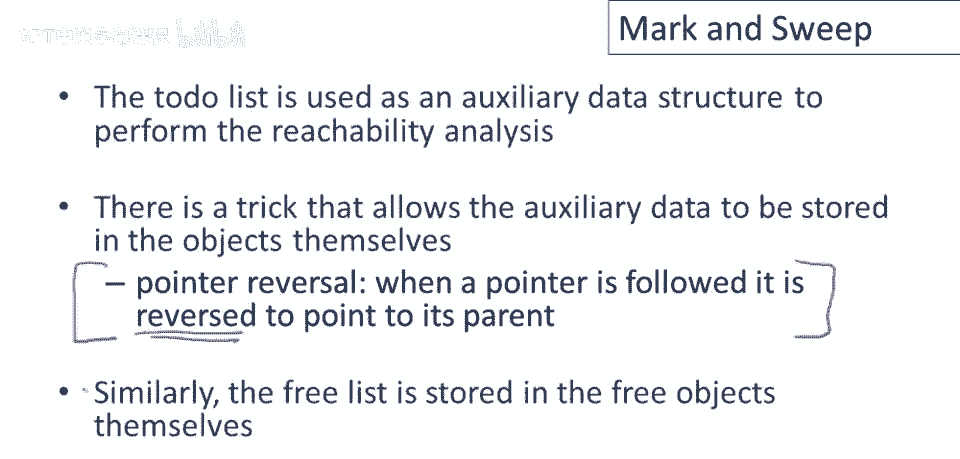

为了更好地理解，我们来看一个简单的例子。假设堆中有对象 A、B、C、D、E，并且只有一个根指针指向对象 A。

1.  **初始状态**：所有对象的标记位为 `0`。
2.  **标记阶段后**：从根（A）开始遍历，可达对象 A、C、E 的标记位被设置为 `1`。对象 B 和 D 不可达，标记位仍为 `0`。
3.  **清除阶段后**：遍历堆，将标记位为 `1` 的对象（A、C、E）重置为 `0`。将标记位为 `0` 的对象（B、D）所占用的内存块加入空闲列表。

最终，空闲列表由这些回收的内存块组成，可以用于后续的内存分配。

---

## 实现细节与挑战

虽然标记清除算法概念清晰，但在实现时需要考虑一些关键问题。

### 标记阶段的存储问题

标记阶段需要使用一个工作列表来跟踪待处理的对象。然而，垃圾收集通常在**内存已耗尽**时触发，此时可能没有额外空间来分配这个列表。

**解决方案：指针反转**
一种巧妙的技巧是使用**指针反转**，在遍历对象图时，利用对象本身的空间来记录回溯路径，从而模拟深度优先搜索所需的栈，而无需分配额外内存。其核心思想是：当沿着指针访问一个对象时，临时修改该指针，使其指向上一个访问过的对象（父节点），从而在需要回溯时能找到回去的路。

### 内存碎片化与合并

标记清除算法的一个缺点是可能导致**内存碎片化**。因为从空闲列表分配内存时，我们选择一块足够大的内存，可能只使用其中一部分，剩余的小块会放回空闲列表。长此以往，空闲列表中会充满许多小碎片，可能无法满足较大对象的分配请求。

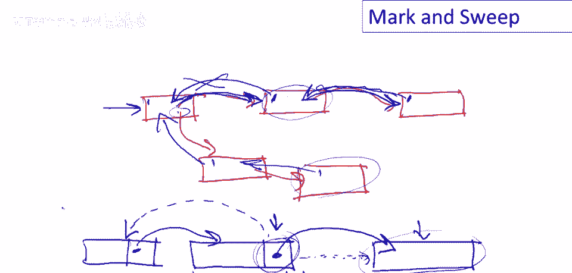

**解决方案：合并空闲块**
在清除阶段或维护空闲列表时，需要检查相邻的内存块是否都是空闲的。如果是，则将它们**合并**成一个更大的连续空闲块，以减少碎片。

---

## 标记清除算法的优缺点

### 优点 👍
*   **对象不移动**：在垃圾收集过程中，对象在内存中的位置保持不变。这意味着不需要更新指向这些对象的指针。
*   **适用于暴露指针的语言**：正因为对象不移动，该算法可以适配像 C 和 C++ 这类将指针地址语义暴露给程序员的语言，已有一些为这些语言实现的标记清除垃圾收集器变种。

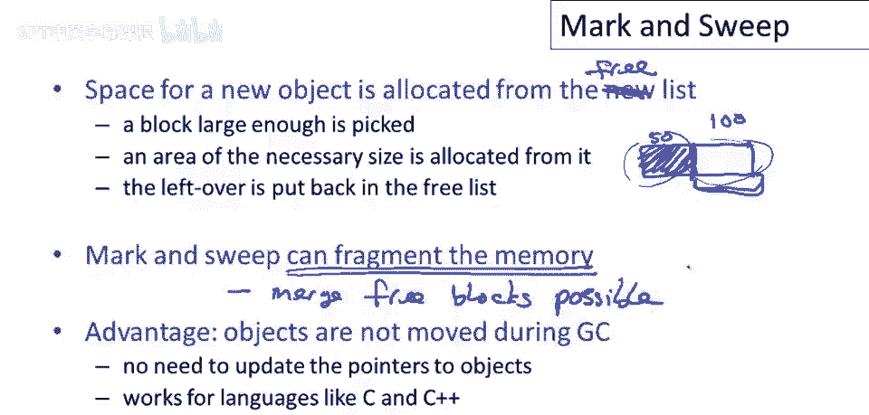

### 缺点 👎
*   **内存碎片化**：如上所述，容易产生内存碎片，可能影响大对象的分配效率。
*   **暂停时间**：标记和清除需要遍历整个堆或大部分堆，在堆较大时可能导致程序出现明显的停顿。
*   **标记阶段开销**：需要遍历所有可达对象图，如果对象图非常复杂，开销较大。

---

## 总结 🎓

本节课中我们一起学习了**标记清除垃圾收集算法**。我们了解到该算法通过**标记阶段**识别所有存活对象，并在**清除阶段**回收垃圾对象的内存。我们探讨了其实现中关于**工作列表存储**（可通过指针反转解决）和**内存碎片化**（可通过合并空闲块缓解）的挑战。最后，我们分析了该算法**对象不移动**的主要优点及其带来的内存碎片化缺点。理解标记清除是学习更复杂垃圾收集算法（如复制收集、分代收集）的重要基础。