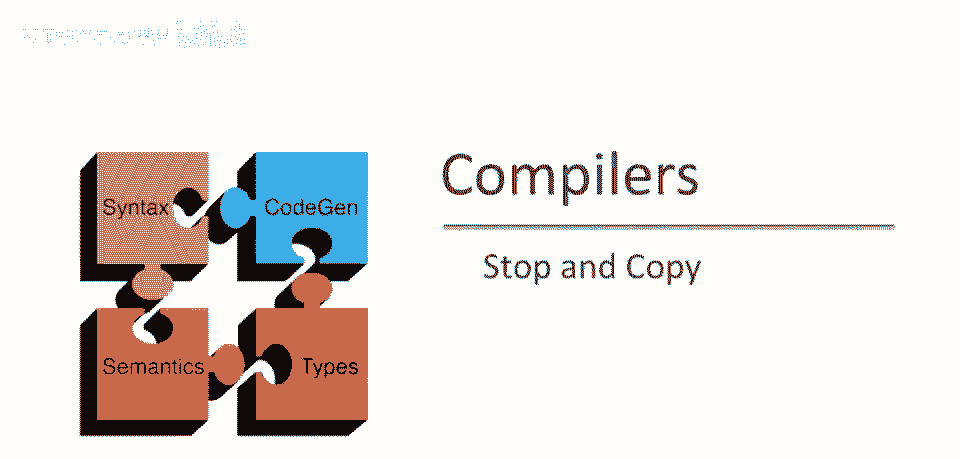

# 课程 P87：停止与复制垃圾回收技术 🗑️➡️🗂️

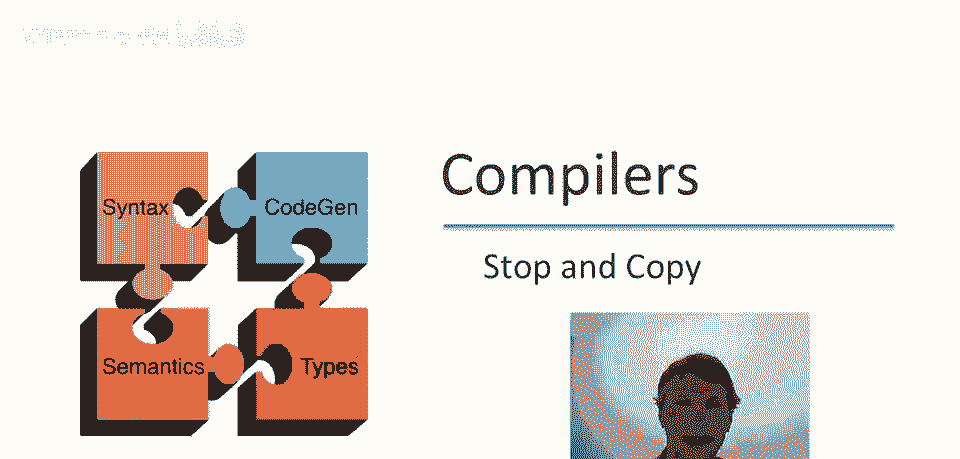

## 概述

在本节课中，我们将要学习第二种垃圾回收技术：**停止与复制**。我们将了解其工作原理、核心算法、优势与劣势，并通过一个具体的例子来理解其执行过程。

---

## 内存布局与分配策略

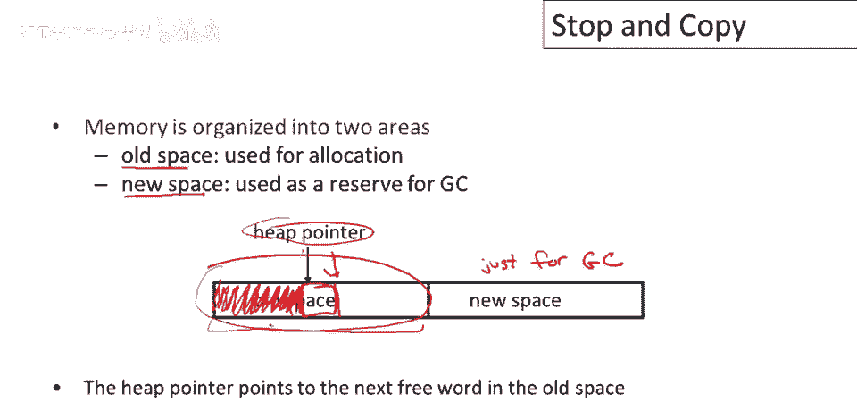

上一节我们介绍了标记-清除算法，本节中我们来看看停止与复制算法是如何组织内存的。

在停止与复制垃圾收集中，内存被划分为两个区域：
*   有一个**旧空间**用于分配。程序当前使用的所有数据都存放在称为旧空间的区域。
*   有一个**新空间**，为垃圾收集器保留。程序不使用这个空间，这是为GC保留的。


停止与复制垃圾收集中的第一个决定是：程序只能使用一半的空间。有一些更高级的停止垃圾收集技术允许程序使用超过一半的空间，但本质上，空间的一大部分必须为垃圾收集器保留。

分配方式是在旧空间中有一个**堆指针**。堆指针左侧的所有内容目前都在使用，这是所有已分配对象所在的区域。当需要分配新对象时，我们简单地将其分配在堆指针处。

因此堆指针将简单地向上移动，并为下一个要执行的对象分配一些块空间。它将不断穿过旧空间进行分配。分配只是推进堆指针。停止与复制的一个实际优势是简单快速的分配策略。

**核心概念**：
*   旧空间（From Space）：`heap_pointer` 左侧为已使用区域。
*   新空间（To Space）：保留给GC的空闲区域。
*   分配操作：`heap_pointer += object_size`


---

## 垃圾回收过程

最终，如果我们一遍又一遍地分配，我们将填满旧空间，垃圾收集将开始。

GC将在旧空间满时开始。它将复制所有可达对象从旧空间到新空间。这个想法的美妙之处在于：当你复制可达对象时，垃圾被留下。所以你只需捡起你正在使用的所有数据，将其移动到新空间，而你不再需要的所有垃圾都留在旧空间。

在您将东西复制到新空间后，由于你留下了垃圾，收集后使用的空间比以前少了，新空间现在有空余。然后交换旧空间和新空间的角色（旧新空间反转，旧的变新，新的变旧），程序继续。

---


## 工作示例

看个快速例子，了解如何工作。假设这是旧空间，有一个根，是对象 `a`。

我们要做的是：复制从 `a` 可达的所有对象，并移到新空间。我们追踪一下：
1.  从 `a` 开始，跟随指针。
2.  从 `main` 看到指向 `c` 的指针，`c` 可达。
3.  然后指向 `f` 的指针。
4.  然后 `f` 指向 `a`。

所有可达对象被复制。复制时，也复制指针并调整它们指向新副本。我们不仅移动对象，也移动指针，并调整它们，所以真的将整个对象图复制到新空间。现在使用较少空间，这里有些空闲。这将成为新的旧空间，用于下次垃圾收集。

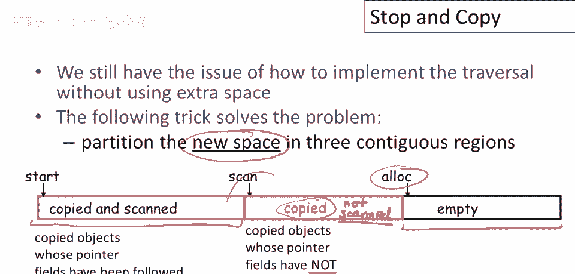

---

## 核心挑战：指针更新与遍历

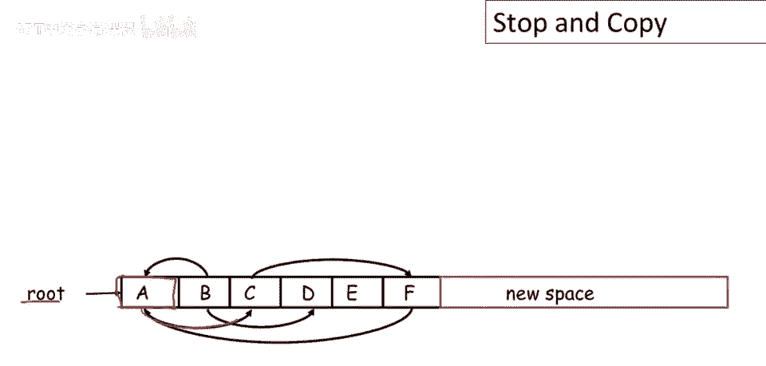

停止复制的一个基本问题是确保找到所有可达对象。真正区分停止和复制的是我们将复制这些对象。因此，当我们找到一个可达对象时，我们将其复制到新空间。这意味着我们必须找到并修复所有指向该对象的指针。

正确地做到这一点并不明显，因为当你找到一个对象时，你看不到所有指向该对象的指针。我们如何做到这一点？当我们复制对象时，将存储旧版本，它被称为指向新复制的**转发指针**。

以下是具体步骤：
1.  在旧空间中发现可访问对象 `a`。
2.  在新空间制作它的副本。
3.  我们将重用其旧空间，并将存储称为转发指针的东西。
4.  首先我们将标记它以某种方式表明已被复制。
5.  然后在对象的一个显眼位置，我们将存储转发指针（可以将其视为转发地址）。

若稍后有指针指向此对象，我们可能跟随此指针，找出此对象的点，意识到此对象已移动（因为我们已标记它），然后可用前向指针找出新对象位置，然后更新此指针，使其指向新对象。

---

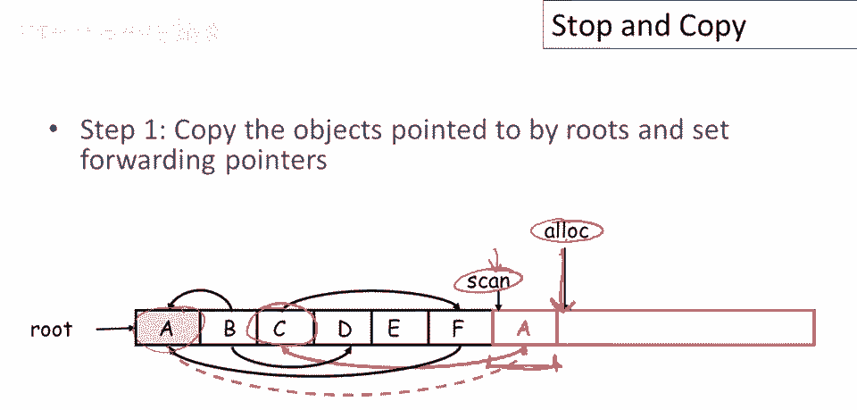

## 算法实现：三区域划分与工作列表

与标记和清除类似，我们仍需解决如何实现对象图遍历，而无需使用任何额外空间。垃圾收集器需要在恒定空间工作。

以下是停止复制算法解决问题的核心想法：我们将新空间划分为三个连续区域。
1.  **空白区域**：最右边，用于分配新复制的对象。有一个**分配指针**指向该区域的开始。
2.  **已复制未扫描区域**：空白区域左侧。对象已被复制到新空间，但我们尚未查看其内部的指针。
3.  **已复制已扫描区域**：最左边。这些是已被复制的对象，并且已处理所有对象内指针。

**扫描指针**与**分配指针**之间的区域（即“已复制未扫描区域”）就是我们的**工作列表**，包含了仍需处理其内部指针的对象。

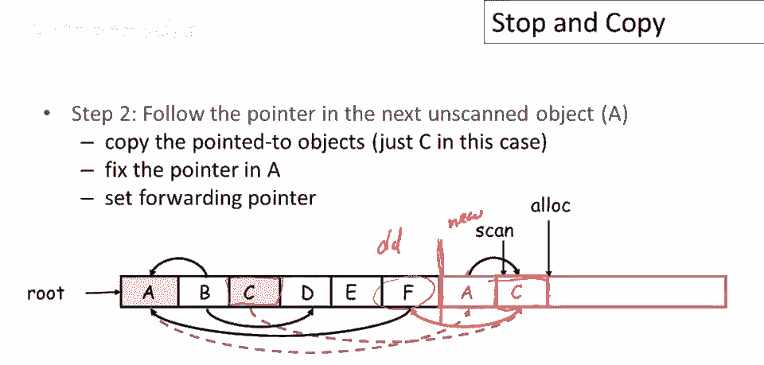

**核心概念**：
*   新空间划分：`[已扫描 | 未扫描 | 空白]`
*   指针：`scan_ptr` 指向下一个待扫描对象，`alloc_ptr` 指向空白区域起始处。
*   循环条件：当 `scan_ptr < alloc_ptr` 时，工作列表非空。


---

## 逐步执行示例

现在我们将逐步讲解停止和复制垃圾收集器如何收集一个特定的堆。请注意，我们只有一个根对象 `a`，它指向对象 `c`。

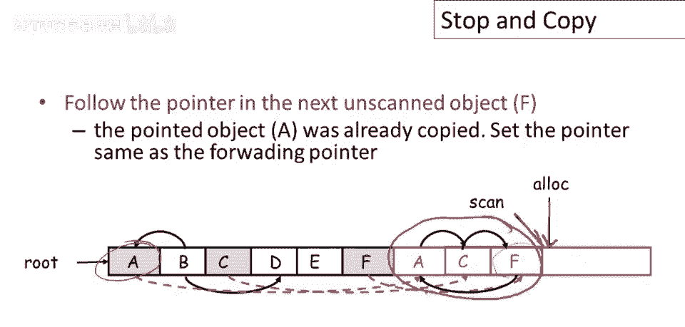

以下是算法步骤：


**第一步：复制根对象**
我们将 `a` 对象复制到新空间。这是一个位对位复制。分配指针移动到 `a` 副本之后。`a` 副本中的指针仍指向旧空间中的对象 `c`。我们在旧 `a` 中留下一个转发指针，指向新 `a` 副本，并标记旧 `a` 为已移动。现在，“已复制未扫描”区域有一个对象 `a`。

**第二步：扫描对象 `a`**
我们处理对象 `a`，遍历其内部指针。发现它指向旧空间的 `c`。`c` 未被移动，因此我们复制 `c` 到新空间，更新 `a` 的指针指向新 `c` 副本。扫描指针移过 `a`，分配指针因分配 `c` 而移动。在旧 `c` 中设置转发指针。现在，“已复制未扫描”区域有对象 `c`。

**第三步：扫描对象 `c`**
扫描 `c`，发现其指向 `f`。`f` 尚未移动，因此将 `f` 复制到新空间，更新 `c` 的指针指向新 `f` 副本。扫描指针移过 `c`，分配指针移动。在旧 `f` 中设置转发指针。现在，“已复制未扫描”区域有对象 `f`。

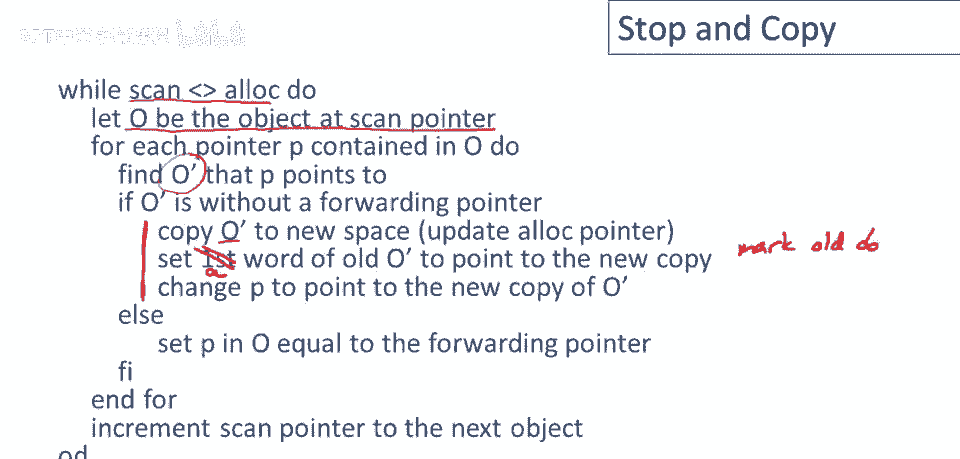

**第四步：扫描对象 `f`**
扫描 `f`，发现其指向 `a`。`a` 已经被标记为已移动并有转发指针。因此，我们不复制新对象，仅更新 `f` 中的指针，使其指向 `a` 的新副本（通过转发指针找到）。扫描指针移过 `f`，分配指针未动。

此时，扫描指针与分配指针相等，工作列表为空。所有从根可达的对象图已被完整复制到新空间。

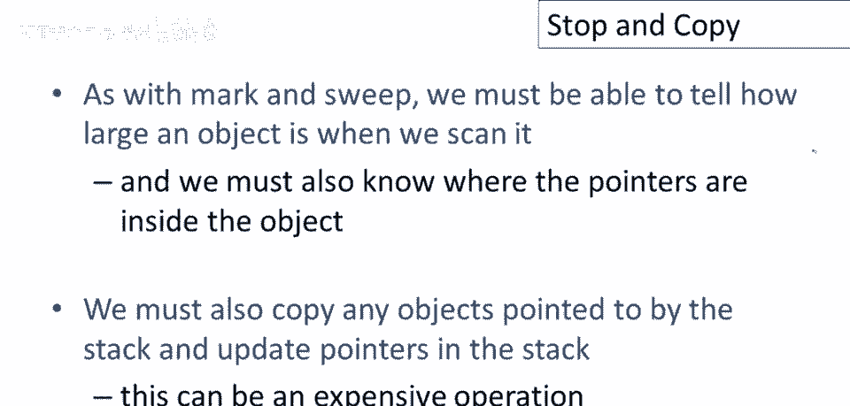

**最后**：交换新空间和旧空间的角色，程序恢复运行。

---

## 算法伪代码

以下是停止复制垃圾回收算法的伪代码概述：

```
while (scan_ptr < alloc_ptr) {
    obj o = object_at(scan_ptr); // 获取当前待扫描对象
    for (each pointer p in o) { // 遍历对象内的每个指针
        obj o_prime = *p; // 获取指针指向的对象
        if (!forwarding_pointer_exists(o_prime)) {
            // 情况1：对象未被复制
            new_copy = allocate_space_in_new_space(o_prime.size);
            copy_bits(o_prime, new_copy);
            set_forwarding_pointer(o_prime, new_copy); // 在旧对象设置转发指针
            *p = new_copy; // 更新当前指针指向新副本
        } else {
            // 情况2：对象已被复制
            *p = get_forwarding_pointer(o_prime); // 通过转发指针更新
        }
    }
    scan_ptr += size_of(o); // 移动扫描指针到下一个对象
}
```

算法一直运行，直到扫描指针赶上分配指针。此外，我们还需要扫描和复制栈中指向的对象，并更新栈中的指针。

---

## 总结与比较

本节课中我们一起学习了停止与复制垃圾回收技术。

**总结其特点**：
*   **优点**：
    1.  **分配速度快**：只需移动堆指针：`heap_pointer += size`。
    2.  **收集效率高**：成本只与**存活对象**的大小成正比，不接触垃圾。当垃圾较多时，效率远高于标记-清除。
    3.  **避免碎片**：通过紧凑复制，自然消除了内存碎片。
*   **缺点**：
    1.  **内存利用率低**：任何时候都只有一半内存可用于程序。
    2.  **移动对象**：在C/C++等语言中，对象地址是语义的一部分，因此无法使用此算法。
    3.  **需要扫描栈**：每次回收都必须扫描并更新栈上的指针，可能带来开销。

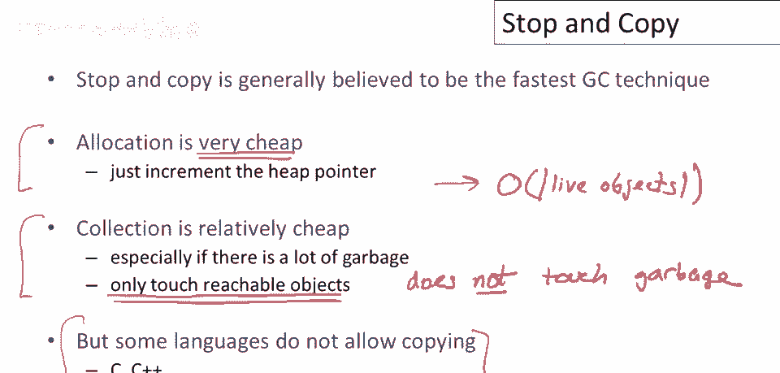

停止与复制及其变种被普遍认为是效率最高的垃圾回收技术之一，尤其适用于存活对象比例较小的场景。它通过空间换时间，以及专注于存活数据的策略，实现了高效的自动内存管理。