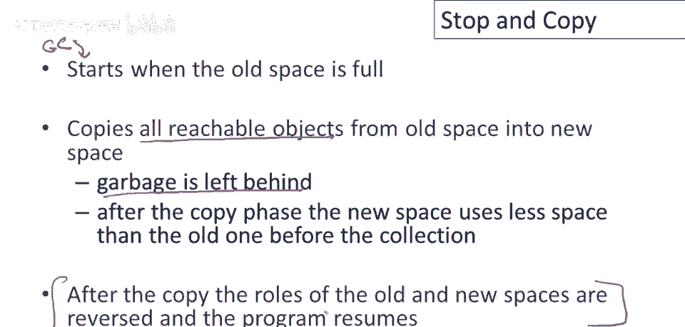
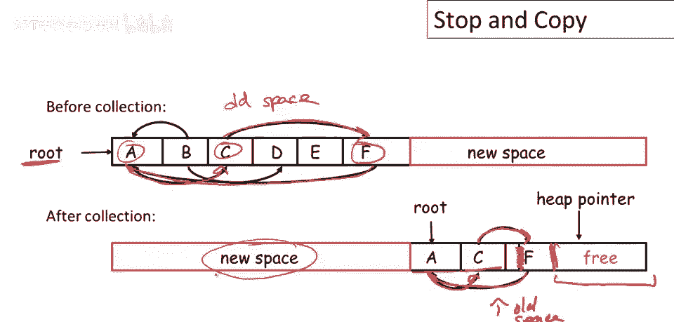
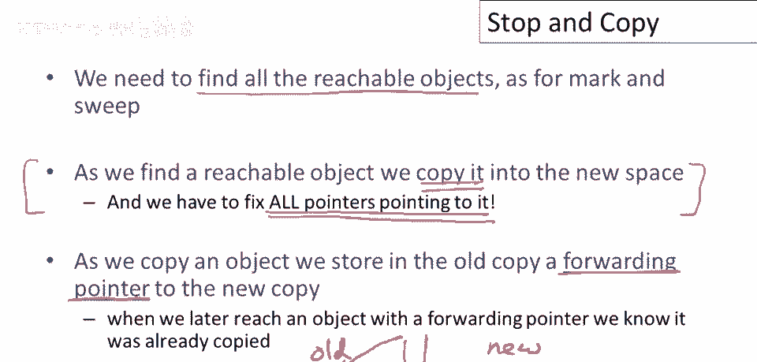
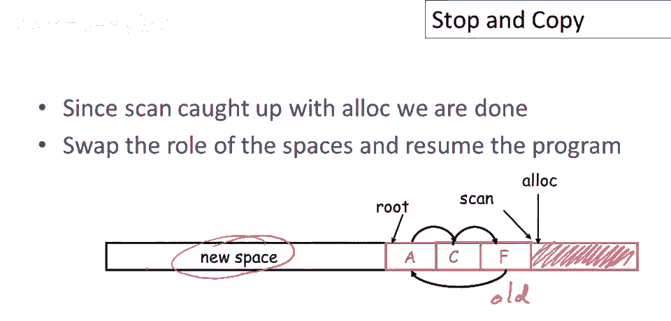

# P87：p87 17-03-_Stop_and_Copy - 加加zero - BV1Mb42177J7

本视频将讨论，第二种垃圾收集技术。

停止并复制，在停止并复制垃圾收集中，内存分为两个区域，有一个旧空间用于分配，程序当前使用的所有数据，都存放在称为旧空间的区域，然后有一个新空间，为垃圾收集器保留，程序不使用这个空间，这是为GC保留的。

停止并复制垃圾收集中的第一个决定是，程序只能使用一半的空间，有一些技术，更高级的停止垃圾收集技术，允许程序使用超过一半的空间，所以这并不像听起来那么糟糕，但本质上，空间的一大部分必须为垃圾收集器保留。

现在，分配方式是在旧空间中有一个堆指针，堆指针左侧的所有内容目前都在使用，这是所有已分配对象所在的区域，我用红色标出的这个区域，当需要分配新对象时，我们简单地将其分配在堆指针处。

因此堆指针将简单地向上移动，并为下一个要执行的对象分配一些块空间，它将不断穿过旧空间进行分配，随着您分配更多对象，好的，因此分配只是推进堆指针，停止并复制的一个实际优势是简单快速的分配策略。

现在，呃，最终，当然，如果我们一遍又一遍地分配，我们将填满旧空间，垃圾收集将开始，GC将在旧空间满时开始，它将做什么，它将复制所有可达对象，所有可达对象从旧空间复制到新空间，这个想法的美妙之处在于。

当你复制可达对象时，垃圾被留下，所以你只需捡起你正在使用的所有数据，将其移动到新空间，而你不再需要的所有垃圾都留在旧空间，然后在您将东西复制到新空间后，首先，由于你留下了垃圾。

收集后使用的空间比以前少了，新空间现在有空余，然后交换旧空间和新空间的角色，旧新空间反转，旧的变新，新的变旧，程序继续。

看个快速例子，了解如何工作，假设这是旧空间，这是旧空间，有一个根，是对象a，我们要做什么，复制从a可达的所有对象，并移到新空间，那会是什么样子，这是之后的样子，我们追踪一下，从a开始，跟随指针。

从main看到指向c的指针，好的，c可达，然后指向f的指针，然后f指向a，所有可达对象，复制它们，复制时，也复制指针，现在指针都改变了，在a的复制中，现在指向c的复制，好的，当然c将指向f的复制。

这里有点问题，这条线不在正确位置，所以应该像这样，然后f指向a的复制，我们不仅移动对象，也移动指针，并调整它们，所以真的将整个对象图复制到新空间，现在使用较少空间，这里有些空闲，好的，这将成为旧空间。

这是现在的旧空间，嗯，这是现在的空间，将用于下次垃圾收集。

总结讨论，停止复制的一个基本问题是确保，找到所有可达对象，我们同样看到标记清除垃圾收集的问题，真正区分停止和复制的是我们将复制这些对象，因此，当我们找到一个可达对象时，我们将其复制到新空间。

这意味着我们必须找到并修复所有指向该对象的指针，实际上，正确地做到这一点并不明显，因为当你找到一个对象时，当然，你看不到所有指向该对象的指针，我们如何做到这一点，好吧，这是一个想法，当我们复制对象时。

将存储旧版本，它被称为指向新复制的转发指针，所以让我们看看那会是，那看起来像什么，我们有旧空间，我们有新空间，假设我们在旧空间中发现可访问对象a，所以我们要做的是，我们将在这里制作它的副本，在新空间。

这很容易做到，但接下来我们要做的是，我们将重用其空间，并将存储称为转发指针的东西，我们将在其中，首先我们将标记，以某种方式表明已被复制，这将有一些特殊标记，我将简单地，你知道，用紫色标这里。

条形图或类似，将以某种方式标记，以便我们知道该对象已复制，然后在对象的一个显眼位置，我们将存储转发指针，可以将其视为转发地址，所以如果你知道某人住哪，你可以去他家，如果他们已搬走，可询问转寄地址。

正是如此，然后可去他们新家，无论他们搬去哪，可能找到他们，这就是将发生的事，若稍后有指针指向此对象，甚至很久后，在垃圾回收中，我们可能发现此指针，我们可能跟随此指针，找出此对象的点，意识到此对象已移动。

因为我们已标记它且对象已移动，然后可用前向指针找出新对象位置，然后更新此指针，使其指向新对象。

现在与标记和清除类似，我们仍需解决如何实现对象图遍历，而无需使用任何额外空间，当这些垃圾收集算法，它们仅被使用时，仅在低内存情况下运行，不能假设能构建无限数据结构，与垃圾收集器一起使用。

垃圾收集器需要在恒定空间工作，这是将使用的想法，用于停止复制算法以解决问题，我们将划分新空间，这是新空间，分为三个连续区域，我们将有，嗯，最右边那个怎么了，我们将分配新对象的空白区域。

有一个分配指针指向该区域的开始，这是我们填充的，正在复制的对象，现在这是未使用的空白空间，嗯，该区域左侧是已复制但未扫描的对象，但未扫描，好的，这是复制的，不是扫描的，那意味着什么？

这意味着对象已被复制，所以我们实际上，你知道，在新空间中复制了对象，但我们尚未查看其指针，我们尚未查看对象内的指针以了解它们指向何处，在那左边是被复制和扫描的对象，这些是已被复制的对象。

已处理所有对象内指针，可视为此区域。

扫描指针与分配指针间，工作列表，仍需处理的对象，已复制对象，可能仍指向未复制对象，需检查指针的对象，看是否指向需复制对象，完成垃圾回收，回到我们的小例子，现在我将逐步讲解。

停止和复制垃圾收集器如何逐步收集这个特定堆，请注意，我们只有一个根对象，它是okay，我只想指出a有一个指针指向对象c。

好的，所以第一步我们要做的是，我们将a对象复制到新空间，好的，这实际上是一个位对位复制，所以我们只是取a的位，并做一个复制，你知道，不做任何内部对象的检查，将其复制到新空间，那怎么工作，当然。

我们的分配指针不在，最初在这里，在新空间的开始，然后我们复制这个对象，然后这意味着分配一个对象，现在分配指针指向我们刚刚分配的内存的第一个字，超出对象，好的，当我们复制它时会发生什么。

因为这只是一个位对位复制，a中的所有指针仍然指向它们之前指向的对象，即旧空间中的对象，请注意，这个a的副本指向旧空间中的对象c，我们还做了另一件事，即在旧副本的a中留下一个转发指针。

所以我们标记a已经被复制，这就是它灰色的原因，这表示该对象已经移动，在这个虚线中，表示在a的某个地方我们存储了一个指向新a副本的指针，现在我们可以开始算法了，请注意。

这里有一些已经被复制但未被扫描的对象，所以这是我们的工作列表，所以现在我们将不断处理这些对象，我们如何知道那里有对象呢？我们只需比较扫描和分配指针，所以如果它们，如果它们不同。

如果在扫描和分配指针之间有一个对象，至少两个指针之间有一个对象，那么就有工作要做，有一个对象需要被扫描，呃，那，呃，和，并可能导致更多对象被移动和分配。

接下来会发生什么，我们处理对象a，我们遍历a，找到所有指针，复制a指向但未移动的对象，之前我们说a指向，这个a的副本指向旧c副本，现在我们发现c对象未被移动，仍在旧空间，我们复制它。

更新a的指针指向新c副本，当然，扫描指针划过一个，已扫描所有指针，好的，分配指针也移动，因为要为c分配空间，当然，他只是一个，旧空间的逐位副本，所以任何指针，指向尚未移动的物体，就指向旧空间。

这种情况下，对象c指向旧空间中的对象f，我大概应该在这里指出，这是原始的分割线，你知道，这里是旧空间，这里是新空间，最后我们标记c已被复制，好的，它已被移动到新空间，并留下了一个转发指针，如有问题。

可修复指针，指向未来可能遇到的问题，现在，嗯，需继续扫描已复制但未扫描的对象，可见扫描与分配指针间有对象c，现处理c内所有指针。

接着扫描c，发现其指向f，f尚未移动，因此将f复制到新空间，我们更新指针c，现在c已复制并扫描，好的，扫描指针越过c，当然f也是逐位复制，因此，所有指向旧空间的指针仍指向旧空间，特别是f指向a。

分配指针再次移动，因为我们移动到了f，现在我们必须处理f。

这将是我们要移动的最后一个对象，那么会发生什么呢，我们发现f指向a，好的，a已经被标记为已移动，并且有一个转发指针，而不是复制a，我们仅更新f中指向旧版a的指针，指向a的副本，所以现在f完全扫描。

f中的所有指针都已处理，我们没有分配任何新对象，因此分配指针没有移动，现在扫描指针和分配指针相等，它们之间没有对象，因此我们的工作列表为空，这是垃圾收集堆，这是一个完全图，一个完整副本。

应该说从旧空间可达对象图。

所以现在完成，我们简单地交换新和老空间的角色，然后我们恢复程序，当程序再次运行时，它将从这个区域分配并超出分配指针，直到填满现在旧的空间，这将用于下次垃圾回收的新空间。

伪代码算法概述如何停止复制垃圾回收，扫描和分配指针不同，记住，我们一直运行，直到扫描指针赶上分配指针，它们相等，我们要做的是，我们将查看扫描指针处的对象，称为对象o，然后对于每个指针。

我们将执行以下操作，我们将找到指针指向的对象o'，对于每个指针，我们将找到其指向的对象o'，然后有两种情况，一种是没转发指针，若没转发指针，需将对象复制到新空间，涉及分配新对象和更新分配指针。

然后设置这里，第一个词不应强调，第一个词设一个字，所以是个特殊词，这才是重要的，我们要知道用哪个词，它总是同一个词，但无论如何，我们用旧物体的词指代新副本，标记旧物体已复制 标记旧物体。

已复制，好的，这样我们就能知道，当我们，如果我们遇到一两点，再次，我们知道它已被移动，然后更改指针指向新的o'副本，好吧，如果有，我们就这样做，如果没有转发指针，如果有转发指针。

那么我们只需更新指针指向转发指针指向的地方，然后我们重复这个循环一遍又一遍，呃，直到我们扫描了所有已复制的对象，所以就像标记和清除一样，当我们扫描一个对象时，我们必须知道它有多大。

我们还需要知道对象中的指针在哪里，所以，如果我们考虑一下这一点，假设我们正在扫描这个对象，所以这是我们的扫描指针，现在我们想处理它所有的指针，我们必须知道指针在哪里，如果这里有一个指针，这里有一个指针。

我们需要能够找到这些指针，我们不想将它们与对象的其他字段混淆，那些可能看起来像指针的字段，所以我知道整数的位模式可能看起来非常像一个指针，现在这不是一个大问题，因为编译器，当然，确定堆中对象的结构。

并且可以将该信息存储在某个地方，以便垃圾收集器可以通信，所以他们将能够找到指针，所以你可以很容易地想象，程序中存储的一些信息指示每种类型，指针在哪里，同样，一旦我们扫描了这个对象。

我们需要能够将扫描指针向前移动，仅超出该对象，以便我们可以找到下一个对象的开始，这就是为什么我们需要知道这个大小，好的，我们需要知道这个大小，以便扫描指针可以，呃，移动，通过对象。

我们可以找到下一个对象的开始，另一个问题是，每当我们进行垃圾收集时，我之前没有提到这一点，但应该清楚我们还需要扫描和复制栈中指向的对象，我们还需要更新栈中的指针，这实际上可以成为一种昂贵的操作。

与停止复制一起，因为你知道你仍然必须每次进行收集时遍历整个堆栈，以确保你已经复制了栈中指向的所有对象，总结：停止并复制，我认为可以这么说，普遍认为是垃圾收集的最快技术，当然。

我相信基于停止和复制的变种是最有效的方法，众所周知，自动内存管理分配非常便宜，好吧，因此，你所要做的就是增加热指针，你只需将单个指针向前移动以分配空间，没有复杂的空闲列表需要遍历或关于。

知道在哪里放置对象的决定，你知道你只会直接在分配指针处分配它，因此，内存管理的这一部分非常便宜，同时，收集也相对便宜，有趣的是，它特别便宜，如果有大量的垃圾，因为，因为我们正在复制可达对象，嗯。

停止复制仅接触可达对象，它没有，特别是没有接触垃圾，所以如果你考虑一下这一点，这意味着垃圾收集，嗯，是停止和复制的大小，所以无论你正在复制的子图是什么，那就是垃圾收集的成本，这与标记和清除形成对比。

因为成本与您使用的所有内存成正比，因为您有清扫阶段，您必须遍历并接触每个单个对象，无论是活的还是垃圾，好的，因此，如果您有相对较多的垃圾和相对较少的活跃对象，停止复制实际上比标记和清除快得多，当然。

停止复制的缺点是它在某些语言中移动对象，特别是C和C++不允许您移动对象，因为对象居住的地址实际上是可见的，在程序中暴露，是对象语义的组成部分，在那里，您真的必须使用标记和清除。

