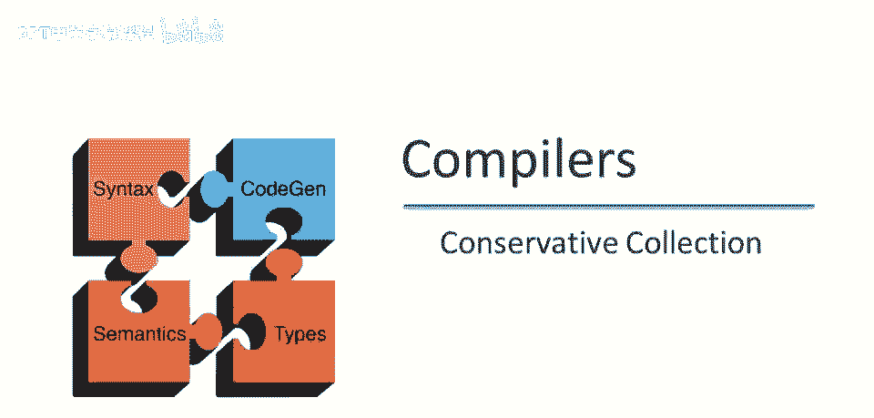
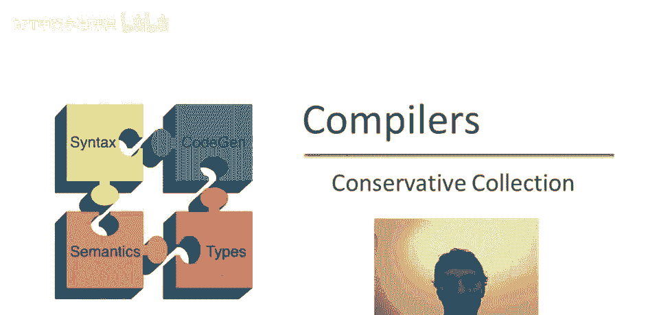

# 课程 P88：保守式垃圾收集 🧹



在本节课中，我们将要学习一种名为“保守式垃圾收集”的技术。这种技术使得在像C和C++这类缺乏精确类型信息的语言中，也能实现自动内存管理。我们将探讨其核心思想、工作原理以及局限性。



## 概述

自动内存管理（垃圾收集）依赖于两个关键能力：找到所有“可达”的对象，以及识别对象内部的所有指针。然而，在C和C++这类语言中，由于类型系统较弱，我们无法百分之百可靠地确定内存中哪些数据是指针。本节课将介绍如何通过“保守”的策略来解决这一难题。

## 核心挑战：指针识别难题

上一节我们介绍了垃圾收集的基本依赖条件，本节中我们来看看在C/C++中实现的具体挑战。

在C或C++中，当我们查看内存中的一块数据（例如两个连续的机器字）时，我们无法确切知道它们的含义。它可能是一个链表节点，其中一个字是数据（如整数），另一个字是指向下一个节点的指针。它也可能是一个二叉树节点，两个字都是指针。由于语言本身不存储运行时类型信息，垃圾收集器无法区分这些情况。

## 保守式收集的核心思想

既然无法精确识别指针，我们可以采用一个“保守”的策略。基本洞察是：如果我们不确定某个内存字是否是指针，我们就把它当作指针来处理。这基于一个原则：在垃圾收集中，多保留一些对象（即“保守”）比错误地释放一个未来可能被使用的对象要安全得多。


图可达性分析本身已经是一种保守近似（它保留所有可达对象，其中一些可能最终不会被使用）。保守式收集将这种“保守”态度进一步延伸到了指针识别阶段。

以下是保守式收集的基本工作逻辑：

1.  **扫描根集合（如寄存器、栈）和堆中的已标记对象。**
2.  对于扫描到的每一个机器字，判断它“是否可能是一个指针”。
3.  如果它可能是一个指针，则将其**当作真正的指针**，并标记它所指向的内存块为“可达”。
4.  重复此过程，直到没有新的内存块被标记。
5.  最后，清扫所有未被标记的内存块并归还给系统。

## 如何判断“是否可能是指针”

那么，如何判断内存中的一个值是否“可能是指针”呢？通常依据以下条件：

*   **对齐检查**：指针通常指向特定对齐的地址（例如，在32位系统上指向4字节边界，64位系统上指向8字节边界）。因此，候选值必须是对齐的地址。
*   **有效地址检查**：将候选值解释为一个内存地址时，这个地址必须落在程序当前“有效”的内存段内（例如，堆、栈、全局数据区）。一个随机的整数（如`12345`）很可能不满足这个条件。

通过这两个过滤器，大部分非指针数据（如小整数、字符等）会被排除。只有真正的指针和少数巧合满足条件的非指针数据会被收集器视为指针。

## 保守式收集的局限

上一节我们介绍了如何保守地识别指针，本节中我们来看看这种策略带来的主要限制。

由于收集器无法确定哪些是真正的指针，它也就**不能移动内存中的对象**。因为移动对象后，需要更新所有指向该对象的指针。如果收集器错误地将一个整数当作指针并修改了它，程序的行为将被彻底破坏。

因此，保守式垃圾收集通常只适用于 **“标记-清除”** 这类非移动式垃圾收集算法，而无法用于更高效的 **“复制”** 或 **“标记-整理”** 算法。

其核心行为可以用以下伪代码描述：
```c
// 保守地标记从某个值开始的可达对象
void conservative_mark(word potential_ptr) {
    if (looks_like_pointer(potential_ptr)) { // 检查对齐和有效地址
        object* obj = (object*)potential_ptr;
        if (is_in_heap(obj) && !is_marked(obj)) {
            mark(obj);
            // 递归扫描该对象内部的每一个字
            for (each word w in obj) {
                conservative_mark(w);
            }
        }
    }
}
// 主收集过程
void conservative_gc() {
    // 1. 从根（寄存器、栈等）开始保守标记
    for (each word w in roots) {
        conservative_mark(w);
    }
    // 2. 清扫未标记的对象
    sweep();
}
```

## 总结


本节课中我们一起学习了保守式垃圾收集技术。我们了解到，为了在C/C++等语言中实现垃圾收集，可以通过“保守”策略将任何看起来像指针的内存字都视为指针，从而安全地高估可达对象集。这种方法的代价是可能保留一些已死亡对象（内存碎片化），并且无法使用需要移动对象的压缩算法。尽管如此，它仍是使手动内存管理语言获得自动内存管理能力的一种实用方案。