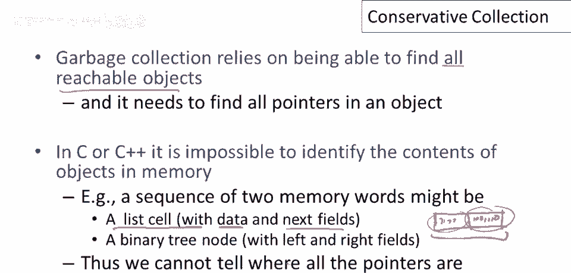
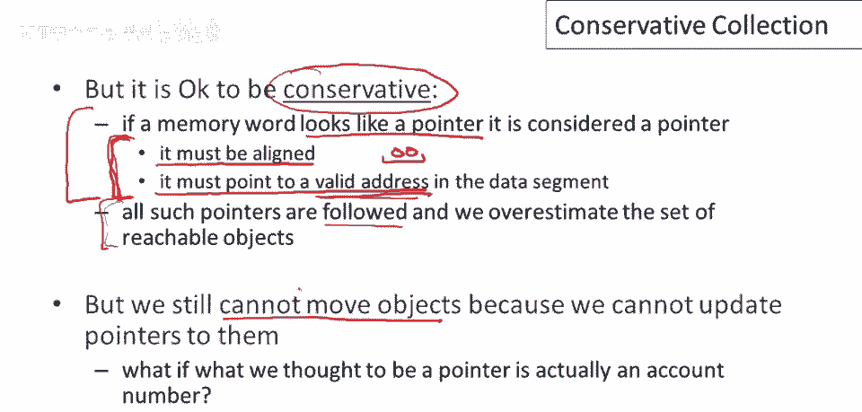

# P88：p88 17-04-_Conservative_Col - 加加zero - BV1Mb42177J7

在这段短视频中，我将谈论一种称为保守垃圾收集的技术，可用于类似C和C++的语言。

加加，回顾自动内存管理依赖于能够找到所有可达对象，还需要能够找到对象中的所有指针，现在，为类似C或C++的语言进行垃圾收集的困难在于，很难甚至不可能以100%的可靠性识别内存中的对象内容，因此。

如果我们看到内存中的两个单词，你知道它可能是一个列表单元，具有数据和下一个字段，所以如果我们只看到这里的两个单词，并且这里有一些位模式，零和一，好吧，我们如何知道这些是否都是指针，我的意思是。

它可能是一个指针，另一个不是，在列表单元的情况下，所以这些字段中的一个只是数据，如整数，然后另一个是一个指针，或者它可能像二叉树节点一样，这两个单词都是指针，由于C和C++类型系统的弱点。

我们无法保证我们知道所有指针的位置，现在，事实证明，有可能扩展垃圾收集技术。

以与类似C和C++的语言一起工作，基本想法或见解是，总是可以保守，如果我们不确定某物将来是否会被使用，那么我们就会保留它，并记住图可达性已经是保守的技术，我们真正想要保留的是未来将被使用的对象。

但对象图中的可达性是对此的近似，因为可达对象可能被使用，现在，C和C++的问题是我们不知道指针在哪里，我们没有从类型系统中关于指针位置的确切保证，因此，基本技巧是，如果某物看起来像指针。

那么我们将把它当作指针对待，我们只需要保守，如果我们不确定内存中的某个单词是否是指针，那么我们就可以把它当作指针对待，并保留它所指向的内容，嗯，如果我们不确定，我们不会移动或更改它，那将没问题。

那么如何决定内存中的某个单词是否是指针，它应该对齐，意味着你知道它应该以一些零结尾，以指示它指向，如果它是一个指针，指向一个字边界，如果是的话，然后无论是什么位模式，如果我们解释为地址。

它必须是一个有效地址，因此它们应指向数据段，注意，你知道这两个条件将排除内存中所有类型的数据，所以，例如，任何小整数可能无法解释为数据段中的有效地址，所以你知道，最有可能，只有指针。

或非常少不是指针的东西将被视为指针，我们要做的是，然后如果看起来像指针，我们将考虑它为指针，我们将跟随它，然后我们将高估可达对象的范围，我们可能会保留一些完全不可达的东西，但没关系。

保留比必要更多的总是好的，现在我们仍然不能移动对象，对吧，因为我们不能更新指向它们的指针，如果我们不知道某物是指针，我们当然不想改变它，好的，你知道所以，例如，如果我们认为某物是指针。

它实际上是一个帐号号码，然后我们更新了指针，当我们移动对象时，我们完全改变了程序的作用，所以这仅适用于标记和清除。

