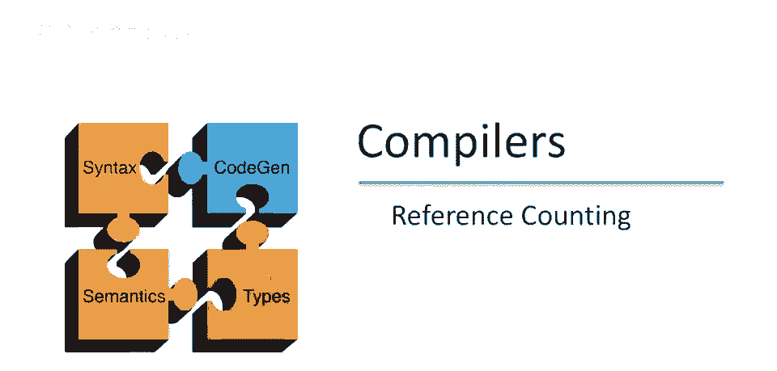
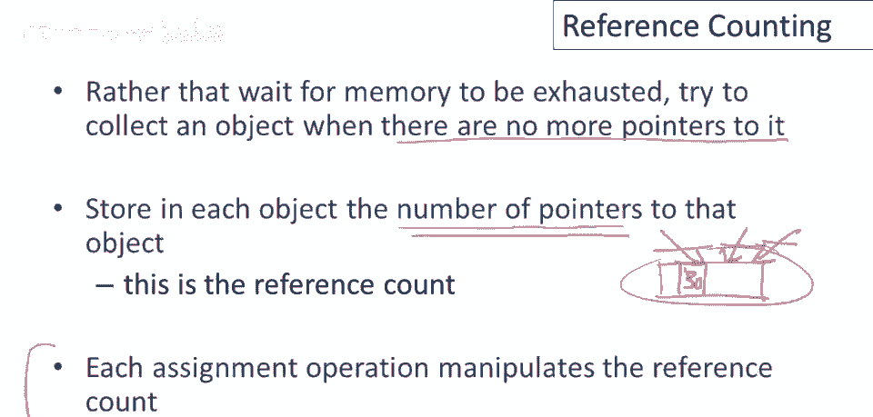
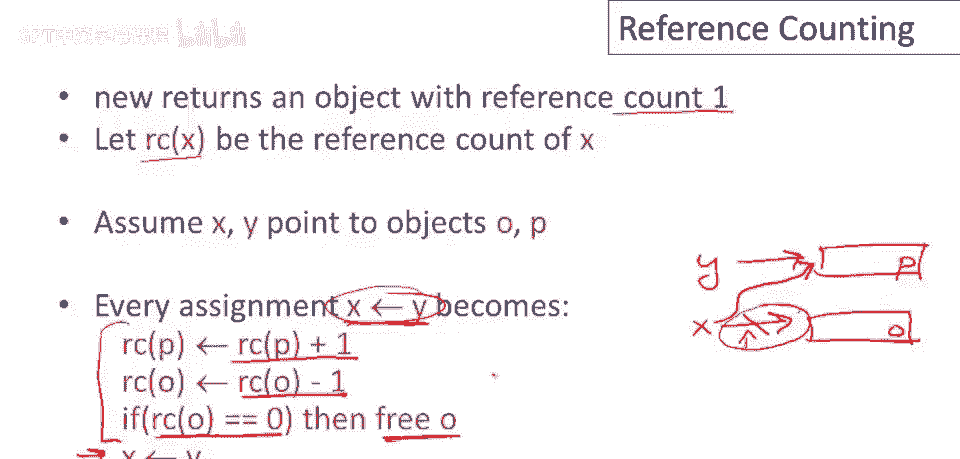
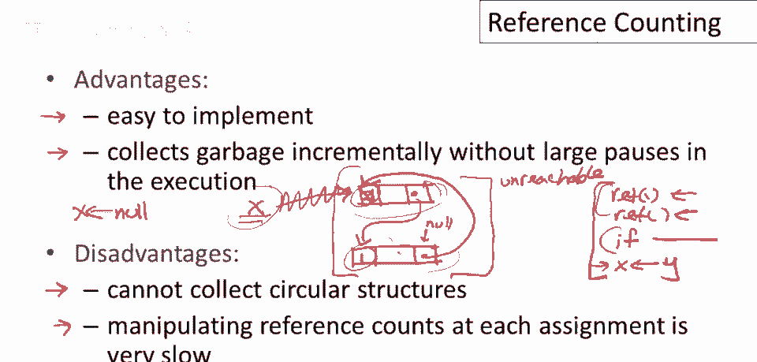
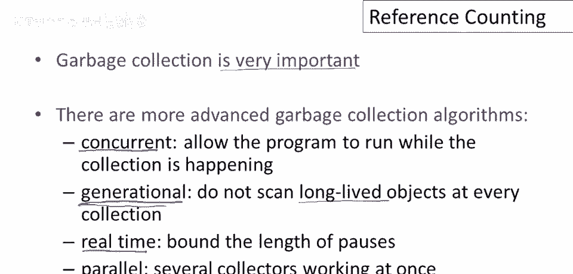

# 课程 P89：引用计数垃圾回收 🧮

在本节课中，我们将结束关于自动内存管理的讨论，学习第三种也是最后一种垃圾回收技术——引用计数。

## 概述 📋

引用计数是一种自动内存管理技术，其核心思想是跟踪每个对象被引用的次数。一旦指向某个对象的指针数量降为零，该对象就可以被立即回收。这种方法试图在内存耗尽前就进行垃圾回收，而不是等待系统内存不足。

## 引用计数的基本思想 💡

上一节我们介绍了标记-清除和停止-复制两种垃圾回收技术，它们都需要在特定时刻暂停程序进行全局扫描。本节中我们来看看引用计数，它采用了一种完全不同的增量式策略。

引用计数的基本思想是：我们不去等待内存完全耗尽，而是尝试在对象变得不可达时立即收集它。具体来说，一旦我们丢弃了最后一个指向该对象的指针，该对象就变得不可达，我们将在那时尝试回收它。

我们如何做到这一点呢？正如其名称所示，我们将计算每个对象的被引用次数。在每个对象中，我们会存储一个专门的字段，用于记录指向该对象的指针数量。这意味着每次赋值操作都必须更新引用计数，以保持指向对象指针数量的准确计数。

## 引用计数的操作机制 ⚙️

以下是引用计数在程序执行过程中的具体操作步骤：

1.  **创建对象**：当使用 `new` 分配一个新对象时，该对象的引用计数初始化为 `1`。返回的指针是该对象的唯一引用。
    *   **公式/代码表示**：`ref_count(new Object()) = 1`

2.  **赋值操作**：当执行赋值语句 `x = y` 时，需要更新相关对象的引用计数。
    *   **步骤**：
        a. 增加 `y` 所指向对象（记为 `P`）的引用计数。
        b. 减少 `x` 原来所指向对象（记为 `O`）的引用计数。
        c. 检查 `O` 的引用计数是否降为 `0`。如果是，则释放 `O` 的内存。
        d. 最后，执行实际的指针赋值，使 `x` 指向 `P`。

因此，程序中的**每一个**赋值操作，现在都转化为需要执行的四个操作，以维护引用计数的正确性。

## 引用计数的优缺点 ⚖️

### 优点

引用计数有其独特的优势，主要体现在以下方面：

*   **增量式垃圾回收**：引用计数在执行时没有长时间的全局暂停。它总是以小增量的方式回收垃圾，这对于实时应用或交互式应用非常有利，因为它最小化了程序的最长暂停时间。
*   **实现相对简单**：基本的引用计数实现相当容易。可以想象一个代码生成器，它会为支持引用计数的语言生成包含引用计数更新操作的代码。对编译器所需的修改并不十分复杂。

### 缺点

然而，引用计数也存在一些明显的缺点：

*   **性能开销大**：每次赋值都需要更新两个引用计数、检查引用计数是否为零，然后才执行赋值本身。这会将每个赋值操作的成本膨胀数倍，对程序性能产生显著影响。
    *   **优化可能**：智能的编译器可以尝试合并对同一对象的多次引用计数更新，但这实现起来非常棘手。一个高度优化的实现会比简单实现快，但仍有明显性能影响，且难以正确实现。
*   **无法回收循环引用**：这是引用计数最著名的缺陷。它无法直接回收形成循环引用但整体不可达的对象组。
    *   **示例**：对象A引用B，B引用A，且外部再无引用指向它们。此时A和B的引用计数均为1，但实际都已不可达。引用计数器无法发现并回收它们。
    *   **解决方案**：
        1.  程序员手动打破循环（在丢弃外部引用前，将循环内的某个引用置为 `null`）。
        2.  结合其他垃圾回收技术（如定期运行标记-清除收集器）来清理循环结构。

## 关于自动内存管理的高级观点 🧠

我们现在准备结束关于自动内存管理的讨论。这里有一些高级别的观点：

*   **自动内存管理是好事**：它防止了严重的存储错误（如内存泄漏、悬垂指针），是编程语言的一大进步。如果你的应用适合，使用支持垃圾回收的语言是高效的选择。
*   **代价是控制权的减少**：程序员不再能精确控制内存布局、释放时机和数据位置。对内存使用量的控制也变得有限。
*   **适用场景**：
    *   **适合**：非极度数据密集型、对内存布局不敏感的应用。
    *   **不适合**：需要高效使用内存的高端数据处理和科学计算应用；有严格实时性要求、不能容忍任意长度暂停的嵌入式或实时系统。
*   **垃圾回收语言中的“内存泄漏”**：自动内存管理防止了内存损坏，但无法防止逻辑上的内存泄漏——即保留了不再需要但仍有指针指向的数据。在生产程序中，忘记将指向大型数据结构的变量置为 `null` 是常见的内存泄漏原因。

## 总结与展望 🚀

本节课中我们一起学习了引用计数垃圾回收技术。我们了解了它通过跟踪每个对象的引用数来增量回收垃圾的基本原理，分析了其实现简单、无长暂停的优点，也探讨了性能开销大和无法处理循环引用的核心缺点。

如前几课所述，垃圾回收非常重要，每个程序员都应了解其优缺点。它也是编程语言实现中一个有趣且不断发展的领域。除了我们讨论的这三种基本算法，还有更先进的垃圾回收技术，例如：
*   **并发垃圾回收**：允许程序在垃圾收集时继续运行。
*   **分代垃圾回收**：基于“大多数对象生命周期很短”的观察，将对象按年龄分代，更频繁地收集年轻代对象。
*   **实时垃圾回收**：尝试限制垃圾回收导致的最长暂停时间。
*   **并行垃圾回收**：使用多个垃圾收集器线程同时工作。

理解这些基础知识，将帮助你更好地选择和使用编程语言，并理解其运行时行为。