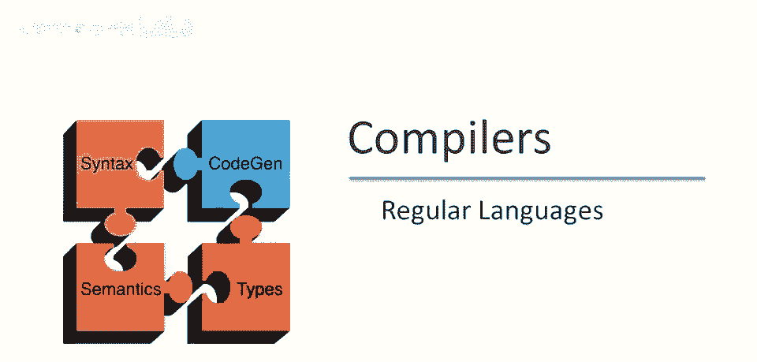
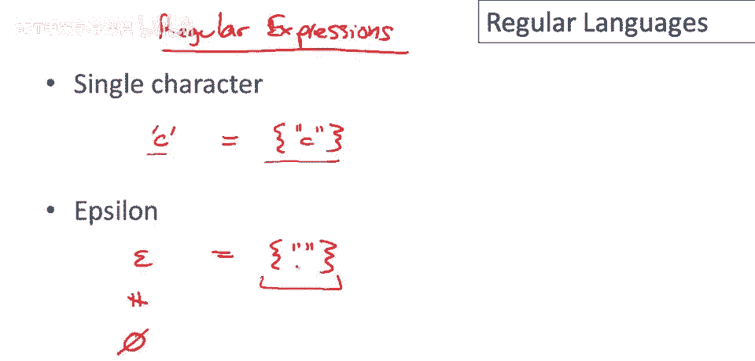
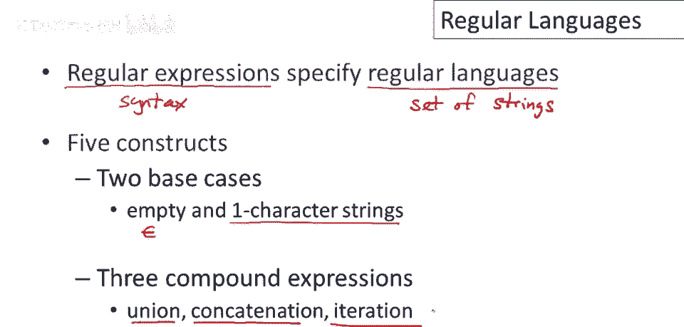

# 课程 P9：正规语言与正则表达式入门 🧩

在本节课中，我们将要学习**正规语言**，它是用于定义编程语言词法结构（即各种“标记”或“Token”类别）的数学工具。我们将重点介绍如何使用**正则表达式**来描述正规语言，并通过简单的例子来理解其核心概念。

---

## 概述：什么是正规语言？ 📖

编程语言的词法结构由一组**标记类**组成，每个标记类都包含一系列特定的字符串。为了精确地指定每个标记类包含哪些字符串，我们通常使用**正规语言**。本课程将介绍正规语言的基本概念及其表示方法——正则表达式。

---

## 正则表达式的基本构成 🧱

正则表达式是一种用于描述字符串集合（即语言）的语法。每个正则表达式都对应一个语言（即一组字符串）。其定义基于一个给定的**字母表**（例如，包含字符 `0` 和 `1` 的集合）。

正则表达式由两种基本形式和三种复合形式构成。

### 两种基本正则表达式

以下是定义正则表达式的两种最基本形式：

1.  **单个字符 `c`**：表示仅包含一个字符串的语言，该字符串就是字符 `c` 本身。
    *   **公式**：`L(c) = { “c” }`

2.  **空字符串 `ε`**：表示仅包含一个字符串的语言，该字符串是空字符串（即长度为0的字符串）。**请注意，`ε` 表示包含空字符串的语言，而非空语言（即不包含任何字符串的集合）**。
    *   **公式**：`L(ε) = { “” }`

### 三种复合正则表达式

我们可以通过以下三种操作，从已有的正则表达式构建出新的、更复杂的正则表达式。

1.  **并集 `A + B`**：表示语言 `A` 和语言 `B` 中所有字符串的合集。
    *   **公式**：`L(A + B) = L(A) ∪ L(B) = { s | s ∈ L(A) 或 s ∈ L(B) }`

2.  **连接 `A B`**：表示从语言 `A` 中任取一个字符串，从语言 `B` 中任取一个字符串，将它们前后拼接起来所形成的所有可能字符串的集合。
    *   **公式**：`L(A B) = { a b | a ∈ L(A) 且 b ∈ L(B) }`

3.  **克林闭包 `A*`**：表示语言 `A` 中的字符串可以重复连接任意次（包括零次）所生成的所有字符串的集合。零次连接得到空字符串 `ε`。
    *   **公式**：`L(A*) = ∪_{i≥0} L(A)^i`，其中 `L(A)^0 = {ε}`，`L(A)^i` 表示 `L(A)` 连接自身 `i` 次。

---

## 正则表达式的形式化定义 📝

综合以上内容，我们可以给出正则表达式在给定字母表 Σ 上的形式化定义（语法）：

*   正则表达式 `R` 是以下五种情况之一：
    1.  `ε` （空字符串）
    2.  `c`，其中 `c ∈ Σ` （单个字符）
    3.  `(R1 + R2)`，其中 `R1` 和 `R2` 是正则表达式 （并集）
    4.  `(R1 R2)`，其中 `R1` 和 `R2` 是正则表达式 （连接）
    5.  `(R*)`，其中 `R` 是正则表达式 （克林闭包）

这个定义清晰地描述了所有合法正则表达式的构成规则。

---

## 实例解析：构建与理解正规语言 🔍

上一节我们介绍了正则表达式的构成规则，本节中我们来看看如何应用这些规则来构建具体的正规语言。我们以字母表 `Σ = {0, 1}` 为例。

以下是几个构建正规语言的例子及其含义解析：

**例1：`1*`**
这个表达式表示所有由字符 `1` 组成的字符串（包括空字符串）。
*   **解析**：根据克林闭包的定义，`1* = ε + 1 + 11 + 111 + ...`
*   **对应的语言**：`{ “”, “1”, “11”, “111”, … }`

**例2：`(1+0) 1`**
这个表达式表示两个字符串的集合。
*   **解析**：`(1+0)` 表示集合 `{“1”, “0”}`，与 `1`（即 `{“1”}`）连接。根据连接规则，我们取前者的每个字符串与后者的每个字符串拼接。
*   **对应的语言**：`{ “1”+“1”, “0”+“1” } = { “11”, “01” }`
*   **另一种写法**：这个语言也可以直接写成 `11 + 01`。

**例3：`0* + 1*`**
这个表达式表示所有全由 `0` 组成的字符串与所有全由 `1` 组成的字符串的并集。
*   **解析**：`0*` 是 `{ “”, “0”, “00”, … }`，`1*` 是 `{ “”, “1”, “11”, … }`，取它们的并集。
*   **对应的语言**：`{ 所有全0串 } ∪ { 所有全1串 }`

**例4：`(0+1)*`**
这是最重要的例子之一，它表示字母表上所有可能的字符串。
*   **解析**：`(0+1)` 表示 `{“0”, “1”}`。其克林闭包意味着，我们可以从 `{“0”, “1”}` 中任意选择字符，重复任意次来组成字符串。
*   **对应的语言**：所有由 `0` 和 `1` 构成的字符串，如 `“”, “0”, “1”, “00”, “01”, “10”, “11”, “000”, …`。
*   **特殊记法**：这个语言通常记为 **`Σ*`**。

**重要提示**：同一个正规语言可以用多个不同的正则表达式来描述。例如，`1*` 也可以写成 `(1* + 1)`，因为增加的 `1` 并没有改变原有的集合。

---

## 总结 🎯

本节课中我们一起学习了**正规语言**及其描述工具——**正则表达式**。

*   **正则表达式**是一种**语法**，是我们写下来用于表示一个字符串集合（即正规语言）的表达式。
*   正则表达式有五种核心构成部分：
    1.  基本表达式：`ε`（空字符串）和单个字符 `c`。
    2.  复合表达式：**并集** (`+`)、**连接**（直接拼接）、**克林闭包** (`*`)。
*   正则表达式是定义编程语言词法结构（如标识符、关键字、数字常量等标记类）的基础。

理解正则表达式是理解编译器如何识别源代码中基本元素的第一步。