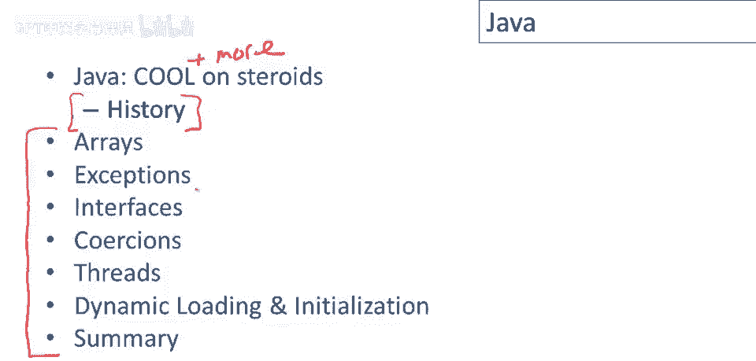

# 课程 P90：Java 语言概览与历史 🚀

在本节课中，我们将学习 Java 语言的核心概念、历史背景及其在编程语言发展中的地位。我们将看到 Java 如何从一个特定项目演变为互联网时代的关键语言，并了解其设计背后的主要思想。

## Java 的历史起源 📜

上一节我们介绍了本课程的目标，本节中我们来看看 Java 语言的起源。

Java 最初是 Sun Microsystems 公司内部一个名为 “Oak” 的项目。该项目始于 20 世纪 90 年代初，其最初目标是开发用于**机顶盒设备**的软件。这种设备是一个连接在电视机上的小盒子，旨在控制有线电视节目并增强电视的互动性。Oak 项目的初步开发持续了数年，大约从 1991 年运行到 1994 年。

然而，机顶盒市场在当时并未真正兴起，消费者接受度有限，因此 Oak 项目的发展潜力受到了限制。随后，互联网革命在 90 年代初加速发展，为编程语言带来了新的需求和机遇。

## 互联网时代的机遇与挑战 🌐

上一节我们了解了 Java 的早期目标，本节中我们来看看它如何抓住了互联网的机遇。

在 1993 至 1994 年间，互联网的普及使得人们对**安全性**和**代码可移植性**的需求变得尤为突出。人们不希望从网上下载由 C/C++ 等语言编写的、可能不可信或不安全的二进制程序。这催生了对一种更安全、更适合网络环境的新编程语言的需求。

当时有几个候选语言竞争成为“互联网编程语言”，除了 Java，还有 Tickle 和 Python 等。最终，凭借 Sun Microsystems 公司的强力支持，Java 抓住了这个机会，成为了互联网编程的主流语言之一。每一种新语言都需要一个“杀手级应用”来推动其普及，而 Java 的**安全性**、**垃圾回收机制**和**类型系统**恰好满足了当时互联网编程的兴起需求，从而变得非常流行。

## Java 的设计影响与特性 🧩

上一节我们看到了 Java 如何顺应时代，本节中我们来看看它的设计哲学和核心特性。

Java 的设计深受其时代背景和前辈语言的影响。新语言常常大量借鉴前代语言的思想，并在其基础上进行创新或重新设计。Java 的类型系统和其对类型的承诺，旨在帮助构建可扩展的大型系统。其面向对象的特性借鉴了如 Objective-C、C++ 和 Eiffel 等语言。

Java 的一个显著特征是引入了 **接口（Interface）** 的概念。此外，Java 也是一门相当**动态**的语言，许多操作（如反射）是在运行时而非编译时完成的。

以下是 Java 受到主要影响的几个方面：
*   **类型系统**：旨在构建强类型的大型系统。
*   **面向对象**：源于 C++、Objective-C 等语言。
*   **接口**：一个显著的语言特征。
*   **动态特性**：支持反射等运行时特性。

## 后续内容预告 📋

如开头所说，本视频只是一个介绍和概览。在接下来的几个视频中，我们将深入研究 Java 的特定功能及其工作原理。

我们将要探讨的特性包括：
*   **异常处理**
*   **接口**
*   **线程**

需要明白的是，Java 是一门非常庞大的语言，其语言手册长达数百页，功能众多。设计语言的难点之一在于确保所有功能能够正确交互，处理好所有特性的组合。

## 总结 ✨

本节课中，我们一起学习了 Java 语言的历史背景和设计概览。我们了解到 Java 从 Oak 项目起步，最初面向机顶盒设备，随后抓住了互联网革命的机遇，凭借其安全性和适合网络环境的特性得以广泛流行。它的设计融合了多种前辈语言的优点，并引入了接口等关键概念。Java 的成功印证了编程语言的发展往往与特定的技术需求和时代机遇紧密相连。在接下来的课程中，我们将深入探讨其具体的语言特性。