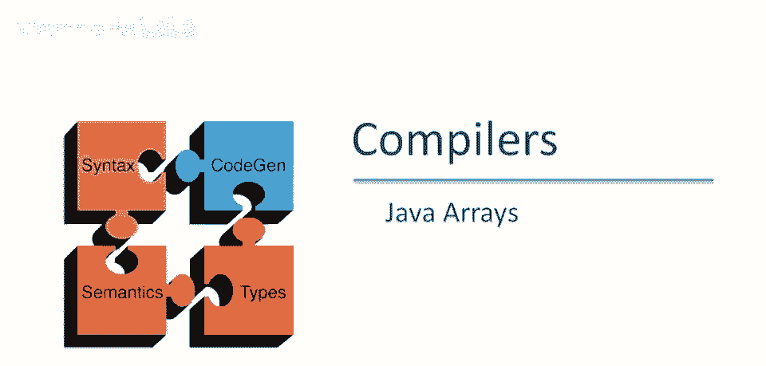
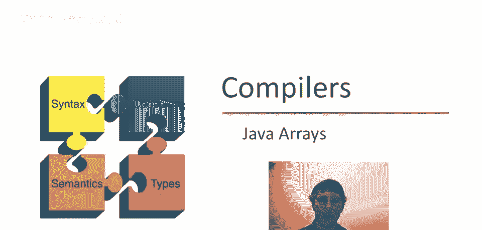
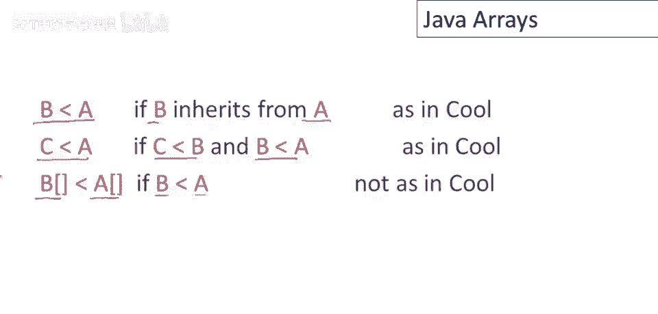
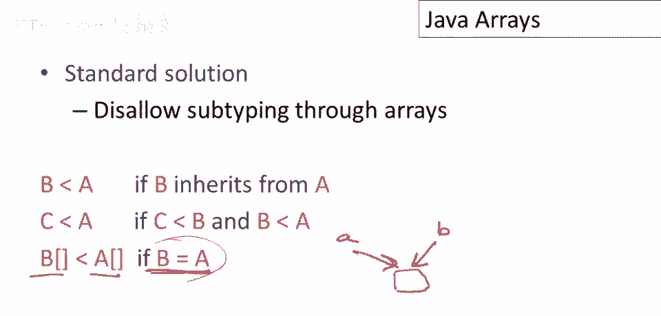

# 课程 P91：Java 数组与子类型 🧩



在本节课中，我们将要学习 Java 中数组与子类型的关系。我们将探讨一个看似合理但会导致运行时错误的场景，并分析其背后的原因。通过理解 Java 数组的子类型规则及其运行时检查机制，你将能更好地编写安全的代码。

## 一个数组别名的例子 🔍

上一节我们介绍了课程主题，本节中我们来看看一个具体的代码示例。假设有两个类 `A` 和 `B`，且 `B` 是 `A` 的子类。考虑执行以下代码会发生什么。

```java
B[] b = new B[10]; // 创建一个用于存储 B 类型对象的数组
A[] a = b;         // 变量 a 也指向与 b 相同的数组
a[0] = new A();    // 将一个新 A 对象赋值给 a[0]
b[0].someMethod(); // 通过 b[0] 调用 B 类中声明但 A 类中未声明的方法
```

首先，分配一个 `B` 类型的数组。有一个数组变量 `b` 指向它。然后有一个变量 `a`，也指向与 `b` 相同的数组。注意 `a` 的类型是 `A[]`，而 `b` 的类型是 `B[]`。

现在执行赋值操作 `a[0] = new A();`。这看起来没问题，因为 `a` 是一个 `A` 类型的数组。第一个位置将存储一个 `A` 对象。


然后访问 `b[0]`。因为 `a` 和 `b` 指向相同的数组，`b[0]` 与 `a[0]` 是同一个对象。代码试图调用一个在 `B` 中声明但在 `A` 中未声明的方法。由于这是一个 `B` 类型的数组，理论上应该能调用所有 `B` 的方法。

但当我们调用该方法时，将出现运行时错误。因为数组中实际存储的对象是一个 `A` 对象，它并不具备 `B` 类独有的方法。

## Java 数组的子类型规则 📐

要理解这个例子，需要查看 Java 的子类型规则。在 Java 中，如果 `B` 继承自 `A`，那么 `B` 是 `A` 的子类。这是标准的面向对象继承关系。



类型子类型是传递的。如果 `C` 是 `B` 的子类，`B` 是 `A` 的子类，那么 `C` 也是 `A` 的子类。

但 Java 还有另一个非标准的规则：**如果 `B` 是 `A` 的子类型，那么数组类型 `B[]` 也是数组类型 `A[]` 的子类型**。

用公式表示即：
**若 `B <: A`，则 `B[] <: A[]`**

这个规则在其他许多有对象和子类型的语言中并不常见，也是导致上述问题的根源。

## 别名与类型安全 ⚠️

让我们以另一种方式解释这个问题。我们有一块可读写的内存（数组），有两个指针 `a` 和 `b` 指向它。它们都可以读写这部分内存。

当两个程序名称指向同一部分内存时，这叫做**别名**。别名在真实程序中很常见，本身并不坏。

但在这个例子中，`a` 和 `b` 有不同的类型。一般来说，如果存在可更新引用的别名，并且这两个名字类型不同，那么类型系统就可能不安全。

问题在于：因为 `B` 是 `A` 的子类型，我们可以通过 `A[]` 类型的指针 `a` 将一个 `A` 对象写入内存位置。然后，我们又可以通过 `B[]` 类型的指针 `b` 将其作为 `B` 对象读取，并尝试调用 `B` 独有的方法，从而导致错误。

即使我们交换 `A` 和 `B` 的角色（假设 `A` 是 `B` 的子类型），由于别名是对称的，也会出现同样的问题。总的来说，**多个不同类型的可更新位置的别名是不安全的**。


## 解决方案对比：静态检查 vs 运行时检查 🛡️

这个问题在许多编程语言中都出现过。编程语言研究社区最广泛接受的解决方案是在类型级别上制定不同的规则。

以下是解决此问题的标准方案：
*   只允许在数组元素类型完全相同的情况下，数组之间才有子类型关系。
*   即，`B[]` 是 `A[]` 的子类型，仅当 `B` 等于 `A`。
*   用公式表示即：**`B[] <: A[]` 仅当 `B = A`**。

这样，我们就无法创建两个指向同一可更新内存位置但元素类型不同的数组引用，从而在编译时确保类型安全。



然而，Java 选择了不同的修复方式。Java 不是在编译时静态检查，而是在**运行时**进行检查。

在 Java 中，每当向数组中执行赋值操作时，虚拟机会检查被赋值的对象的运行时类型是否与数组声明的元素类型兼容。

例如，对于 `B[] arr = new B[10];`，每当执行 `arr[i] = someObj;` 时，Java 会检查 `someObj` 是否是 `B` 类型或其子类型。如果不是，则会抛出 `ArrayStoreException`。

这会给数组的赋值操作带来运行时开销。幸运的是，最常见的数组（如 `int[]`、`float[]` 等原始类型数组）不受影响，因为原始类型没有子类型关系，因此不需要这些额外的检查。

## 总结 📝

本节课中我们一起学习了 Java 数组与子类型的交互。
1.  我们看到了一个由于数组别名和 Java 特殊的数组协变规则（`B[] <: A[]` 若 `B <: A`）而可能引发运行时错误的例子。
2.  我们分析了问题的核心在于**不同类型对同一可更新内存位置的别名访问会破坏类型安全**。
3.  我们探讨了两种解决方案：一种是在编译时禁止数组协变（许多语言采用），另一种是 Java 采用的**运行时类型检查**，这会在向对象数组赋值时带来开销，但保证了兼容性。


理解这些机制有助于你更深入地认识 Java 类型系统的设计权衡，并在编程时避免此类陷阱。