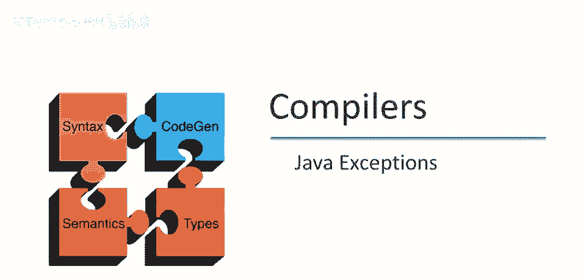
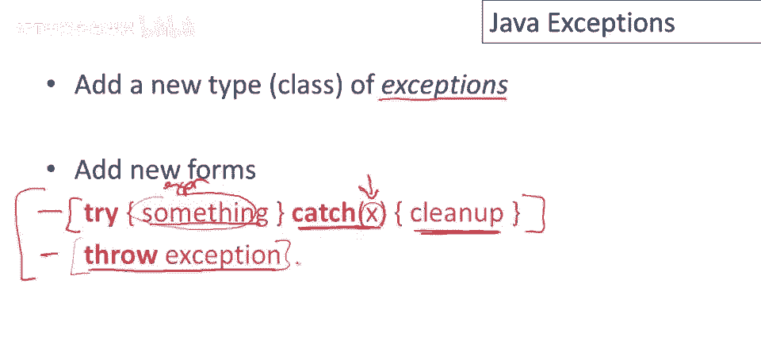
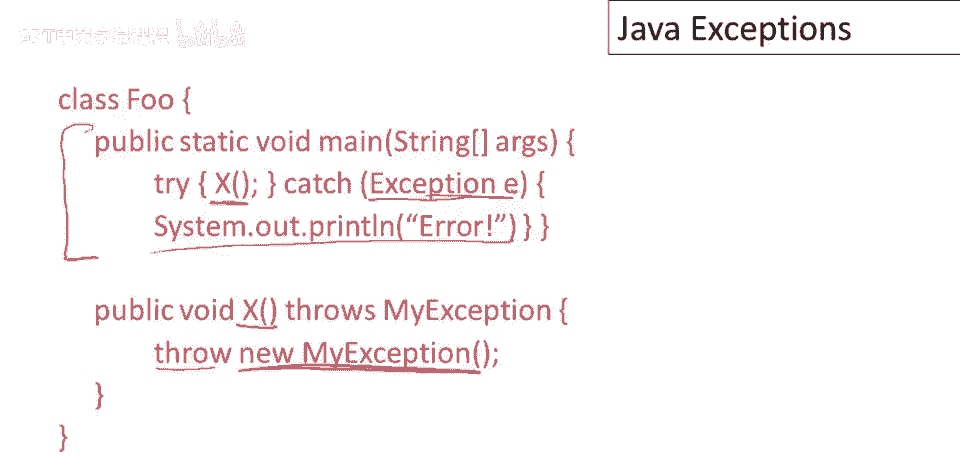
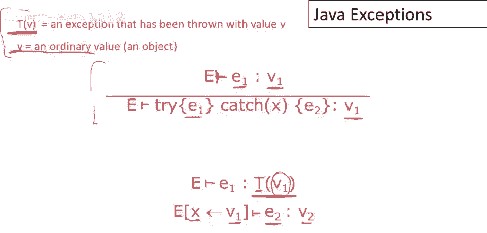
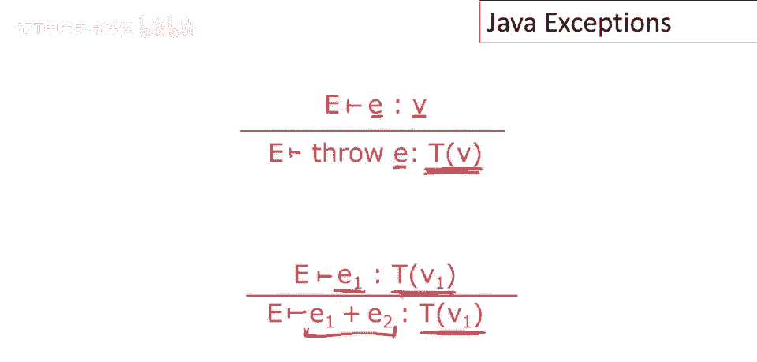
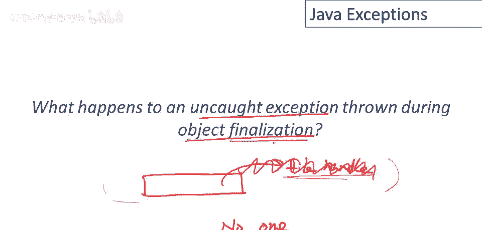

# 课程 P92：Java 异常处理 🚨

在本节课中，我们将要学习 Java 中的异常处理机制。异常是一种用于处理程序中意外错误情况的语言特性。我们将了解如何抛出和捕获异常，其背后的工作原理，以及 Java 异常设计的一些独特之处。


## 程序员定义的异常

上一节我们介绍了课程概述，本节中我们来看看程序员如何定义和使用异常。

考虑以下典型编程场景：在深入复杂的代码部分时，可能会遇到出现意外错误的地方。例如，可能发现内存不足，或者数据结构不满足某些要求（如一个本应排序的列表并未排序）。

问题在于如何处理这些错误。目标是编写能够优雅处理错误的代码，而不是让程序变得混乱。



## 异常处理方案

许多语言（包括 Java）的流行解决方案是在语言中添加一种新的值类型，称为**异常**，并配备相应的控制结构来处理它。



以下是 Java 中最核心的两个结构：
*   **抛出异常**：在检测到错误的地方创建并抛出异常对象。
*   **捕获异常**：使用 `try-catch` 结构来捕获并处理异常。

其基本思想是：异常在实际检测到错误的地方（可能在代码深处）被抛出，但这通常不是处理它的好地方。通过抛出异常，可以退出当前代码块，让异常向上传播到更高层次的、能够进行清理和处理的代码位置（即 `catch` 块）。

## 一个简单的例子

以下是使用异常的一个小例子：

```java
public class Main {
    public static void main(String[] args) {
        try {
            x(); // 调用可能抛出异常的方法
        } catch (Exception e) {
            System.out.println("出现错误"); // 捕获并处理异常
        }
    }

    static void x() throws Exception {
        throw new Exception(); // 抛出一个异常对象
    }
}
```

在这个例子中，`x` 方法抛出一个异常。当 `main` 方法调用 `x` 时，异常被抛出，导致 `x` 异常终止。随后，控制权返回到 `main` 方法中的 `catch` 块，执行清理代码（这里只是打印一条消息）。

## 异常的操作语义



为了更清晰地理解 `try-catch` 和 `throw` 的工作方式，我们可以借助操作语义来描述。

首先，需要区分异常对象的两种状态：
*   **普通值**：刚创建的异常对象，行为与任何其他对象无异。
*   **已抛出的异常**：被 `throw` 语句抛出的异常，是一种特殊状态的值。

**`try-catch` 的规则如下：**
1.  如果 `try` 块中的表达式 `e1` 评估为一个普通值 `V`，那么整个 `try-catch` 表达式的结果就是 `V`。
2.  如果 `e1` 评估为一个已抛出的异常 `t`，那么我们会解开这个异常，将其内部的值绑定到 `catch` 子句中指定的变量名，然后评估清理代码 `e2`。`e2` 的结果就是整个 `try-catch` 表达式的结果。

**`throw` 的规则非常简单：**
`throw e` 会先评估表达式 `e` 得到一个值 `V`，然后将其标记为已抛出的异常 `t`。



**异常传播规则：**
对于语言中的其他结构（如加法 `e1 + e2`、`if` 语句等），如果其子表达式之一评估为已抛出的异常，则立即停止当前表达式的进一步评估，并将该异常作为整个表达式的结果向外传播。唯一能阻止异常传播的结构就是 `try-catch`。

## 异常的常见实现方式

一种简单的实现异常处理的方法是使用栈标记。

当遇到 `try` 表达式时，在调用栈中标记当前位置。然后继续执行 `try` 块内的代码。当 `throw` 异常发生时，系统会展开（弹出）堆栈，直到找到最近的一个 `try` 标记，然后跳转到对应的 `catch` 块开始执行。

这种设计的缺点是，即使没有异常抛出，执行 `try-catch` 块也需要付出标记栈的成本。更复杂的技术会尝试降低 `try` 的成本（因为异常相对罕见），但这可能会让 `throw` 的代价稍高一些。


## Java 中的特殊问题：终结器中的异常

Java 允许对象拥有 `finalize` 方法（终结器），该方法在对象被垃圾回收器回收之前调用，常用于释放资源（如关闭文件句柄）。

如果终结器方法抛出了异常，会发生什么？由于终结器是由垃圾回收器在不可预测的时间调用的，没有明确的上下文来处理这个异常。答案是：**如果终结器中的异常未被自身捕获，它将被静默丢弃**。这是编写终结器代码时需要特别注意的一点。

## Java 的创新：受检异常



Java 的一个创新是**受检异常**。异常类型是方法接口的一部分，编译器会进行检查。

在方法声明中，可以使用 `throws` 关键字列出该方法可能抛出的异常。调用该方法的代码必须处理（捕获或继续声明抛出）这些异常，否则编译器会报错。

为什么这样做？在早期的 Java 项目中，程序员常常忽略处理可能抛出的异常。通过编译器强制检查，促使程序员编写更健壮的代码，因为他们能清楚地看到必须处理哪些错误情况。

当然，也有一些例外（如 `NullPointerException`, `ArithmeticException`），它们属于**运行时异常**，不强制在方法签名中声明，因为静态检查它们是否会发生非常困难。

## 总结


本节课中我们一起学习了 Java 的异常处理机制。我们了解了如何使用 `throw` 和 `try-catch` 来抛出和处理异常，探讨了其背后的操作语义和常见实现原理。我们还特别讨论了 Java 中终结器异常的处理方式，以及其独特的受检异常特性，这一特性有助于在编译期发现潜在的错误处理漏洞，提升代码的健壮性。