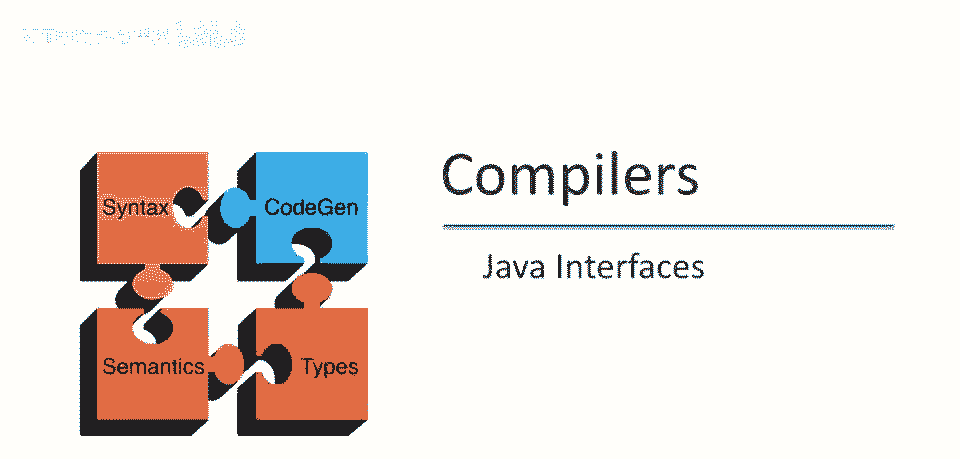
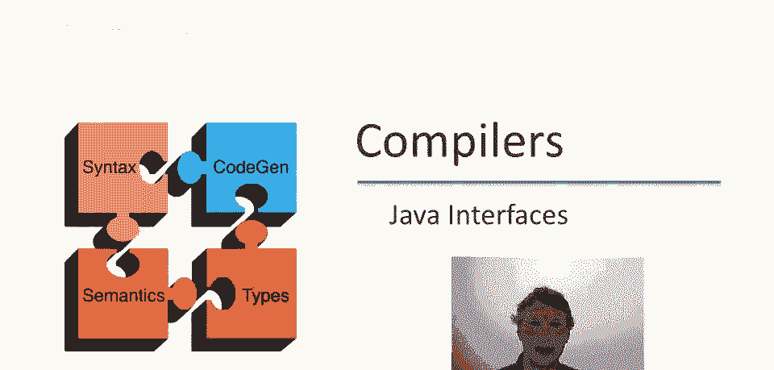
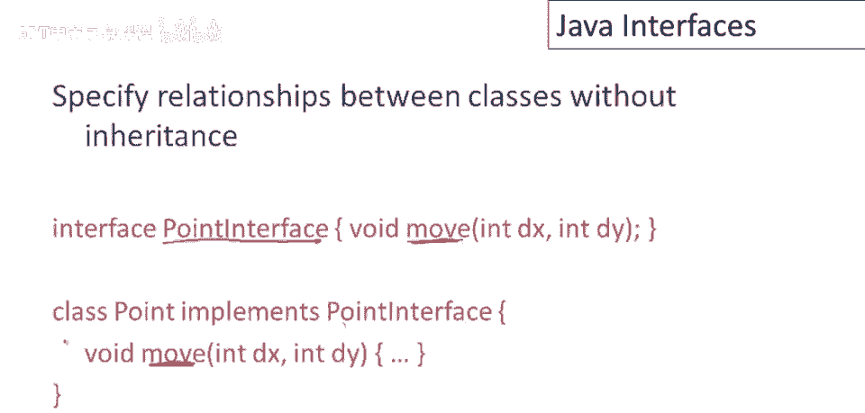
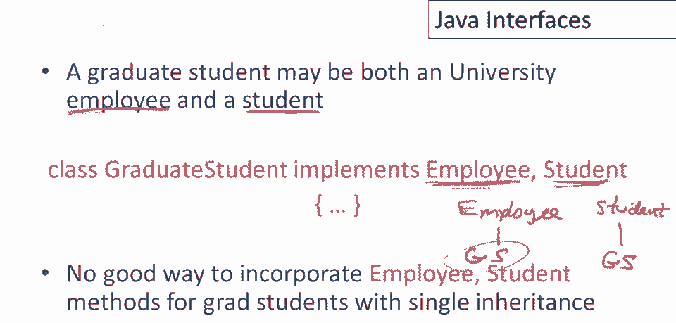
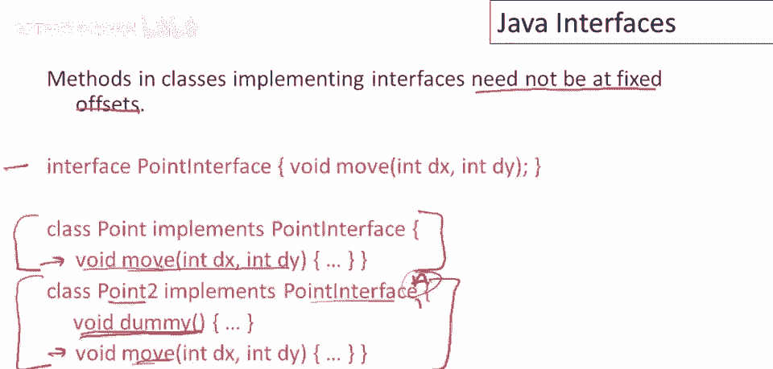
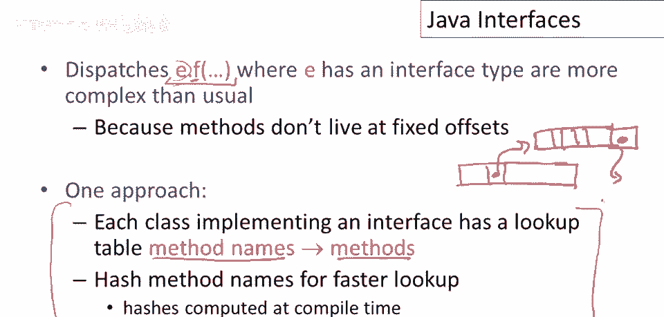

# 课程 P93：Java 接口详解 🧩

在本节课中，我们将要学习 Java 编程语言中的一个核心概念——接口。我们将了解接口是什么，它与继承有何不同，以及如何在程序中有效地使用它。

---

## 什么是接口？ 🤔

接口定义了类之间的关系，但它不使用继承。这是一个例子：我们有一个名为 `Point` 的接口。`Point` 接口可以包含许多方法，我们只声明这些方法的签名。接口中也可以有其他东西，但通常它们主要用于声明方法。

这是一个特定方法的示例：`move` 方法。它接受参数并有特定的返回类型。任何将实现 `Point` 接口的类，都必须提供具有相同签名的方法。因此，因为 `Point` 接口有 `move` 方法，`Point` 类也必须有 `move` 方法，并且其签名必须与接口中声明的完全一致。如果 `Point` 接口还有其他方法，那么 `Point` 类也需要实现那些同名、带适当参数和结果类型的方法。

---

## 接口的作用：模拟多重继承 🔄

上一节我们介绍了接口的基本定义，本节中我们来看看接口的核心作用。

Java 语言手册指出，Java 程序可使用接口，使相关类无需共享抽象超类，或为对象添加方法。接口在 Java 中起到了类似 C++ 中多重继承的作用。原因是，一个类可以实现多个接口。

例如，若我有一个类 `X` 实现了三个接口 `A`、`B` 和 `C`，这意味着 `X` 对象在适当的上下文中可被视为 `A` 对象、`B` 对象或 `C` 对象。这几乎就像 `X` 有三个父类 `A`、`B` 和 `C`。虽然存在一些重要区别，但效果类似。若要让一个类具备多种功能，或实现多个接口的功能，在 Java 中可以直接声明该类实现所有这些接口。

以下是接口的一个应用示例：考虑大学里的研究生。研究生通常是学生，他们上课，具有学生属性，获得学位和成绩等。同时，研究生通常也为大学工作，他们常是课堂助教或研究助理，因此他们还有另一个角色，即大学雇员。

如果在人事管理软件中，我们已经实现了处理学生的功能和处理员工的功能，那么在设计研究生类时，我们希望复用这些功能。一种方法是让研究生类同时实现 `Employee` 接口和 `Student` 接口。这样，研究生就既是员工也是学生。

在单继承体系中，如果有一个 `Employee` 类和一个 `Student` 类，你只能选择其中一个让 `GraduateStudent` 类去继承，从而无法同时获得两者的功能。接口的优势在于，它允许一个类表达与多种不同事物的功能关系，从而实现多重功能。

---

## 接口与继承的区别 ⚖️

可能最大的区别是，实现接口不如继承高效。这就是为什么两者并存，并且如果可以，你倾向于使用继承，因为它通常比接口更高效。

接口效率较低的主要原因是什么？主要原因是，实现接口的类不必将接口中的方法分配到对象内存布局的固定偏移量中。

让我们看一个例子。这是我们的 `Point` 接口。假设我们有一个 `Point` 类实现了 `Point` 接口，并实现了 `move` 方法。同时，我们有另一个类也实现了 `Point` 接口，但还实现了其他不属于该接口的功能。

那么，如何决定 `move` 方法在这两个类中的内存位置呢？如果我们采用类似 C++ 的简单实现方式（方法按声明顺序排列），`move` 方法可能不在这些类的第一个位置。我们可以想象一个编译器优化过程，让 `Point` 接口的所有方法在实现它的任何类中都位于固定位置。但只要我们实现多个接口，这个方法就不起作用了。

假设 `Point2` 类还实现了另一个接口 `A`。如果我们已经决定对于 `Point` 接口，`move` 方法应该首先出现；同时对于 `A` 接口，其某个方法也应该首先出现，这就会产生冲突。通常，没有一个完美的排序方式能为所有方法和接口安排位置，使得它们在实现这些接口的所有类中都能保持一致，尤其是在不预先知道所有未来声明的类和接口的情况下。Java 的设计允许未来扩展，因此接口中的方法不在类中拥有固定的内存偏移量。

---

## 接口是如何实现的？ 🛠️

既然接口方法没有固定偏移量，那么如何实现接口方法的调用分发呢？这比普通的方法调用更复杂。

假设变量 `e` 具有某种接口类型，我们在调用该接口的 `f` 方法。一种可行但效率较低的方法是：每个实现接口的类，都会有一个关联的查找表，将方法名（字符串）映射到具体的方法实现。我们可以对方法名进行哈希以加快查找速度（实际上哈希值可以在编译时计算）。

具体思路是，每个对象内部有一个分发指针，它指向该类常规方法表。在方法表的末尾，可能还有另一个指针，指向一个专门的查找表。这个查找表将接口方法名称映射到具体的方法代码。

因此，与每个类的每个对象相关联，我们都有这样一个查找表，用于映射接口方法名称到其实现。

---

## 总结 📝

本节课中我们一起学习了 Java 接口。我们了解到接口是一种定义类之间关系、但不使用继承的机制。它通过声明方法签名来约定行为，任何实现该接口的类都必须提供这些方法的具体实现。

接口的核心作用在于模拟多重继承，允许一个类具备多种角色或功能，这是单继承体系难以做到的。然而，这种灵活性带来了一定的性能开销，因为接口方法的调用分发机制比普通的继承方法调用更复杂，通常需要通过额外的查找表来实现。

通过理解接口的定义、作用、与继承的区别以及其底层实现原理，我们可以更明智地在 Java 程序设计中运用接口，在代码的灵活性与执行效率之间做出合适的权衡。