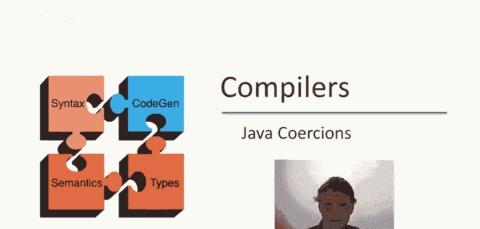
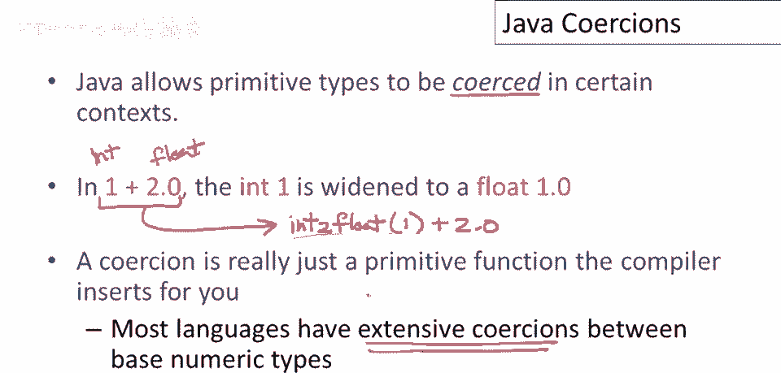
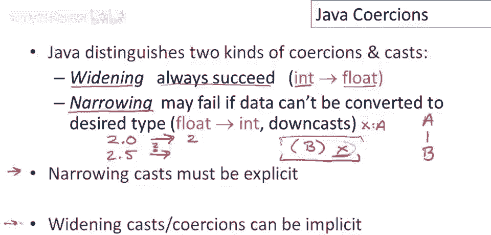

# 课程 P94：Java 中的类型强制转换 🧩

在本节课中，我们将要学习编程语言类型系统中的一个重要概念——**强制转换**。我们将以 Java 语言为例，探讨编译器如何自动或根据指令在不同类型之间进行转换，以及这种机制带来的便利与潜在问题。



---

## 什么是强制转换？🤔

上一节我们介绍了课程的主题。本节中，我们来看看强制转换的基本定义。

许多编程语言都具备**强制转换**的特性。在 Java 中，它允许在某些上下文中将一种原始类型转换为另一种类型。

考虑表达式 `1 + 2.0`。这里的困难在于，`1` 是整数（`int`），而 `2.0` 是浮点数（`float` 或 `double`）。不同类型的数据无法直接进行加法运算。

在执行操作前，必须将它们转换为统一的表示。通常的做法（也是 Java 的做法）是将整数转换为浮点数，即 `1.0`。

理解强制转换的一种有效方式是：**它们就像是编译器为你自动插入的原始函数**。当你遗漏了必要的类型转换时，编译器会注意到并帮你补上。

在这个例子中，可以认为存在一个将整数转换为浮点数的原始函数 `intToFloat`。因此，表达式 `1 + 2.0` 实际上被编译器转换为：
```java
intToFloat(1) + 2.0
```
强制转换本质上是为程序员提供的一种便利，让你在类型转换显而易见时，无需显式编写转换代码。这种机制在数字类型之间尤为常见，并不仅限于 Java。



---

## Java 中的两种转换：扩展与窄化 ⚖️

理解了强制转换的基本概念后，本节我们来看看 Java 如何对它们进行分类。

Java 明确区分两种类型的转换：**扩展强制转换**和**窄化强制转换**。

以下是两种转换的核心区别：

*   **扩展强制转换**：这种转换总是安全的，能够成功。编译器或运行时系统不会对此报错。
    *   **例子**：从 `int` 到 `float` 的转换。因为浮点数可以无损地表示整数范围内的值。
*   **窄化强制转换**：这种转换可能失败。
    *   **例子1**：从 `float` 到 `int`。`2.0` 可以转换为 `2`，但 `2.5` 没有直接的整数表示。Java 会阻止这种可能导致信息丢失或错误的隐式转换。
    *   **例子2**：向下转型。假设有类 `A` 和其子类 `B`。一个 `A` 类型的变量 `x` 可以被强制转换为 `B` 类型 `(B)x`。编译器会允许此代码通过类型检查，但在**运行时**，系统会检查 `x` 实际引用的对象是否是 `B` 的实例。如果不是，则会抛出异常。

Java 的规则是：**窄化转换必须是显式的**。你必须在代码中明确写出类型转换操作（如 `(int)floatValue` 或 `(B)aObject`），这表明你确实意图进行此操作。而扩展强制转换可以是隐式的，由编译器自动完成。

---

## 一个特殊的类型：布尔值 🚫



讨论了数值和对象类型的转换后，我们来看一个 Java 中的特例。

在 Java 中，有一个原始类型**没有定义任何到其他类型的隐式或显式强制转换**。

这个类型就是 **`boolean`**。

因此，你不能将 `boolean` 值（`true` 或 `false`）直接转换为数字（如 `1` 或 `0`）或其他任何类型，这在 Java 中是不被允许的。


---

## 强制转换的潜在问题与示例 ⚠️

虽然强制转换带来了便利，但它也可能导致程序行为与程序员的预期不符。本节我们通过一个历史语言中的例子来理解其潜在风险。

以 IBM 在 20 世纪 60 年代设计的 PL/I 语言为例，它拥有非常广泛的强制转换规则，有时会导致令人惊讶的结果。

考虑以下 PL/I 代码片段，其中 `a`, `b`, `c` 被声明为长度为 3 的字符串：
```
b = ‘123’;
c = ‘456’;
a = b + c;
```
问题是，变量 `a` 的结果是什么？

以下是运算步骤：
1.  **表达式解释**：`b + c` 中的 `+` 被解释为**整数加法**。因此，字符串 `b` 和 `c` 被强制转换为整数 `123` 和 `456`。
2.  **整数运算**：两者相加得到整数结果 `579`。
3.  **结果转换**：由于 `a` 是长度为 3 的字符串，整数 `579` 需要被转换回去。
4.  **转换步骤**：
    *   首先，整数 `579` 被转换为**默认长度（假设为6）的字符串**，结果可能是 `" 579"`（前面有3个空格）。
    *   然后，这个6字符的字符串被**截断**为 `a` 所要求的3个字符长度，只取前3个字符。
5.  **最终结果**：`a` 的值是三个空格 `" "`。

这个结果显然不是将 `"123"` 和 `"456"` 作为字符串连接起来的预期结果 `"123456"`。这个例子展示了过度依赖隐式强制转换可能带来的混淆。

---

## 总结 📝

本节课中我们一起学习了 Java 中的类型强制转换。


我们首先了解了强制转换是编译器自动插入类型转换函数的一种便利机制。然后，我们区分了 Java 中**扩展强制转换**（隐式、安全）和**窄化强制转换**（显式、可能失败）两种类型，并特别指出 `boolean` 类型不允许任何转换。最后，我们通过一个历史语言的例子，探讨了隐式强制转换可能带来的出人意料的行为，提醒我们在享受便利的同时，也需对类型转换保持清晰的认识。