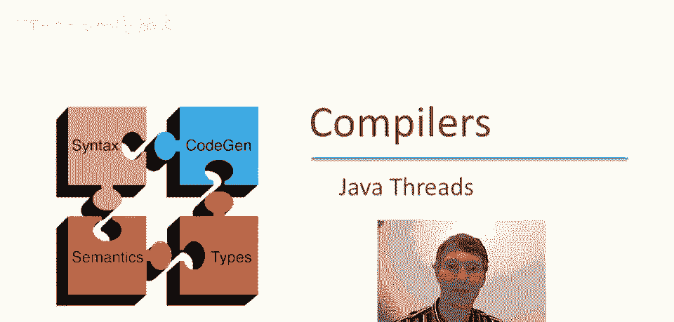
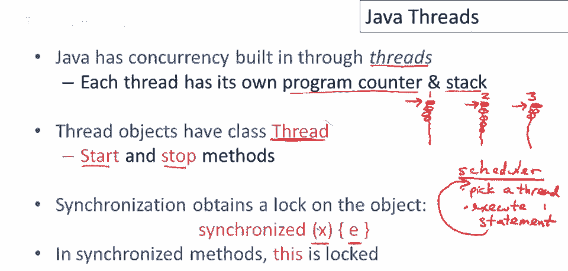
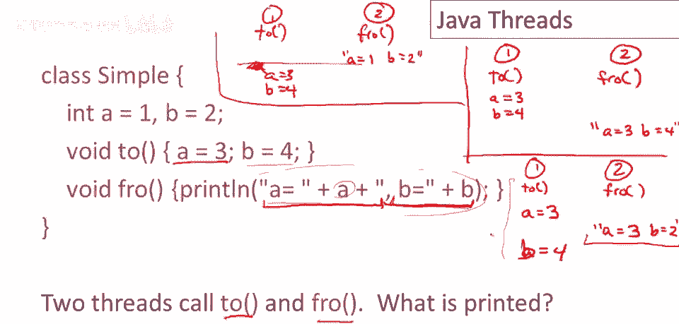

# 课程 P95：Java 线程入门 🧵



在本节课中，我们将要学习编程语言中的并发概念，特别是 Java 中线程的基本使用方法。我们将了解线程如何工作，如何通过同步来控制线程间的交互，以及 Java 并发编程中一些需要注意的关键点。

---

## 什么是线程？🤔

上一节我们介绍了课程概述，本节中我们来看看线程的基本概念。

Java 语言内置了对并发的支持，主要通过线程实现。本教程假设您对线程已有一定了解，这里仅作简单回顾。线程类似于一个独立的程序，它拥有自己的程序计数器（用于跟踪下一条要执行的指令）、局部变量和激活记录（用于管理函数调用）。

在 Java 或任何支持线程的语言中，一个程序可以同时运行多个线程。抽象地看，每个线程都在执行一系列语句，并拥有自己的局部变量。但它们可以引用共享的数据，例如相同的堆数据结构。



假设有三个线程（线程一、线程二、线程三）在程序中执行各自的指令。调度器负责决定哪个线程在何时执行。概念上，调度器会循环执行以下操作：选择一个线程，让它执行一条语句，然后重复此过程。例如，它可能先选择线程一执行一条语句，然后切换到线程二，再切换到线程三，之后可能又回到线程二或线程一执行多条语句。

线程的执行顺序是不确定的。每次执行时，哪个线程运行、运行多少条指令都可能不同。线程的指令可能会以各种方式交错执行，顺序几乎是随机的。

---

## 如何在 Java 中创建和使用线程？⚙️

了解了线程的基本概念后，本节我们来看看在 Java 中如何具体实现线程。

在 Java 中，所有线程对象都基于 `Thread` 类。要创建一个线程，通常需要继承这个特殊的 `Thread` 类。继承后，您的类将拥有 `start` 和 `stop` 等方法，用于启动和结束线程。

线程有一个重要特性：它们可以同步对象。这意味着线程可以通过同步构造来获取对象的锁。在 Java 中，同步的主要方式是通过 `synchronized` 关键字。

以下是同步的基本语法：
```java
synchronized (x) {
    // 执行表达式 e
}
```
这段代码意味着，在执行块内的代码之前，程序会先获取对象 `x` 的锁。执行完毕后，会释放锁。这是一种结构化的同步方式，也是 Java 中控制多线程交错执行的主要（几乎是唯一）方法。当一个线程执行这段同步代码时，其他试图锁定同一对象 `x` 的线程必须等待。

两个线程能否同时执行相同的同步代码块？如果它们的局部变量 `x` 指向不同的对象，那么它们互不干扰，可以同时执行。只有当它们试图锁定**同一个**对象时，执行才不会交错。

Java 中还有一种更常用的简写形式，可以将 `synchronized` 关键字直接应用于方法：
```java
public synchronized void methodName() {
    // 方法体
}
```
当 `synchronized` 附加在方法声明上时，意味着调用此方法时会自动锁定**当前对象**（即 `this`）。

---



## 一个简单的线程交互示例 🔄

现在我们已经知道了如何创建线程和使用同步，本节我们通过一个具体例子来看看线程间可能如何交互，以及同步的重要性。

假设我们有一个 `Simple` 类，它有两个方法 `two` 和 `fro`，以及两个共享的整型变量 `a` 和 `b`。

```java
class Simple {
    int a = 1;
    int b = 2;

    public void two() {
        a = 3;
        b = 4;
    }

    public void fro() {
        System.out.println("a = " + a + ", b = " + b);
    }
}
```
现在，假设线程一调用 `two()` 方法，线程二调用 `fro()` 方法。我们来看看几种可能的执行结果：

以下是几种可能的执行顺序：
1.  **顺序执行一**：线程一先完整执行 `two()`，然后线程二执行 `fro()`。输出将是：`a = 3, b = 4`。
2.  **顺序执行二**：线程二先完整执行 `fro()`，然后线程一执行 `two()`。输出将是：`a = 1, b = 2`。
3.  **交错执行**：线程一执行了 `a = 3;` 后，线程二开始执行 `fro()`。它可能先读取 `a`（值为3），在读取 `b` 之前，线程一又执行了 `b = 4;`，但线程二读取到的 `b` 可能仍是旧值2。最终输出可能是：`a = 3, b = 2`。这展示了一个“中间状态”，即一个线程只完成了部分更新。

如果我们认为第三种交错执行产生的输出是错误的（即看到了不一致的数据状态），我们就需要使用同步来防止这种情况。

---

## 一个常见且错误的同步尝试 ❌

上一节我们看到线程交错可能导致问题，本节我们来看一个试图修复但**失败**的同步尝试，这是一个 Java 程序员常犯的错误。

常见的错误想法是：只有写入数据的方法需要同步，读取数据的方法是安全的，可以不同步。基于此，可能只同步 `two()` 方法：

```java
class Simple {
    int a = 1;
    int b = 2;

    public synchronized void two() {
        a = 3;
        b = 4;
    }

    public void fro() { // 注意：这里没有同步！
        System.out.println("a = " + a + ", b = " + b);
    }
}
```
这个修复是无效的。因为 `fro()` 方法没有同步，它不会去检查对象锁。即使线程一正在执行同步的 `two()` 方法并持有锁，线程二仍然可以自由地进入并执行 `fro()` 方法。因此，之前提到的所有交错情况（包括看到中间状态）仍然可能发生。


**核心问题**：同步只有在所有访问共享数据的方法都进行检查（即都同步）时才有效。无论是读者（`fro`）还是写者（`two`），都需要同步。

---

## 正确的同步方式 ✅

认识到错误后，本节我们来看看正确的做法。

正确的解决方案是将 `synchronized` 关键字放在**两个**方法上：

```java
class Simple {
    int a = 1;
    int b = 2;

    public synchronized void two() {
        a = 3;
        b = 4;
    }

    public synchronized void fro() {
        System.out.println("a = " + a + ", b = " + b);
    }
}
```
现在，当两个方法都同步后，可能的执行结果就只有两种了：
1.  `fro()` 在 `two()` 之前完整执行，输出：`a = 1, b = 2`。
2.  `two()` 在 `fro()` 之前完整执行，输出：`a = 3, b = 4`。
不可能再出现看到部分更新的中间状态。

---

## Java 并发的其他重要注意事项 ⚠️

掌握了基本的线程创建与同步后，本节我们补充一些 Java 并发编程中其他重要的知识点。


**1. 原子性与“凭空出现”的值**
我们希望的一个基本属性是：即使没有同步，一个变量也应该只持有由某个线程实际写入的值。例如，线程一写 `a = 3.14`，线程二写 `a = 2.78`。执行后，`a` 的值应该是 3.14 或 2.78，而不应该是从未被写入过的值（如 3.78）。这种混合了不同写入片段的值被称为“凭空出现”的值。

Java 保证了大多数基本数据类型（如 `int`, `boolean`）的读写是原子的，但 **`double` 和 `float` 除外**。因为 `double` 占64位（两个字），在有些硬件平台上，对其的写入可能需要多条指令，从而可能被其他线程的写入操作交错，导致位混合。

**解决方案**：如果需要在多线程环境中并发读写 `double` 或 `float` 变量，应将其声明为 `volatile`：
```java
private volatile double a;
```
`volatile` 关键字可以保证对 `double` 的读写是原子的（在当前Java规范下）。这是一个对性能的折衷，未来可能会改变。

**2. Java 并发语义的复杂性**
Java 是最早将线程作为一等公民的主流语言之一，并试图将其与丰富的语言特性集成。因此，其完整的并发语义非常复杂且难以精确理解，某些边界情况下的行为甚至仍是研究和争论的领域。对于大多数直接、常见的并发任务，Java 线程工作良好。但如果你进行非常复杂或底层的并发编程，可能需要更深入地研究 Java 内存模型等规范。

---

## 总结 📝

本节课中我们一起学习了 Java 线程的基础知识：
1.  **线程概念**：线程是独立的执行流，拥有自己的计数器和局部变量，但可共享数据。
2.  **线程创建**：通过继承 `Thread` 类来创建线程。
3.  **线程同步**：使用 `synchronized` 关键字（代码块或方法）来获取对象锁，控制线程对共享资源的访问，避免数据不一致。
4.  **常见错误**：只同步写入方法而不同步读取方法是无效的，**所有访问共享数据的方法都需要同步**。
5.  **注意事项**：`double` 和 `float` 类型的读写不是原子的，在多线程环境下应使用 `volatile` 声明。Java 的完整并发语义较为复杂，对于常规使用是足够的。

理解这些基础是编写正确、可靠的多线程 Java 程序的关键。