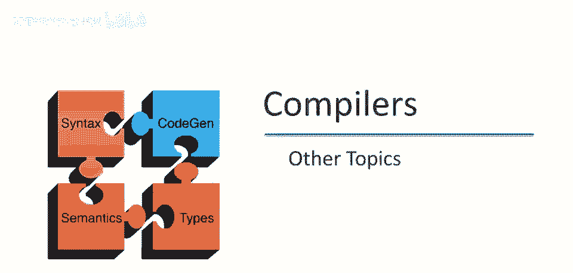
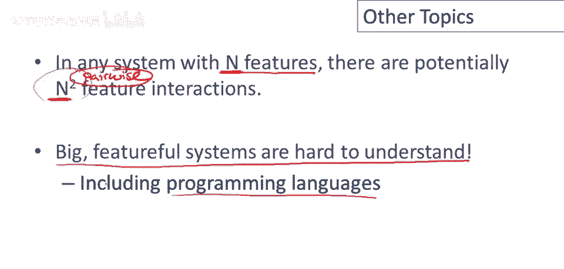

# 课程P96：Java语言的其他主题 🧩

在本节课中，我们将结束对Java语言的讨论，通过了解几个附加主题及其在语言设计中的体现。我们将探讨Java的动态类加载、字节码验证、复杂的类初始化过程，并从中理解设计复杂系统时特性交互所带来的挑战。

***

## 动态类加载与字节码验证 🔄

上一节我们介绍了Java语言的整体框架，本节中我们来看看Java的动态特性之一：运行时类加载。

Java允许在运行时动态加载类。这意味着可以向正在执行的Java程序中添加新功能。然而，这种动态性也带来了类型安全和安全性方面的问题。

编译时和加载时存在区别。源代码的类型检查在编译时进行，这是我们之前讨论过的类型检查。但类加载器在加载类时，加载的是字节码，而非源代码。这些字节码不会被再次进行类型检查，并且可能来自不可信的来源。

这些字节码可能不是由经过类型检查的编译器生成的。在生成字节码之前，它们可能不满足任务实现的类型假设。因此，必须在类被加载时再次检查字节码。这个过程称为**字节码验证**。

字节码验证本质上是对字节码进行类型检查。由于字节码的抽象级别更低，其算法与源码类型检查略有不同，但其核心目的仍是进行类型检查。加载策略由**类加载器**处理。

类加载器是Java中的一个特殊类，它决定哪些类可以被加载。在Java早期，曾发现一系列安全问题，攻击者可以控制类加载器，安装比标准类加载器更宽松的自定义类加载器，从而破坏系统。但这些问题早已被修复。

Java另一个有趣的特点是类也可以被卸载。这意味着不仅可以加载类，也可以卸载类。不过，类卸载的具体语义（例如，该类的现有对象会发生什么）在定义上并不完全明确。

***

## 复杂的类初始化过程 ⚙️

了解了动态加载后，我们来看看Java中另一个复杂的机制：类初始化。这相当复杂，因为Java是Cool语言的超集，它继承了Cool的所有初始化问题，并因并发等特性而变得更加复杂。

事实上，如果你想理解一门新的面向对象语言，研究其对象和类的初始化过程是一个很好的切入点。因为在初始化过程中，语言的所有特性都会相互作用，必须清晰地定义这些交互。

现在让我们谈谈**类初始化**（即代表类的那个类对象是如何初始化的），而不讨论对象实例的初始化。

首先需要知道的是，类是在其内部的符号**首次被使用时**初始化的，而不是在类被加载时。这样做的原因是，如果类初始化中有错误，错误会在一个可预测的位置发生。这使得错误是可重复和可预测的。如果错误发生在加载时，而加载可能发生在多个不确定的时间点，那么错误的发生将变得非确定性。

以下是Java中初始化类对象的主要过程步骤：

1.  **获取锁**：首先，尝试锁定该类的类对象。如果已被其他线程锁定，则等待。
2.  **检查状态**：获得锁后，检查类是否已被初始化。
    *   **情况A**：发现当前线程已经在初始化这个类（由于递归结构，例如类有一个类型为自己的字段）。此时释放锁并返回。
    *   **情况B**：发现类已被其他线程初始化完毕。此时无事可做，正常返回。
3.  **标记初始化**：如果类既未初始化，当前线程也非正在初始化它，则标记该类“正在由本线程初始化”，然后**解锁**。
4.  **初始化超类**：递归地初始化其超类。
5.  **初始化字段**：按文本顺序初始化所有静态字段。但在初始化任何其他字段之前，会先为所有字段赋予默认值，并优先初始化**静态最终（`static final`）字段**。
6.  **处理结果**：
    *   **若出现异常**：在初始化过程中如果抛出异常，则将类标记为“错误”状态，此类将不可用。
    *   **若成功**：再次锁定类，将其标记为“已初始化”，然后通知所有正在等待该类对象的线程，最后解锁。

这个过程简化了一些细节，但涵盖了主要观点，展示了并发、异常、静态/最终字段、继承等特性是如何交织在一起的。

***

## 系统设计中的特性交互难题 🤔

退一步看，关于Java类初始化的讨论阐明了一个关于设计复杂系统的普遍观点。

任何具有一定数量特性（设为 `n`）的系统，随着特性的增加，特性之间潜在的交互数量会超线性增长。如果只考虑两两交互，其数量级约为 `O(n²)`。这意味着每增加一个新特性，都需要考虑它与系统中所有现有特性的交互。

如果开始考虑特性子集之间的交互，那么潜在交互的数量将呈指数级增长。这就是为什么构建或扩展具有众多特性的系统非常困难。

这个教训适用于任何复杂系统的设计，尤其在编程语言设计中力量显著。因为语言特性间的交互发生在非常细的粒度上，并且可以任意组合。语言设计者必须厘清所有这些交互，程序员才能有效理解和使用这门语言。这是本课程希望传达的重要思想之一。

***

## 总结与课程结束 🎯

本节课中，我们一起学习了Java语言的几个高级主题。

总结并结束我们对Java的讨论：Java是一种在工业标准上做得非常出色的语言。它是当今设计最完善、规范最严谨的流行语言之一，并将一些重要思想（如强静态类型和垃圾回收内存管理）引入了主流。

但这并不意味着它是完美的。Java包含一些在设计时并未被完全理解的功能，这些可能构成了语言设计中仍显粗糙的部分。例如，并发时的内存语义可能仍存在一些多数人认同的问题和灰色地带。此外，正如之前所述，特性众多会导致复杂的交互，使得系统难以管理和理解。

**本节课中我们一起学习了：**
1.  Java的动态类加载机制及其伴随的字节码验证过程。
2.  Java中复杂的类初始化流程，它集中体现了多种语言特性的交互。
3.  从Java初始化机制中引申出的关于复杂系统设计中“特性交互”难题的普遍思考。
4.  对Java语言整体的评价：其成就与遗留的挑战。

至此，我们关于Java语言的专题讨论就告一段落了。