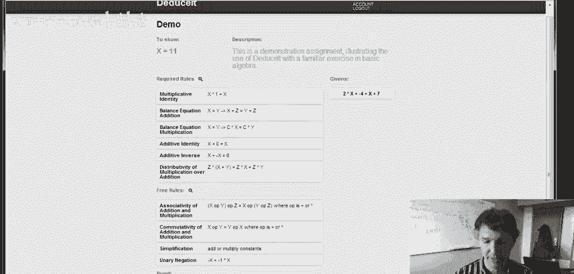
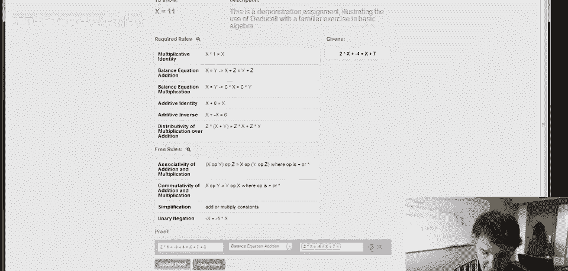
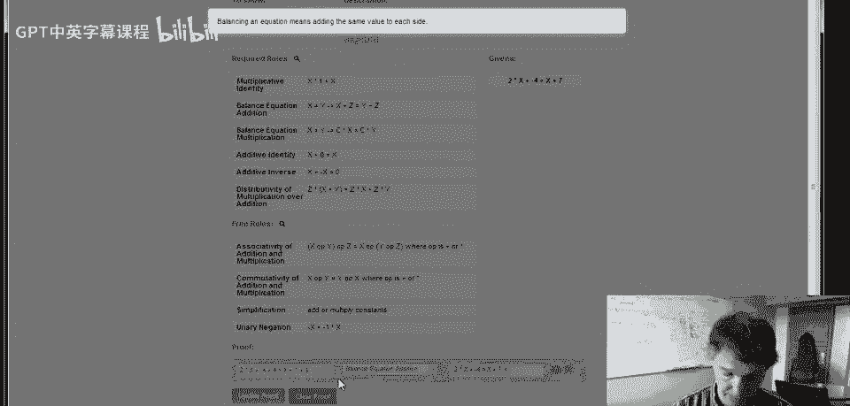
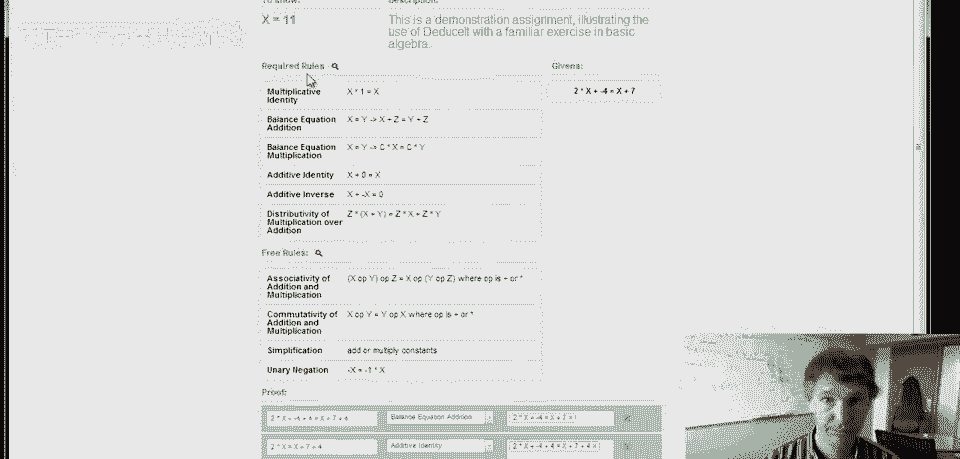

# P97：p97 DeduceIt_Demo - 加加zero - BV1Mb42177J7

你好，在这段视频中，我将展示斯坦福大学演绎CEA研究项目的演示，以帮助学生在在线课程中学习正式系统，演绎它的基本思想是让学生完成正式推导，并使用他们的改进技术，这将检查那些推导是否正确。

这样你实际上可以学习形式推理的细节，所以让我们看看一个例子，这是一个代数小练习，我们的目标是证明x等于十一，好吧，这是我们正在努力实现的目标，我们从这个等式开始，2x减4等于x加7，一般来说。

这个特定练习中可能不止一个初始给定假设，这里只有一个，我们想从那个等式开始，我们想证明x等于十一，为了到达那里，我们可以使用任何列出的规则，我用鼠标圈出的那些，这些规则分为两类，这里有必需的规则。

这是顶部的这个第一组，必需的规则是必需的，因此，每当我们的推导步骤使用这些规则之一时，我们必须明确命名它，我们必须明确显示那一步，然后有一些规则被认为是自由的，这些规则我们不需要显示，所以，例如。

我们不需要显示所有涉及加法和乘法结合律的步骤，假设我们的老师已经说过我们理解了这一点，我们允许跳过这些步骤，系统将尝试填补它们，所以这些下面的规则，我们可以显示它们，如果我们喜欢，但它们是可选的。

我们允许跳过这些步骤，好吧，所以让我们开始，呃，处理这个，并且推导的每一步都将有三个部分，它将有一个结论，所以一些我们在这一步中正在证明的东西，我们会有理由，所以这一步遵循的规则，最后。

我们将使用哪些先前的事实，我们已经知道是真的，好吧，我们开始用哪个规则？然后我们从中得出什么结论？如何在这个例子中取得进步？我们可以在等式两边加4，为什么这样做合理？我们用了哪个规则？这是平衡方程。

使用上面的加法规则，它说在等式两边加相同的东西是可以的。

所以我们会从可能规则列表中选择这个规则，然后，嗯，我们使用了什么假设？目前我们只有一件事，这是我们开始时给定的基础，所以这是我们推导的一步，我们认为这是正确的，我们点击更新证明，系统回来确认确实如此。

是的，这是推导中有效的一步，好的，现在让我们再做一步，实际上让我们看看这里会发生什么，如果我们正确平衡方程，假设我们两边没加相同项，那么让我们试试，我们得到什么？我们看到现在变红了，表示有错误。

这里没给下一步填充，好，因为这一步不对，但我们也看到这有个问号图标，我们可以点击它。

它告诉我们出了什么问题，给了我们一些建议，平衡方程意味着两边都要加相同的值，好的。

所以有了这个建议，我们或许能找出哪里错了并纠正这一步，然后回到我们现在的正轨上，应该说不是每个错误步骤都有建议，但如果有了，你知道你，你可以点击了解详情，你可能确实做错了，现在让我们继续，看看这个。

看我们能做好什么，我们尝试简化左半部分，所以左边等于2x，右边，X加7加4，我们认为这里可以，因为你知道4加负4，只是加常数，这是我们免费规则之一，好的，所以我们可以加常数，你知道，和和和得到零。

我们应该能做些什么免费的事，好吧，这遵循我们之前的步骤，所以我们选择那个，现在我们可以更新，它回来说，哦，我们做错了什么，所以这不立即遵循前一步。

实际上这里有一个提示，所以我们可以看到为什么，我们看到，哦，加法恒等式是必需的规则。

那么我们犯了什么错误呢，你知道，把四和负四加在一起得到零是可以的，不需要显示，因为那只是乘法常数，但随后的一步，我们说的2x加零等于2x，这是我们实际上需要在这个练习中显示的。

所以每当我们使用加法恒等式，我们必须明确地说，所以我们可以我们可以修复它，说是的，实际上这一步实际上遵循加法恒等式从上一个，和所有在那一步中使用的免费规则，所以我们不需要命名它们，对吧。

所以现在我们可以继续，我们也可以简化左边的，你最好清理一下，这只是免费规则，我们不需要确切地说我们使用的是哪个规则，我想我那里没有更新，好的，所以现在，嗯，我想我意外地按了两次，呃。

所以让我们去掉其中一个步骤，好的，所以现在，嗯，下一步我们要执行什么，嗯，看起来我们需要把x移到左边，所以我们要在两边都加上一个负x，所以我有2x加负x等于x加11加负x，好的，那又是。

使用加法规则的平衡方程，这遵循我们上一步，好的，我们可以去掉那个，当我们更新那个，那没问题，好的，现在我们可以对左边的进行简化，我的意思是，抱歉，在右边，请原谅，因为所有这些都等于十一，好的，呃。

然后我们必须使用x加负x等于0，然后我们只是加十一和零，所以那可以算作加常数，所以这应该遵循，呃，从之前的加法逆元步骤，如果我们更新那个，是的，那解决了，现在我们只需要处理左边，我们有两个x加负x。

为了把它变成可以简化的形式，我们需要使用分配律，我们需要拉出常数，呃，那些在x前面的，我们可以做到，我们可以说，嗯，二加负一乘x等于十一，所以我们使用了分配律，但我们也在使用一元负数规则，说。

你知道负x等于负一乘x，但那是免费规则，所以我们不必担心那个，所以我们只需要命名分配律，并且那遵循之前的推导步骤，我们更新那个，好的，现在我们就快到了，所以现在我想一步就能完成简化。

我们可以从二减一得到一，然后有一乘x等于十一，那是乘法恒等式，这是这个特定练习所需的规则，遵循之前的步骤，像所有其他，我喜欢所有之前的步骤，呃，现在我们完成了，现在我们已经证明了x等于十一。

系统知道我们已经完成了作业，这是背后的基本想法，演绎它，这个例子虽为代数，任何形式系统皆可，呈现练习规则集。

