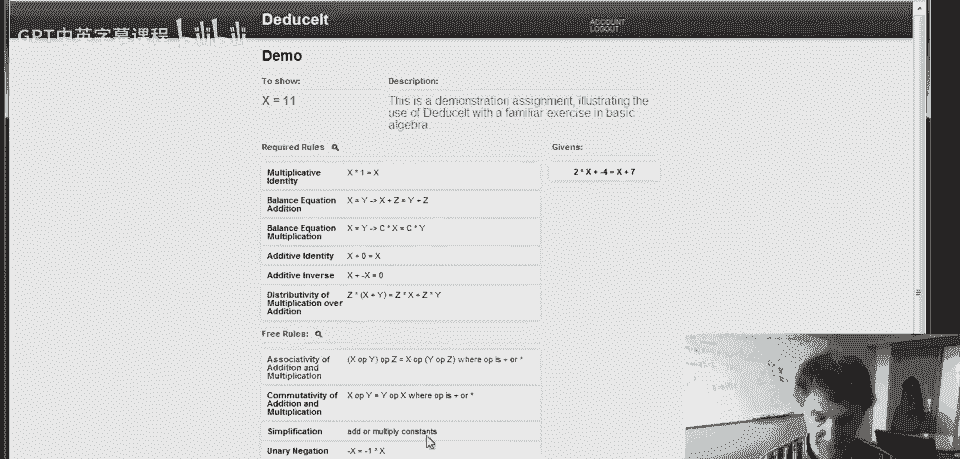
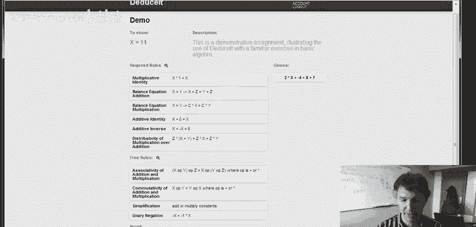
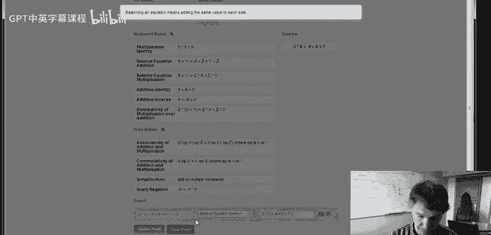
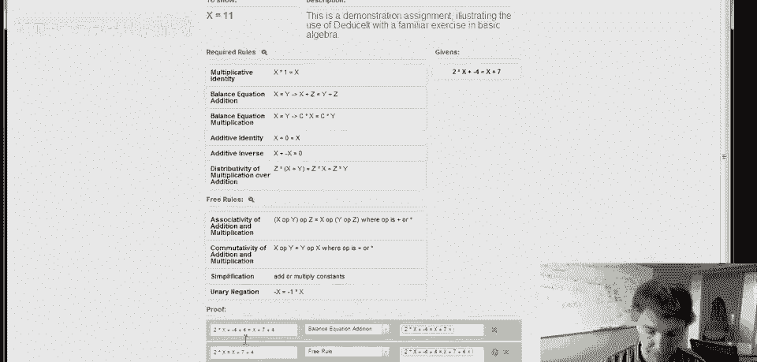
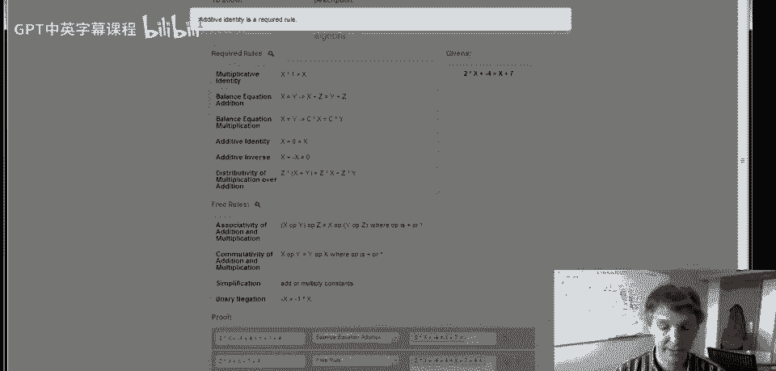
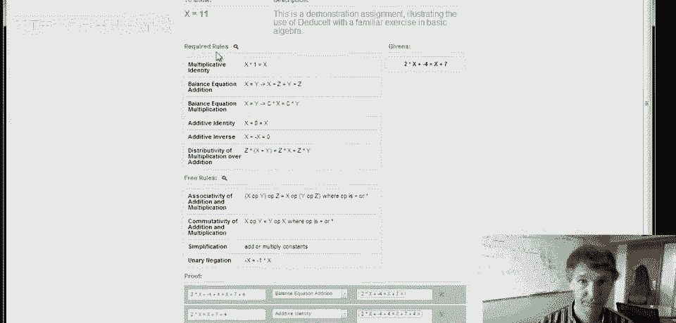

# 课程 P97：DeduceIt 系统演示教程 🧮

在本节课中，我们将学习如何使用斯坦福大学演绎CEA研究项目的演示工具——DeduceIt。该系统旨在帮助学生在在线课程中学习形式系统。其核心思想是让学生完成形式推导，并使用系统提供的即时反馈技术来检查推导步骤的正确性。通过这种方式，学生可以深入理解形式推理的细节。

## 概述：系统界面与规则分类

上一节我们介绍了DeduceIt系统的目标。本节中，我们来看看一个具体的代数证明示例及其界面。

我们的目标是证明 **`x = 11`**。证明从一个给定的等式开始：**`2x - 4 = x + 7`**。在系统中，可用的推导规则分为两类：

以下是两类规则的说明：
*   **必需规则**：位于规则列表顶部。每当推导步骤使用这些规则时，必须明确命名并显示该步骤。
*   **自由规则**：位于规则列表下方。使用这些规则时，步骤可以跳过，系统会尝试自动填补。这些规则（如加法结合律）被认为是已掌握的，可以省略以简化推导过程。

推导的每一步都包含三个部分：
1.  **结论**：这一步要证明的命题。
2.  **理由**：这一步所依据的规则。
3.  **依据**：这一步所依赖的、先前已证明为真的事实。

## 第一步：应用平衡方程规则

现在，让我们开始推导。第一步是如何取得进展？我们可以在等式两边同时加上4。

这一步的合理性在于“平衡方程”的加法规则，它允许在等式两边加上相同的量。

我们选择“平衡方程（加法）”这条必需规则。依据是目前唯一已知的事实，即初始给定的等式。点击“更新证明”后，系统确认这一步是有效的。

> 

## 错误处理与系统提示

如果操作错误会怎样？例如，如果在等式两边添加了不同的值，系统会立即用红色高亮显示错误。

此时，步骤旁边会出现一个问号图标。点击它可以查看错误详情和修正建议。例如，系统会提示“平衡方程意味着两边都要加相同的值”。

> 
> 

并非所有错误都有详细提示，但当提示出现时，它能有效帮助定位问题。

## 应用简化与必需规则

回到正确的推导路径。下一步是简化表达式。左边 `2x - 4 + 4` 可简化为 `2x`，右边 `x + 7 + 4` 可简化为 `x + 11`。

这里，将 `-4 + 4` 合并为 `0` 属于自由规则（加常数），可以跳过。但是，将 `2x + 0` 简化为 `2x` 需要使用“加法恒等式”规则，而这是一条必需规则，必须明确显示。

如果我们错误地跳过了必需规则，系统会报错并给出提示。

> 
> 

修正后，这一步应声明使用了“加法恒等式”规则，并依据上一步的结论。而其中涉及的常数合并等自由规则则无需列出。

## 后续推导步骤

完成简化后，我们得到 `2x = x + 11`。后续步骤遵循类似的模式：

1.  **移项**：两边加上 `-x`，使用“平衡方程（加法）”规则，得到 `2x + (-x) = x + 11 + (-x)`。
2.  **简化右边**：`x + (-x)` 运用“加法逆元”（必需规则）得到 `0`，`11 + 0` 运用“加法恒等式”（必需规则）得到 `11`。于是右边简化为 `11`。
3.  **处理左边**：将 `2x + (-x)` 转化为 `(2 + (-1)) * x`，这需要用到“分配律”（必需规则）。其中 `-x` 转化为 `(-1)*x` 属于自由规则，可跳过。
4.  **最终简化**：计算 `2 + (-1)` 得到 `1`（自由规则），然后运用“乘法恒等式” `1 * x = x`（必需规则），最终得到 `x = 11`。

当推导出目标结论 `x = 11` 时，系统会识别出证明已完成。

## 总结与系统通用性

本节课中，我们一起学习了使用DeduceIt系统进行形式推导的全过程。我们了解了必需规则与自由规则的区别，掌握了每一步需要填写的结论、理由和依据。我们还体验了系统的即时错误检查和提示功能，这对于学习正确的推理流程至关重要。

需要强调的是，虽然本例是代数证明，但DeduceIt系统适用于任何形式系统。教师可以为其定义不同的规则集，让学生练习逻辑、集合论或其他领域的正式推导。

> 

通过这种交互式、有反馈的练习，学生能够扎实地掌握形式推理的核心技能。