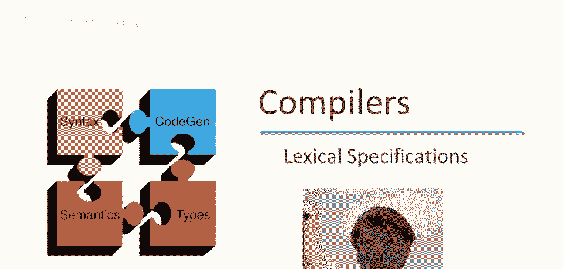
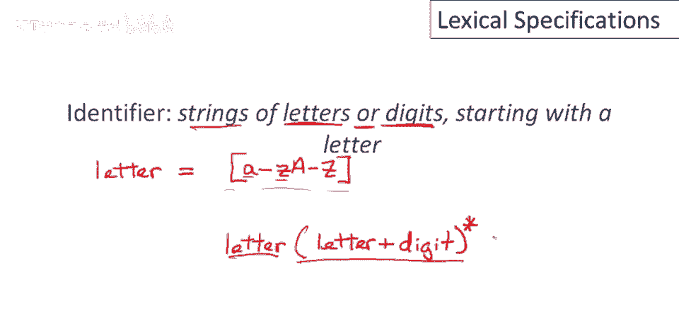
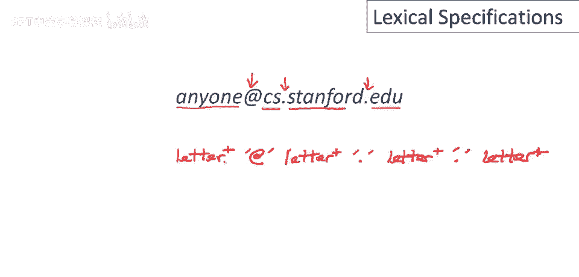
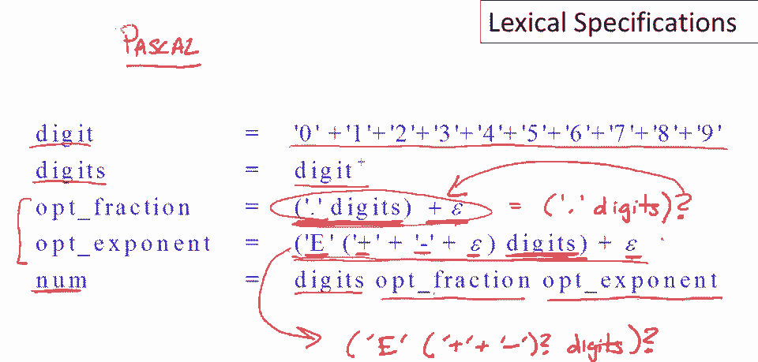

# 【编译原理 CS143 】斯坦福—中英字幕 - P11：p11 03-05-_Lexical_Specific - 加加zero - BV1Mb42177J7

欢迎回到本视频，将展示如何使用正则表达式指定编程语言的不同方面。

从关键字开始，这是一个相对简单的案例，仅对3个关键字进行操作，为if else或then编写正则表达式，如何为更多关键字编写将显而易见，为if编写正则表达式，即为i的正则表达式，后跟f的正则表达式。

这是这两个正则表达式的连接，然后将与else的正则表达式联合，那是什么？else由4个单独字符组成，因此必须写出这4个字符的连接，如您所见，这有点冗长，所有这些引号和混乱的阅读，实际上有一种常用的简写。

现在让我切换到那个，若要编写单个字符序列的正则表达式，只需在序列最外层字符周围放置引号，例如，大多数工具将允许您编写此内容，我在开头放置引号，我写i f然后写闭引号，这完全等同于这个。

这是两个单个字符正则表达式的连接，类似地对于else，类似地对于them，如果有更多关键字，只需将它们全部写出并联合在一起，现在考虑一个稍微更复杂的例子，让我们思考如何指定整数。

我们希望它们是数字的非空字符串，这里第一个问题是写出数字是什么，这相当直接，数字只是0到9的单个字符中的任何一个，我们已经知道如何编写单个字符的正则表达式，只需将这10个指定此的联合起来，只需片刻，嗯。

完成那里我们走，这是一个对应所有单个数字字符串的正则表达式集合，因为我们将不时地引用它，并且因为这是一个非常常见的事情想要做，大多数工具都有命名正则表达式的功能，例如，我可以将其命名为digit。

单个数字是任何由这个正则表达式生成的或属于该集合的，现在我们要做的是多个数字，好吧，我们知道如何做到这一点，我们知道如何做到这一点，我们可以遍历，嗯，这个，任意多次的单数，因此我们得到所有字符串。

所有可能的数字字符串，这非常接近我们想要的，除了我们想要的字符串不能为空，我们不把空字符串算作整数，这是一个简单的解决方法，我们只需说整个序列必须以一个数字开始，然后跟着是，零个或更多附加数字。

再次重申，我们说必须至少有一个数字，然后跟着零个或更多附加数字，这种模式对于给定的语言非常常见，所以如果我想说我至少有一个a，我写成a a星，因为这部分说零个或更多，第二部分说零个或更多a。

而第一部分说必须至少有一个a，因为这种非常常见，有一个简写，我认为被所有正则表达式处理器支持，那就是写a加，a加就是a星的简写，因此我们可以稍微简化这个正则表达式，写成digit加。

现在让我们看另一个例子，比之前的更复杂，让我们想想如何定义标识符，它们是以字母开始的字母或数字字符串，所以我们已经知道如何做数字，所以让我们暂时关注字母，那么如何写出字母的正则表达式，我们得命名它。

所以我们会说字母实际上是一个字母，现在我们必须写出所有单个字母的正则表达式，你知道，直接，但繁琐，我们必须说小写a小写b，小写c，小写d，正如你所见，这将是一个非常长的正则表达式。

我们将有26个小写字母和26个大写字母，整个东西写下来会很繁琐，所以实际上我们不做这个，相反，让我提一个简写，工具支持编写这种正则表达式，更简单，称为字符范围，方括号内可写字符范围，如何做到？

我有起始字符和结束字符，用横线分隔，意味着从第一个字符到第二个字符的所有单字符正则表达式的并集，从第一个字符开始，到第二个字符结束，中间所有内容，这就是所有小写字母的正则表达式。

然后我可以有另一个字符范围，在同一方括号内包含所有大写字母，所以大写A到，Z 好的，这个，嗯，右侧的正则表达式确切定义了我不想写出的并集，这给了我们一个字母的定义，现在我们状况很好。

我们已经有一个数字的定义，我们现在已经有了一个字母的定义，因此我们可以写出余下的定义，因此我们希望整个正则表达式始终以字母开头，好的，因此标识符始终以字母开头，之后它可以是一个字母或数字的字符串，好的。

因此或表示将有一个并集，在第一个字母之后，我们可以有一个字母或数字，然后我们可以有这些事物的任意字符串，因此我们在整个东西上放一个星号，这就是标识符的定义，以单个字母开始，后跟零个或多个字母和数字。

由于我们在做完整的词法规范，我们还需要处理甚至字符串中，呃，我们不真正感兴趣的，部分。我们至少需要有一个规范，以便我们可以识别并丢弃它们，特别是，我们必须能够识别空格，我们将只取空格，非空空白序列。

换行和制表符，尽管还有其他空白字符，看起来可能像擦除，取决于你的键盘，可能还有其他，但这三个足以说明所有要点，所以你知道空白很容易写，那就是单引号内的空白，但换行和制表符有问题，因为新行。

文件中的回车有特殊含义，通常你知道，是的，你在行上，在这些正则表达式工具中，结束你正在工作的任何命令，词法工具，你知道，制表符也不容易写下来，在很多情况下，它与空白看起来没有太大不同，我们使用的工具有。

它们为这些提供单独名称，通常通过某种转义字符完成，反斜杠是最常用的，后跟字符名称，反斜杠n通常用于换行，反斜杠t通常用于制表符，我想强调，我的意思是，举这个例子的原因是为了说明，那。

我们需要一种命名字符的方式，它们实际上并没有很好的打印表示，还有其他字符甚至根本没有真正的打印表示，我们仍然需要在正则表达式中谈论它们，因为它们可能嵌入在文件中，我们稍后需要进行词法分析，所以无论如何。

这样做的方法是提供一种单独的命名方案，对于这些不可打印字符，通常使用转义序列，以特殊字符如反斜杠开始，后跟字符名称，如n为换行，这种情况下，和t为轻敲，因此完成定义，这给我们，你知道，一个字符空格。

然后需要一个非空序列，所以我们用括号，把整个联盟括起来，加个加号，这就得到我们想要的，让我们暂停讨论编程语言，看看使用正则表达式的另一个例子，嗯，从不同领域，这里有一个电子邮件地址。

结果电子邮件地址构成正规语言，世界上每个电子邮件处理设备，所以你的邮件程序和邮件服务器，都会进行正则表达式处理以理解电子邮件地址的含义，在发送的电子邮件中，因此。

我们可以将电子邮件地址视为由四个不同的字符串组成，由标点符号分隔，有一个用户名，然后是域名的三个部分，好的，为了简单起见，假设字符串仅由字母组成，实际上，它们可以由其他类型的字符组成，但让我们保持简单。

我们可以使用正则表达式写出更复杂的东西，但结构将保持不变，如果我们只考虑它们由字母组成，然后这四个字符串由标点符号分隔，所以这是@符号，和两个小数点，形成字符串的分隔符，因此，这是一个相对简单的东西。

可以编写正则表达式，基于我们所知道的，因此，用户名将是非空的字母序列，然后将被@符号跟随，然后域名的第一部分，也会是一个非空字母序列后跟一个点，然后其余部分就一样了，好的，所以这里，非常简洁地，嗯。

我们定义了一个大的电子邮件地址家族，如我所说，嗯，实际上，电子邮件地址稍复杂，但可用稍复杂的正则表达式写出。

最后，看最后一个例子，让我们看一个真实编程语言的词法规范片段，在这种情况下，语言是pascal，属于algal语言家族，Pascal是类型化语言的早期例子，与fortran和c属于同一大家族。

此pascal片段处理数字的定义，让我们看看这里，我将从底部开始，数字的整体定义是。嗯，三件事，呃，一些数字和可选分数，和可选指数，所以我们在处理浮点数，所以浮点数，我可以有一堆数字。

可能后跟指数或不跟，和想法，尽管仅从此定义看不到，分数或指数可独立存在，现在让我们自下而上简要工作，检查数字是否如我们所期望，单个数字是，所有常见数字的并集，正如我们所希望，非空数字序列是数字加。

这是我们已见过的，现在有趣的部分是看如何定义可选分数和可选指数，可选分数看起来不那么可怕，让我们先做那个，分数内部发生了什么，如果有小数分数，将有一个小数点，后跟一串数字，这就是浮点数的分数部分。

是十进制点后的东西，为什么加epsilon在外面，嗯，记住加是并集，epsilon代表空字符串，所以这说的是，数字的小数部分是存在的，或完全不存在，这就是如何说，某物是可选的，写出该事物的正则表达式。

然后在末尾做加epsilon，这意味着，我之前说的所有内容都可以在那里，或什么也没有，可选指数的结构类似，但更复杂，你可以看到整个指数是可选，因为这里有一些正则表达式，嗯，那是与epsilon的并集。

所以要么有东西，这是可选的x，这是指数部分，或根本不存在，现在让我们看看指数是如何定义的，如果它在，所以指数总是以e开始，所以这是指数，你知道标准指数表示法，并且它总是有一个非空字符串的数字。

所以有e后跟数字，中间可有可选符号，我们知道符号可选，因为epsilon是可能之一，整个，呃，整个符号可能缺失，那么符号的可能有哪些，可以是负数，或正数，所以可有正负号，或无符号，在这种情况下。

可能解释为正数，用加epsilon表示可选的惯用法很常见，因此许多工具提供另一种简写，另一种常见写法是，这是小数部分，然后可能缺失，正则表达式后的问号表示这个结构，我们或它与epsilon。

这个正则表达式较复杂，有两个可选部分，所以让我们写出来，我们有，呃，指数以e开始，然后呃，正负sin是可选，所以加问号，呃，后跟非空数字串，然后整个，呃是可选，整个指数可选，这是另一种更紧凑的写法。

总结。

我希望在这视频中说服你，正则表达式能描述许多有用语言，呃，我们见过编程语言片段，但电子邮件地址也可这样指定，嗯，其他如电话号码和文件名也是正则语言，日常生活中还有许多其他例子。

正则语言用于描述简单字符串集，并且，我还想强调，到目前为止我们使用正则语言作为语言规范，用它定义我们感兴趣字符串集，但还没说如何实现词法分析，仍需实现，将在后续视频中讨论，特别是，特别是。

将研究给定字符串s和正则表达式r，如何判断字符串是否属于正则表达式的语言。

R。