# 【编译原理 CS143 】斯坦福—中英字幕 - P12：p12 04-01-_Lexical_Specific - 加加zero - BV1Mb42177J7

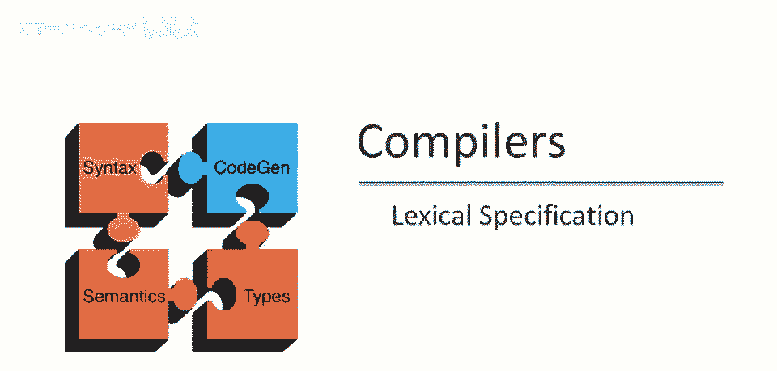

欢迎回到本视频。

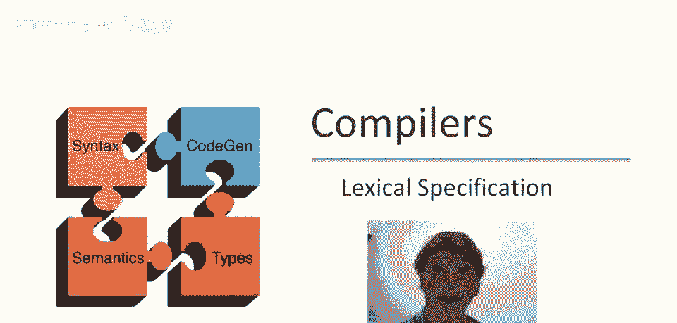

将讨论正则表达式如何用于构建，编程语言的完整词法规范。

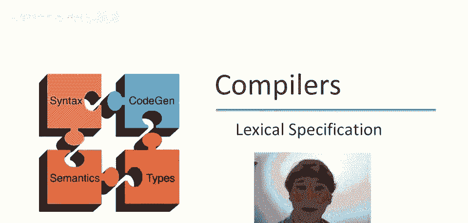

在我们开始之前，我想快速总结一下正则表达式的符号，我们上次讨论的简写之一是a+，意味着至少一个a序列，或语言a a*，有时你会看到一个垂直线，呃，用于代替并集，因此a+b，嗯，也可以写成a|b。

可选的a是正则表达式a+ε的缩写，然后我们有字符范围，允许我们按顺序进行大量字符的并集，然后还有一个实际上非常重要，但我们上次没有讨论的是字符范围的补集，所以这个表达式意味着任何字符。

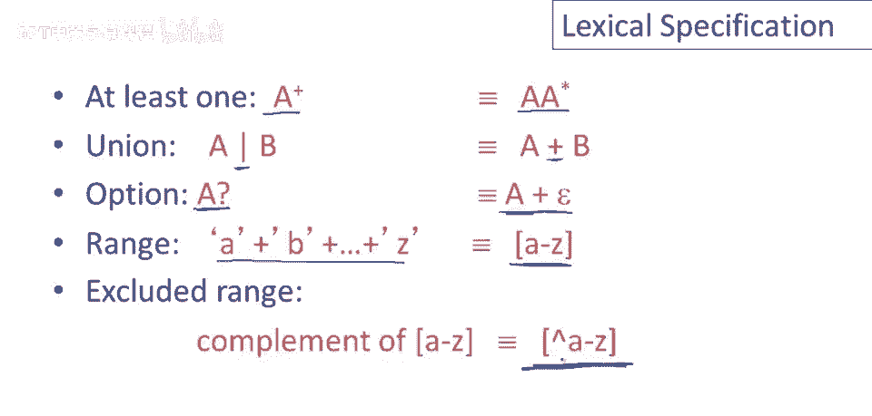

除了a到z的字符，在上次讲座中，我们讨论了以下谓词的规范，给定一个字符串，S是否属于语言，这是函数l的正则表达式，即我们定义了正则表达式的语言，并以字符串集合的形式讨论了它们的语义。

因此对于任何给定的正则表达式，我们可以手动推理，给定字符串是否属于该语言，但这并不足以满足我们想要做的事情，只是为了回顾，我们想要做什么，我们给定的输入，是一堆字符，所以这是一个字符字符串。

它可以比七个字符长得多，而我们真正想要做的是分割这个字符串，我们想在这个字符串中划线，将语言中的单词分开，当然，每个单词都应该是某个正则表达式的语言，但仅仅有一个是，否答案并不完全相同。

与有一种方法将字符串分割为其组成部分，因此我们必须将正则表达式适应这个问题，并且这将需要一些小的扩展，这就是本视频的全部内容。

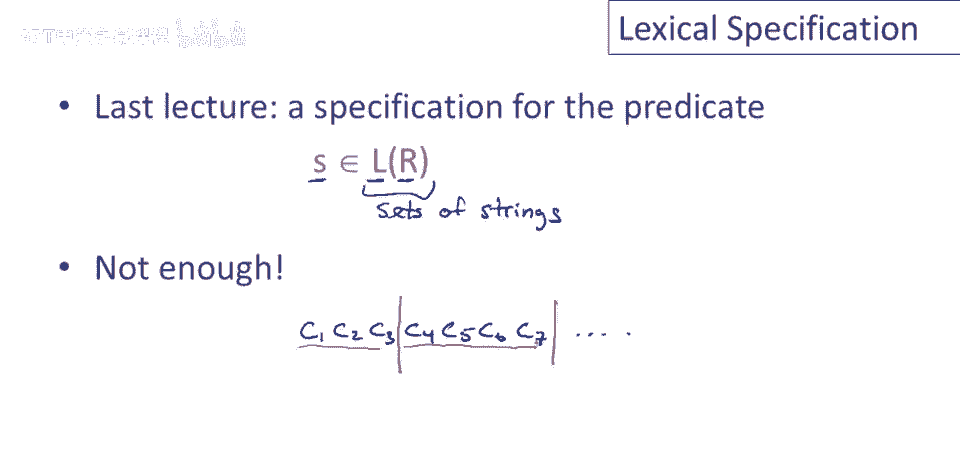

那么让我们谈谈如何做到这一点，当我们想要设计语言的词法规范时，我们必须为每个标记类的词素编写正则表达式，我们上次讨论了如何做到这一点，我们已经讨论了如何做到这一点，对于数字。

我们可能使用数字加作为正则表达式，我们可能有一个关键词类别，即语言中所有关键词的列表，我们可能会有标识符类别，这是我们上次讨论的定义，以字母开始的字母或数字序列，然后我们会有一堆标点符号，比如左括号。

右括号，等，因此我们写下了一堆正则表达式，每个语言语法类别的1个。

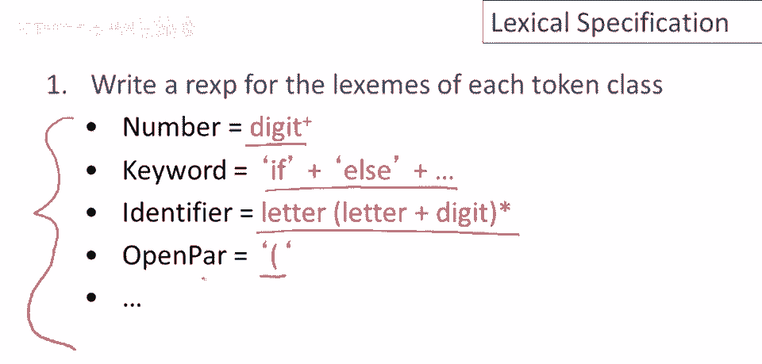

现在这是我们的词法规范起点，作为第二步我们要做的是，我们将构建一个巨大的正则表达式，它只匹配所有令牌的词法场景，这仅仅是上一页上写下的所有正则表达式的并集，我们只需取所有这些正则表达式的并集。

这形成了语言的词法规范，我们会写出这个，我们并不真正关心这些正则表达式是什么，它们只是一些拇指规则，R1，R2等等，整个东西我们将称为r。

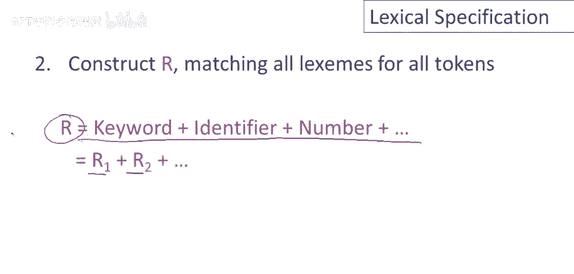

现在这里是如何，我们实际上使用这个词法规范进行词法分析的核心，因此让我们考虑一个输入，输入是一个字符串x1到xn，现在对于该输入的每个前缀，好的，我们将检查它是否属于正则表达式的语言。

因此我们将查看带有第一个字符的前缀字符串，我们将问自己，它是否属于这个大正则表达式的语言，如果它在如果它在语言中，那么我们特别知道该前缀是其中一个组成部分正则表达式的语言。

因为记住r等于所有不同令牌类别的和，因此我们知道这个前缀x1到xi属于某个rj的语言，好的，因此我们知道那是一个词，在我们的语言中，是我们在乎的其中一个令牌类别，因此我们简单地删除那个前缀从输入中。

然后回到3并重复，以这种方式我们不断地咬下输入的前缀，我们将这样做直到字符串为空，然后我们就电子方式分析了整个程序。

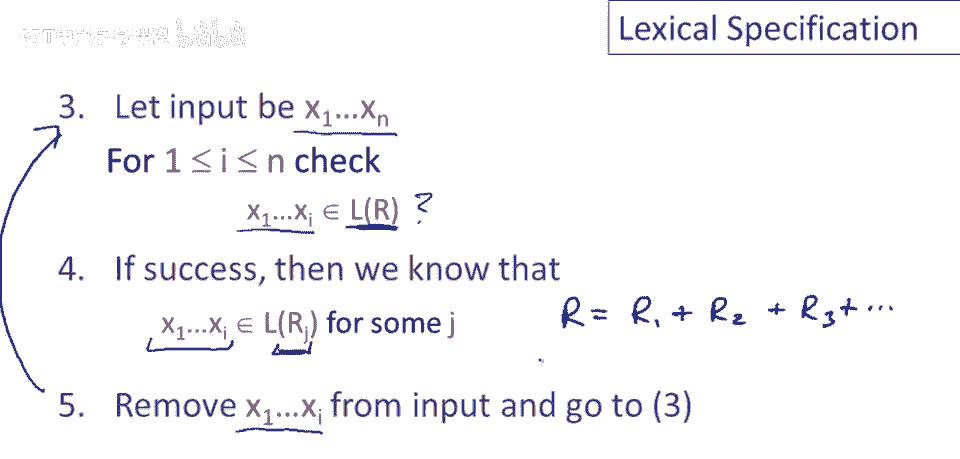

现在该算法有几个歧义，有一些东西没有明确说明，这些实际上是很有趣的，因此让我们花一点时间谈谈那些，第一个问题是实际使用了多少输入，所以让我们考虑以下情况，假设我们有x1到，Xi属于词汇规范的语言。

并且假设有一个不同的前缀，也在词汇规范的语言中，当然你的i不等于j，那看起来像什么，看起来像这样的一种情况，我们会有输入字符串，我们有两个不同的输入前缀，都是有效的标记类，问题是我们要哪一个。

你知道为了具体起见，给出一个具体的例子，让我们考虑当双等号在输入的开头时会发生什么，所以如果我们切掉了其他一些输入，你知道也许我们有了这个子串或这个输入的前缀，嗯，我们正在看，问题是，你知道。

这应该被视为一个等于号，嗯，这将是大多数语言中的赋值操作符，或者会被视为双等号，这在某些语言中是比较操作符，这是一个我们之前看过并讨论过的例子，实际上有一个明确的答案，我们应该总是选择较长的那个。

这有一个名字，它被称为最大贪婪，所以规则是，当面临两个不同的输入前缀的选择时，任何一个都是有效的标记，我们总是应该选择较长的那个，原因就是这样是人类自己阅读的方式，所以当我们看到一个双等号。

我们不会看到两个不同的等号操作符，我们看到的是一个双等号，如果我看，你知道我写在这里的这句话，你知道，当我们看h o w，我们不会看到三个字母，我们把这些都聚集在一起成为一个长的标记，我们尽可能走远。

直到我们看到一个分隔符，因为这就是人类工作的原理，我们让工具以同样的方式工作，这通常或几乎总是做正确的事，第二个问题是如果多个标记匹配，应该使用哪个标记，所以我的意思是什么，身体又好了。

我们有输入的前缀，并且它在词汇规范的语言中，记住词汇规范本身，也是由许多正则表达式组成的标记类联盟，由于，由于这个前缀在词汇规范的语言中，这意味着它，它必须属于某个特定的标记类，Rj。

但没说它不在完全不同标记的语言中，意味着这同一字符串可解释为两种不同标记之一，问题是如果发生这种情况，我们应选择哪一个，所以，例如，为了具体化，回忆一下我们可以为关键字制定词汇规范。

这将是像if和else这样的东西，等等，还有标识符，标识符是一个字母，后跟字母或数字，重复，好的，如果你，若查看这两项，你会发现字符串，如果if两者皆是，因此如果f是关键字语言，且也在标识符语言中。

那么应将if视为关键字或标识符，多数语言规则是，关键词总是关键词，标识符不包括关键词，嗯，明确排除关键词，写出标识符很痛苦，这是一个更自然的定义，我在这写了标识符，通过优先级排序解决，首先列出，好的。

所以有选择时，当字符串可能属于多个标记类时，首先列出的具有更高优先级，因此在我们的文件中，定义词法规范，我们会把关键字放在标识符之前。

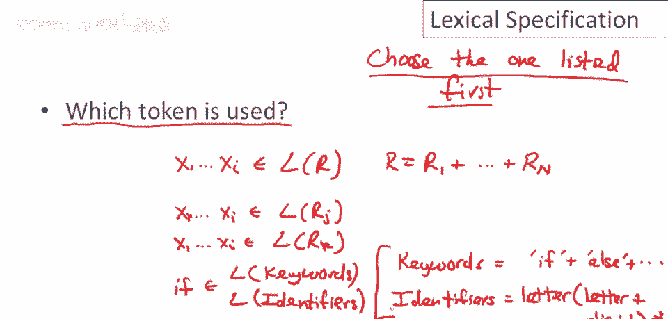

正如我们在这里所做的，最后一个问题是做什么，若无规则匹配，若输入前缀，不在词汇规范语言中，嗯，实际上可能出现，当然有很多字符串，不在大多数语言的词汇规范中，问题是如何处理这种情况。

编译器做好错误处理非常重要，不能简单崩溃，需要能向用户反馈错误位置和类型，因此需要优雅处理，词法分析的最佳解决方案是不这样做，所以不要让这发生，好的，所以我们要做的是，相反，编写错误字符串类别。

所以所有字符串，在语言词汇规范中，我们再次写出正则表达式，这是另一个正则表达式，用于所有可能的错误字符串，所有可能发生的错误字符串，如您所知，无效词汇输入，然后将其放在最后，优先级最低。

这样它将在其他所有匹配后匹配，将其放在最后的原因，实际上允许我们在，定义错误字符串时有点粗心，实际上可以与早期正则表达式重叠，我们可以将错误字符串中实际上不是错误的内容包括在内。

但如果我们将其放在最后优先级，那么它将仅在早期正则表达式未匹配时匹配，因此实际上它将仅捕获错误字符串，然后当我们匹配，错误字符串将打印错误消息并提供漂亮的反馈，如文件中的位置等，等。

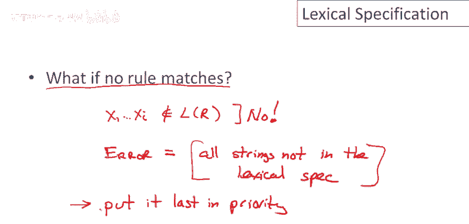

总结这个视频，嗯，正则表达式是字符串模式的很好且简洁的表示，但要在词法分析中使用它们需要一些小的扩展，特别是，我们需要解决一些歧义，我们希望匹配，嗯，是，嗯，尽可能长，因此我们一次尽可能多地输入。

所以我们会尽可能多地获取输入，我们也想选择最高，优先级匹配，因此正则表达式被赋予优先级，不同的标记类具有优先级，当出现平局时，当输入的前缀可以匹配多个时，我们选择优先级最高的。

这通常只是在文件中按顺序列出它们，列表中靠前的具有高于列表中靠后的优先级，我只想警告你，当你去写，词汇规范，当你实际实现一个语言的Alexa时，我们取最长可能匹配的规则。

以及我们倾向于最高优先级规则的平局，这导致了一些棘手的情况，并不总是明显你得到你想要的确切内容，你必须仔细考虑规则的顺序，以及你确切如何编写规则，以便你得到你想要的行为，最后，为了处理错误。

我们通常会写出捕获所有可能错误字符串的通用正则表达式，并给它最低优先级，因此它仅在，没有有效的标记类匹配时触发，输入的一部分，最后我们还没有讨论这些，但有一些非常好的算法已知用于实现所有这些。

实际上我们只能通过一次输入的遍历来做到这一点，并且每个字符的操作次数非常少，只需几次，只需简单的表查找，这将是未来视频的主题。

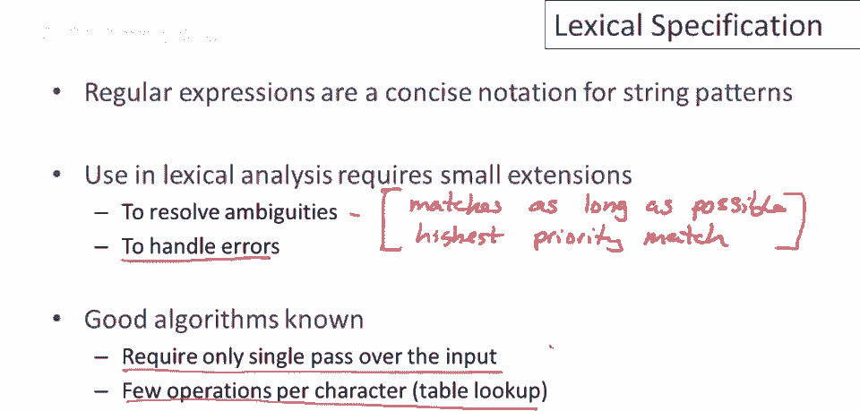