# 【编译原理 CS143 】斯坦福—中英字幕 - P13：p13 04-02-_Finite_Automata - 加加zero - BV1Mb42177J7

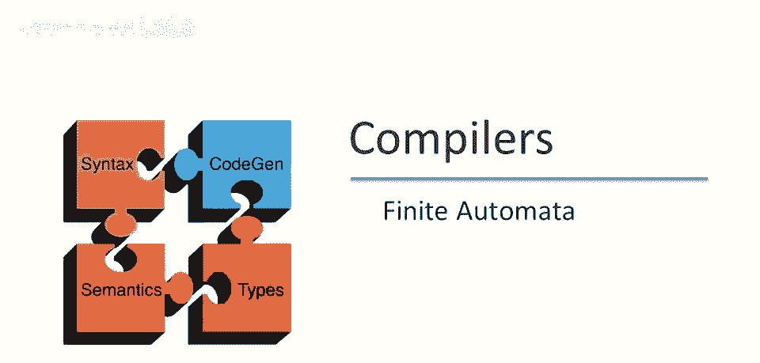

欢迎回到本视频，我们将讨论有限自动机，未来视频中会看到，它是正则表达式的良好实现模型。

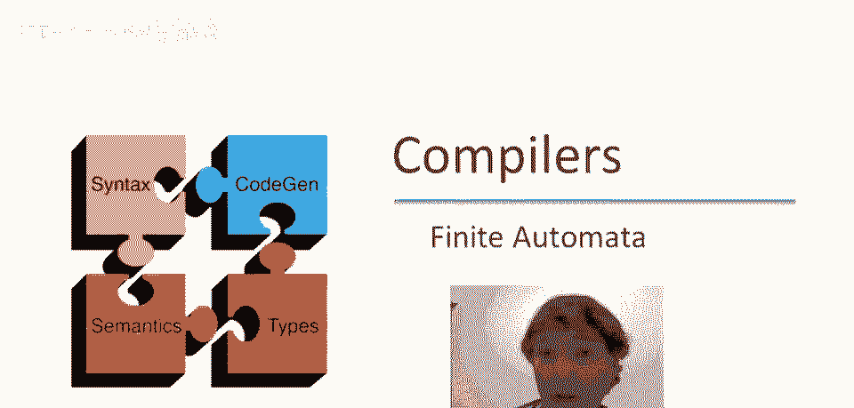

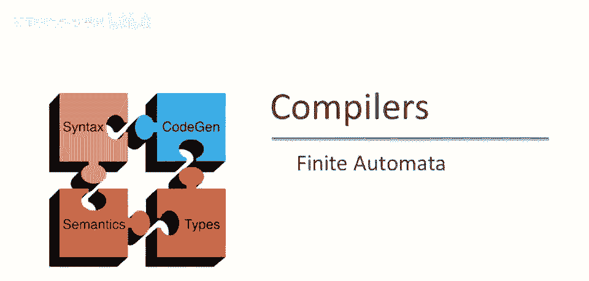

前几视频中我们讨论了正则表达式，呃，用作词法分析的规范语言，本视频将开始新内容，我们将讨论有限自动机，作为正则表达式的实现机制非常方便，正则表达式和有限自动机密切相关，事实证明，它们可以指定相同的语言。

称为正则语言，本课程不会证明这一点，但我们会充分利用这一事实，继续前进，什么是有限自动机，嗯，这是典型的定义，您可能在自动机理论教科书中看到，有限自动机包括输入字母表，这是它可以读取的字符集，嗯，呃。

它有一个有限的状态集，应该强调这是使它成为有限自动机的原因，它有一些状态，它可以处于这些状态之一，这是特殊的，被指定为起始状态，一些状态是接受状态，所以这些是状态，嗯，我们稍后会找到更多，直观上。

如果自动机在读取一些输入后终止于这些状态之一，那么它就接受输入，否则拒绝输入，最后，自动机有一些状态转换，即，如果它在某个状态。

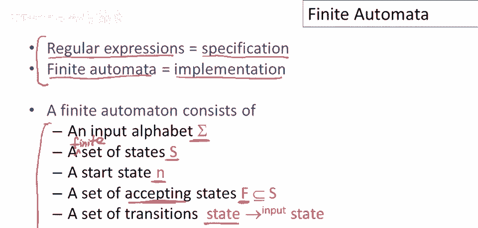

它可以读取一些输入并转到另一个状态，所以让我们，嗯，更详细地看一下，有限自动机中的转换，如果我在这种情况下，我写出了一个特定的转换，如果在状态一，我们读取输入a，那么自动机可以移动到状态二，好的。

自动机可以有大量不同的转换，来自不同状态和不同输入，它的读取方式是，如果在状态一输入a，我们将进入状态二，若自动机结束于接受状态，当它到达输入的末尾，它将执行称为接受字符串的操作，意味着它将说'是'。

该字符串属于此机器的语言，直观上，自动机从起始状态开始，并反复读取，输入，每次读取一个输入字符进行一次转换，因此它将查看当前状态下，基于该输入可进行的转换至另一状态，若当它完成读取输入时，呃。

处于一个最终状态，呃，那么它将接受，否则它将拒绝输入，拒绝输入的情况有哪些？若它终止，在一个状态，S，不是最终或接受状态，好的，因此若它结束于除接受状态外的任何状态，那么它将拒绝，呃，若机器卡住。

意味着它发现自己处于一个状态，且在该状态下没有输入的转换，特别是，假设它处于某个状态s，并且输入是a，并且没有转换，对于状态s在输入a上没有指定转换，因此机器无法移动并卡住，这也是一个拒绝状态。

因此在这两种情况下，若它到达输入的末尾且不在最终状态，或它从未到达输入的末尾因为它卡住，在这两种情况下，它将拒绝该字符串，该字符串不属于有限自动机的语言。

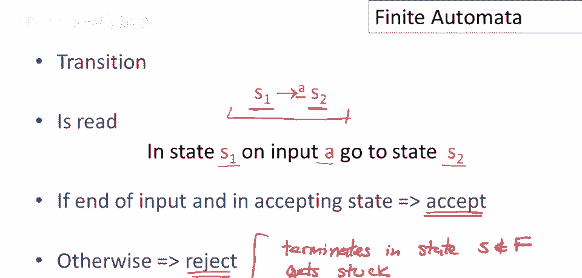

现在有一种对有限自动机的替代表示法，我认为更直观，呃，例如，我们将强调，呃，那种书写方式，嗯，在这种表示法中，一个状态表示为图中的一个节点，我们画一个大圆表示，起始状态用一个箭头指向的节点表示，无源。

这是进入节点的转换，但无源，来自的节点，这表示唯一的起始状态，接受状态画为双圆圈节点，最后，转换画为图中的节点间边，所以这表示，如果我在这个蓝色圆圈中的状态，并且我读入的输入是a。

那么我可以移动到这个箭头尾部的状态。

现在让我们做一个简单的例子，让我们尝试写出只接受单个数字1的自动机，我们需要一个起始状态，并且可能还需要一个接受状态，现在的问题是，嗯，我们中间应该放什么，这里将会有某种转换，一个好的猜测是。

如果机器读取数字1，我们应该采取该转换，现在让我花一点时间谈谈机器如何执行，所以让我们标记这些状态，让我们称这个状态为a，让我们称这个状态为b，好的，所以，嗯，机器将有一些输入，好的，我们，嗯。

我们可以在这里写出输入，所以让我们假设我们有一个单个字符1，并且它从某个状态开始，即起始状态，机器的一种配置是它所处的状态和输入，我们通常会用指针指示它在输入中的位置，说明它在输入中的位置。

关于有限自动机输入的重要事情是，嗯，输入指针总是前进，所以，当我们或它只前进，所以，当我们读取一个输入字符时，输入指针向右移动，并且永远不会后退，从状态a，我们有规则，我们可以看到我们在状态a。

下一个输入字符是1，这允许我们进行到状态b的转换，所以现在我们在状态b，我们的输入指针在哪里，它在输入的末尾，表示我们已到输入结束，所以现在这是，嗯，我们在接受状态，且已过输入结束，因此我们接受，好的。

那么让我们，嗯，再做一次执行，所以我们从状态a开始，嗯，以输入为例，嗯，字符串零，好的，我想画个指针，实际上我应该在输入前画，我们总是把指针，嗯，在这种情况下，在两个输入元素之间，紧靠左侧的一个。

我们即将阅读，在这种情况下，我们即将读零，我们处于状态a，我们的输入是零，我们查看机器，我们看到零上没有转换，好吧，因此机器卡住了，它根本没有移动，这是我们的最终配置，我们可以看到输入未结束。

因此这是一个拒绝，好的，在这种情况下，机器拒绝该字符串，因为它不属于机器的语言，嗯，再做一例，嗯，假设我们在状态well，我们始终从状态a和起始状态开始，假设这次输入的字符串是一零，好的。

输入指针在那里没问题，所以再次我们处于状态a，输入是一个一，因此我们将移动到状态b，现在输入没有变化，只是输入指针改变，但我会复制输入以显示，嗯，差异，现在输入指针已前进，因为我们已读取，嗯。

一个输入字符，现在我们处于另一个状态，现在我们可以看到，嗯，我们处于状态b，下一个输入是零，从状态b没有零的转换，尽管处于接受状态，b是终态，是其中之一，除了未消耗完输入的状态，因此。

该机器也拒绝此字符串，这也是拒绝，通常，我们可以谈论，有限自动机的语言，等于，嗯，集合，接受的优势，好的，有限自动机的语言，当谈论有限自动机的语言，我指自动机接受的字符串集。

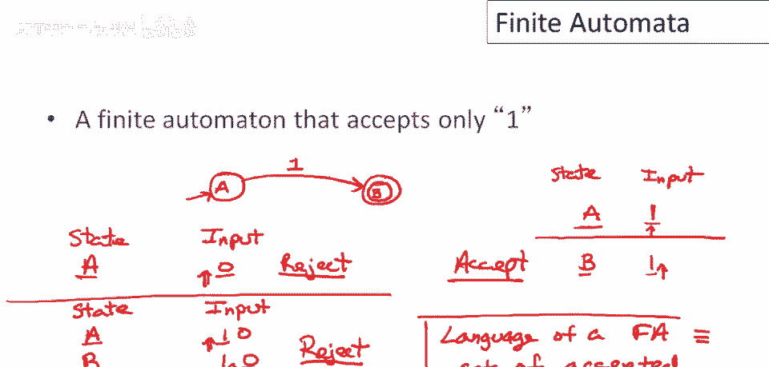

现在让我们做更复杂的例子，尝试写出接受任意个1，后跟单个0的自动机，嗯，再次需要开始状态，嗯，还需要一个最终状态，现在让我们从思考，这台机器的语言中最短字符串开始，所以在这种情况下嗯。

我们知道它必须以单个零结尾，所以零肯定必须是零，转换必须是最后一步，在那零之前可以有任何数量的1，特别是不能有1，所以一，嗯，这台机器的转换是从起始状态，嗯，输入零，我们肯定能到达最终状态，因为单一。

由单个零组成的字符串属于这台机器的语言，现在唯一的问题是，我们如何编码任何数量的零之前都可以是一的事实，好的，有一个简单的方法，嗯，我们可以在起始状态添加一个自循环，嗯，并采取那个转换。

如果我们读到一个一，这意味着什么，这意味着只要我们在读一，我们就会停留在起始状态，然后一旦我们读到一个零，我们将移动到最终状态，因为那必须是，嗯，字符串的结束，嗯哼，如果这，如果机器要接受它。

所以让我们做几个例子来说服自己这可行，让我再次标记这些状态，所以这是状态a，那个状态b，所以嗯，让我们在这里写出来，状态和输入，我们将从状态a开始，并输入，嗯，一一零，好的，所以让我们先做一个接受案例。

好的，输入指针开始于第一个字符的左侧，我们在状态a，在起始状态我们读到一个一，这说我们应该采取一个转换，让我们回到状态a，然后我们前进输入指针，好的，现在我们消耗了第一个一，并且我们再次在状态a。

下一个输入是一个一，所以我们将进行另一个转换，嗯到状态a，输入指针将前进，好的，所以现在我们在状态a，下一个输入是一个零，所以我们将采取转换到b，现在我们在这种配置中，所以输入指针已经达到了输入的末尾。

嗯，我们在接受状态，所以机器接受一一零，一是这个机器的语言，所以现在让我们做一个例子，我们将拒绝输入，我们开始于哪个配置？有限自动机的配置，意味着你知道执行中的一个点。

它总是由一个状态和输入指针的位置组成，所以我们的初始状态是a，现在让我们选择字符串，哦，我不知道，让我们取100，让我们确认这不在机器的语言中，好吧，我们从状态a开始，输入指针在那里，现在我们读一个1。

这意味着从状态a，转换1，我们留在状态a，输入指针前进，现在我们看到一个0，所以从状态a输入0，我们转换到状态b，现在输入指针在这里，所以现在，嗯，我们在状态b，输入是0，但状态b上没有0的转换。

状态b上没有任何转换，所以机器卡住了，它不能读完输入，再次，即使我们在接受状态，我们还没有读完整个输入，所以这意味着机器会拒绝，所以100，0不在这个机器的语言中。

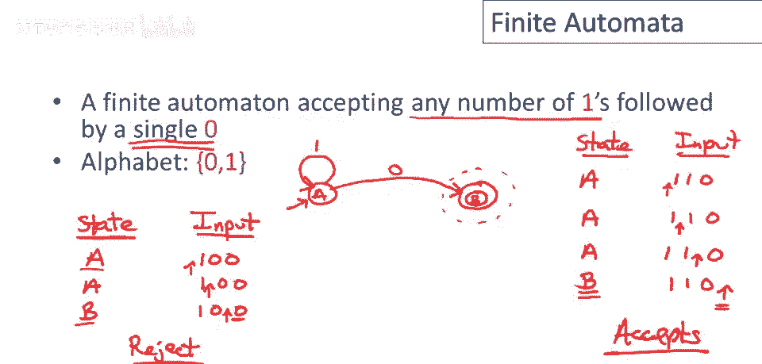

到目前为止，有限自动机每次移动都会消耗一个输入字符，所以只要它能做任何移动，输入指针就会前进，嗯，现在我们要谈论一种新的移动，epsilon移动，epsilon移动背后的想法是机器可以做出状态转换。

而不消耗输入，所以例如，如果我有一个状态，我在状态a，我的输入，让我们就说，嗯，我们有x1，x2，x3，出于某种原因，当我们准备读取x2时我们做了一个epsilon移动，机器改变状态。

但输入指针仍然在完全相同的位置，所以机器的新配置将是我们在状态b，但我们的输入指针仍在等待读取x2，可以将epsilon移动视为机器的一种免费移动，它可以，它可以不消耗任何输入移动到另一个状态，嗯。

为了清楚起见，机器不必进行epsilon移动，这是一个选择，我们可以决定是否进行epsilon移动。

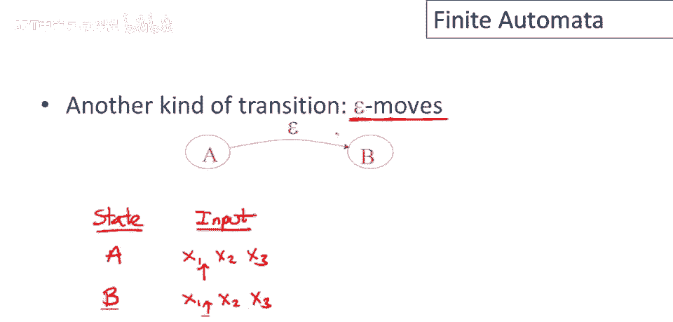

现在，Epsilon移动是第一次，我们提到有限自动机可能有一个选择，在它的移动上，实际上，在具有选择性的自动机和没有选择性的自动机之间有一个重要的区别，因此确定性的，有限自动机有两个属性，首先。

它们没有epsilon移动，因此它们必须始终消耗输入，其次，对于每个输入和每个状态，它们只有一个转换，我指的是什么，这意味着，如果我看一个确定性的自动机中的任何状态，它们永远不会有像这样的事情。

对于相同的输入，它们有两个可能的移动，确定性的自动机中的所有出站边都必须有不同的输入标签。

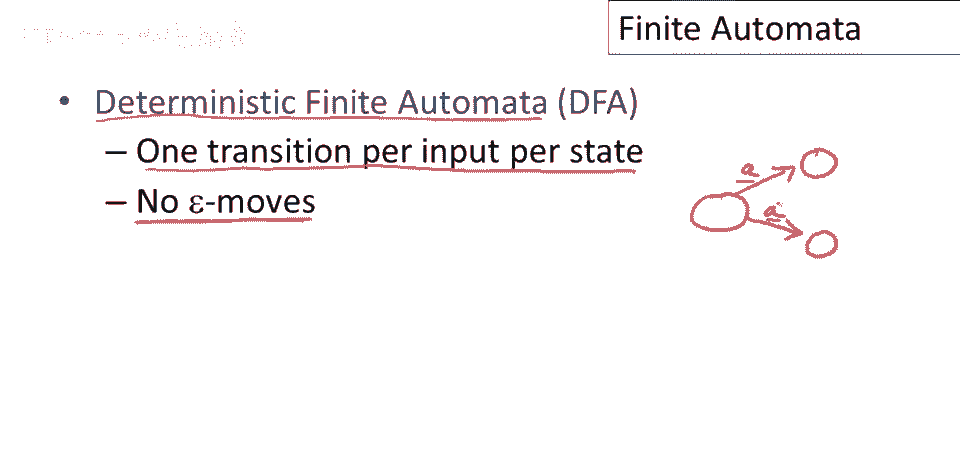

然后非确定性的，有限自动机就是那些不是确定性的，特别是nitrachaton可以有epsilon移动，因此它可以选择不消耗输入而移动到另一个状态，它们也可以在一个给定的状态下为同一个输入有多个转换。

所以像这样的事情是可以的，对于一个非确定性的自动机，现在让我指出，实际上，Epsilon移动足以创建非确定性的自动机，而这个第二个情况，你在同一个输入上有多个转换。

可以通过一个稍微更复杂的带有epsilon移动的机器来模拟，因此，例如，我可以以以下方式绘制这个机器，我可以有，或者我可以以以下方式模拟被圈出的机器，我可以有一个带有两个epsilon移动的状态，然后。

每个这些状态都有一个在a上的移动，所以，如果我标记这些状态为1，2和3，那么这个将对应于状态一，那么这个将对应于状态二，那么这个将对应于状态三，因此，任何时候我们有一个状态在单个输入上有多个移动。

我们总是可以用更多的带有epsilon移动的状态来替换它，并让机器中的每个状态对于每个可能的输入只有一个转换，所以实际上，确定性的自动机和非确定性的自动机之间的唯一根本区别，是否有epsilon转移。

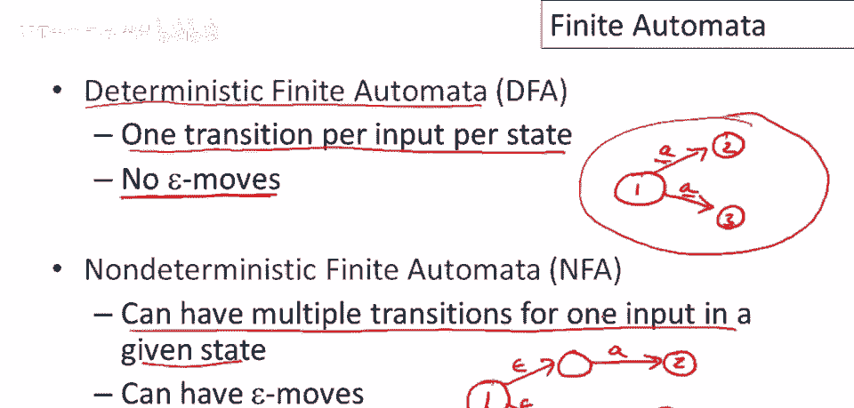

确定性自动机的关键属性是，对于每个输入，它只能通过状态图的一条路径，因此这是每个输入，我所说的意思是什么？即自动机始终从起始状态开始，让我们考虑一个非常简单的输入字符串abc。

如果我们看确定性自动机将采取的状态序列，嗯，对于那个输入，通过状态图的这个路径完全由输入决定，因为再次，在给定状态下，它没有选择，只会有一个标记为a的转换，它将带您到一个只有标记为b的转换的状态。

那将带您到另一个只有标记为c的转换的状态，因此，每个输入决定了自动机将通过状态图采取的路径，这对非确定性自动机不成立，因此，例如，可能是，从起始状态开始，输入a，对于输入a，我可以到达某个状态i。

但可能还有另一个转换，嗯，标记为a，那将带我到另一个状态，因此，自动机可能能够到达两个不同的状态，并且可能还有epsilon转换，因此，对于非确定性自动机来说，通常，当它们通过状态图时。

当它们在输入上执行时，它们可能会最终处于任何数量的不同的状态，好的，关于非确定性自动机的规则，嗯，关于何时接受是，如果任何路径接受，那么nfa，接受，如果一些，导致接受状态在输入结束时。

这就是非确定性自动机，我可以选择做什么移动，只要有一些选择它可以做，那将使它到达接受状态，所以让我们说，嗯，切换颜色这里，你知道，这是一个接受状态在这里，它走了这条路，那么它将接受。

也许所有这些其他路径都是拒绝的，路径，那不重要，只要有一条路径，嗯，一组nfa可以选择的动作，让它在输入结束时到达接受状态，我们说该字符串属于NFA语言。

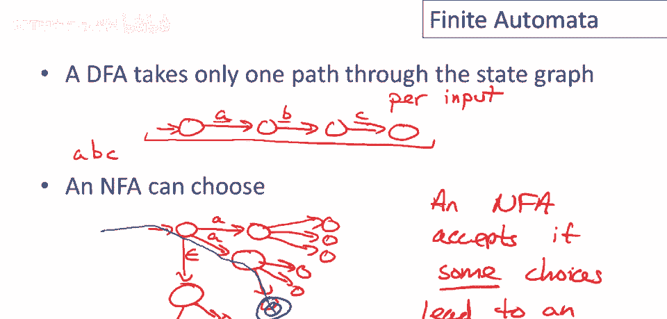

NFA能进入多个不同状态的事实，取决于它们在运行中的选择很重要，将在未来视频中发挥核心作用，我们将快速举一个例子，以确保这一点清晰，这是一个小自动机，注意它是非确定的，从起始状态，输入零有2种可能移动。

我们将执行该机器的一个执行，在一个样本输入上，看看它能进入哪些不同状态，我们从起始状态开始，我们应该标记我们的状态实际上，以便我们可以引用它们，让我们称它们为a、b和c，并且假设第一个输入是1。

那意味着什么，这意味着我们将采取这个转换，我们将从起始状态回到起始状态，机器可能处于的状态集，在第一次转换后只是集合a，所以保证仍然在起始状态，所以没有，与。的选择，呃，第一个移动现在。

假设第二个输入字符是零，现在我们有选择，我们可以去状态b或我们可以去状态a，我们可以认为这然后是一个可能性集，在我们执行这个移动后，这个转换，机器可能处于任何一个集合状态。

实际上这完全描述了机器的可能性，我们知道我们已经读了第二个输入字符，现在我们可以处于一个集合状态，好的，我们可以处于状态a或状态b，所以现在，假设我们读另一个零，我们可能去哪里，那么嗯。

如果我们在状态b，我们可以做转换到状态c，但如果我们处于状态a，那么我们将做转换，要么到状态b，再次到状态a，所以事实上，如果我们读另一个零，我们可以处于任何一个三个状态，好的，现在你可以看到，嗯。

规则是什么，所以，每一步，非确定性自动机处于机器的状态集合中，当读取另一个输入时，考虑所有可能的移动，它可以计算，机器在下一步可能处于的状态完整集合，那么最后我们如何决定机器是否接受。

我们查看最后输入位读取后的最终状态，如果有任何，抱歉，我们查看最后输入字符读取后的最后状态集合，如果该集合中有任何最终状态，那么机器接受，在这种情况下，我们读取零后。

我们看到接受状态c在这个可能状态集合中，这意味着机器可以做出一些选择，在输入结束时进入最终状态，因此，机器接受这个输入，好的，所以，如果最终可能状态集合中有最终状态，那么非确定性机器接受。

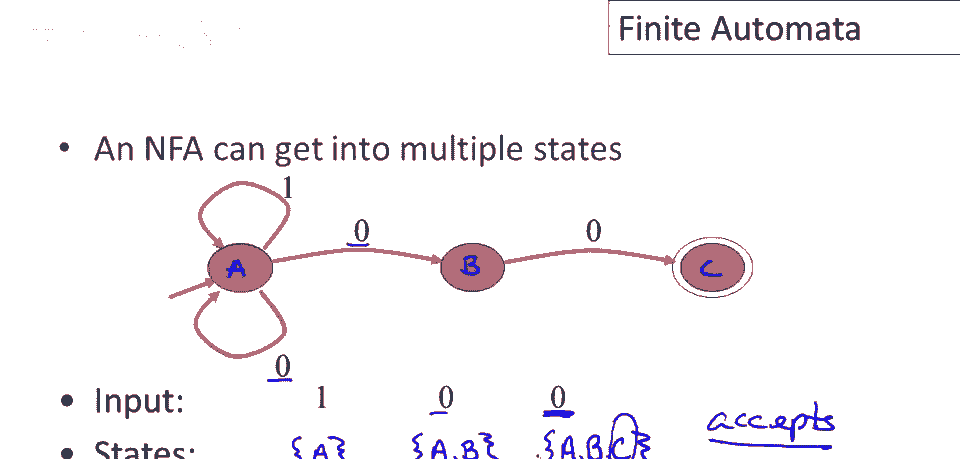

结果表明，NAS和DFA识别完全相同的语言，特别是正则语言，因此NAS，DFA和正则表达式具有相同的功能，它们只能指定正则语言，DFA执行速度肯定更快，嗯，主要或完全，因为不需要考虑选择。

所以DFA可以沿着状态图的单一路径前进，而与NFA，我们可能需要跟踪NFA中的潜在选择集，我们可能处于一些状态中，然而，NAS有一些优点，它们通常比DFA小得多，实际上，它们可以比DFA小指数倍。

所以最小的uh，NFA，Uh可能比最小的等效DFA小得多，Uh，啊，比相同语言的等效最小DFA小，因此本质上，NAS和DFA之间存在时空权衡，NAS可能更紧凑。

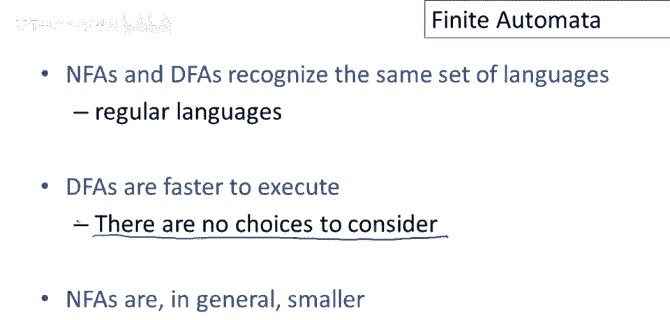