# 【编译原理 CS143 】斯坦福—中英字幕 - P19：p19 05-03-_Derivations - 加加zero - BV1Mb42177J7

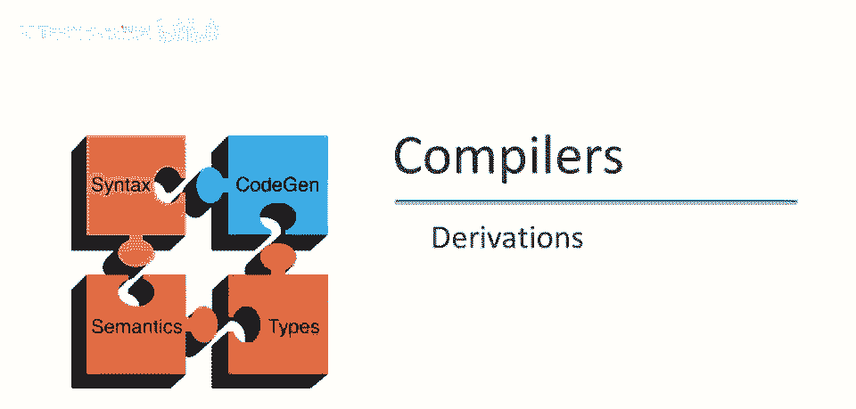

在这视频中。

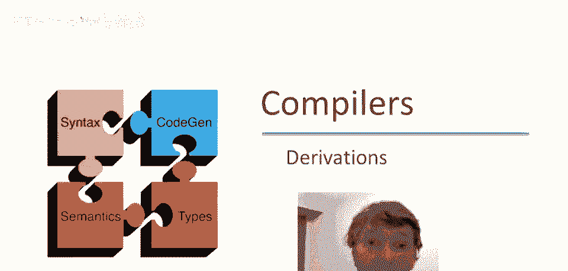

我们将继续讨论解析。

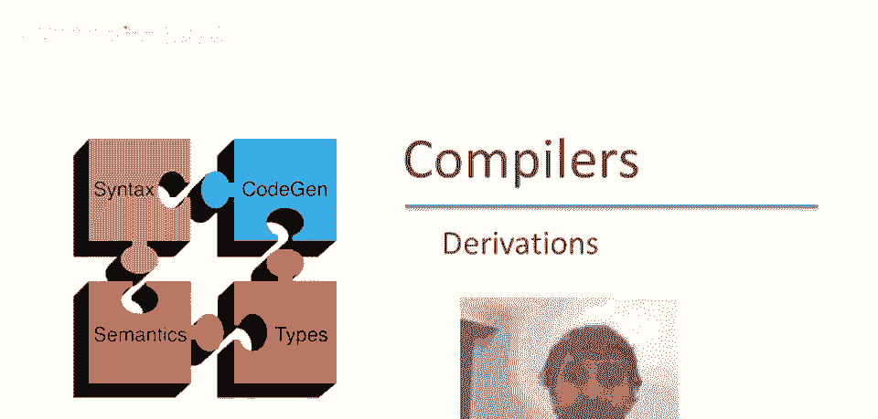

以推导的想法，所以从开始符号，嗯，我们可以依次应用生产规则。

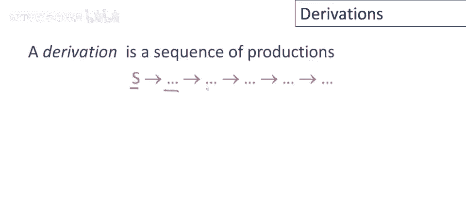

这产生了一个推导和一个推导，可以用不同的方式绘制，而不是作为线性替换序列，我们可以画成一棵树，若有非终结符x出现，则替换x时，可用规则左部表示，将x的子节点，设为替换x的规则左部，应用产生式时。

x变为y1至y n，将y1至y n，作为x的子节点加入树中。

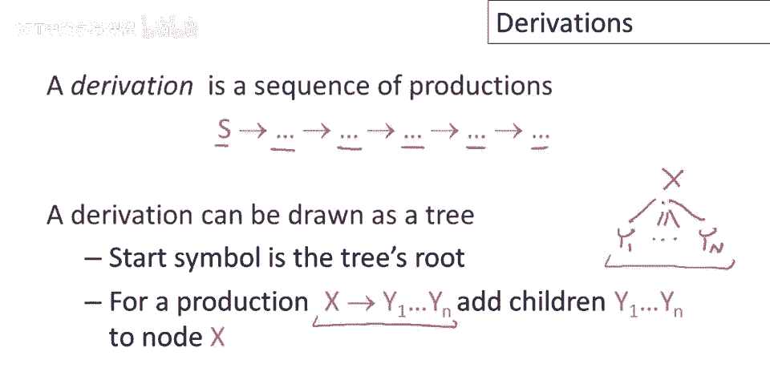

示例说明，嗯，这是我们的算术表达式简单语法，考虑这个特定字符串，id乘id加id，现在我们要做的是，我们将解析这个字符串，我们将展示如何为该字符串生成推导，同时构建一棵树，就在这里结束。

这里有一个从e开始到感兴趣字符串的推导，每一步应用一个生产规则，这是对应的树，这称为解析树，这是这个表达式的解析树或输入字符串，让我们详细地走过这个推导，右边红色的是我们正在构建的树。

左边蓝色的是我们迄今为止采取的推导步骤，因此，最初我们的推导只包含开始符号，E和我们的树只包含根，所以最初我们的推导只包含开始符号，也是起始符号，所以第一步是，嗯，有产生式e->e+e，意思是，在树中。

我们取根节点，给它三个子节点，e+和e，所以现在替换第一个e，嗯，为e乘z，使用产生式e->e乘e，这意味着我们取树中第一个e，给它3个子节点，每个e一次，继续，我们取这里剩下的第一个e，用id替换它。

这意味着我们让id成为树中左起第一个e的子节点，然后用id替换第二个e，使用产生式e去id，最后我们对第三个e做同样的事，现在我们已经完成了解析树，所以再次，从开始符号到要解析的字符串。

我们感兴趣的是解析，过程中我们构建了这个表达式的解析树。

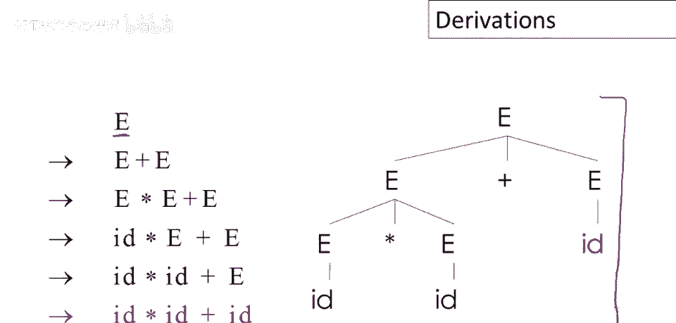

关于解析树有很多有趣的事情可以说，首先，解析树的叶子是终结符，内部节点是非终结符，此外，按顺序遍历叶子是原始输入。

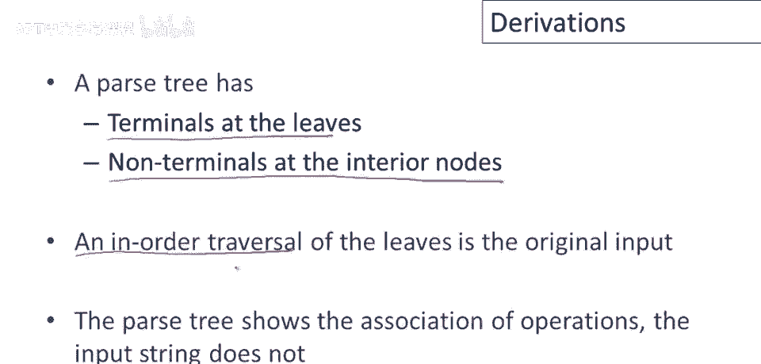

让我们回到例子并确认所有这些，如果我们看叶子，我们可以看到它们都是终结符，好的，内部节点都是非终结符，在这种情况下，我们的语言中只有一个非终结符，所有内部节点都是e，叶子是字符串的终结符。

然后我们可以看到，如果我们按顺序遍历叶子，我们得到的就是我们开始时的输入字符串。

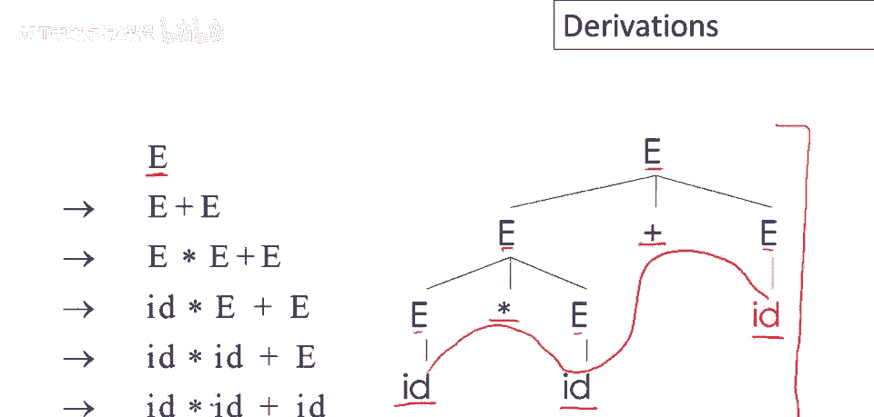

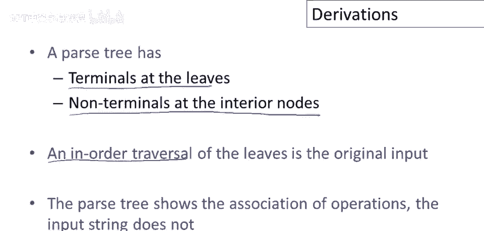

此外，解析树显示了操作与输入字符串的关联，而输入字符串没有，你可能已经注意到，这个解析树是如何构建的，乘法比加法结合得更紧，因为乘法是包含加法的树的子树，这意味着我们会先做e乘以e。

然后再加e和some，有些人可能会想，嗯，我是怎么知道要选这个解析树的，因为实际上，如果你考虑一下，还有另一种推导，实际上，有好几种推导会给我不同的解析树，其中加法或乘法靠近根部，加法嵌套在乘法中。

所以我们现在先不要担心这个，让我们只是说，我们以某种方式知道这是想要的解析树，我给了你一个产生这种解析树的推导。

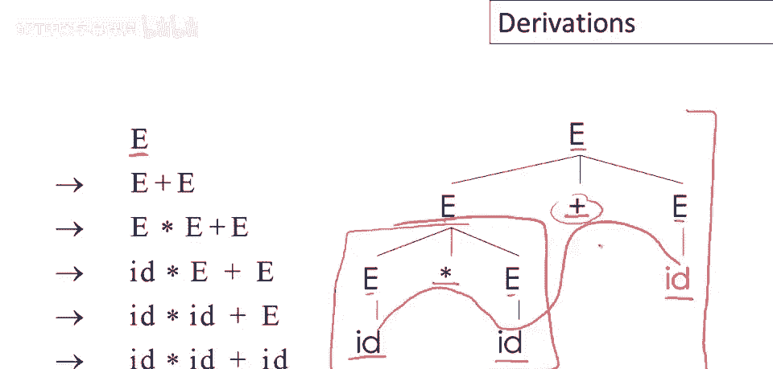

在之前的推导中继续，我展示的实际上是一种非常特殊的推导，它被称为最左推导，哪里，每一步替换最左非终结符，存在自然等价的最右推导概念，这就是，又是相同字符串的最右推导，从开始符号开始，以字符串结束。

关注并注意每一步替换最右非终结符，这里替换唯一的非终结符e，得到e加e，第二步替换第二个非终结符e为id等，余下的字符串。

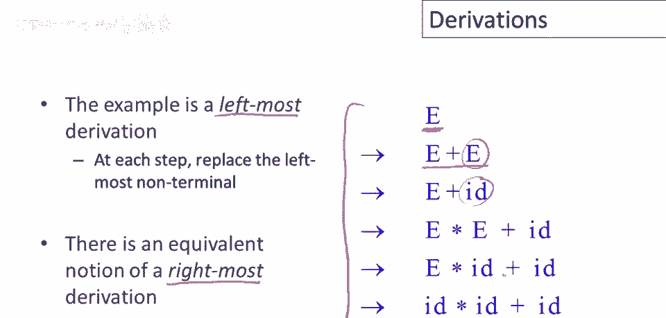

用小图完整展示树和推导，这里是树和推导同时，这里又是树，这是开始符号e的根，蓝色是推导，开始替换e为e加e，这是唯一的非终结符，所以是最右的，从树的右侧开始，替换右边的e为id。

然后左边的e被替换为e乘e，现在剩下的最右e被替换为id，最后剩下的e也被替换为id。

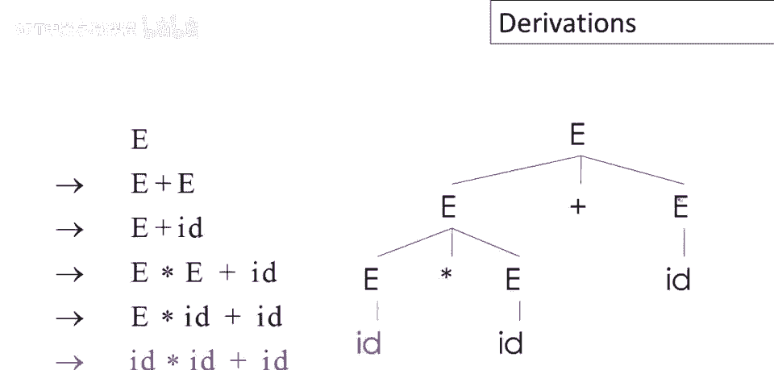

指出最右和最左推导，我展示的具有完全相同的解析树，这不是巧合，每个解析树都有一个最右和最左推导，只是分支添加的顺序不同，例如，如果我有第一个产生式，E去e加e，现在我有选择如何构建我的树。

我可以处理这个子树，或者我可以处理那个子树，如果我首先构建这个，那将是最右推导，如果我继续总是处理最右非终结符，当然，如果我首先处理这个，我可以用它来做最左推导，同样重要的是要意识到还有许多推导。

除了最右和最左，我可以，我可以以某种随机顺序选择非终结符进行替换，但最右和最左是我们最关心的。

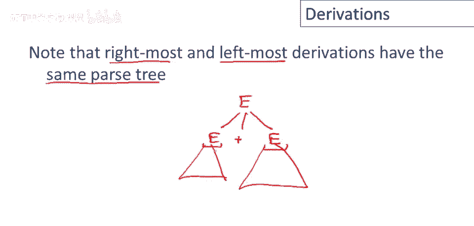

所以总结一下，我们不仅对字符串是否属于特定上下文无关文法感兴趣，我们需要该字符串的解析树，推导定义了解析树，但通常一个解析树有多种推导，特别是我们关注最左和最右推导。

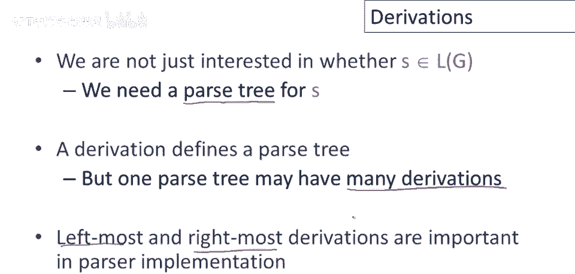