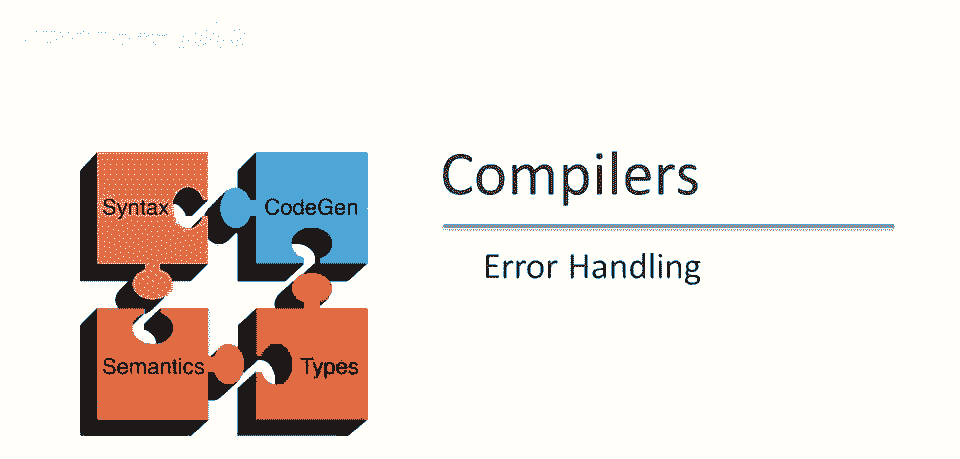
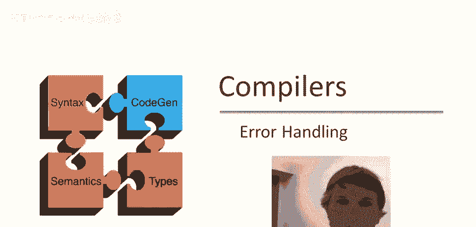
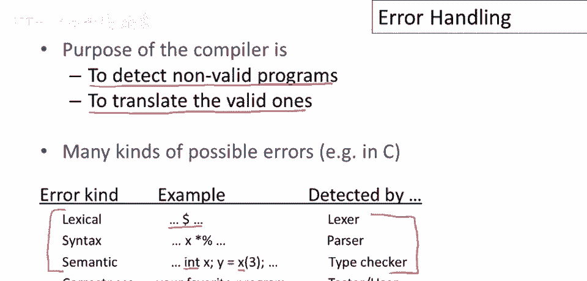
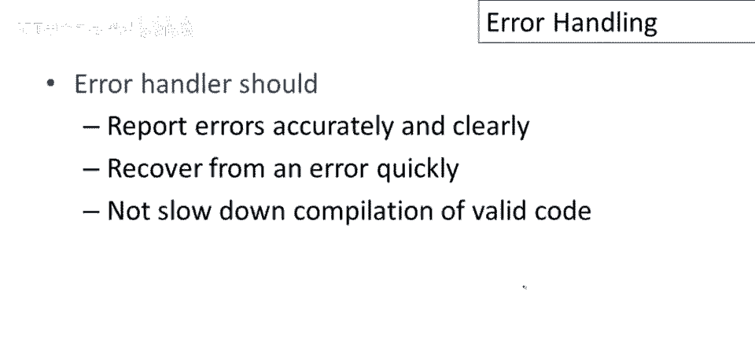
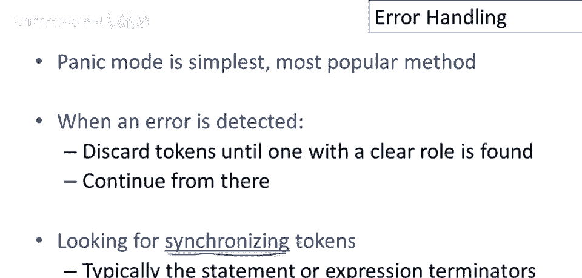
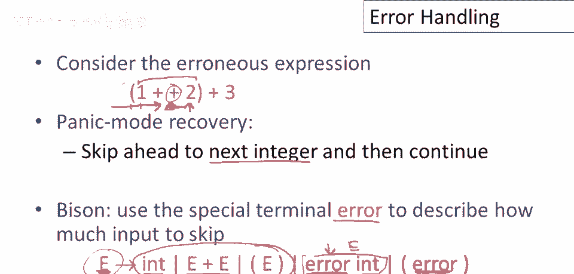
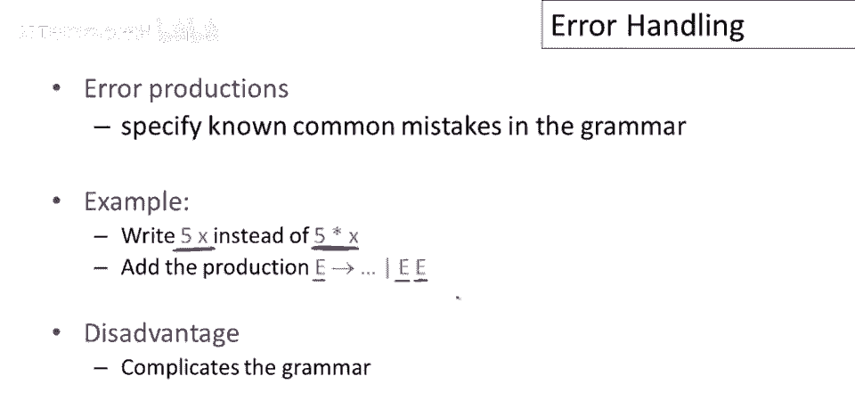
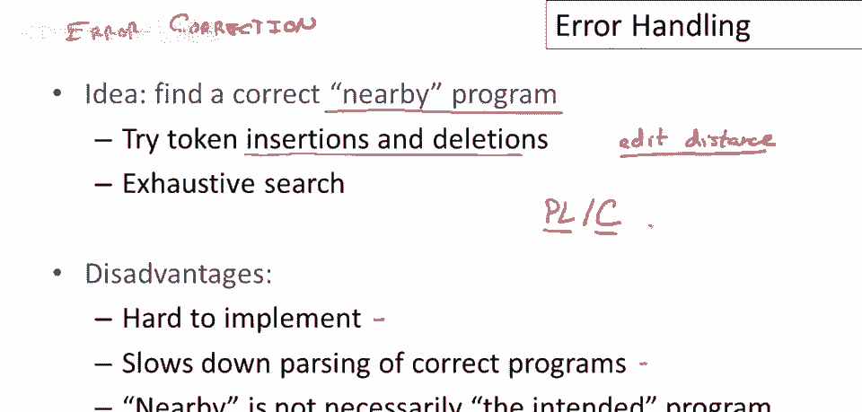
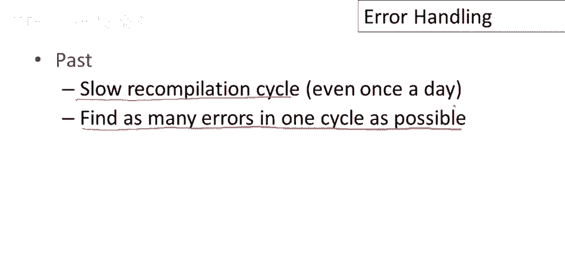
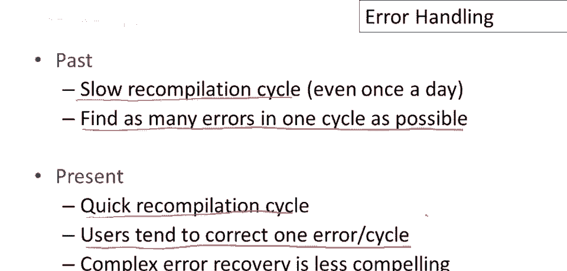

# 【编译原理 CS143 】斯坦福—中英字幕 - P21：p21 06-01-_Error_Handling - 加加zero - BV1Mb42177J7

本视频，将稍微偏离主题，讨论编译器如何处理错误，和，特别是，解析器中可用的错误处理功能类型。

编译器有两个相对独立的工作，第一个是将有效程序翻译，即，如果它从程序员那里得到一个正确的有效程序，它需要为该程序生成正确代码，现在，与这项任务不同，提供错误程序良好反馈的工作，甚至仅仅是检测无效程序。

因此我们不想编译任何不是有效程序的程序，在编程语言中，编程语言有许多不同类型的错误，仅举几例，例如，我们可能有词法错误，即使用在语言中不存在的任何基本符号字符，这些将由词法分析阶段检测。

我们可能有语法错误，这些将是解析错误，当所有单个词法单元都正确时，但以某种方式组装，没有意义，我们不知道如何编译它，可能有语义错误，例如，当类型不匹配时，我声明x为整数并用作函数。

这些将是类型检查器的任务来捕获，然后实际上可能有很多错误，呃，在你的程序中，这些不是编程语言或你编写的程序的错误，实际上它是一个有效程序，但它没有做你打算做的事情，实际上你的程序有一个错误，因此。

虽然编译器可以检测许多种错误，它不能检测所有错误，你知道，一旦我们超越了编译器所能做的，然后测试人员和用户将找到程序中剩下的问题。

那么良好的错误处理要求是什么，嗯，我们希望编译器准确清晰地报告错误，以便我们可以快速识别问题并修复它，编译器本身应迅速从错误中恢复，所以当它遇到错误时，它不应该花很长时间来决定，在继续之前做什么。

最后我们不想错误处理减慢有效代码的编译，那就是，我们不应为错误处理付费，如果我们并不真正使用它。

我将谈论三种不同的错误处理方式，恐慌模式和错误产生是当前编译器中使用的两种，这些都是今天人们实际使用的东西，自动，局部或全局修正是一个过去广泛追求的想法，我认为它在历史上很有趣。

特别是与今天人们所做对比，以及为什么人们很久以前尝试这样做，恐慌模式是最简单、最流行的错误恢复方法，基本思想是当错误被检测到时，解析器将开始丢弃标记，直到找到一个在语言中有明确角色的标记。

然后它将尝试重新开始并从该点继续，这些标记，它正在寻找的，称为同步标记，这些只是语言中有明确角色的标记，因此我们可以可靠地识别我们在哪里，因此，一种典型策略可能是尝试跳至语句的末尾，或函数的末尾。

如果在语句或函数中发现错误，然后开始解析下一个语句或下一个函数。

让我们看一个简单的假设性恐慌模式错误恢复示例，这是一个表达式，显然，如果我们不应该有两个加号连续出现，那么这里就有问题，所以在第二个加号处出错了，解析器将过来，解析器将从左到右进行，它将看到左括号。

它将看到数字1，它将看到加号，一切都好，然后它将看到这个第二个加号，它将不知道该怎么办，它将意识到它卡住了，并且语言中没有两个加号连续出现的表达式，它需要做些什么来恢复，它遇到了解析错误。

它必须在这一点采取一些错误行动，所以在恐慌模式恢复中，它将做的就是按下恐慌按钮，所以就在这一点它将说放弃，我不再正常解析了，它进入了一个不同的模式，在那里它只是在扔掉输入，直到找到它认识的东西，例如。

可以说，这项政策，针对这类错误是跳过，到下一个整数，然后尝试继续，因此，它将忽略这个加号，然后它将从这里重新开始，期待看到另一个整数，尝试完成这个表达式，它将把此视为1加2，然后括号将匹配。

表达式其余部分将解析得很好，在如bison等工具中，广泛使用的解析器生成器，你可能使用的，嗯，项目，有一个特殊的终结符error，描述要跳过多少输入，bison中给出的产生式看起来像这样。

你可以说e的可能性是e可以是整数，它可以是两个e表达式的和，E的两个表达式，它可以是一个括号表达式，如果这些都不行，好的，这些都是正常生产，如果那些都不行，那么我们可以尝试这些有错误的生产。

空气是野牛的特殊符号，它说好吧，这是要尝试的替代方案，如果这些都不行，所以如果你发现错误，集中看这个，这说的是，解析时发现错误，好的，还没说如何工作，未来视频会看到，概念上解析器识别，这里。

状态是期待整数，或加号或括号表达式，如果这不起作用，如果卡住了，那就按紧急按钮，你可以宣布它处于错误状态，它可以丢弃所有输入，此错误将匹配到下一个整数的所有输入，然后整个东西可以算作一个e。

然后我们将尝试继续解析，类似地，我们可以扔掉整个东西，然后从括号边界重置，然后继续解析，这是两种可能的错误恢复策略，如果我们发现语法中特定符号的错误，你可以有错误，嗯，这些包含错误标记的生产，嗯。

对于语言中不同种类的符号，你可以有。

嗯，任意数量的，另一种常见策略是使用所谓的错误生产，这些指定了程序员经常犯的已知常见错误，就像语法中的备选生产，所以这是一个简单的例子，假设我们正在开发一种编程语言或编译器，为许多数学家使用的编程语言。

而不是像计算机科学家那样写五次x，这些家伙总是想写五，空白x，只是为了将五和x并排放置，看起来更像正常的数学符号，他们抱怨这总是给他们解析错误，解析器一直在抱怨，这不是一个有效的表达式，好吧。

我们可以直接进入语法并添加一个生产使其有效，我们可以说好吧，现在，它是合法的，如果我有那种表达式，只是将两个表达式并排放置在一起，没有中间的运算符，这有一个缺点，显然，如果我们这样做很多。

我们的语法会变得很难理解，维护起来也会变得很难，本质上，所有这些都是将常见错误提升为备选语法，但这种方法在实际中被使用，人们确实在做这样的事情，你会看到，例如，当你使用gcc和其他生产c编译器时。

它们通常会警告你不应该做的事情，但无论如何它们都会接受，这本质上就是它们实现这一点的机制。

最后我想谈一谈错误纠正，所以到目前为止，我们只讨论了检测错误的策略，但我们也可以尝试修复错误，也就是说，如果程序中有错误，编译器可以尝试帮助程序员并说，程序有错误，编译器可以尝试修复，哦，你知道。

你显然不是有意写那个，让我试着找给你一个程序，那个能运行的，还有这类修正，某种意义上我们想找附近的程序，与程序员提供的程序不太不同的程序，但我们无法正确编译，你可以做几件事。

人们尝试过的事情中有像插入和删除这样的东西，所以你想最小化编辑距离，那将是用来确定一个程序是否接近，程序员提供的原始程序的度量，你还可以在一定范围内进行穷尽搜索，尝试所有可能的，与提供的程序接近的程序。

这种方法有几个缺点，实际上有很多缺点，嗯，你可以想象这很难实现，实际上相当复杂，嗯 这会减慢正确程序的解析，因为我们需要保留足够的状态，以便我们能够管理这个搜索，或者在实际上遇到错误的情况下进行编辑。

当然附近并不是，它并不完全清楚，那意味着什么，各种附近的观念可能实际上不会，带我们到一个程序员，程序员实际上会满意的程序，最著名的错误纠正例子是编译器pc，这是一个pl one编译器，pl部分是。

c代表的是更正或康奈尔，这是编译器构建的地方，plc以愿意编译你给的任何东西而闻名，你可以给它，电话簿你可以，人们确实给了它像哈姆雷特独白这样的东西，它会打印出很多错误消息，有时这些错误消息会很有趣。

最终它会进行更正并产生一个始终有效的运行，pl one程序。

你可能会问为什么人们费心于那个那似乎，嗯，但那可能看起来并不那么有吸引力，嗯 对我们今天来说，你必须意识到当这项工作在二十世纪七十年代完成时，人们生活在一个非常不同的世界，有一个非常缓慢的重编译周期。

编译运行程序可能需整天，早上提交程序，下午可能才得到结果，这种反馈周期下，程序中一个语法错误都致命，可能因错过一个关键词而浪费整天，输入关键词时出错，编译器尝试找到可运行的程序，若改正小错误可节省整天。

若能修正小错误并运行成功，这实际上是有用的，目标是一次循环找出尽可能多的错误，他们会尝试，尝试找出尽可能多的错误以恢复，嗯，找出尽可能多的错误，提供尽可能好的反馈，这样可修正尽可能多的错误。

避免尽可能多的重试周期，甚至可能自动修正程序，这样可查看修正是否正确，然后可能返回的结果是有用的，这使你能够在下一轮之前进行更多调试。

现在情况完全不同，我们有非常快的，几乎交互式的重新编译周期，因此，用户通常不感兴趣找到很多错误，他们倾向于每轮只修正一个错误，编译器仍报告许多错误，会给出很多很多错误，但我的观察，当然也是我的习惯。

以及我看到许多人做的，只是修正第一个，因为它最可靠，并且是编译之前必须修正的，如果编译足够快，这可能是最高效的做法，因此，和，结果，复杂的错误恢复今天不如几十年前有吸引力。

