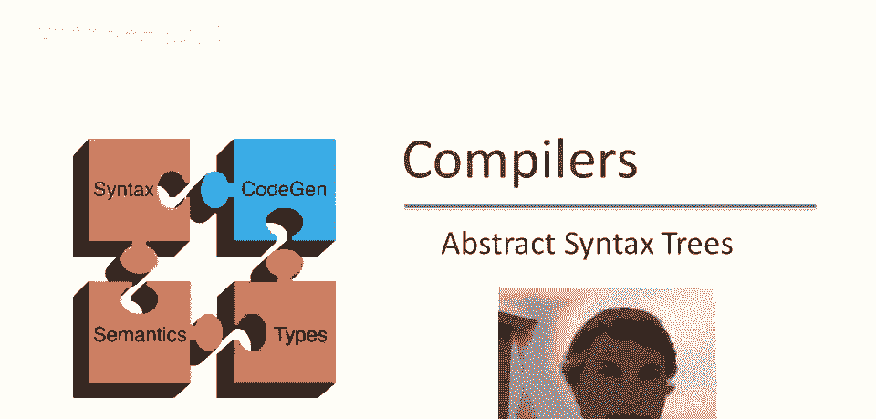
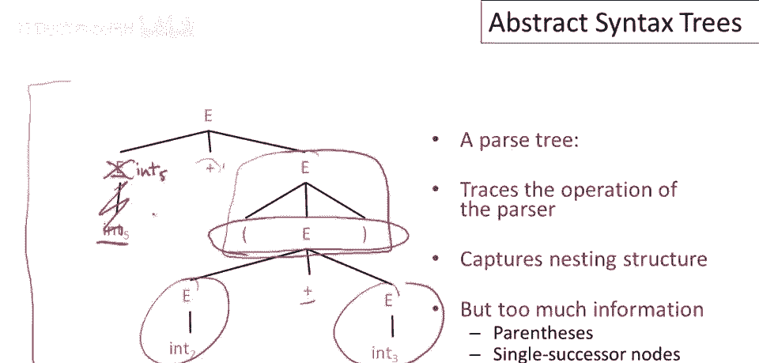

# 【编译原理 CS143 】斯坦福—中英字幕 - P22：p22 06-02-_Abstract_Syntax_ - 加加zero - BV1Mb42177J7

本视频中，将讨论编译器使用的核心数据结构，抽象语法树。

简单回顾，解析器跟踪标记序列的推导，但仅此对编译器并不十分有用，因为编译器的其余部分需要程序的某种表示，它需要一个实际的数据结构来告诉它程序中的操作是什么，以及它们是如何组合在一起的，嗯。

我们知道有一种这样的数据结构叫做解析树，但结果表明，解析树并非我们想要处理的，相反，我们想处理一种称为抽象语法树的东西，抽象语法树实际上就是解析树，但忽略了一些细节，我们从解析树的细节中抽象出来。

这里有一个你会看到的缩写，Asts代表抽象语法树。

让我们看看语法，这是语法，对于整数的加法表达式，我们还括起了表达式，这是一个字符串，词法分析后，我们有什么，嗯，我们得到了一个标记序列，带有相关词素，告诉我们实际字符串是什么，然后传递给解析器。

然后我们构建一个解析树。

这是该表达式的解析树，现在我要强调这种表示，解析树实际上完全适合编译，我们可以使用解析树做编译器，这是程序的真实表示，问题是那样做会很不方便，为了看到这一点，让我指出解析树的一些特征，首先。

你可以看到解析树很冗长，例如，我们这里有节点e，它只有一个子节点，当节点只有一个继承者时，这对我们有何作用，嗯，我们实际上不需要，E，我们可以直接将五放在这里，使树变小，类似地，对于其他单一继承者节点。

此外，这些括号这里，嗯，这些在解析中非常重要，因为它们显示了这些论点与这两个加法操作的关系，这表明这个加法是嵌套的，这个加法在这里，嵌套在这个上面的加法中，但一旦我们完成了解析。

树结构告诉我们相同的事情，我们不需要知道，这些在括号内，这两个表达式的事实是，这个加法的参数已经告诉我们所有需要知道的内容，因此，所有这些节点在某种意义上都是多余的，我们不再需要这些信息了。

因此，我们更喜欢使用称为提取语法树的工具，它压缩了解析树中的所有垃圾，所以这是一个抽象语法树或假设的抽象语法树，它将代表与前一页幻灯片上的解析树相同的内容，你可以看到这里，我们真的只削减了基本项目。

我们有两个加法节点，我们有三个参数，关联仅由哪个加法节点嵌套在另一个中显示，我们没有多余的非终结符，我们没有括号，一切都简单多了，你可以想象编写算法。

走过这样的结构比走过前一页幻灯片上的红色和复杂结构更容易，当然，再次，它被称为抽象语法树，因为它从具体语法中抽象出来，我们抑制了具体语法的细节，只保留足够的信息以能够忠实地代表程序并编译它。

