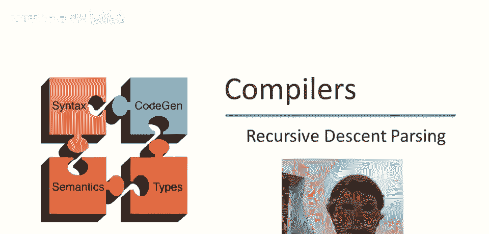
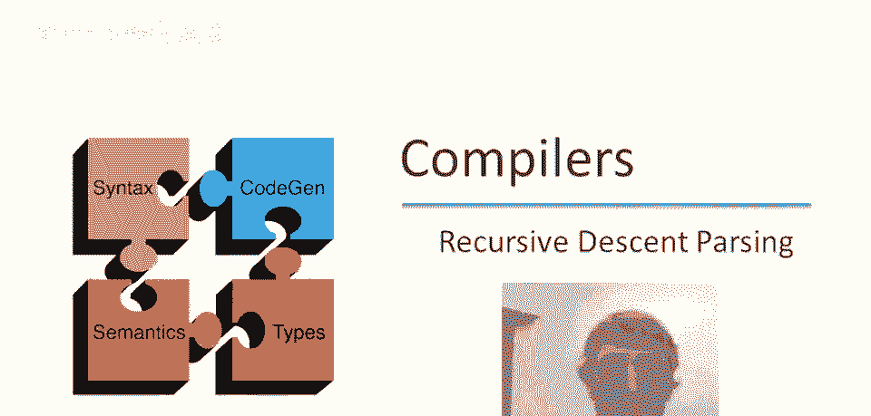

# 【编译原理 CS143 】斯坦福—中英字幕 - P23：p23 06-03-_Recursive_Descen - 加加zero - BV1Mb42177J7

本视频将讨论，我们的第一个解析算法。

递归下降解析。

递归下降是一种自顶向下解析算法，你可能怀疑也有自底向上的解析算法，确实有这样的东西，稍后我们会讨论，在自顶向下解析算法中，解析树从顶部构建，从根节点开始，从左到右，因此。

终端将在它们出现在标记流中的顺序中出现，例如，如果我有这个标记流，这是我可能构建的假设解析树，这里的数字对应于解析树中节点构建的顺序，我们必须从根开始，这是首先发生的事情。

然后如果t2属于解析树中的这里，那将是接下来发生的事情，但如果下一个位置是非终结符，那将是数字三，然后如果它有孩子，那么最左边的，因为我们从左到右，将是第四个要生成的，然后假设数字四的两个孩子都是终端。

所以那将是接下来的两个输入终端，等等，接下来发生的事情是数字三的第二个孩子，然后是最后两个按左到右顺序出现的终端。

让我们考虑这个整数表达式的语法，让我们看看一个特定的输入，一个非常简单的，仅打开5关闭，现在我们要做的是，我们将使用递归下降策略解析这个，我不会实际向您展示任何伪代码或其他类似的东西，我只是要走过。

如何使用这个语法和递归下降算法解析，这个输入字符串，基本思想是，我们从非终结符开始，我们从根节点开始，我们总是按顺序尝试非终结符的规则，我们将首先从egos到t开始，如果那不起作用。

我们将尝试egos到t加e，所以这将是一个自顶向下的算法，从根开始，我们将从左到右工作，我们按顺序尝试生产，当生产失败时，我们可能需要做一些回溯以尝试其他生产。

有三部分，我们使用的语法，我们构建的解析树，最初只是解析树的根，最后是我们处理的输入，我们将指示我们在输入中的位置，通过这个大红箭头表示我们已读的输入量，它始终指向要读取的下一个终结符号。

要读取的下一个标记，因此我们从左括号开始，好的，语法中也可以看到高亮，更亮的红色表示要尝试的生产，我们将开始构建解析树，尝试生产 e 到 t，这意味着什么？这意味着将 t 作为 e 的子节点。

然后我们继续尝试构建解析树，记住从左到右和自顶向下，现在 t 是一个未展开的非终结符，它是唯一的未展开非终结符，所以我们必须处理它，我们将做什么？我们将尝试 t 的生产，因为我们还没有尝试过。

我们将尝试第一个，T 到 int，下一步是使 int 成为 t 的子节点，这就是我们的第三部分，现在我们实际上有一些可以检查的东西，我们能否检查，我们是否取得了进展，因此请注意，只要我们生成非终结符。

我们实际上并不知道我们是否走在正确的轨道上，我们无法检查，我们生成的非终结符是否会产生输入字符串，但是一旦我们生成一个终结符号，然后我们可以将其与下一个输入标记进行比较以查看它们是否相同。

在这种情况下不幸的是，它们不相同，我们在这里生成的 int 不匹配输入中的左括号，因此显然这个解析，这个解析策略或这个，我们正在构建的解析树不会成功，因此我们将不得不做，我们将不得不回溯。

这意味着我们将撤销一个或多个决定，我们将回到我们的最后一个决策点，看看是否有其他替代方案可以尝试，我们最后做出的决定是什么？我们决定使用t到int，这样我们可以撤销，然后我们可以尝试t的下一个产生式。

那恰好是t到n乘t，我们将使用该产生式扩展t，现在再次生成左边的终结符，所以现在我们可以与输入进行比较，不幸的是，int标记与n的打开标记不匹配，所以我们必须回溯，所以我们撤销了这个决定。

这使我们回到尝试t的替代方案，还有一个可能性，那就是t到(e)，我们使用该产生式扩展t，现在我们可以比较标记(与输入中的(匹配，它们匹配，那很好，这意味着我们可能走上了正确的轨道，由于它们匹配。

未来我们做的任何事情都必须与不同的输入匹配，所以我们将输入指针前进，那么我们现在要处理什么？我们必须扩展这个非终结符e，我们将做我们之前做过的事情，我们只是将从第一个产生式开始，所以我们有e到t。

然后我们必须处理t，所以我们将选择t的第一个产生式，我们有t到int，现在我们可以比较int与输入中的int是否匹配，确实如此，所以我们再次前进输入指针，现在我们在哪里，还剩下什么？

我们已经进展到这一点，我们正在看那个左括号，它也匹配，所以它与输入匹配，现在我们已经匹配了解析树中的所有内容，我们的输入指针在字符串的末尾，所以这实际上是对输入表达式输入字符串的成功解析。

所以这意味着我们接受。

