# 【编译原理 CS143 】斯坦福—中英字幕 - P27：p27 07-01-_Predictive_Parsi - 加加zero - BV1Mb42177J7

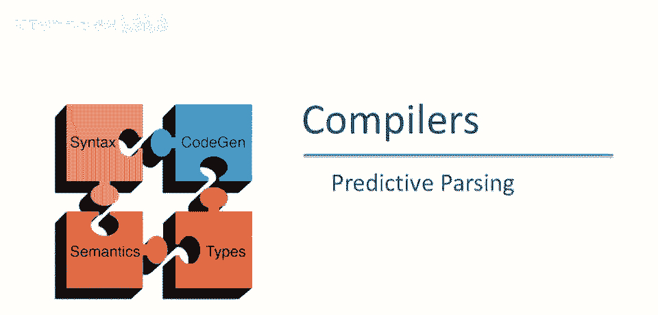

本视频中，我们将继续讨论自顶向下解析算法，使用另一种称为预测解析的策略。

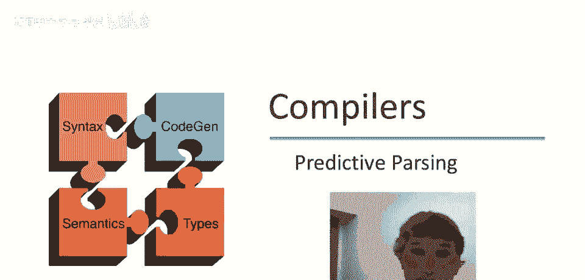

因此，预测解析类似于递归下降，它仍然是一种自顶向下解析器，但解析器能够预测将使用哪个产生式，它从不鲁莽，解析器总能正确猜测，哪个产生式将导致成功的解析，如果有任何产生式将导致成功的解析。

它通过两种方式做到，首先，它查看接下来的几个标记，所以它使用前瞻来尝试确定应使用哪个产生式，因此基于输入流中即将出现的内容，但同时也限制了语法，所以这仅适用于，呃，受限形式的语法，优势是没有回溯涉及。

因此解析器是完全确定的，嗯，现在它永远不会尝试其他选择，预测性解析器接受称为LLK文法的东西，这是一个非常神秘的名称，所以让我解释一下，嗯，第一个l代表从左到右扫描，这意味着我们从输入的左端开始。

从左到右读取，我们讨论的技巧首都有l，第二个l代表最左推导，因此我们构建最左推导，意味着我们始终处理解析树最左非终结符，k代表k个前瞻符号，实际上，呃，尽管理论适用于任意k，实际上，K总是等于1。

实际上我们只讨论k等于1的情况，在这些视频中回顾递归下降解析，每一步。

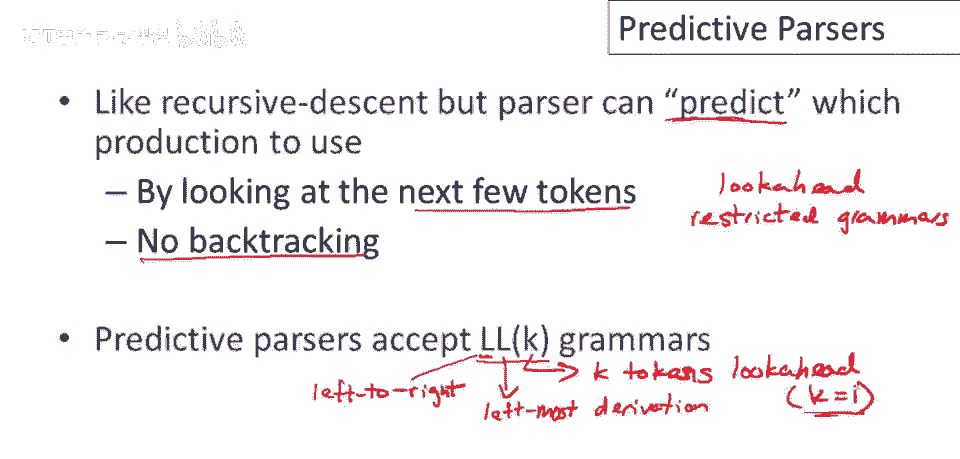

可能有很多生产规则可供使用，因此我们需要使用回溯来撤销l型解析器中的错误选择，在每个步骤中，只有一个解析器，将只有一种可能的生产规则可供使用，那意味着什么？这意味着如果我有输入字符串。

如果我有解析器的配置，其中有一些终结符号，欧米茄和非终结符a，你知道，可能现在接着其他东西，可能有终结符和非终结符，但再次a是左最非终结符，下一个输入，是一个标记t好吧，那么恰好有一个产生式。

呃a去阿尔法，呃在输入t，好的，只有一个可能的使用生产，任何其他生产都保证是错误的，现在可能是即使a去阿尔法也不会成功，可能是我们会在一个情况，没有生产我们可以使用，但在一个l一解析器中总是最多一个。

呃，我们可以使用，所以在这种情况下我们会选择，呃，重写字符串到欧米茄阿尔法贝塔。

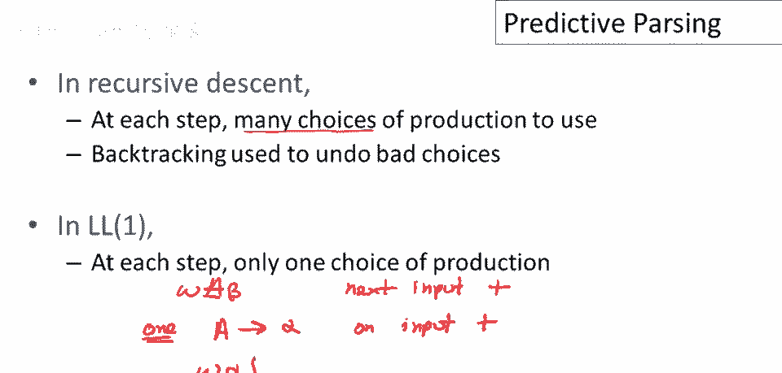

让我们看看我们最喜欢的语法，我们为最后几个视频一直在使用的，我们可以看到使用这个语法进行预测解析的问题，看看t的前两个生产，它们都以int开始，所以如果我告诉你下一个终端在输入流中，当我们解析时。

是一个整数，这并不能真正帮助你区分这两个生产，并决定决定使用哪一个，所以，事实上，只有一标记的看前，我不能在这两个生产之间选择，而且这不是唯一的问题实际上，所以我们有t的问题，但相同的问题也存在于e。

我们可以看到这里e的两个生产都以非终结符t开始，我们真的不知道该怎么做，因为t再次是一个非终结符终端，我们甚至如何做预测，但事实是他们以相同的东西开始，呃表明基于仅一个标记的看前。

对我们来说预测使用哪个生产并不容易，所以在这里我们需要做的是我们需要改变语法，这个语法实际上不适合预测解析，或至少对于ll一解析。

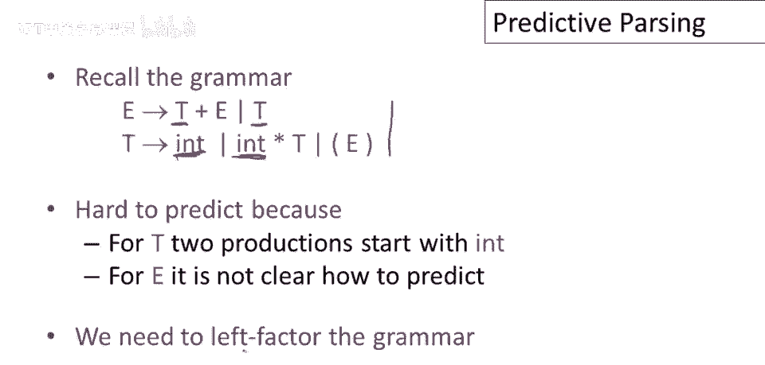

我们需要做一些被称为左因子化的语法，左因子化的想法是消除一个非终结符多个生产的一个共同前缀，所以这是一个口胡，让我们举个例子，让我们从e的生产开始，让我们开始于e的生产，我们可以看到。

e的两个产生式都以相同的前缀开始，相同的前缀，我们要做的就是提取这个公共前缀到一个单独的产生式中，我们将有一个e到t的产生式，然后我们将有多个后缀，因此，让我们引入一个新的非终结符x来处理其余部分。

所以这里我们有e到tx，它说e产生的所有内容都以t开始，这与这两个产生式是一致的，现在我们必须为x写另一个产生式来处理其余部分，那会是什么？一种可能性是我们处于这个产生式中，我们需要有一个加e。

然后在这个产生式中什么都没有，所以很容易处理，我们为x写一个可能，是它到加e，另一个可能性是它到epsilon，现在你可以看到一般想法，我们提取公共前缀，我们有一个处理前缀的产生式，然后我们写，然后。

我们引入一个新的非终结符来处理不同的后缀，然后我们只有多个产生式，一个用于每个可能的后缀，你可以看到这将做什么，这实际上将推迟关于使用哪个产生式的决定，而不是立即决定要为e使用哪个产生式，在这个语法中。

我们等到已经看到了t，无论t派生自什么，然后我们必须决定生产式的其余部分是加e还是空字符串，让我们做另一组产生式，所以我们有t um到，现在我们要消除的共同前缀是int。

所以我们将只有一个以int开始的产生式，然后我们将有一个新的非终结符来代表各种可能的后缀，现在这里我们还有另一个与它无关的产生式，所以我们只是把它留下，那个产生式就留在这里，因为它已经以不同的东西开始。

我们不会在这两个可能的生产式之间遇到任何麻烦，这两个可能的生产式，现在我们必须写y的生产式，我们再次只取我们留下的产生式的后缀，并将它们作为备选方案写下来，一个是空，另一个是times t。

所以我们最终得到了times t，或。

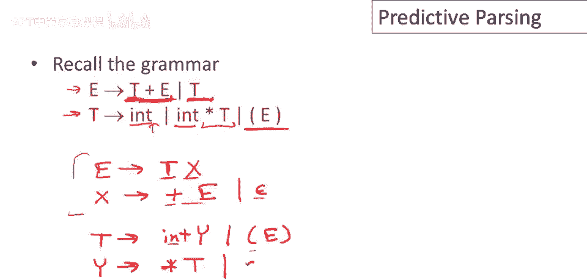

所以这是现在整齐地打出的左因子语法，我们使用这个语法来构建解析表。

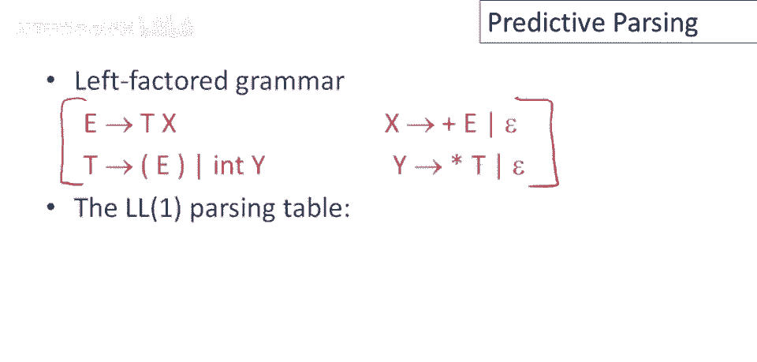

现在别担心如何得到这张表，我不会给出算法，嗯，现在，嗯，但假设我们以某种方式得到了它，我将解释如何使用这张表，表的一维是解析树中的当前最左非终结符，所以它在行上，然后列代表下一个输入标记。

所以输入流中的下一个标记，然后条目是产生式的右侧，所以在那个解析点我们应该使用哪个生产。

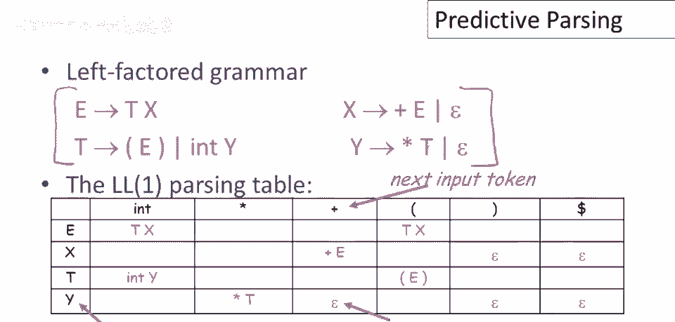

那就是预测的生产，让我们举个例子，让我们看看e int条目，这个条目在这里，这表示当当前非终结符是e，意味着，解析树中的最左非终结符，并且下一个输入是整数，我们看到的，那么应该使用生产e去tx。

所以应该扩展e，嗯，用孩子tx。

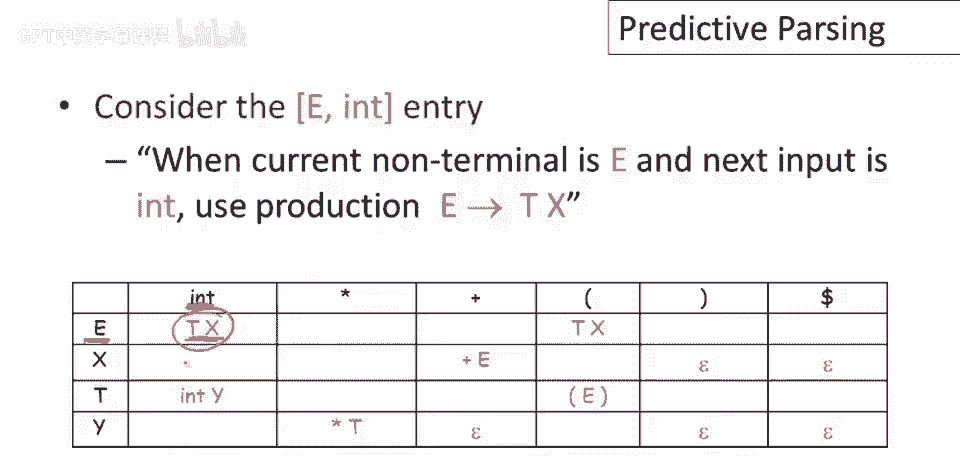

嗯，让我们再做另一个例子，所以当当前非终结符是y，嗯，当前标记，当前输入是加号，那么应该使用生产y去epsilon，好的，这表示与上一个情况有点不同，它说当你看到一个加号在输入中。

并且你当前的最左非终结符是y，解析成功唯一的办法是y不产生任何东西，你需要去掉y并继续到另一个非终结符，无论哪一个在你去掉y之后是最左的，如果你想对这个特定的字符串有任何希望解析。

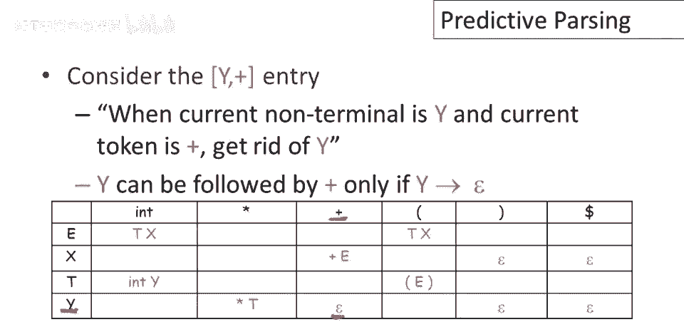

最后注意很多条目是空白的，那些是错误条目，让我们看看e星条目，这表示如果最左非终结符是e，并且下一个输入标记是时间符号，一个星号，嗯，那么，你不能做任何移动，对于e没有你可以使用的生产。

能够成功地解析那个输入，这就是你会引发解析错误的地方。

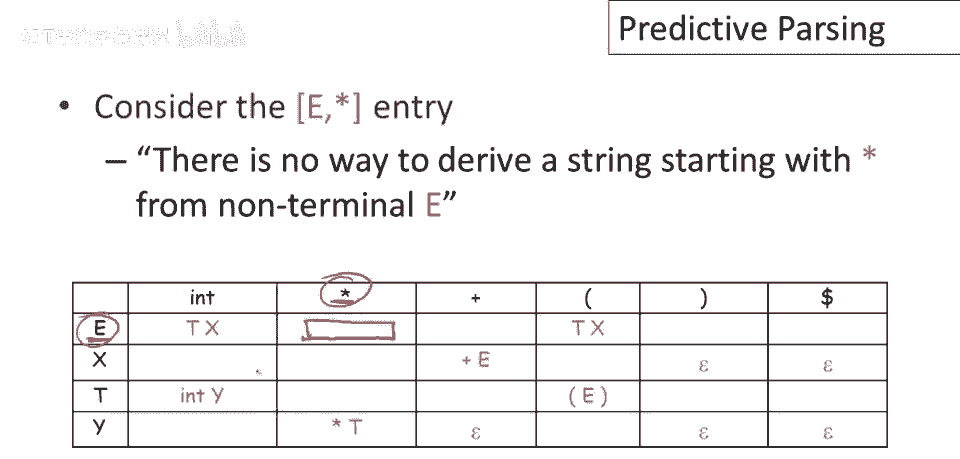

在本视频的其余部分，我将给出使用解析表的解析算法，然后在未来的视频中我们将解释如何构建解析表，使用解析表的解析方法类似于递归下降，除了最左非终结符s，我们看下一个输入标记a，如示例所示，我们查找表。

使用低处的生产，在，在，在s，a条目，而不是使用递归函数追踪解析树，我们将有一个记录前沿的记录栈，在解析树的任何一点，我们会有一些尚未展开的非终结符，它们总是在前沿，解析树的当前叶节点。

还有一些我们尚未匹配的终结符，它们都将记录在栈上，栈的重要性质是，最左边的待定终结符或非终结符，总是在栈的顶部，因此，我们试图匹配的终结符，或我们试图展开的非终结符总是在栈的顶部，如果我们达到错误状态。

我们将拒绝，因此，如果我们查找到表中的空条目，我们将拒绝该字符串，并且当我们到达输入的末尾且栈为空时，我们将接受，意味着我们没有待匹配的未展开终结符或非终结符。

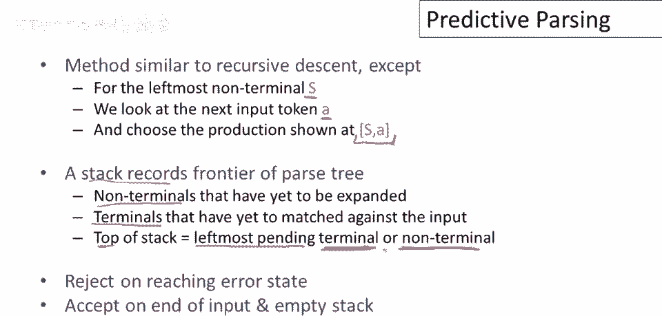

所以这是算法，我们将栈初始化为仅开始符号s和特殊符号，美元符号，美元符号不是字母表的一部分，或者你可以认为，我们扩展了我们的字母表，添加了一个名为美元符号的新符号，美元符号标记栈的底部。

你也可以认为它标记输入的结束，所以这只是一种记录输入结束位置的方式，所以一旦我们匹配了s上的某些东西，那么剩下的最好在输入的末尾，这就是栈所表达的，现在我们在循环中，我们将重复以下动作。

直到我们无法重复它们为止，直到栈为空，好的，有两种可能的动作，让我们先做终结符，所以假设栈的顶部是终结符，所以我们将栈分为栈的顶部，和栈的其他部分，如果栈的顶部是终结符，我们将做什么，嗯。

我们将尝试匹配输入，所以我们将说，在栈的顶部，栈顶的终结符与输入的下一项匹配，然后我们前进输入并弹出栈，因此我们成功匹配了输入与终端，终端处理完毕，应进入栈中，匹配尚未处理的下一个项，如果他们不匹配。

若当前查看的终端与输入的下一个项不匹配，嗯，那是错误，这里没有回溯，无法解析字符串，将引发错误，第二类移动处理非终端，假设栈顶是非终端X，记住栈顶将是非终端，恰好是左侧非终端，现在我们查看解析表，呃。

在X和下一个输入符号的条目下，应该给出产生式的右侧，好的，现在我们弹出X栈，并将X解析树中的子节点推入栈中，这是扩展X的方式，现在解析中未处理的左侧项将是Y1，因为那是X的第一个子节点。

然后X的其他子节点紧随其后，然后是栈中其他内容，同样，如果当前非终端和输入在表中无条目，则是错误，解析停止，所以让我们通过一个例子。

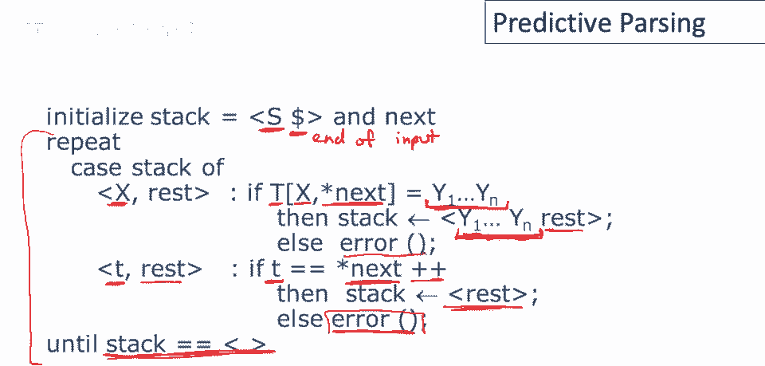

呃，使用我们的解析表，你可能想回头查看解析表，我没有在这里包含它，因为空间不够，但我会通过它，你可以回头看看，并确信我做出了正确的移动，所以最初我们的栈是e美元符号。

所以使用我们的开始符号和美元符号是我们的输入结束符号，我们的输入将尝试解析int times int，那就是我们想解析的，当然我们还有新的符号，美元符号，我们将它附加到输入的末尾，如果一切顺利。

栈上的美元符号将匹配，输入末尾的美元符号再次，美元符号在这里只是标记输入的结束，美元符号只是一个标记输入结束的方式，表达我们需要解析整个输入，现在如果你查看e int条目。

所以第一个终结符和输入中的下一个终结符，以及我们解析中的最左终结符，你会看到我们应该采取的行动是使用生产式，E去tx，同时在这里构建解析树，好的，所以最初我们的栈再次，栈是解析树的边界。

最初我们只有解析树的根，那是它自己的边界，它只是一个符号，我们还没有处理它，所以e在栈上，E在解析树中未展开，现在我们将使用生产式e去tx，所以我们将有t和x作为他的孩子，接下来会发生什么。

E从栈中弹出，T和x被推入栈中，现在注意解析树的边界是tx，那些是，这些是没有处理的叶子，要么是未匹配的输入，要么是未展开的非终结符，事实上，栈确切地记录了哪一个被留下，大多数，所以t在栈的顶部。

X在栈的下面，好的，嗯，我们仍然没有消耗任何输入，现在如果我们查看t int条目，它说使用t去int y，所以现在我们可以通过int y扩展t，现在会发生的是t从栈中弹出，Int和y被推入栈中。

现在注意栈是int y，X从顶部到底部，解析树的边界是int y x，现在我们有了一个情况，栈顶有一个终结符，所以现在我们将尝试将其与输入中的第一个终结符匹配，确实它们匹配，所以int被弹出栈，终端。

抱歉，输入指针在输入中前进，我在这里记录了，通过仅仅丢弃我们已经处理过的输入部分，所以现在我们有times一个int剩下要处理，int已经从栈中移除，所以现在栈顶是什么。

是y y确实是边界上未处理的最左边的东西，表格说对于非终结符y在输入times上，应使用生产式y到t乘t，所以让我们放在这里，现在会发生什么，为什么它会弹出栈，t乘t将被推入栈，现在注意栈是t乘t x。

前沿，解析树的未处理前沿是t乘t x，所以现在栈顶是终端，它与输入中的下一个终端匹配，所以弹出栈顶的终端，前进输入指针，现在t是我们的最左非终端，输入流中的下一个东西是int，表格说在这种情况下。

我们应该使用生产式t到int y，那意味着t被弹出栈，y被推入栈，注意栈是int y x，解析树的未处理前沿，从左到右是int y x，再次，栈顶是终端，它与输入流中的下一个终端匹配，它们匹配。

现在我们已经消耗了所有输入，美元符号是输入中剩下的唯一东西，但栈不是空的，好吧，那么这意味着什么，嗯，如果栈不是空的并且我们没有了输入，那么栈上剩下的所有东西最好生成空字符串。

所以从现在开始我们最好只使用epsilon生产式，确实，表格说当y是下一个非终端美元符号，我们处于输入的末尾，我们应该使用生产式，Y到epsilon，所以y到epsilon，这意味着y被弹出栈。

epsilon被推入栈，epsilon是空字符串，所以什么都没被推入栈，现在只剩下x，在x是下一个非终端美元符号是，我们处于输入的末尾，所以美元符号是我们的下一个符号，那么表格也说使用生产式。

X到epsilon，然后会发生什么，嗯，X被弹出栈，什么都没被推入，因为生产式是x到空字符串，现在我们看到美元符号在栈顶，美元符号在输入中，于是我们清空了栈，我们到达了输入的末尾。

因此我们接受这是一个成功的解析。

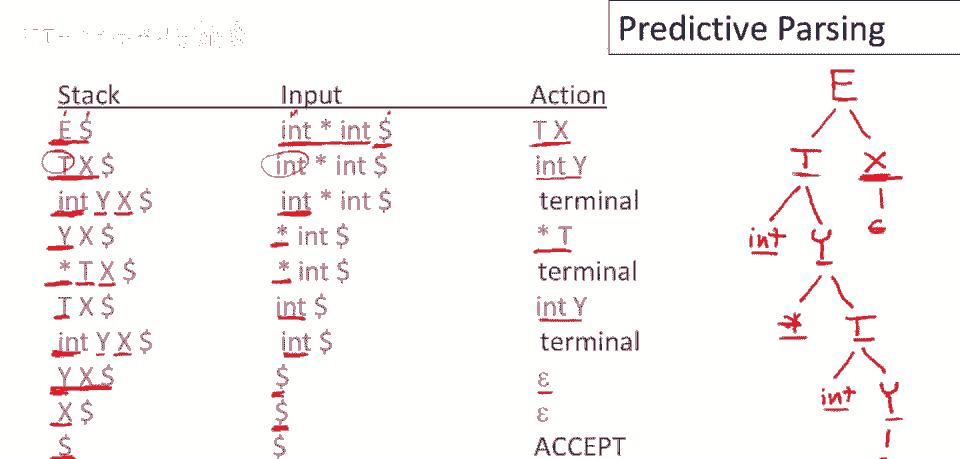