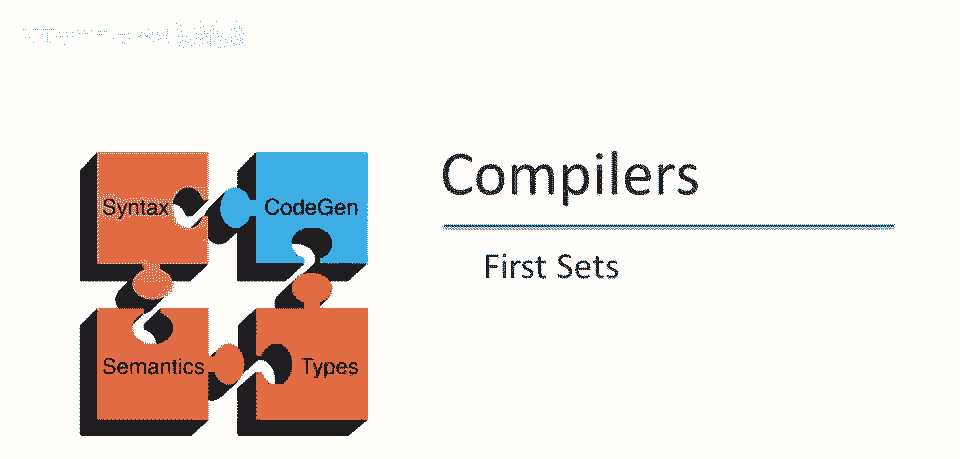
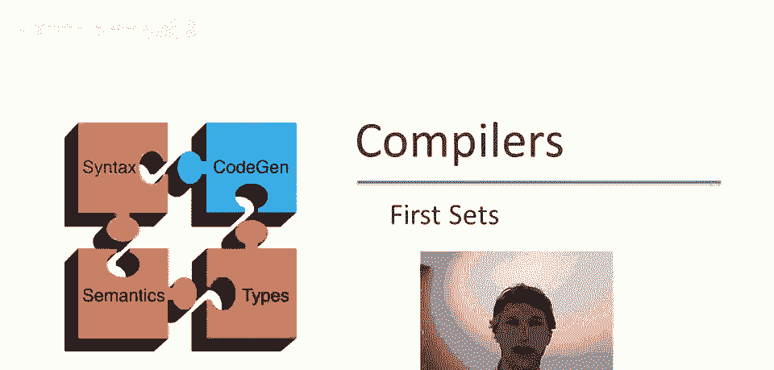
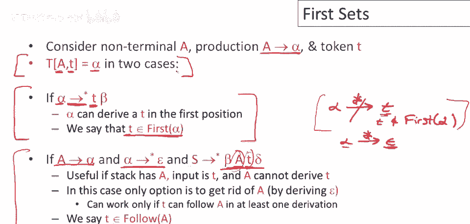
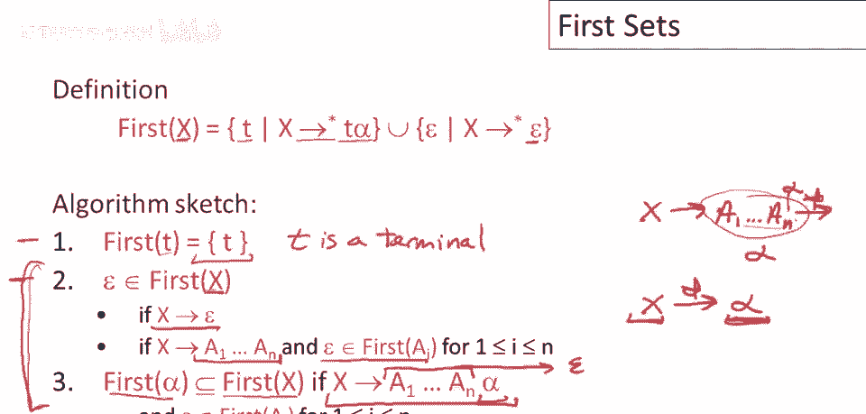
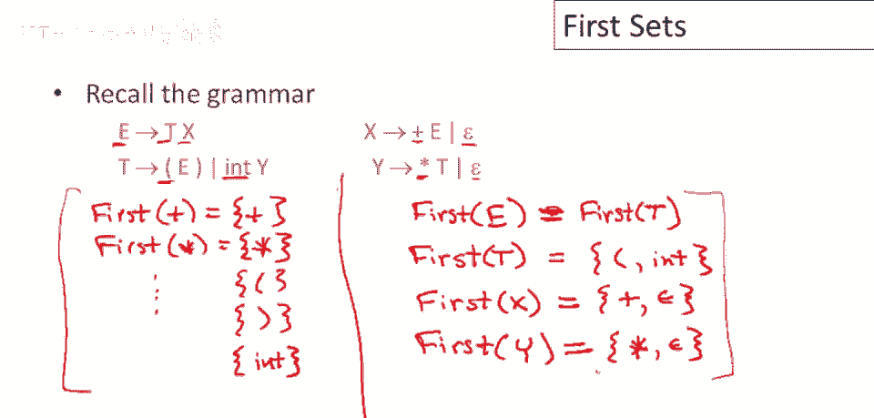

# 【编译原理 CS143 】斯坦福—中英字幕 - P28：p28 07-02-_First_Sets - 加加zero - BV1Mb42177J7

在接下来的视频中，我们将讨论如何构建LL(1)解析表，在这个特定视频中，我们将首先看看如何构建称为first sets的东西。

在我们深入本视频主题之前，即称为first sets的东西，我们需要稍微谈谈如何构建解析表，或构建解析表的条件是什么，因此我们感兴趣的是我们正在构建什么，我们正在构建一个解析表。

并且我们想了解对于给定的非终结符，A，这是最左非终结符和给定的输入符号，下一个输入符号t，我们想了解什么，在什么条件下我们会进行移动，A去α将替换非终结符A为右侧，α，这意味着表格中的a项将是α。

我们有两个情况想要这样做，好吧，所以第一个是如果α可以推导出t在第一个位置，这意味着从α开始，有一些推导，一些序列的移动可以是零或更多，移动将导致t出现在派生的字符串的第一个位置，如果有这样的推导。

那么在这个点上使用移动a去α将是好主意，因为然后我们可以匹配t，最终α可以生成t，然后我们可以匹配t，然后继续解析输入的其余部分，好吧，所以在这种情况下，当α可以生成t在第一个位置时。

我们说t是first of alpha的元素，t是α可以产生的东西之一，可能有更多的东西，但t至少是α可以产生在非常第一个位置的东西之一，一个终端，我应该说α可以产生在非常第一个位置的一个终端。

现在有另一种情况，一个稍微更复杂的情况，在这种情况下我们可能想要进行移动，或者我们想要进行移动，如果我们看到a是最左非终结符，并且t是下一个输入，那么我们想要替换a由a去α正确。

我们考虑的情况是如果α不能推导出t，所以，α不能在任何序列的移动中推导出t，实际上这意味着t不会在first of alpha中，α不能在任何序列的移动中推导出t。

实际上这意味着t不会在first of alpha中，好的，接下来是输入符号t，我们仍在考虑以a为最左非终结符的情况，现在下一个输入符号是t，这听起来不太乐观，因为我们有一个要匹配的输入符号t。

而我们接下来要做的推导，最左非终结符不能生成t，所以，但结果并非无望，实际上我们可能仍能解析这个字符串，即使情况允许，α也能到ε，若α能推导出ε，若α能完全消失，我们可以基本擦除α。

那么语法中其他部分可能匹配t，那么会在什么情况下呢，条件是，若a产生α，α可通过0或更多步到ε，α最终可完全消除，若t能在语法中紧接在a后，这必须有推导才合理，应有推导，我们使用a，a是推导的重要部分。

你知道，从开始符号，a后紧接着是期待的输入符号，在这种情况下，如果能去掉a，通过去epsilon，我们仍会按计划进行，可能语法其他部分会匹配，这种情况下我们测试什么，什么条件下能做好，我们希望能做到。

语法中t可跟在a后，我们说t在a的后续，a后可跟t等，这是易混淆的重要点，我想强调，注意不是推导t，a不产生t，t在衍生后出现，这里的a和t，与a产生的内容无关，这与，a在衍生中可出现的位置有关。

若t可在a的衍生后出现，则称t在a的后续中，本视频将聚焦于第一部分，下一视频将看后续集，再下一个视频将讨论如何整合，构建解析表。

好的，现在关注视频主题，计算First集合，所以这里，首先需要定义First集合，对于任意字符串a，实际上是x，这里是一个字符串，可以是单个终结符，可以是单个非终结符，或语法符号字符串，好的。

如果x通过某些步骤，在首位产生t，则t是，First集合中的终端，好的，所有可能的首位产生终端，将在First集合中，出于技术原因，稍后明确，也需要跟踪x是否产生epsilon。

尽管epsilon不是终端符号，如果x通过0或更多步产生epsilon，则说epsilon在First集合中，这被证明是需要的，我们需要跟踪x，是否产生epsilon，以计算给定语法符号的。

First集合中的所有终端，好的，这里是算法的概述，嗯，首先对于任何终结符，嗯，终端只能产生自身，所以这里的每个终端符号，应该说t是终端，对于每个终端符号，它的First集合仅包含该终端，好的。

现在考虑非终结符x，好的，所以这里是非终结符x，epsilon在First集合中的条件，如果有epsilon产生，如果x直接到epsilon，显然x可以产生epsilon。

epsilon应在First集合中，但如果x可以产生其他右侧，右侧所有内容，可以到epsilon，右半边可变为空，因此在这种情况下，空也在x的第一个，注意，这仅在，这些可以时发生。

仅当所有a都是非终结符本身时，才有可能发生，显然，如果右半边有任何终结符，则该产生式永远无法完全变为空，好的，我们至少会生产那个终端，但如果右半边的每个非终结符都能产生空。

意味着空在所有这些非终结符的第一个，并且右半边没有终结符，那么空将在x的第一个，还有另一种情况，这是我们利用跟踪空产生的地方，所以让我们假设我们有这样的产生式，好的，假设前n个符号。

这里a1到an都可以变为空，所以这都可以消失，好的，并被替换为空字符串，那么，这意味着，所以，如果我们有这样的推导，好的，然后通过一些移动，呃，它变为alpha，这意味着x可以通过，呃，一系列移动，呃。

推导出alpha本身，好的，所以i可以通过擦除所有a来变为alpha，我忘了在这里放alpha，结尾，在a_n后面应该有alpha，好的，这意味着什么，这意味着alpha中的任何东西，也将在x的第一个。

所以如果右半边的任何前缀可以消失，那么剩余的后缀，alpha，无论alpha是什么，都会被留下，那么alpha的第一个将是左半边非终结符的子集，在这种情况下是x，好的，好的，好的，这就是第一集的定义。

以及如何计算它们，好的，我们得计算终端，和非终端，好的，这就是这些，这些第二条规则涵盖非终端，正如我前面提到的，这对任何其他语法序列也是定义明确的，我的意思是，抱歉，语法中的任何其他字符串，不会。

如果我知道如何为终端计算它，并且我知道如何为非终端计算它，那么我也可以为语法中的任意字符串计算它。

好吧，所以现在让我们做一个例子，让我们看看这个语法，让我们看看我们是否能计算第一个集合，让我们从简单开始，做终结符，好吧，所以对于终结符，实际上，你知道，非常直接，加号是加号，乘号是乘号。

每个终结符都在集合中，第一组，每个终端的第一组只是，第二组包含该终端，余下的依此类推，这并不值得写出来，嗯，所以将是，嗯，open的第一组将是open，close的第一组将是discloper。

我想这就是所有我们需要做的，好的，行，这是终结符的第一组，现在看看更有趣的，谈谈第一个非终结符，那么，第一个v怎么样，看e的生产规则，记住我们的规则，我们知道t中的任何内容，也将是第一的e。

所以第一的t是v的子集，好的，所以为了知道第一的e是什么，我们必须知道第一的t是什么，至少至少要知道第一的b的一部分，我们必须知道第一的t，那么让我们继续计算第一的t，让我们试着现在得到那个集合。

第一的t实际上很容易，因为如果我们看t的生产式，我们可以看到它们在第一位产生终端符号，所以第一的t的唯一可能性和可能性是n和int，由于t只有两个生产式，并且它们都在非常第一位有一个终端符号。

没有其他终端符号可以通过t在第一位产生，所以我们可以直接从语法中读取第一的t，它是n和int，好的，现在让我们回到思考第一的e，所以记住我们还有另一个情况需要跟踪，或者我们抱歉我们需要考虑，所以可能是。

所以显然第一的t中的一切都在第一的e中，我们已经记下了这一点，但如果t可以转到epsilon，那么第一的x中的东西也可能在第一的e中，但现在我们计算了第一的t，我们看到epsilon不在那里。

第一的t总是生成至少一个终端符号，所以永远不会有一个情况x可以贡献到第一的v，因为t总是保证生成至少一个终端，所以实际上我们写在这里的子集根本不是子集，它是相等，第一的t和第一的b相等。

所以第一的e也是n和int，所以现在让我们看看第一的x，好的，所以第一的x显然加号在第一的x中，因为x的一个生产式立即在第一位置产生一个加号，所以我们可以直接将加号添加到第一的x中。

然后x有一个epsilon生产式，所以它也可以转到epsilon，这意味着epsilon也在第一的x中，那么关于第一的y，第一的y，它与生产式的结构相似，对于，加号我们看到我们有一个生产式。

在这里有一个终端在第一位置，这就是乘法，所以第一个y含有乘法，然后y还有一个epsilon产生式，为什么我能直接到epsilon，所以epsilon也在y的所有首次集中，实际上这就是这个语法的全部。

这些都是语法中所有符号的完整首次集，终结符只包含它们自己在首次集中，然后我们计算的非终结符有这些集合，因此我们结束了首次集的讨论。

